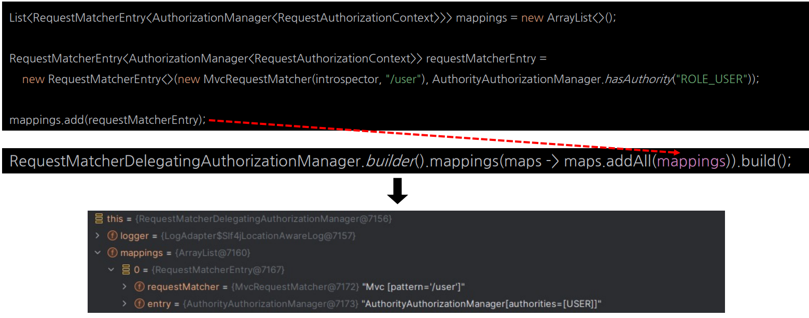
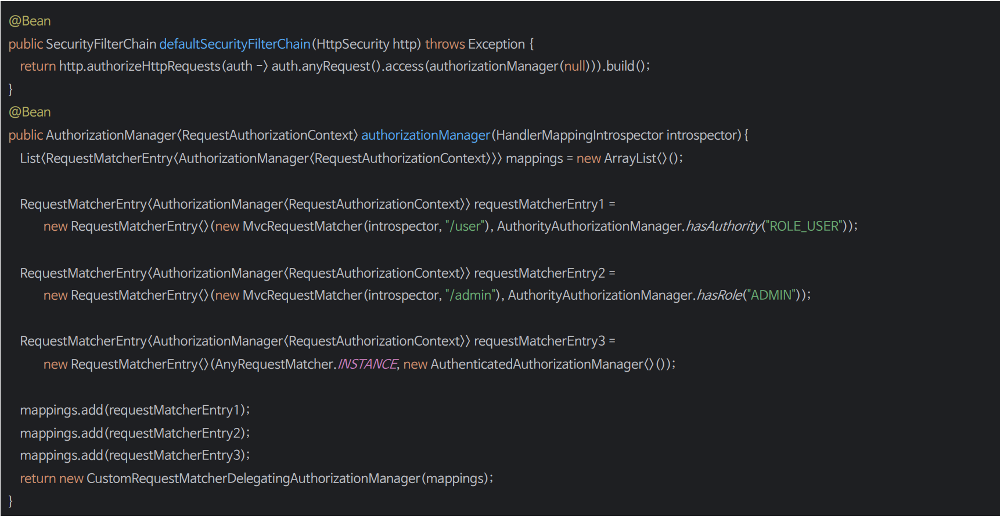
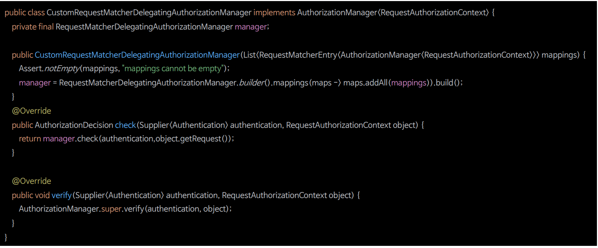

# RequestMatcherDelegatingAuthorizationManager 로 인가 설정 응용

- `RequestMatcherDelegatingAuthorizationManager` 의 **mappings** 속성에 직접 `RequestMatcherEntry` 객체를 생성하고 추가한다.


- `getEntry()`
  - 요청 패턴에 매핑된 `AuthorizationManager` 객체를 반환한다.
- `getRequestMatcher()`
  - 요청 패턴을 저장한 `RequestMatcher` 객체를 반환한다.



---

## 적용

- **RequestMatcherDelegatingAuthorizationManager**를 감싸는 **CustomRequestMatcherDelegatingAuthorizationManager**를 구현할 수 있다.






- 요청에 대한 권한 검사를 `RequestMatcherDelegatingAuthorizationManager` 객체가 수행하도록 한다.
- `RequestMatcherDelegatingAuthorizationManager` > **CustomRequestMatcherDelegatingAuthorizationManager** > `RequestMatcherDelegatingAuthorizationManager`
  구조는 개선이 필요하다.

---

```java
@Configuration
@EnableWebSecurity
public class SecurityConfig {

    @Bean
    public SecurityFilterChain securityFilterChain(HttpSecurity http) throws Exception {

        http
                .authorizeHttpRequests(authorize -> authorize
                        .anyRequest().access(authorizationManager(null)))
                .formLogin(Customizer.withDefaults())
                .csrf(AbstractHttpConfigurer::disable)
        ;
        return http.build();
    }

    @Bean
    public AuthorizationManager<RequestAuthorizationContext> authorizationManager(HandlerMappingIntrospector introspector) {
        List<RequestMatcherEntry<AuthorizationManager<RequestAuthorizationContext>>> mappings = new ArrayList<>();

        RequestMatcherEntry<AuthorizationManager<RequestAuthorizationContext>> requestMatcherEntry1 =
                new RequestMatcherEntry<>(new MvcRequestMatcher(introspector, "/user"),
                                                    AuthorityAuthorizationManager.hasAuthority("ROLE_USER"));

        RequestMatcherEntry<AuthorizationManager<RequestAuthorizationContext>> requestMatcherEntry2 =
                new RequestMatcherEntry<>(new MvcRequestMatcher(introspector, "/db"),
                        AuthorityAuthorizationManager.hasAuthority("ROLE_DB"));

        RequestMatcherEntry<AuthorizationManager<RequestAuthorizationContext>> requestMatcherEntry3 =
                new RequestMatcherEntry<>(new MvcRequestMatcher(introspector, "/admin"),
                        AuthorityAuthorizationManager.hasAuthority("ROLE_ADMIN"));

        RequestMatcherEntry<AuthorizationManager<RequestAuthorizationContext>> requestMatcherEntry4 =
                new RequestMatcherEntry<>(AnyRequestMatcher.INSTANCE, new AuthenticatedAuthorizationManager<>());

        mappings.add(requestMatcherEntry1);
        mappings.add(requestMatcherEntry2);
        mappings.add(requestMatcherEntry3);
        mappings.add(requestMatcherEntry4);

        return new CustomRequestMatcherDelegatingAuthorizationManager(mappings);
    }
    
   @Bean
    public UserDetailsService userDetailsService() {
        UserDetails user = User.withUsername("user")
                .password("{noop}1111")
                .roles("USER")
                .build();

        UserDetails manager = User.withUsername("db")
                .password("{noop}1111")
                .roles("DB")
                .build();

       UserDetails admin = User.withUsername("admin")
               .password("{noop}1111")
               .roles("ADMIN", "SECURE")
               .build();

        return new InMemoryUserDetailsManager(user, manager, admin);
    }
}
```
```java
public class CustomRequestMatcherDelegatingAuthorizationManager implements AuthorizationManager<RequestAuthorizationContext> {

    RequestMatcherDelegatingAuthorizationManager manager;

    public CustomRequestMatcherDelegatingAuthorizationManager(
            List<RequestMatcherEntry<AuthorizationManager<RequestAuthorizationContext>>> mappings) {
        
        manager = RequestMatcherDelegatingAuthorizationManager.builder()
                                                              .mappings(maps -> maps.addAll(mappings))
                                                              .build();
    }

    @Override
    public AuthorizationDecision check(Supplier<Authentication> authentication, RequestAuthorizationContext object) {
        return manager.check(authentication, object.getRequest());
    }

    @Override
    public void verify(Supplier<Authentication> authentication, RequestAuthorizationContext object) {
        AuthorizationManager.super.verify(authentication, object);
    }
}
```