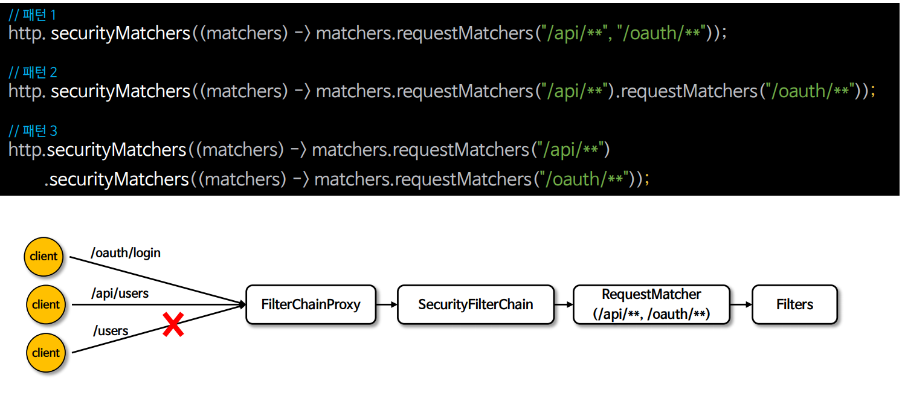

# 요청 기반 권한 부여

---

## securityMatcher()

- `securityMatcher()` 메서드는 특정 패턴에 해당하는 요청에만 보안 규칙을 적용하도록 설정할 수 있으며 중복해서 정의할 경우 마지막에 설정한 것으로 대체한다.

> 1. **securityMatcher(String... urlPatterns)**
>    - 특정 자원 보호가 필요한 경로를 정의한다.
> 2. **securityMatcher(RequestMather... requestMatchers)**
>    - 특정 자원 보호가 필요한 경로를 정의한다.
>    - `AntPathRequestMatcher`, `MvcRequestMatcher` 등의 구현체를 사용할 수 있다.


- `HttpSecurity`를 `/api/`로 시작하는 URL에만 적용하도록 구성한다.
- Spring MVC가 클래스 경로에 있으면 `MvcRequestMatcher`가 사용되고, 그렇지 않으면 `AntPathRequestMatcher`가 사용된다.

---

## 다중 패턴 설정

### securityMatchers(Customizer< RequestMatcherConfigurer >)

- **securityMatchers** 메서드는 특정 패턴에 해당하는 요청을 단일이 아닌 다중 설정으로 구성해서 보안 규칙을 적용할 수 있으며 현재의 규칙은 이전의 규칙을 대체하지 않는다.



---

```java
@Configuration
@EnableWebSecurity
public class SecurityConfig {

    @Bean
    public SecurityFilterChain securityFilterChain1(HttpSecurity http) throws Exception {

        http
                .authorizeHttpRequests(authorize -> authorize
                        .anyRequest().authenticated())
                .formLogin(Customizer.withDefaults())
        ;
        return http.build();
    }

    @Bean
    @Order(1)
    public SecurityFilterChain securityFilterChain2(HttpSecurity http) throws Exception {

        http
                .securityMatchers(matchers -> matchers
                        .requestMatchers("/api/**", "/oauth/**"))

                .authorizeHttpRequests(authorize -> authorize
                        .anyRequest().permitAll())
        ;
        return http.build();
    }


   @Bean
    public UserDetailsService userDetailsService() {
        UserDetails user = User.withUsername("user")
                .password("{noop}1111")
                .roles("USER")
                .build();

        UserDetails manager = User.withUsername("manager")
                .password("{noop}1111")
                .roles("DB")
                .build();

       UserDetails admin = User.withUsername("admin")
               .password("{noop}1111")
               .roles("ADMIN", "SECURE")
               .build();

        return new InMemoryUserDetailsManager(user, manager, admin);
    }

}
```
```java
@RestController
public class IndexController {

    @GetMapping("/")
    public String index(){
        return "index";
    }

    @GetMapping("/api/photos")
    public String photos(){
        return "photos";
    }

    @GetMapping("/oauth/login")
    public String oauth(){
        return "oauthLogin";
    }
}
```