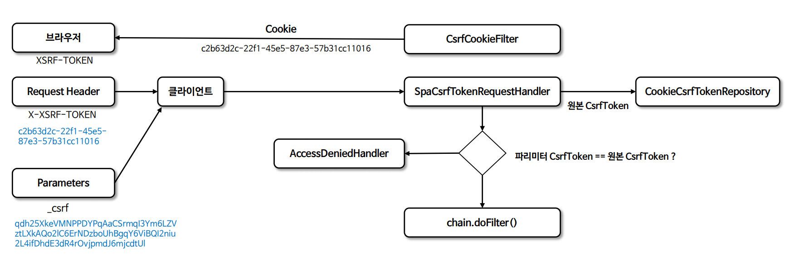
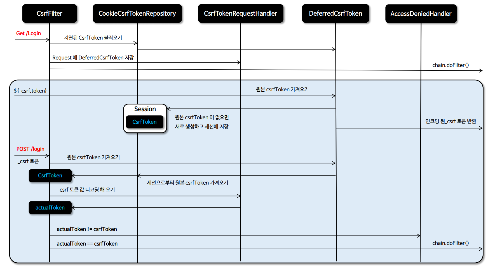
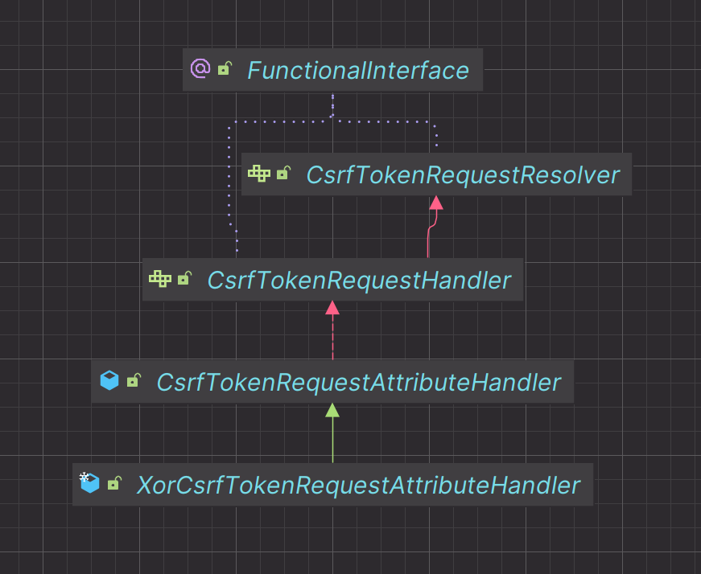

# CSRF 통합

- `CSRF` 공격을 방지하기 위한 토큰 패턴을 사용하려면 실제 `CSRF` 토큰을 HTTP 요청에 포함해야 한다.
- 그래서 브라우저에 의해 HTTP 요청에 자동으로 포함되지 않는 요청 부분(폼 매개변수, HTTP 헤더 또는 기타 부분) 중 하나에 포함되어야 한다.
- 클라이언트 애플리케이션이 `CSRF`로 보호된 백엔드 애플리케이션과 통합하는 여러 가지 방법이 있다.

---

## HTML Forms

- HTML 폼을 서버에 제출하려면 `CSRF` 토큰을 `hidden` 값으로 **Form**에 포함해야 한다.


- **Thymeleaf**는 위와 같이 직접 작성하지 않아도 `CSRF` 토큰을 자동으로 폼에 포함해준다.

---

## JavaScript Applications

### Single Page Application

1. `CookieCsrfTokenRepository.withHttpOnlyFalse`를 사용해서 클라이언트가 서버가 발행한 쿠키로부터 `CSRF` 토큰을 읽을 수 있도록 한다.
2. 사용자 정의 **CsrfTokenRequestHandler**를 만들어 클라이언트가 요청 헤더나 요청 파라미터로 `CSRF` 토큰을 제출할 경우 이를 검증하도록 구현한다.
3. 클라이언트의 요청에 의해 `CSRF` 토큰을 쿠키에 렌더링해서 응답할 수 있도록 필터를 구현한다.



### Multi Page Application

- JavaScript 가 각 페이지에서 로드되는 멀티 페이지 애플리케이션의 경우 `CSRF` 토큰을 쿠키에 노출시키는 대신 HTML 메타 태그 내에 `CSRF` 토큰을 포함시킬 수 있다.

**HTML 메타 태그에 `CSRF` 토큰 포함**


**AJAX 요청에서 `CSRF` 토큰 포함**


---

## CsrfFilter



---

## HTML Form 전송

```java
@Configuration
@EnableWebSecurity
public class SecurityConfig {

    @Bean
    public SecurityFilterChain securityFilterChain(HttpSecurity http) throws Exception {

        http
                .authorizeHttpRequests(auth -> auth
                        .requestMatchers("/csrf", "/csrfToken", "/form", "/formCsrf").permitAll()
                        .anyRequest().authenticated())
                .formLogin(Customizer.withDefaults())
                .csrf(Customizer.withDefaults())
        ;

        return http.build();
    }
}
```
```java
@Controller
public class ViewController {

    @GetMapping("/form")
    public String form() {
        return "form";
    }
}
```
- form.html
```html
<!DOCTYPE html>
<html xmlns:th="http://www.thymeleaf.org">
<head>
    <title>Dashboard</title>
    <link rel="stylesheet" href="https://stackpath.bootstrapcdn.com/bootstrap/4.3.1/css/bootstrap.min.css">
    <link href="https://fonts.googleapis.com/css2?family=Roboto:wght@300;400;500&display=swap" rel="stylesheet">
    <style>
        ...
</head>
<body>
<div class="container-fluid">
    <div class="row">
        <div class="col-md-10 content">
            <div class="login-form">
                <form th:action="@{/formCsrf}" method="post">
                    <div class="form-group">
                        <label for="username">Username</label>
                        <input type="text" class="form-control" id="username" name="username" required>
                    </div>
                    <div class="form-group">
                        <label for="password">Password</label>
                        <input type="password" class="form-control" id="password" name="password" required>
                    </div>
                    <button type="submit" class="btn btn-primary">Login</button>
                </form>
            </div>
        </div>
    </div>
</div>
</body>
</html>
```


- 이렇게 타임리프 문법으로 폼 태그에 `hidden` 타입으로 `CSRF` 토큰이 만들어지는 것을 볼 수 있다.

---

## 쿠키로 전송

```java
public class SpaCsrfTokenRequestHandler extends CsrfTokenRequestAttributeHandler {

    private final CsrfTokenRequestAttributeHandler delegate = new XorCsrfTokenRequestAttributeHandler();

    @Override
    public void handle(HttpServletRequest request, HttpServletResponse response, Supplier<CsrfToken> deferredCsrfToken) {
        delegate.handle(request, response, deferredCsrfToken);
    }

    @Override
    public String resolveCsrfTokenValue(HttpServletRequest request, CsrfToken csrfToken) {
        if (StringUtils.hasText(request.getHeader(csrfToken.getHeaderName()))) {
            return super.resolveCsrfTokenValue(request, csrfToken);
        }

        return delegate.resolveCsrfTokenValue(request, csrfToken);
    }
}
```



- `XorCsrfTokenRequestAttributeHandler`와 `CsrfTokenRequestAttributeHandler` 는 `CSRF` 토큰의 유효성 검증 기능 로직을 구현하고 있고, 
    `XorCsrfTokenRequestAttributeHandler`는 여기에 더해 `CSRF` 토큰에 대해 인코딩 및 디코딩 기능을 지원한다.
- 직접 만들 `SpaCsrfTokenRequestHandler` 에서는 인코딩된 토큰이 오면 `XorCsrfTokenRequestAttributeHandler`에게 위임하고, 인코딩 되지 않은 토큰이 오면 `CsrfTokenRequestAttributeHandler`에게 위임한다.

```java
public class CsrfCookieFilter extends OncePerRequestFilter {
    @Override
    protected void doFilterInternal(HttpServletRequest request, HttpServletResponse response, FilterChain filterChain) throws ServletException, IOException {
        CsrfToken csrfToken = (CsrfToken) request.getAttribute("_csrf");
        if (csrfToken != null) {
            csrfToken.getToken();
        }

        filterChain.doFilter(request, response);
    }
}
```
```java
@Configuration
@EnableWebSecurity
@Slf4j
public class SecurityConfig {
    @Bean
    public SecurityFilterChain securityFilterChain(HttpSecurity http) throws Exception {

        http
                .authorizeHttpRequests(auth -> auth
                        .requestMatchers("/csrf", "/csrfToken", "/form", "/formCsrf", "/cookieCsrf", "/cookie").permitAll()
                        .anyRequest().authenticated())
                .formLogin(Customizer.withDefaults())
                .csrf(csrf -> csrf
                        .csrfTokenRepository(CookieCsrfTokenRepository.withHttpOnlyFalse())
                        .csrfTokenRequestHandler(new SpaCsrfTokenRequestHandler())
                )
                .addFilterBefore(new CsrfCookieFilter(), BasicAuthenticationFilter.class)
        ;

        return http.build();
    }
}
```
```java
@Controller
public class ViewController {

    @GetMapping("/cookie")
    public String cookie() {
        return "cookie";
    }
}
```
```html
<!DOCTYPE html>
<html xmlns:th="http://www.thymeleaf.org">
<head>
    <meta charset="UTF-8">
    <title>Fetch Example</title>
    <script>
        // fetch 요청을 실행하는 함수
        function sendRequest() {
            fetch('/cookieCsrf', {
                method: 'POST', // 요청 메소드
                headers: {
                    'Content-Type': 'application/json', // 컨텐츠 타입 지정
                    'X-XSRF-TOKEN': getCookie('XSRF-TOKEN') // CSRF 토큰 헤더에 추가
                },
                body: JSON.stringify({/* 데이터 객체 */}), // 서버로 보낼 데이터
                credentials: 'include' // 쿠키를 포함시키기 위해 필요
            })
                .then(response => {
                    if (!response.ok) {
                        throw new Error('Network response was not ok');
                    }
                    return response.json(); // 여기에서 서버 응답을 처리
                })
                .then(data => {
                    console.log('Success:', data); // 성공 처리 로직
                })
                .catch(error => {
                    console.error('Error:', error); // 에러 처리 로직
                });
        }

        // 쿠키 값을 가져오는 함수
        function getCookie(name) {
            let cookieValue = null;
            if (document.cookie && document.cookie !== '') {
                const cookies = document.cookie.split(';');
                for (let i = 0; i < cookies.length; i++) {
                    const cookie = cookies[i].trim();
                    if (cookie.substring(0, name.length + 1) === (name + '=')) {
                        cookieValue = decodeURIComponent(cookie.substring(name.length + 1));
                        break;
                    }
                }
            }
            return cookieValue;
        }
    </script>
</head>
<body>
<!-- 버튼 요소 -->
<button onclick="sendRequest()">Send Request</button>
</body>
</html>
```
```java
@PostMapping("/cookieCsrf")
public CsrfToken cookieCsrf(CsrfToken csrfToken) {
    return csrfToken;
}
```