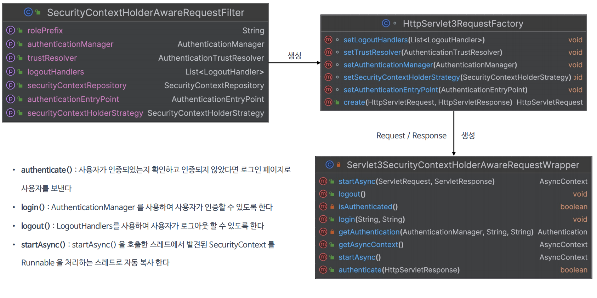
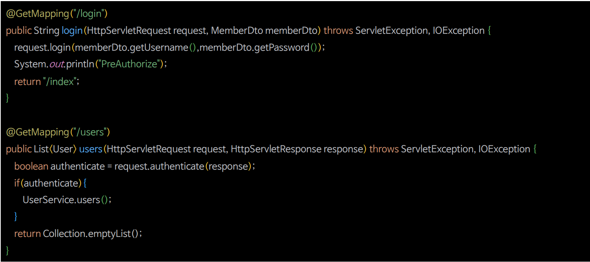

# Servlet API 통합

- 스프링 시큐리티는 다양한 프레임워크 및 API 와의 통합을 제공하고 있으며 **Servlet 3**과 **Spring MVC** 와 통합을 통해 여러 편리한 기능들을 사용할 수 있다.
- 인증 관련 기능들을 필터가 아닌 서블릿 영역에서 처리할 수 있다.

---

## Servlet 3+ 통합

### SecurityContextHolderAwareRequestFilter
- HTTP 요청이 처리될 때 `HttpServletRequest`에 보안 관련 메서드를 추가적으로 제공하는 래퍼 클래스(`SecurityContextHolderAwareRequestWrapper`)를 적용한다.
- 이를 통해 개발자는 서블릿 API의 보안 메서드를 사용하여 인증, 로그인, 로그아웃 등의 작업을 수행할 수 있다.

### HttpServlet3RequestFactory
- **Servlet 3** API와의 통합을 제공하기 위한 `Servlet3SecurityContextHolderAwareRequestWrapper` 객체를 생성한다.
- `SecurityContextHolderAwareRequestWrapper` : `Servlet3SecurityContextHolderAwareRequestWrapper`의 부모 클래스


### Servlet3SecurityContextHolderAwareRequestWrapper
- `HttpServletRequest` 의 래퍼 클래스로서 **Servlet 3.0**의 기능을 지원하면서 동시에 `SecurityContextHolder`와의 통합을 제공한다.
- 이 래퍼를 사용함으로써 `SecurityContext`에 쉽게 접근할 수 있고 **Servlet 3.0**의 비동기 처리와 같은 기능을 사용하는 동안 보안 컨텍스트를 올바르게 관리할 수 있다.

---

## 구조 및 API



### 예제 코드



---

```java
@Configuration
@EnableWebSecurity
@RequiredArgsConstructor
public class SecurityConfig {

    @Bean
    public SecurityFilterChain securityFilterChain(HttpSecurity http) throws Exception {

        http
                .authorizeHttpRequests(authorize -> authorize
                        .requestMatchers("/user").hasAuthority("ROLE_USER")
                        .requestMatchers("/db").hasAuthority("ROLE_DB")
                        .requestMatchers("/admin").hasAuthority("ROLE_ADMIN")
                        .anyRequest().permitAll())
//                .formLogin(Customizer.withDefaults())
                .csrf(AbstractHttpConfigurer::disable)
        ;
        return http.build();
    }

   @Bean
    public UserDetailsService userDetailsService() {
        UserDetails user = User.withUsername("user")
                .password("{noop}1111")
                .roles("USER")
                .build();

        UserDetails manager = User.withUsername("db")
                .password("{noop}1111")
                .roles("DB")
                .build();

       UserDetails admin = User.withUsername("admin")
               .password("{noop}1111")
               .roles("ADMIN", "SECURE")
               .build();

        return new InMemoryUserDetailsManager(user, manager, admin);
    }
}
```
```java
@RestController
@Slf4j
public class IndexController {

    @GetMapping("/")
    public String index() {
        return "index";
    }

    @GetMapping("/user")
    public String user() {
        return "user";
    }

    @GetMapping("/db")
    public String db() {
        return "db";
    }

    @GetMapping("/admin")
    public String admin() {
        return "admin";
    }

    @GetMapping("/login")
    public String login(HttpServletRequest request, @ModelAttribute MemberDto memberDto) throws ServletException {
        request.login(memberDto.getUsername(), memberDto.getPassword());
        log.info("login is successful");
        return "login";
    }

    @GetMapping("/users")
    public List<MemberDto> users(HttpServletRequest request, HttpServletResponse response) throws ServletException, IOException {
        boolean authenticate = request.authenticate(response);
        if (authenticate) {
            return List.of(new MemberDto("user1", "1111"));
        }
        return Collections.emptyList();
    }
}
```