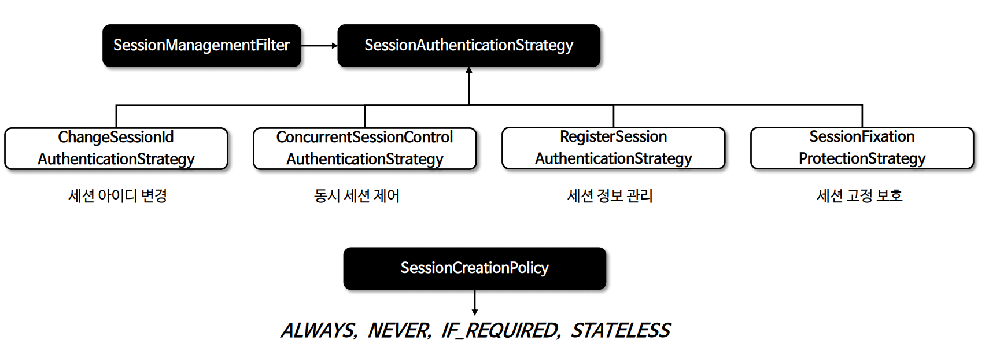
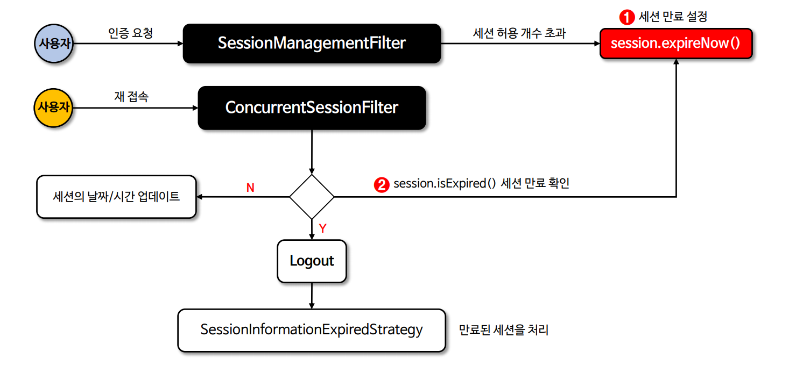
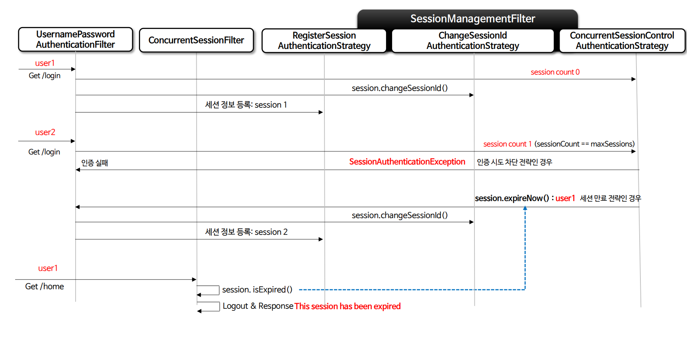

# SessionManagementFilter

- 요청이 시작된 이후 사용자가 인증되었는지 감지하고, 인증된 경우에는 세션 고정 보호 메커니즘을 활성화 하거나 동시 다중 로그인을
    확인하는 등 세션 관련 활동을 수행하기 위해 설정된 세션 인증 전략(`SessionAuthenticationStrategy`)을 호출하는 필터 클래스이다.
- 스프링 시큐리티 6 이상에서는 `SessionManagementFilter`가 기본적으로 설정 되지 않으며 세션 관리 API 설정을 통해 생성할 수 있다.



---

# ConcurrentSessionFilter

- 각 요청에 대해 `SessionRegistry`에서 **SessionInformation**을 검색하고 세션이 만료로 표시되었는지 확인하고, 만료로 표시된 경우 로그아웃 처리를 수행한다.(세션 무효화)
- 각 요청에 대해 `SessionRegistry.refreshLastRequest(String)`를 호출하여 등록된 세션들이 **항상 마지막 업데이트 날짜/시간**을 가지도록 한다.



- **시퀀스 다이어그램**



---

```java
@Configuration
@EnableWebSecurity
public class SecurityConfig {

    @Bean
    public SecurityFilterChain securityFilterChain(HttpSecurity http) throws Exception {

        http
                .authorizeHttpRequests(auth -> auth
                        .anyRequest().authenticated())
                .formLogin(Customizer.withDefaults())
                .sessionManagement(session -> session
                        .maximumSessions(2)
                        .maxSessionsPreventsLogin(false)
                )
        ;

        return http.build();
    }

    @Bean
    public SessionRegistry sessionRegistry() {
        return new SessionRegistryImpl();
    }
}
```
```java
@Service
@RequiredArgsConstructor
@Slf4j
public class SessionInfoService {

    private final SessionRegistry sessionRegistry;

    public void sessionInfo() {
        for (Object principal : sessionRegistry.getAllPrincipals()) {
            List<SessionInformation> allSessions = sessionRegistry.getAllSessions(principal, false);
            for (SessionInformation session : allSessions) {
                log.info("사용자 = {}", principal);
                log.info("세션 ID = {}", session.getSessionId());
                log.info("최종 요청 시간 = {}", session.getLastRequest());
                log.info("----------------------------------------------");
            }
        }
    }
}
```