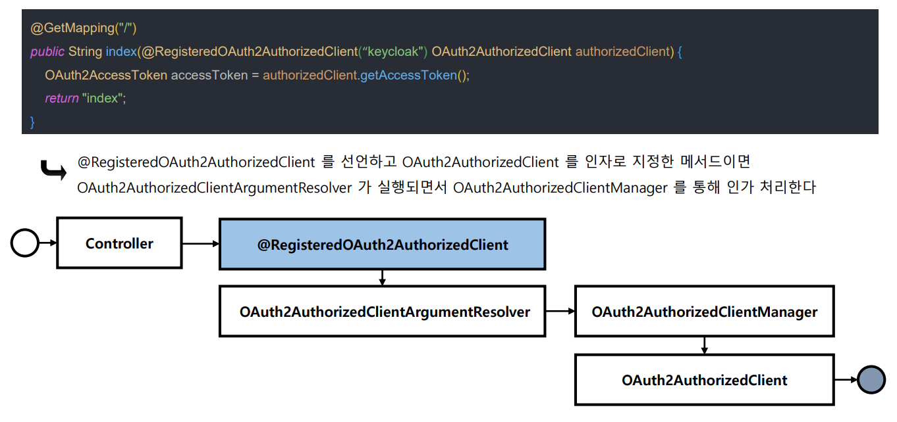

# oauth2Client() - @RegisteredOAuth2AuthorizedClient 활용

## @RegisteredOAuth2AuthorizedClient

- 파라미터를 `OAuth2AuthorizedClient` 타입 인자로 바인딩 해준다.
- `OAuth2AuthorizedClientArgumentResolver` 에서 요청을 가로채어 유형별로 권한 부여 흐름을 실행하도록 한다.




---

```java
@Controller
@RequiredArgsConstructor
public class LoginController {

    @GetMapping("/v2/oauth2Login")
    public String oauth2LoginV2(Model model,
                                @RegisteredOAuth2AuthorizedClient("keycloak") OAuth2AuthorizedClient authorizedClient) {

        if (authorizedClient != null) {
            OAuth2UserService<OAuth2UserRequest, OAuth2User> oAuth2UserService = new DefaultOAuth2UserService();

            ClientRegistration clientRegistration = authorizedClient.getClientRegistration();
            OAuth2AccessToken accessToken = authorizedClient.getAccessToken();

            OAuth2User oAuth2User = oAuth2UserService.loadUser(new OAuth2UserRequest(clientRegistration, accessToken));

            SimpleAuthorityMapper authorityMapper = new SimpleAuthorityMapper();
            authorityMapper.setPrefix("SYSTEM_"); //디폴트 : SCOPE_, 설정 후 : SYSTEM_SCOPE_*
            Set<GrantedAuthority> grantedAuthorities = authorityMapper.mapAuthorities(oAuth2User.getAuthorities());

            OAuth2AuthenticationToken oAuth2AuthenticationToken = new OAuth2AuthenticationToken(
                    oAuth2User,
                    grantedAuthorities,
                    clientRegistration.getRegistrationId());

            SecurityContextHolder.getContext().setAuthentication(oAuth2AuthenticationToken);

            model.addAttribute("AccessToken", authorizedClient.getAccessToken().getTokenValue());
            model.addAttribute("RefreshToken", authorizedClient.getRefreshToken().getTokenValue());
        }


        return "home";
    }
}
```
---

[이전 ↩️ - OAuth 2.0 Client(oauth2Client) - DefaultOAuth2AuthorizedClientManager - 필터 기반 구현]()

[메인 ⏫](https://github.com/genesis12345678/TIL/blob/main/Spring/security/oauth/main.md)