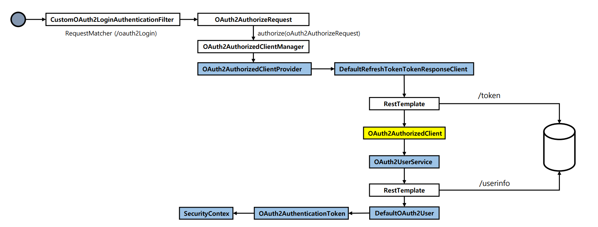

# oauth2Client() - 필터 기반 구현



---

### CustomOAuth2AuthenticationFilter

```java
@Slf4j
public class CustomOAuth2AuthenticationFilter extends AbstractAuthenticationProcessingFilter {

    public static final String DEFAULT_FILTER_PROCESSING_URI = "/oauth2Login/**";
    private DefaultOAuth2AuthorizedClientManager oAuth2AuthorizedClientManager;
    private OAuth2AuthorizedClientRepository oAuth2AuthorizedClientRepository;
    private OAuth2AuthorizationSuccessHandler successHandler;

    private Duration clockSkew = Duration.ofSeconds(3600);
    private Clock clock = Clock.systemUTC();

    public CustomOAuth2AuthenticationFilter(DefaultOAuth2AuthorizedClientManager oAuth2AuthorizedClientManager,
                                               OAuth2AuthorizedClientRepository oAuth2AuthorizedClientRepository) {
        super(DEFAULT_FILTER_PROCESSING_URI);

        this.oAuth2AuthorizedClientManager = oAuth2AuthorizedClientManager;
        this.oAuth2AuthorizedClientRepository = oAuth2AuthorizedClientRepository;

        this.successHandler = (authorizedClient, principal, attributes) -> {
            oAuth2AuthorizedClientRepository
                    .saveAuthorizedClient(authorizedClient, principal,
                            (HttpServletRequest) attributes.get(HttpServletRequest.class.getName()),
                            (HttpServletResponse) attributes.get(HttpServletResponse.class.getName()));

            log.info("authorizedClient = {}", authorizedClient);
            log.info("principal = {}", principal);
            log.info("attributes = {}", attributes);
        };

        oAuth2AuthorizedClientManager.setAuthorizationSuccessHandler(successHandler);
    }

    @Override
    public Authentication attemptAuthentication(HttpServletRequest request, HttpServletResponse response) throws AuthenticationException, IOException, ServletException {

        Authentication authentication = SecurityContextHolder.getContextHolderStrategy().getContext().getAuthentication();

        if (authentication == null) {
            authentication = new AnonymousAuthenticationToken(
                    "anonymous", "anonymousUser", AuthorityUtils.createAuthorityList("ROLE_ANONYMOUS")
            );
        }

        OAuth2AuthorizeRequest authorizeRequest = OAuth2AuthorizeRequest
                .withClientRegistrationId("keycloak")
                .principal(authentication)
                .attribute(HttpServletRequest.class.getName(), request)
                .attribute(HttpServletResponse.class.getName(), response)
                .build();

        OAuth2AuthorizedClient authorizedClient = oAuth2AuthorizedClientManager.authorize(authorizeRequest);

        //권한 부여 타입을 변경하지 않고 실행
        if (authorizedClient != null && hasTokenExpired(authorizedClient.getAccessToken()) && authorizedClient.getRefreshToken() != null) {
            authorizedClient = oAuth2AuthorizedClientManager.authorize(authorizeRequest);
        }

        if (authorizedClient != null) {
            OAuth2UserService<OAuth2UserRequest, OAuth2User> oAuth2UserService = new DefaultOAuth2UserService();

            ClientRegistration clientRegistration = authorizedClient.getClientRegistration();
            OAuth2AccessToken accessToken = authorizedClient.getAccessToken();

            OAuth2User oAuth2User = oAuth2UserService.loadUser(new OAuth2UserRequest(clientRegistration, accessToken));

            SimpleAuthorityMapper authorityMapper = new SimpleAuthorityMapper();
            authorityMapper.setPrefix("SYSTEM_");
            Set<GrantedAuthority> grantedAuthorities = authorityMapper.mapAuthorities(oAuth2User.getAuthorities());

            OAuth2AuthenticationToken oAuth2AuthenticationToken = new OAuth2AuthenticationToken(
                    oAuth2User,
                    grantedAuthorities,
                    clientRegistration.getRegistrationId());

            SecurityContextHolder.getContext().setAuthentication(oAuth2AuthenticationToken);

            this.successHandler.onAuthorizationSuccess(
                    authorizedClient, oAuth2AuthenticationToken, createAttributes(request, response)
            );

            return oAuth2AuthenticationToken;
        }

        return null;
    }

    private boolean hasTokenExpired(OAuth2Token token) {
        return this.clock.instant().isAfter(token.getExpiresAt().minus(this.clockSkew));
    }

    private static Map<String, Object> createAttributes(HttpServletRequest servletRequest,
                                                        HttpServletResponse servletResponse) {
        Map<String, Object> attributes = new HashMap<>();
        attributes.put(HttpServletRequest.class.getName(), servletRequest);
        attributes.put(HttpServletResponse.class.getName(), servletResponse);
        return attributes;
    }
}
```

### SecurityConfig

```java
@Configuration
@EnableWebSecurity
@RequiredArgsConstructor
public class OAuth2ClientConfig {

    private final DefaultOAuth2AuthorizedClientManager oAuth2AuthorizedClientManager;
    private final OAuth2AuthorizedClientRepository oAuth2AuthorizedClientRepository;

    @Bean
    public SecurityFilterChain securityFilterChain(HttpSecurity http) throws Exception {
        http
                .authorizeHttpRequests(request -> request
                        .requestMatchers("/","/oauth2Login", "/client", "/favicon.*", "/error").permitAll()
                        .anyRequest().authenticated()
                )
//                .oauth2Login(Customizer.withDefaults())
                .oauth2Client(Customizer.withDefaults())
                .addFilterBefore(customOAuth2AuthenticationFilter(), UsernamePasswordAuthenticationFilter.class);
        ;

        return http.build();
    }

    private CustomOAuth2AuthenticationFilter customOAuth2AuthenticationFilter() {
        CustomOAuth2AuthenticationFilter oAuth2AuthenticationFilter =
                new CustomOAuth2AuthenticationFilter(oAuth2AuthorizedClientManager, oAuth2AuthorizedClientRepository);
        oAuth2AuthenticationFilter.setAuthenticationSuccessHandler((request, response, authentication) -> {
            response.sendRedirect("/home");
        });

        return oAuth2AuthenticationFilter;
    }

}
```

```java
@Controller
@RequiredArgsConstructor
public class HomeController {

    private final OAuth2AuthorizedClientService oAuth2AuthorizedClientService;

    @GetMapping("/home")
    public String home(Model model, OAuth2AuthenticationToken authentication) {

        OAuth2AuthorizedClient authorizedClient =
                oAuth2AuthorizedClientService.loadAuthorizedClient("keycloak", authentication.getName());

        model.addAttribute("oAuth2AuthenticationToken", authentication);
        model.addAttribute("AccessToken", authorizedClient.getAccessToken().getTokenValue());
        model.addAttribute("RefreshToken", authorizedClient.getRefreshToken().getTokenValue());

        return "home";
    }
}
```
---

[이전 ↩️ - OAuth 2.0 Client(oauth2Client) - DefaultOAuth2AuthorizedClientManager - `Refresh Token` 권한 부여 구현](https://github.com/genesis12345678/TIL/blob/main/Spring/security/oauth/OAuth2Client/Refresh%20Token.md)

[메인 ⏫](https://github.com/genesis12345678/TIL/blob/main/Spring/security/oauth/main.md)

[다음 ↪️ - OAuth 2.0 Client(oauth2Client) - @RegisteredOAuth2AuthorizedClient 활용](https://github.com/genesis12345678/TIL/blob/main/Spring/security/oauth/OAuth2Client/%40RegisteredOAuth2AuthorizedClient.md)