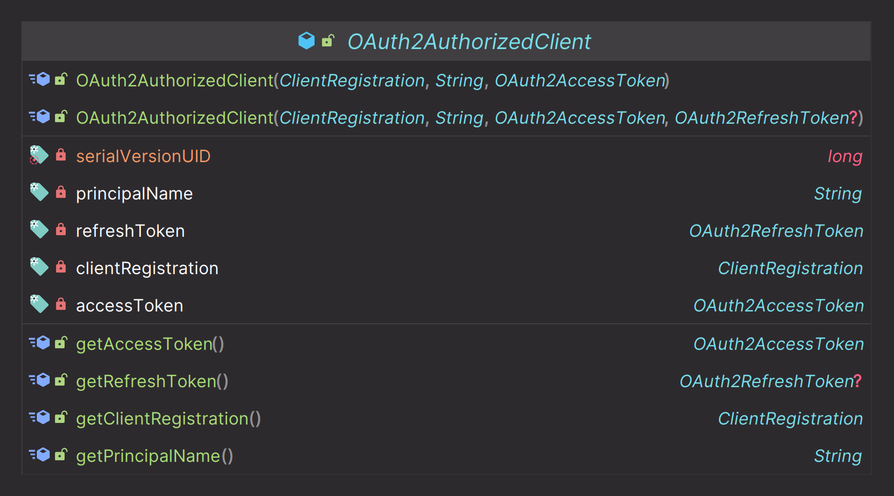
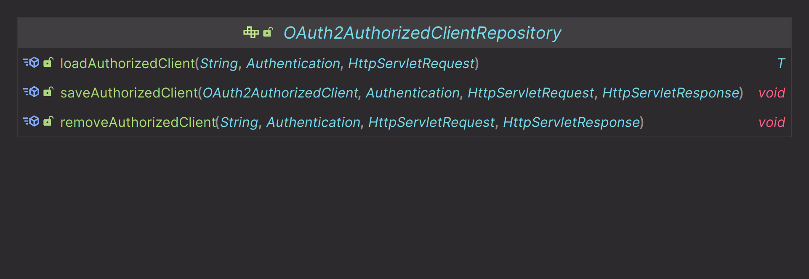
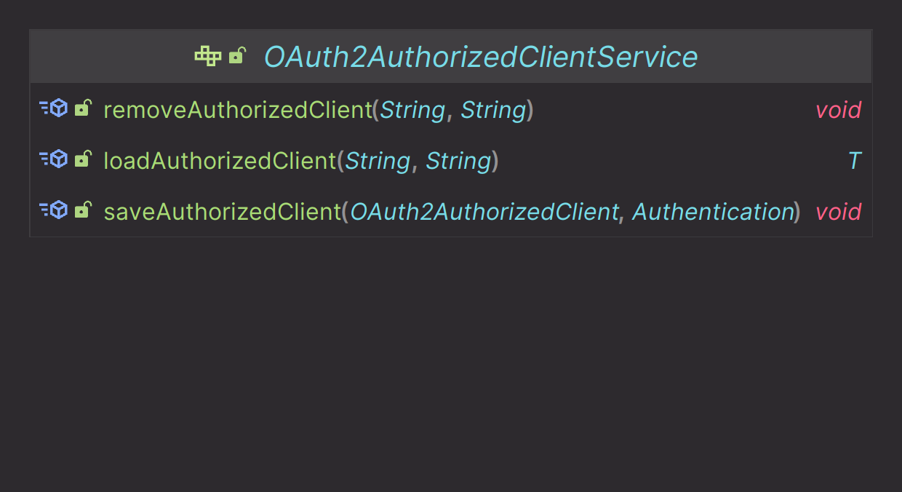
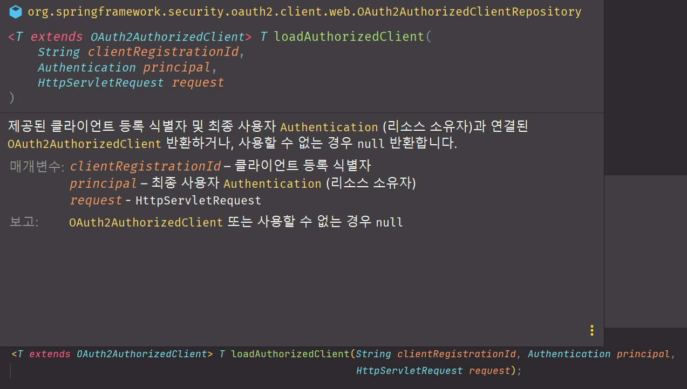
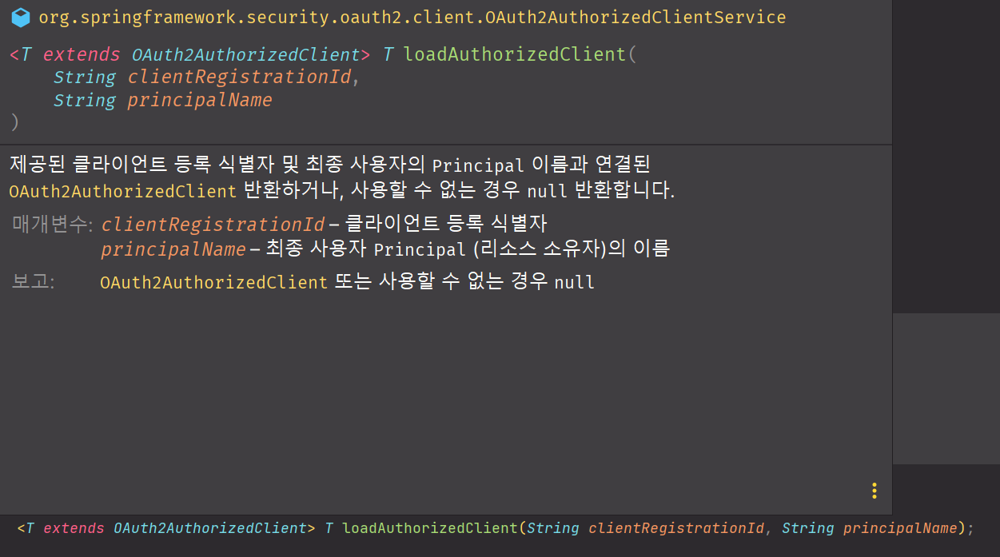

# oauth2Client() - OAuth2AuthorizedClient

- `OAuth2AuthorizedClient`는 **인가받은 클라이언트**를 의미하는 클래스다.
- 최종 사용자(리소스 소유자)가 클라이언트에게 리소스에 접근할 수 있는 권한을 부여하면, 클라이언트를 인가된 클라이언트로 간주한다.
- `OAuth2AuthorizedClient`는 **AccessToken**과 **RefreshToken**을 `ClientRegistration`(클라이언트)과 권한을 부여한 최종 사용자인 `Principal`과 함께 묶어준다.
- `OAuth2AuthorizedClient`의 **AccessToken**을 사용해서 리소스 서버의 자원을 접근 할 수 있으며 인가 서버와의 통신으로 토큰을 검증할 수 있다.
- `OAuth2AuthorizedClient`의 **ClientRegistration**과 **AccessToken**을 사용해서 `UserInfo` 엔드 포인트로 요청할 수 있다.



---

## OAuth2AuthorizedClientRepository



- `OAuth2AuthorizedClientRepository`는 다른 웹 요청이 와도 동일한 `OAuth2AuthorizedClient`를 유지하는 역할을 담당한다.
- **OAuth2AuthorizedClientService**에게 `OAuth2AuthorizedClient`의 저장, 조회, 삭제 처리를 위임한다.

## OAuth2AuthorizedClientService



- `OAuth2AuthorizedClientService`은 애플리케이션 레벨에서 `OAuth2AuthorizedClient`를 관리(저장, 조회, 삭제)를 한다.

### 웹 애플리케이션에서 활용

> - [OAuth2 Client 자동 설정 초기화](https://github.com/genesis12345678/TIL/blob/main/Spring/security/oauth/OAuthClient/AutoConfig.md) 과정에서 `OAuth2AuthorizedClientRepository`과 `OAuth2AuthorizedClientService`가 스프링 빈으로 등록된다.
> - `OAuth2AuthorizedClientRepository`나 `OAuth2AuthorizedClientService`를 통해 **OAuth2AuthorizedClient**를 얻을 수 있다.
> - **OAuth2AuthorizedClient**에서 `OAuth2AccessToken`을 찾을 수 있는 기능을 제공하므로 보호 중인 리소스 요청을 시작할 때 사용할 수 있다.
> 
> 

---

## OAuth2AuthorizationCodeGrantFilter

- **Authorization Code Grant** 방식으로 권한 부여 요청을 지원하는 필터
- 인가 서버로부터 리다이렉트 되면서 전달된 `code`를 인가 서버의 **Access Token**으로 교환한다.
- `OAuth2AuthorizedClientRepository`를 사용해서 **OAuth2AuthorizedClient**를 저장 후 클라이언트의 `Redirect Uri`로 이동한다.

**실행 조건**

- 요청 파라미터에 `code`와 `state` 값이 존재하는지 확인
- `OAuth2AuthorizationRequest` 객체가 존재하는지 확인


---

### Controller

```java
@Controller
@RequiredArgsConstructor
public class HomeController {

    private final OAuth2AuthorizedClientRepository oAuth2AuthorizedClientRepository;
    private final OAuth2AuthorizedClientService oAuth2AuthorizedClientService;

    /**
     * 여기로 요청이 왔다는 것은 클라이언트가 인가 서버로부터 인가를 받은 상태에서 온 것이다.
     * 하지만 oauth2Client() 같은 경우 최종 사용자의 인증 처리는 해주지 않기 때문에 SecurityContextHolder 에서 꺼낸 Authentication은 아직 Anonymous 이다.
     * 때문에 클라이언트에서 인증 처리를 하고 SecurityContextHolder 에 다시 저장한다.
     */
    @GetMapping("/client")
    public String client(HttpServletRequest request, Model model) {

        //익명 객체
        Authentication authentication = SecurityContextHolder.getContextHolderStrategy().getContext().getAuthentication();

        String registrationId = "keycloak";
        
        OAuth2AuthorizedClient authorizedClient1 = oAuth2AuthorizedClientRepository
                .loadAuthorizedClient(registrationId, authentication, request);

        OAuth2AuthorizedClient authorizedClient2 = oAuth2AuthorizedClientService //null
                .loadAuthorizedClient(registrationId, authentication.getName());
        
        OAuth2UserService<OAuth2UserRequest, OAuth2User> oAuth2UserService = new DefaultOAuth2UserService();
        
        ClientRegistration clientRegistration = authorizedClient1.getClientRegistration();
        OAuth2AccessToken accessToken = authorizedClient1.getAccessToken();

        OAuth2User oAuth2User = oAuth2UserService
                .loadUser(new OAuth2UserRequest(clientRegistration, accessToken));

        OAuth2AuthenticationToken oAuth2AuthenticationToken = new OAuth2AuthenticationToken(
                oAuth2User,
                List.of(new SimpleGrantedAuthority("ROLE_USER")),
                clientRegistration.getRegistrationId()
        );

        SecurityContextHolder.getContext().setAuthentication(oAuth2AuthenticationToken); //인증 객체 저장

        model.addAttribute("principalName", oAuth2User.getName());
        model.addAttribute("clientName", authorizedClient1.getClientRegistration().getClientName());
        model.addAttribute("accessToken", accessToken.getTokenValue());
        model.addAttribute("refreshToken", authorizedClient1.getRefreshToken().getTokenValue());

        return "client";
    }
}
```

> - ` oAuth2AuthorizedClientRepository.loadAuthorizedClient(registrationId, authentication, request);`
> 
> 
> 
> - `oAuth2AuthorizedClientService.loadAuthorizedClient(registrationId, authentication.getName());`
>   - `oAuth2AuthorizedClientService`를 통해서 `OAuth2AuthorizedClient`를 얻을 때는 인증된 사용자가 아니면 `Null`을 반환한다.
>   - 반면 `oAuth2AuthorizedClientRepository`의 경우 인증된 사용자가 아니면 익명 객체를 리턴한다.
> 
> 
> 
> **OAuth2AuthorizedClientRepository**와 **OAuth2AuthorizedClientService**에서 `OAuth2AuthorizedClient`를 얻을 때 필요한 매개변수가 다르다.
> 
> - [OAuth2UserService<OAuth2UserRequest, OAuth2User>](https://github.com/genesis12345678/TIL/blob/main/Spring/security/oauth/OAuth2Login/OAuthUser.md#oauth2userservice) 
>   - `UserInfo` 엔드포인트 요청으로 `OAuth2User` 객체를 반환

### HTML

```html
<!DOCTYPE html SYSTEM "http://www.thymeleaf.org/dtd/xhtml1-strict-thymeleaf-4.dtd">
<html xmlns="http://www.w3.org/1999/xhtml"
      xmlns:th="http://www.thymeleaf.org"
      xmlns:sec="http://www.thymeleaf.org/extras/spring-security">

<head>
    <meta charset="UTF-8">
    <title>Insert title here</title>

</head>
<body>
<div>Welcome</div><p></p>
<div sec:authorize="isAuthenticated()"><a th:href="@{/logout}">Logout</a></div><br>
<div sec:authorize="isAuthenticated()">principalName: <span th:text="${principalName}">인가받은 클라이언트</span></div><br>
<div sec:authorize="isAuthenticated()">clientName: <span th:text="${clientName}">인가받은 클라이언트</span></div><br>
<div sec:authorize="isAuthenticated()">accessToken: <span th:text="${accessToken}">인가받은 클라이언트</span></div><br>
<div sec:authorize="isAuthenticated()">refreshToken: <span th:text="${refreshToken}">인가받은 클라이언트</span></div><br>
</body>
</html>
```


---

[이전 ↩️ - OAuth 2.0 Client(oauth2Client) - OAuth2ClientConfigurer 초기화](https://github.com/genesis12345678/TIL/blob/main/Spring/security/oauth/OAuth2Client/OAuth2ClientConfigurer.md)

[메인 ⏫](https://github.com/genesis12345678/TIL/blob/main/Spring/security/oauth/main.md)

[다음 ↪️ - OAuth 2.0 Client(oauth2Client) - DefaultOAuth2AuthorizedClientManager](https://github.com/genesis12345678/TIL/blob/main/Spring/security/oauth/OAuth2Client/DefaultOAuth2AuthorizedClientManager.md)