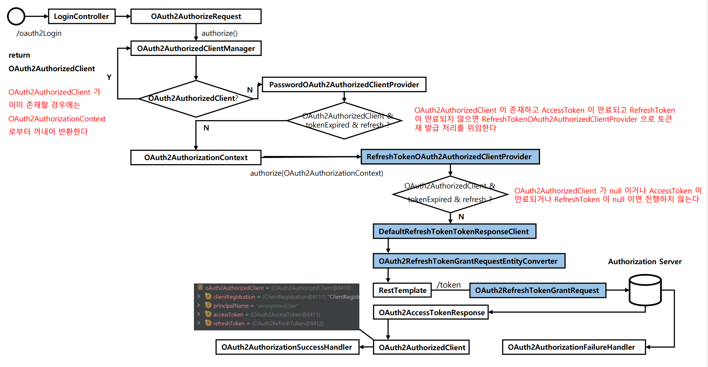

# oauth2Client() - Refresh Token



---

```java
@Configuration
public class AppConfig {

    @Bean
    public DefaultOAuth2AuthorizedClientManager oAuth2AuthorizedClientManager(ClientRegistrationRepository clientRegistrationRepository,
                                                                       OAuth2AuthorizedClientRepository oAuth2AuthorizedClientRepository) {

        /**
         * 리프레시 토큰 테스트를 위해 clockSkew의 충분히 큰 시간을 설정해 준다.
         * 인가 서버의 액세스 토큰 유효 시간은 5분이며,
         * 패스워드 방식과 리프레시 토큰 방식은 액세스 토큰의 기간에서 clockSkew 의 설정된 값을 뺀 시간으로 판단한다.
         * 액세스 토큰 만료 테스트를 위해 토큰을 받자마자 종료되게 설정한다.
         */
        OAuth2AuthorizedClientProvider oAuth2AuthorizedClientProvider = OAuth2AuthorizedClientProviderBuilder.builder()
                .authorizationCode()
                .password(passwordGrantBuilder -> passwordGrantBuilder.clockSkew(Duration.ofSeconds(3600)))
                .refreshToken(refreshTokenGrantBuilder -> refreshTokenGrantBuilder.clockSkew(Duration.ofSeconds(3600)))
                .clientCredentials()
                .build();

        DefaultOAuth2AuthorizedClientManager oAuth2AuthorizedClientManager =
                new DefaultOAuth2AuthorizedClientManager(clientRegistrationRepository, oAuth2AuthorizedClientRepository);

        oAuth2AuthorizedClientManager.setAuthorizedClientProvider(oAuth2AuthorizedClientProvider);
        oAuth2AuthorizedClientManager.setContextAttributesMapper(contextAttributesMapper());

        return oAuth2AuthorizedClientManager;
    }

    /**
     * Function<T, R>
     * T 받아서 R 리턴
     * @return : Map<String, Object>
     */
    private Function<OAuth2AuthorizeRequest, Map<String, Object>> contextAttributesMapper() {
        return oAuth2AuthorizeRequest -> {
            Map<String, Object> contextAttributes = new HashMap<>();

            HttpServletRequest request = oAuth2AuthorizeRequest.getAttribute(HttpServletRequest.class.getName());

            // OAuth2ParameterNames : 스프링 시큐리티가 제공하는 클래스
            String username = request.getParameter(OAuth2ParameterNames.USERNAME);
            String password = request.getParameter(OAuth2ParameterNames.PASSWORD);

            if (StringUtils.hasText(username) && StringUtils.hasText(password)) {
                
                //OAuth2AuthorizationContext : 스프링 시큐리티가 제공하는 클래스
                contextAttributes.put(OAuth2AuthorizationContext.USERNAME_ATTRIBUTE_NAME, username);
                contextAttributes.put(OAuth2AuthorizationContext.PASSWORD_ATTRIBUTE_NAME, password);
            }

            return contextAttributes;
        };
    }
}
```
```java
@Controller
@RequiredArgsConstructor
public class LoginController {

    private final DefaultOAuth2AuthorizedClientManager oAuth2AuthorizedClientManager;
    private final OAuth2AuthorizedClientRepository oAuth2AuthorizedClientRepository;

    private Duration clockSkew = Duration.ofSeconds(3600);

    private Clock clock = Clock.systemUTC();

    @GetMapping("/oauth2Login")
    public String oauth2Login(Model model, HttpServletRequest request, HttpServletResponse response) {

        Authentication authentication = SecurityContextHolder.getContextHolderStrategy().getContext().getAuthentication();

        OAuth2AuthorizeRequest authorizeRequest = OAuth2AuthorizeRequest
                .withClientRegistrationId("keycloak")
                .principal(authentication) //anonymous
                .attribute(HttpServletRequest.class.getName(), request)
                //AppConfig에서 Function 으로 username과 password 를 추출하기 위해
                //HttpServletRequest 객체를 담아놓는다.
                .attribute(HttpServletResponse.class.getName(), response)
                .build();

        oAuth2AuthorizedClientManager.setAuthorizationSuccessHandler((authorizedClient, principal, attributes) -> {
            oAuth2AuthorizedClientRepository
                    .saveAuthorizedClient(authorizedClient, principal,
                            (HttpServletRequest) attributes.get(HttpServletRequest.class.getName()),
                            (HttpServletResponse) attributes.get(HttpServletResponse.class.getName()));

            System.out.println("authorizedClient = " + authorizedClient);
            System.out.println("principal = " + principal);
            System.out.println("attributes = " + attributes);
        });

        OAuth2AuthorizedClient authorizedClient = oAuth2AuthorizedClientManager.authorize(authorizeRequest);

        //권한 부여 타입을 변경하지 않고 실행
        if (authorizedClient != null && hasTokenExpired(authorizedClient.getAccessToken()) && authorizedClient.getRefreshToken() != null) {
            oAuth2AuthorizedClientManager.authorize(authorizeRequest);
        }

        //권한 부여 타입을 변경하고 실행
        if (authorizedClient != null &&
                hasTokenExpired(authorizedClient.getAccessToken()) && authorizedClient.getRefreshToken() != null) {
            oAuth2AuthorizedClientManager.authorize(authorizeRequest);

            // ClientRegistration 권한 부여 타입을 refresh token 방식으로 재정의
            ClientRegistration clientRegistration = ClientRegistration
                    .withClientRegistration(authorizedClient.getClientRegistration())
                    .authorizationGrantType(AuthorizationGrantType.REFRESH_TOKEN)
                    .build();

            //OAuth2AuthorizedClient 를 재정의한 ClientRegistration 에 맞게 재정의
            OAuth2AuthorizedClient oAuth2AuthorizedClient = new OAuth2AuthorizedClient(
                    clientRegistration,
                    authorizedClient.getPrincipalName(),
                    authorizedClient.getAccessToken(),
                    authorizedClient.getRefreshToken());

            OAuth2AuthorizeRequest authorizeRequest2 = OAuth2AuthorizeRequest
                    .withAuthorizedClient(oAuth2AuthorizedClient)
                    .principal(authentication)
                    .attribute(HttpServletRequest.class.getName(), request)
                    .attribute(HttpServletResponse.class.getName(), response)
                    .build();

            oAuth2AuthorizedClientManager.authorize(authorizeRequest2);
        }

        model.addAttribute("AccessToken", authorizedClient.getAccessToken().getTokenValue());
        model.addAttribute("RefreshToken", authorizedClient.getRefreshToken().getTokenValue());

        return "home";
    }

    @GetMapping("/logout")
    public String logout(Authentication authentication, HttpServletRequest request, HttpServletResponse response) {
        SecurityContextLogoutHandler logoutHandler = new SecurityContextLogoutHandler();
        logoutHandler.logout(request, response, authentication);

        return "redirect:/";
    }

    private boolean hasTokenExpired(OAuth2Token token) {
        return this.clock.instant().isAfter(token.getExpiresAt().minus(this.clockSkew));
    }
}
```
---

[이전 ↩️ - OAuth 2.0 Client(oauth2Client) - DefaultOAuth2AuthorizedClientManager - `Client Credentials` 권한 부여 구현]()

[메인 ⏫](https://github.com/genesis12345678/TIL/blob/main/Spring/security/oauth/main.md)

[다음 ↪️ - OAuth 2.0 Client(oauth2Client) - DefaultOAuth2AuthorizedClientManager - 필터 기반 구현]()