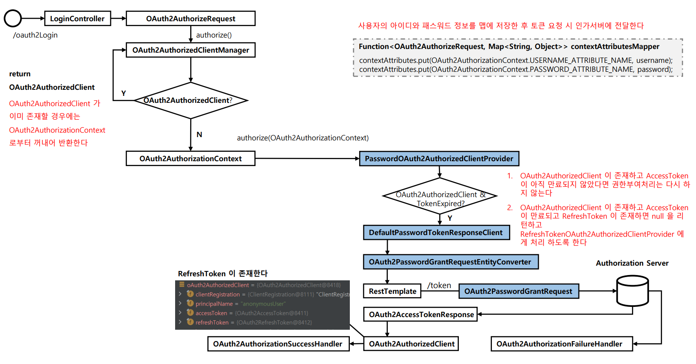
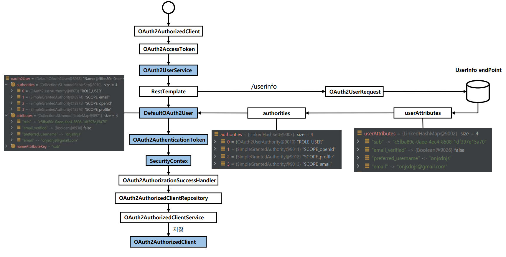

# oauth2Client() - Resource Owner Password





---

### AppConfig

```java
@Configuration
public class AppConfig {

    @Bean
    public DefaultOAuth2AuthorizedClientManager oAuth2AuthorizedClientManager(ClientRegistrationRepository clientRegistrationRepository,
                                                                       OAuth2AuthorizedClientRepository oAuth2AuthorizedClientRepository) {

        OAuth2AuthorizedClientProvider oAuth2AuthorizedClientProvider = OAuth2AuthorizedClientProviderBuilder.builder()
                .authorizationCode()
                .password()
                .clientCredentials()
                .refreshToken()
                .build();

        DefaultOAuth2AuthorizedClientManager oAuth2AuthorizedClientManager =
                new DefaultOAuth2AuthorizedClientManager(clientRegistrationRepository, oAuth2AuthorizedClientRepository);

        oAuth2AuthorizedClientManager.setAuthorizedClientProvider(oAuth2AuthorizedClientProvider);
        oAuth2AuthorizedClientManager.setContextAttributesMapper(contextAttributesMapper());

        return oAuth2AuthorizedClientManager;
    }

    /**
     * Function<T, R>
     * T 받아서 R 리턴
     * @return : Map<String, Object>
     */
    private Function<OAuth2AuthorizeRequest, Map<String, Object>> contextAttributesMapper() {
        return oAuth2AuthorizeRequest -> {
            Map<String, Object> contextAttributes = new HashMap<>();

            HttpServletRequest request = oAuth2AuthorizeRequest.getAttribute(HttpServletRequest.class.getName());

            // OAuth2ParameterNames : 스프링 시큐리티가 제공하는 클래스
            String username = request.getParameter(OAuth2ParameterNames.USERNAME);
            String password = request.getParameter(OAuth2ParameterNames.PASSWORD);

            if (StringUtils.hasText(username) && StringUtils.hasText(password)) {
                //OAuth2AuthorizationContext : 스프링 시큐리티가 제공하는 클래스
                contextAttributes.put(OAuth2AuthorizationContext.USERNAME_ATTRIBUTE_NAME, username);
                contextAttributes.put(OAuth2AuthorizationContext.PASSWORD_ATTRIBUTE_NAME, password);
            }

            return contextAttributes;
        };
    }
}
```

> 여기서 정의한 `contextAttributesMapper()` **Function** 인터페이스로 `PasswordOAuth2AuthorizedClientProvider` 에서 `OAuth2PasswordGrantRequest`를 
>  생성하여 인가 서버에 요청하게 된다.
> 
> 이렇게 하기 위해서는 컨트롤러에서 `OAuth2AuthorizeRequest`에 **HttpServletRequest** 객체를 담아야 파라미터를 추출할 수 있다.

### LoginController

```java
@Controller
@RequiredArgsConstructor
public class LoginController {

    private final DefaultOAuth2AuthorizedClientManager oAuth2AuthorizedClientManager;
    private final OAuth2AuthorizedClientRepository oAuth2AuthorizedClientRepository;

    @GetMapping("/oauth2Login")
    public String oauth2Login(Model model, HttpServletRequest request, HttpServletResponse response) {

        Authentication authentication = SecurityContextHolder.getContextHolderStrategy().getContext().getAuthentication();

        OAuth2AuthorizeRequest authorizeRequest = OAuth2AuthorizeRequest
                .withClientRegistrationId("keycloak")
                .principal(authentication) //anonymous
                .attribute(HttpServletRequest.class.getName(), request)
                //AppConfig에서 Function 으로 username과 password 를 추출하기 위해
                //HttpServletRequest 객체를 담아놓는다.
                .attribute(HttpServletResponse.class.getName(), response)
                .build();

        //DefaultOAuth2AuthorizedClientManager의 생성자에서 기본적으로 같은 기능을 하는 성공 핸들러가 저장 된다.
        oAuth2AuthorizedClientManager.setAuthorizationSuccessHandler((authorizedClient, principal, attributes) -> {
            oAuth2AuthorizedClientRepository
                    .saveAuthorizedClient(authorizedClient, principal,
                            (HttpServletRequest) attributes.get(HttpServletRequest.class.getName()),
                            (HttpServletResponse) attributes.get(HttpServletResponse.class.getName()));

            System.out.println("authorizedClient = " + authorizedClient);
            System.out.println("principal = " + principal);
            System.out.println("attributes = " + attributes);
        });

        OAuth2AuthorizedClient authorizedClient = oAuth2AuthorizedClientManager.authorize(authorizeRequest);

        if (authorizedClient != null) {
            OAuth2UserService<OAuth2UserRequest, OAuth2User> oAuth2UserService = new DefaultOAuth2UserService();

            ClientRegistration clientRegistration = authorizedClient.getClientRegistration();
            OAuth2AccessToken accessToken = authorizedClient.getAccessToken();

            OAuth2User oAuth2User = oAuth2UserService.loadUser(new OAuth2UserRequest(clientRegistration, accessToken));

            SimpleAuthorityMapper authorityMapper = new SimpleAuthorityMapper();
            authorityMapper.setPrefix("SYSTEM_"); //디폴트 : SCOPE_, 설정 후 : SYSTEM_SCOPE_*
            Set<GrantedAuthority> grantedAuthorities = authorityMapper.mapAuthorities(oAuth2User.getAuthorities());

            //SecurityContext 에 저장할 인증 객체
            OAuth2AuthenticationToken oAuth2AuthenticationToken = new OAuth2AuthenticationToken(
                    oAuth2User,
                    grantedAuthorities,
                    clientRegistration.getRegistrationId());

            SecurityContextHolder.getContext().setAuthentication(oAuth2AuthenticationToken);

            model.addAttribute("oAuth2AuthenticationToken", oAuth2AuthenticationToken);

            return "home";
        }

        return "redirect:/";
    }

    @GetMapping("/logout")
    public String logout(Authentication authentication, HttpServletRequest request, HttpServletResponse response) {
        SecurityContextLogoutHandler logoutHandler = new SecurityContextLogoutHandler();
        logoutHandler.logout(request, response, authentication);

        return "redirect:/";
    }
}
```
---

[이전 ↩️ - OAuth 2.0 Client(oauth2Client) - DefaultOAuth2AuthorizedClientManager](https://github.com/genesis12345678/TIL/blob/main/Spring/security/oauth/OAuth2Client/DefaultOAuth2AuthorizedClientManager.md)

[메인 ⏫](https://github.com/genesis12345678/TIL/blob/main/Spring/security/oauth/main.md)

[다음 ↪️ - OAuth 2.0 Client(oauth2Client) - DefaultOAuth2AuthorizedClientManager - `Client Credentials` 권한 부여 구현](https://github.com/genesis12345678/TIL/blob/main/Spring/security/oauth/OAuth2Client/Client%20Credentials.md)