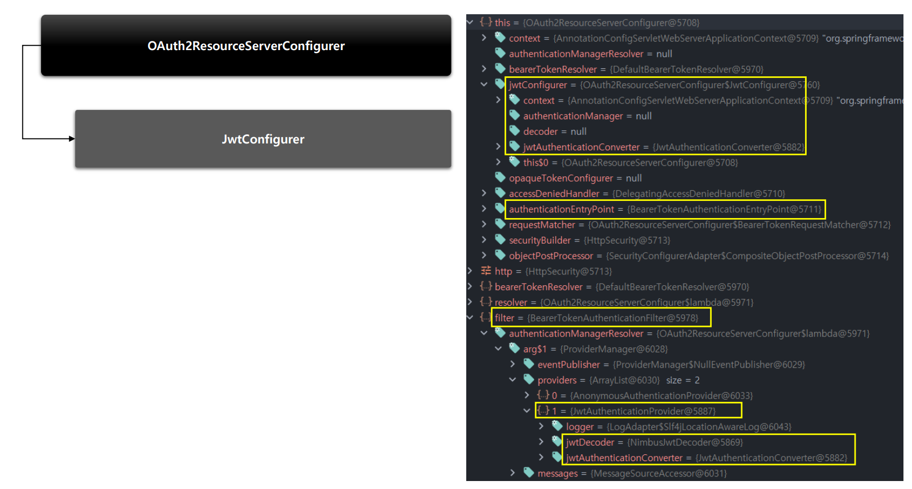
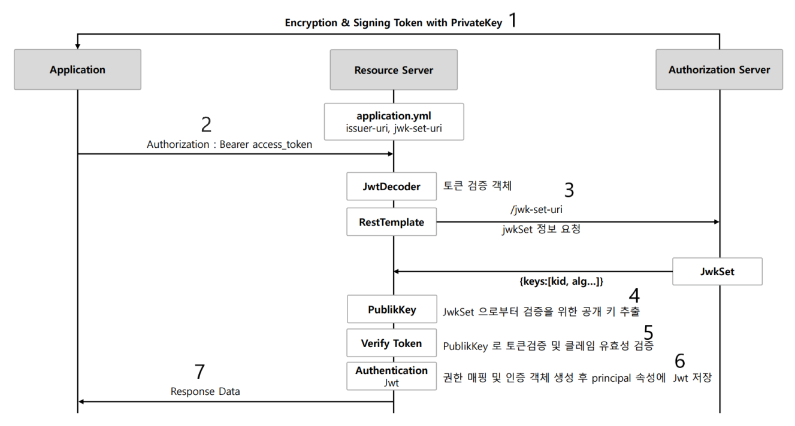

# OAuth 2.0 Resource Server(jwt()) - JWT API

- `SecurityFilterChain` 타입의 빈을 생성해서 보안 필터를 구성
- **HttpSecurity** 에 있는 `oauth2ResourceServer().jwt()` API를 정의하고 빌드

### 검증 프로세스

- 프로퍼티를 설정하면 JWT로 인코딩한 Bearer 토큰을 검증하는 리소스 서버가 자동으로 설정된다.
- **Open ID Connect ProvideR** 설정 엔드포인트 또는 **인가 서버 메타데이터 엔드포인트**를 검색해서 `jwk-set-uri` 엔드포인트를 찾아 검증을 진행한다.
- **두 가지 검증 전략을 설정한다.**
  - 리소스 서버는 인가 서버의 `jwk-set-uri` 엔드포인트로 유효한 공개키를 질의하기 위한 검증 전략을 설정한다.
  - `issuer-uri`에 대한 각 JWT 클레임을 검증할 전략을 설정한다.

> **검증 순서**
> 
> 1. 클라이언트가 `Authorization` 헤더에 `Bearer` + `Access Token`을 담아서 요청한다.
> 2. 리소스 서버는 요청한 토큰이 `Bearer` 토큰 사양에 부합하는지 검사한다.
> 3. 인가 서버에서 JWT에 서명한 개인키와 매칭하는 공개키를 `jwk-set-uri` 엔드포인트 요청으로 가져와서 첫 번째 검증을 진행한다.
> 4. JWT에 있는 `exp`, `nbf`, `iss` 클레임의 정보가 기준에 부합하는지 두 번째 검증을 진행한다.
> 5. 검증에 성공하면 **Jwt** 객체를 생성하고 `claims` 정보에 있는 `scope`를 추출해서 시큐리티의 권한에 매핑한다.(`SCOPE_email`, `SCOPE_profile` 등)
> 6. **Authentication** 객체를 생성하고 **Jwt** 객체를 `principal` 속성에 저장한다.
> 7. **Authentication**을 `SecurityContext`에 저장하고 인증을 완료한다.

---

[메인 ⏫](https://github.com/genesis12345678/TIL/blob/main/Spring/security/oauth/main.md)

[다음 ↪️ - OAuth 2.0 Resource Server(jwt()) - JwtDecoder 세부 흐름](https://github.com/genesis12345678/TIL/blob/main/Spring/security/oauth/ResourceServer/Decoder%ED%9D%90%EB%A6%84.md)