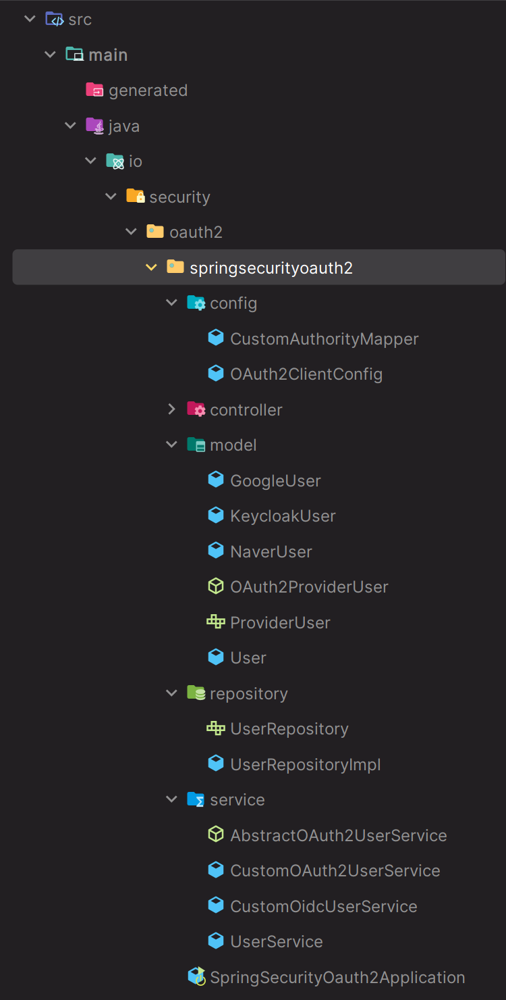
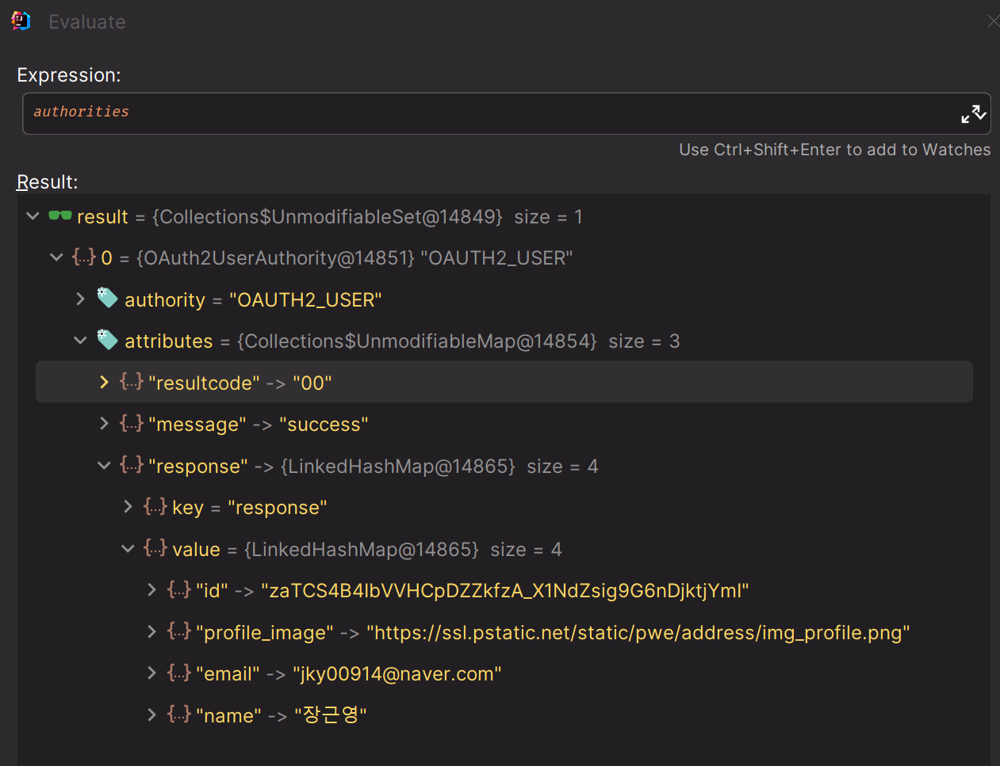

# Social Login - 코드 구현



### [model]()

---

### [repository]()

---

### [service]()

---

### SecurityConfig

```java
@Configuration
@EnableWebSecurity
@RequiredArgsConstructor
public class OAuth2ClientConfig {

    private final CustomOAuth2UserService customOAuth2UserService;
    private final CustomOidcUserService customOidcUserService;

    @Bean
    public SecurityFilterChain securityFilterChain(HttpSecurity http) throws Exception {
        http
                .authorizeHttpRequests(request -> request
                        .requestMatchers("/", "/css/**", "/js/**", "/images/**",
                                "/webjars/**", "/favicon.*", "/*/icon-*").permitAll() //정적 자원

                        .requestMatchers("/api/user").hasAnyRole("SCOPE_profile","SCOPE_email")
                        .requestMatchers("/api/oidc").hasAnyRole("SCOPE_openid") //OpenID를 지원하는 인가 서버만 허용

                        .anyRequest().authenticated()
                )
                .oauth2Login(oauth2 -> oauth2
                        .userInfoEndpoint(userInfoEndpointConfig -> userInfoEndpointConfig
                                
                                // 커스텀한 OAuth2UserService 등록
                                .userService(customOAuth2UserService) 
                                .oidcUserService(customOidcUserService)))
                .logout(logout -> logout.logoutSuccessUrl("/"))
        ;

        return http.build();
    }

    @Bean
    public GrantedAuthoritiesMapper customAuthorityMapper() {
        return new CustomAuthorityMapper();
    }
}
```
> - Google 이나 Keycloak 같은 경우는 OpenID를 지원하기 때문에 `/api/oidc`로는 접근이 가능하다.
> - Naver 같은 경우 OpenID를 지원하지 않아 접근하지 못한다.

### CustomAuthorityMapper

```java
public class CustomAuthorityMapper implements GrantedAuthoritiesMapper {

    private String prefix = "ROLE_";

    @Override
    public Collection<? extends GrantedAuthority> mapAuthorities(Collection<? extends GrantedAuthority> authorities) {
        HashSet<GrantedAuthority> mapped = new HashSet<>(authorities.size());

        for (GrantedAuthority authority : authorities) {
            if (authority instanceof OAuth2UserAuthority oAuth2UserAuthority) {
                Map<String, Object> attributes = oAuth2UserAuthority.getAttributes();

                //네이버의 경우 response 로 한번 감싸져 있다.
                if (attributes.containsKey("response")) {
                    Map<String, Object> o = (Map<String, Object>) attributes.get("response");
                    for (String s : o.keySet()) {
                        mapped.add(mapAuthority("SCOPE_" + s));
                    }
                }
            }
            mapped.add(mapAuthority(authority.getAuthority()));

        }
        return mapped;
    }

    private GrantedAuthority mapAuthority(String name) {
        //구글의 스코프 정보 추출
        if (name.lastIndexOf(".") > 0) {
            int index = name.lastIndexOf(".");
            name = "SCOPE_" + name.substring(index + 1);
        }

        if (!prefix.isEmpty() && !name.startsWith(prefix)) {
            name = prefix + name;
        }

        return new SimpleGrantedAuthority(name);
    }
}
```

> - **SecurityConfig**에서 정의한 `hasAnyRole`에 맞게 `ROLE_` prefix를 붙여준다.
> 
> 네이버의 경우 `attributes`가 **response**로 한번 감싸져 있기에 **response**를 한 번 벗겨내고 권한 매핑을 한다.
> 
> 
> 
> 구글의 경우 `email` 같이 바로 오지 않고 `https://.../.../.email`과 같은 형태로 정보가 넘어오기 때문에 정확한 스코프 정보만 추출하기 위한 코드가 필요하다.
> 
> 

---

### application.yml

```yaml
server:
  port: 8081

spring:
  security:
    oauth2:
      client:
        registration:

          keycloak:
            client-id: {client_id}
            client-secret: {client_secret}
            redirect-uri: http://localhost:8081/login/oauth2/code/keycloak # /login/oauth2/code 는 스프링 시큐리티에서 정해놓은 기본값
            client-name: oauth2-client-app
            authorization-grant-type: authorization_code
            client-authentication-method: client_secret_basic
            scope:
              - openid
              - profile
            provider: keycloak

          google:
            client-id: {client_id}
            client-secret: {client_secret}
            scope:
              - openid
              - profile
              - email

          naver:
            client-id: {client_id}
            client-secret: {client_secret}
            authorization-grant-type: authorization_code
            client-name: naver-client-app
            redirect-uri: http://localhost:8081/login/oauth2/code/naver
            scope:
              - profile
              - email
            provider: naver

        provider:

          keycloak:
            issuer-uri: http://localhost:8080/realms/oauth2
            authorization-uri: http://localhost:8080/realms/oauth2/protocol/openid-connect/auth
            token-uri: http://localhost:8080/realms/oauth2/protocol/openid-connect/token
            user-info-uri: http://localhost:8080/realms/oauth2/protocol/openid-connect/userinfo
            jwk-set-uri: http://localhost:8080/realms/oauth2/protocol/openid-connect/certs
            user-name-attribute: preferred_username
          naver:
            authorization-uri: https://nid.naver.com/oauth2.0/authorize
            token-uri: https://nid.naver.com/oauth2.0/token
            user-info-uri: https://openapi.naver.com/v1/nid/me
            user-name-attribute: response
```
> - 구글의 경우 **provider**는 이미 스프링에 정의되어 있다.([참고](https://github.com/genesis12345678/TIL/blob/main/Spring/security/oauth/OAuthClient/ClientRegistration.md#commonoauth2provider))
> - `client_id`와 `client_secret`은 각각 애플리케이션 등록 화면에서 알 수 있다.
> - `redirect_uri`는 반드시 애플리케이션 등록할 때 `uri`와 같아야 한다.
> - 네이버는 `OpenID`를 지원하지 않는다.
> - 네이버의 `provider` 각 `uri` 정보는 [네이버 로그인 개발가이드](https://developers.naver.com/docs/login/devguide/devguide.md#3-4-2-%EB%84%A4%EC%9D%B4%EB%B2%84-%EB%A1%9C%EA%B7%B8%EC%9D%B8-%EC%97%B0%EB%8F%99-url-%EC%83%9D%EC%84%B1%ED%95%98%EA%B8%B0)에서 확인할 수 있다.
---

[이전 ↩️ - OAuth 2.0 Client(Social Login) - 구글, 네이버 애플리케이션 등록]()

[메인 ⏫](https://github.com/genesis12345678/TIL/blob/main/Spring/security/oauth/main.md)

[다음 ↪️ - OAuth 2.0 Client(Social Login) - ]()
