# Spring Authorization Server - 주요 클래스

## RegisteredClient

- **인가서버에 등록된 클라이언트**를 의미하며 클라이언트가 `authorization_code` 또는 `client_credentials` 같은 권한 부여 흐름을 시작하려면 먼저
    클라이언트를 권한 부여 서버에 등록해야 한다.
- 클라이언트 등록 시 클라이언트는 고유한 클라이언트는 고유한 `client_id`, `client_secret` 및 고유한 클라이언트 식별자와 연결된 메타데이터를 할당한다.
- 클라이언트의 메타데이터는 클라이언트 이름부터 프로토콜 흐름과 관련된 항목(유효한 리다이렉션 URI 목록 등) 까지 다양하다.
  - **RegisteredClient**과 대응하는 클래스는 OAuth2 Client 의 [ClientRegistration](https://github.com/genesis12345678/TIL/blob/main/Spring/security/oauth/OAuthClient/ClientRegistration.md)이다.
- 클라이언트의 주요 목적은 보호된 리소스에 대한 액세스를 요청하는 것으로 클라이언트는 먼저 권한 부여 서버를 인증(임시코드 요청)하고 액세스 토큰과 교환을 요청한다.
- 권한 부여 서버는 클라이언트 및 권한 부여를 인증하고 유효한 경우 액세스 토큰을 발급하고 클라이언트는 액세스 토큰을 보내 리소스 서버에서 보호된 리소스를 요청할 수 있다.

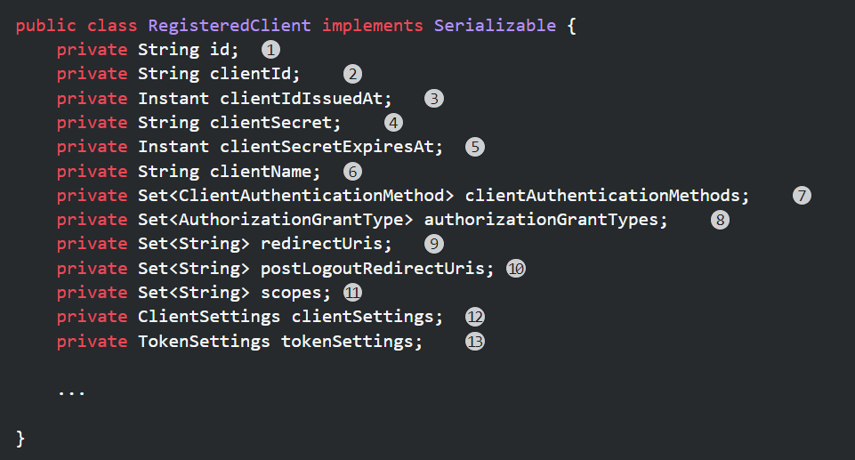

1. **id** : `RegisteredClient`를 고유하게 식별하는 ID
2. **clientId** : 클라이언트 식별자
3. **clientIdIssuedAt** : 클라이언트 식별자가 발급된 시간
4. **clientSecret** : 클라이언트 시크릿, **Spring Security의 `PasswordEncoder`** 를 사용하여 인코딩 되어야 한다.
5. **clientSecretExpiresAt** : 클라이언트 시크릿이 만료되는 시간
6. **clientName** : 클라이언트 이름
7. **clientAuthenticationMethods** : 클라이언트가 사용할 수 있는 인증 방법 (`client_secret_basic`, `client_secret_post`, `none` 등)
8. **authorizationGrantTypes** : 클라이언트가 사용할 수 있는 권한 부여 유형 (`authorization_code`, `client_credentials` 등)
9. **redirectUris** : 클라이언트가 리다이렉션 기반 흐름에서 사용할 수 있는 등록된 리다이렉션 URI
10. **postLogoutRedirectUris** : 클라이언트가 로그아웃에 사용할 수 있는 로그아웃 후 리다이렉션 URI
11. **scopes** : 클라이언트가 요청할 수 있는 범위
12. **clientSettings** : 클라이언트에 대한 사용자 정의 설정(PKCE 필요, 승인 동의 필요 등)
13. **tokenSettings** : 클라이언트에 발급된 OAuth2 토큰에 대한 사용자 정의 설정()

## RegisteredClient 구성 방법

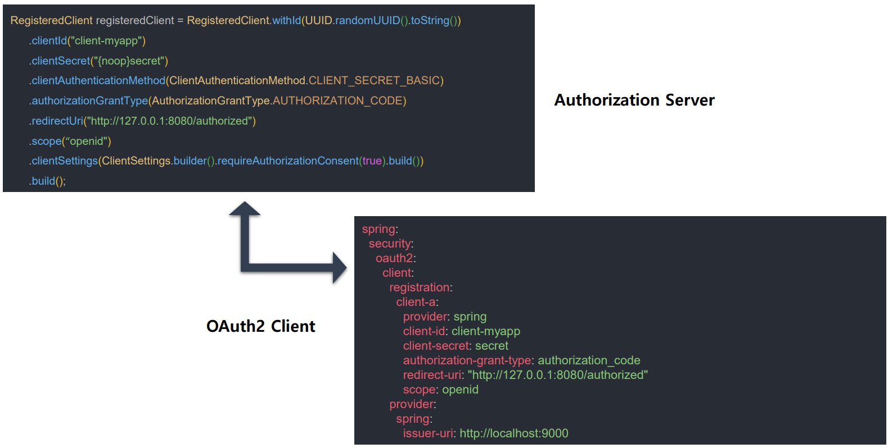

- **Authorization Server** 와 **OAuth2 Client** 는 서로 대응되는 정보이기 때문에 반드시 그 정보가 일치해야 한다.

---

## RegisteredClientRepository

- 새로운 클라이언트를 등록하고 기존 클라이언트를 조회할 수 있는 저장소 클래스
- 클라이언트 인증, 권한 부여 처리, 토큰 자체 검사, 동적 클라이언트 등록 등과 같은 특정 프로토콜 흐름 시 다른 구성 요소에서 참조한다.
- 제공하는 구현체로 `InMemoryRegisteredClientRepository` 와 `JdbcRegisteredClientRepository`가 있다.

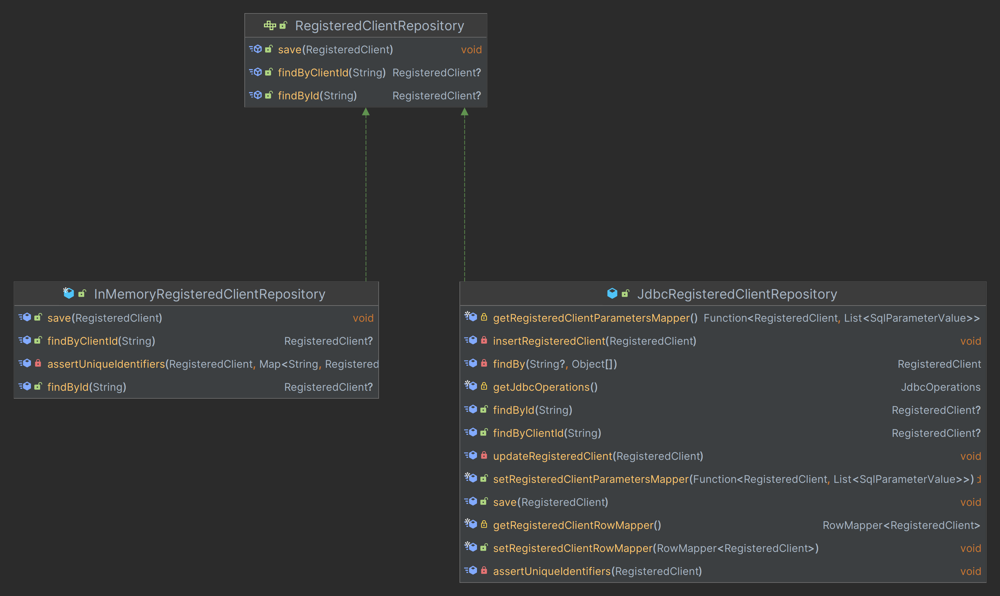

---

## 예시 코드

### SecurityConfig

## 동작 확인

### oauth-client-app1

**임시 코드 요청**

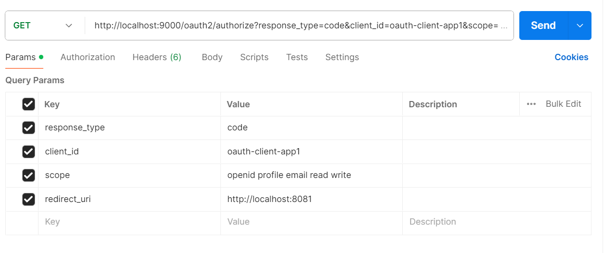

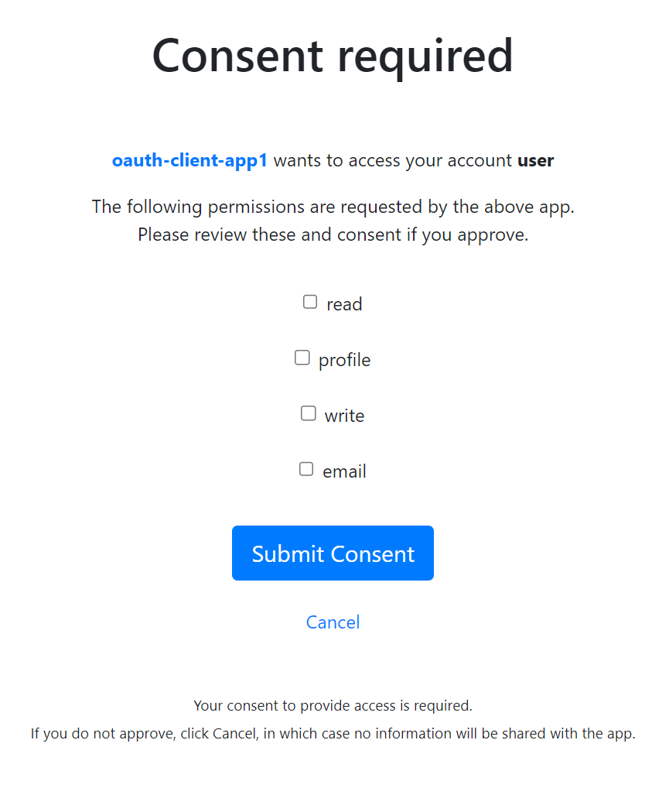

**토큰 요청**

**사용자 정보 요청**

### oauth-client-app2

**임시 코드 요청**

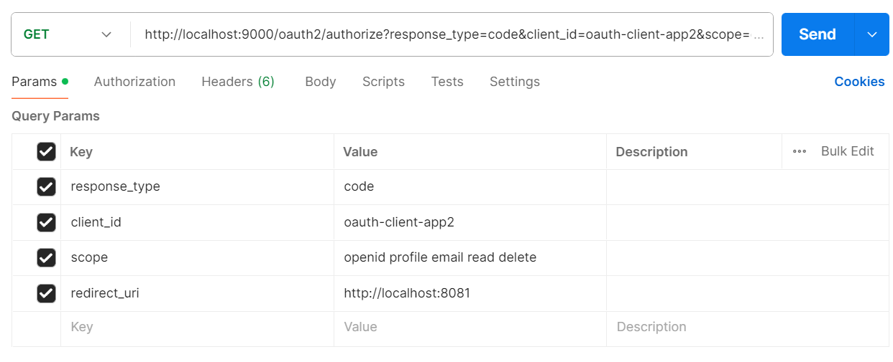

**토큰 요청**

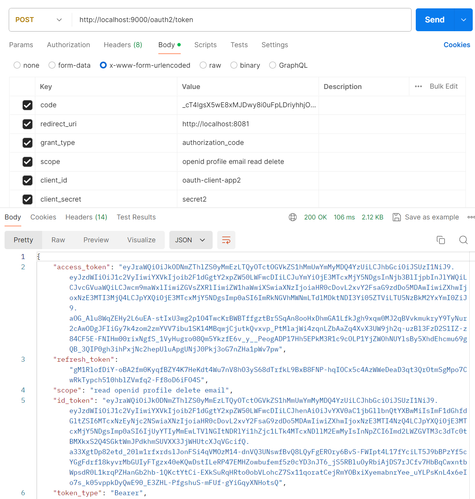

**사용자 정보 요청**

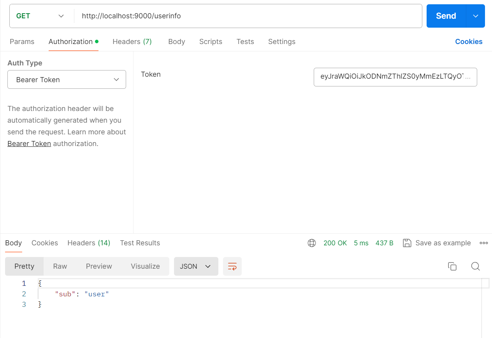

### oauth-client-app3

**임시 코드 요청**

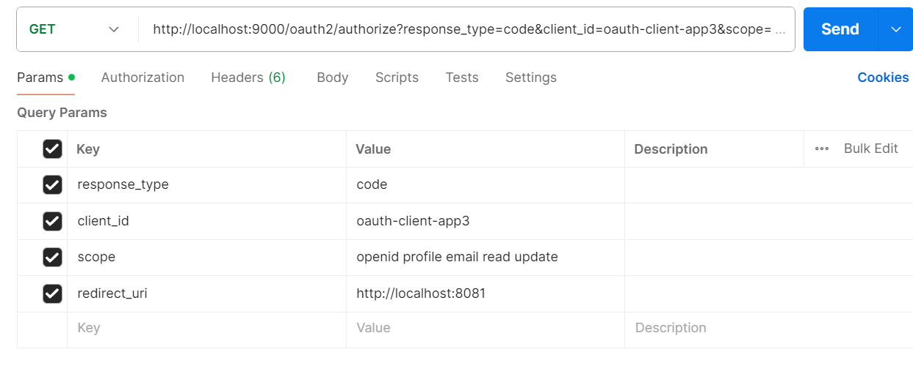

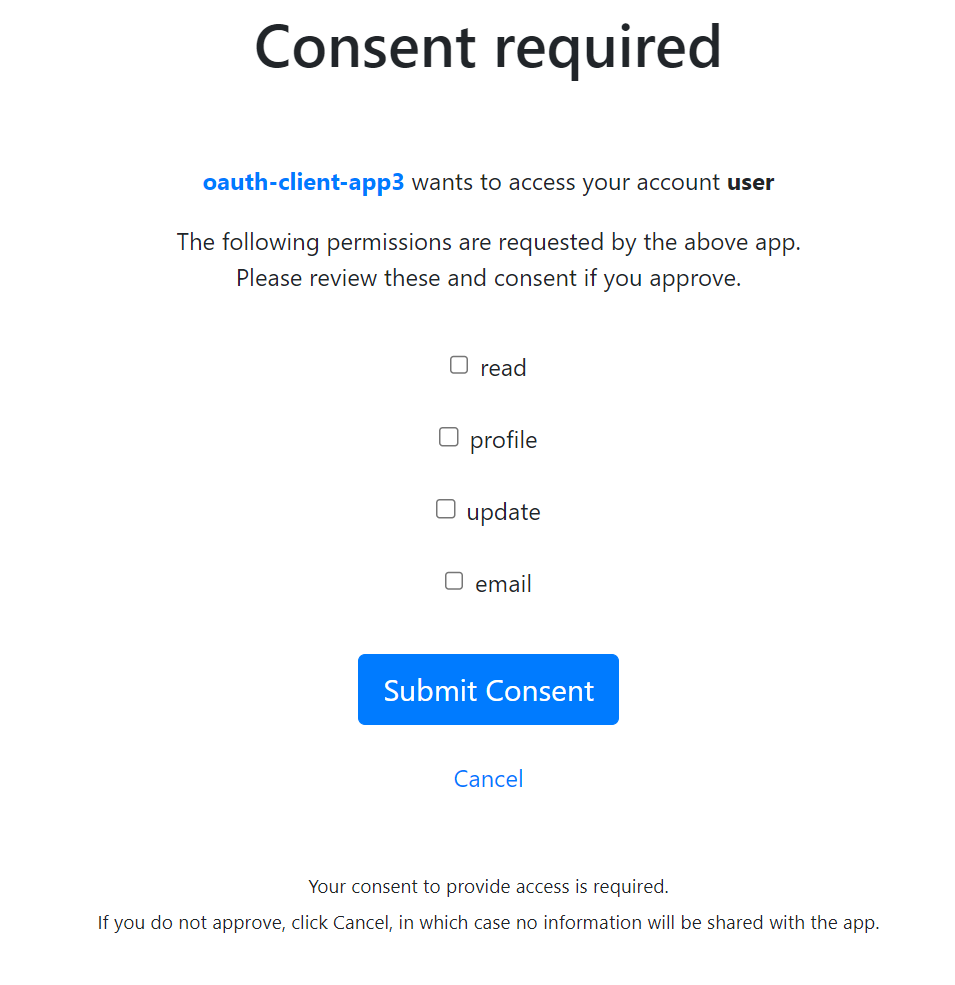

**토큰 요청**

**사용자 정보 요청**

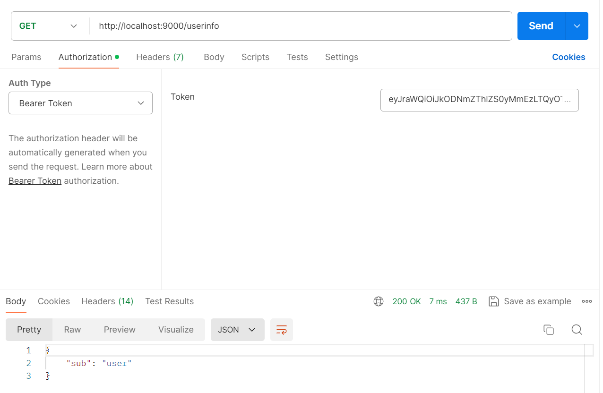

## RegisteredClientController

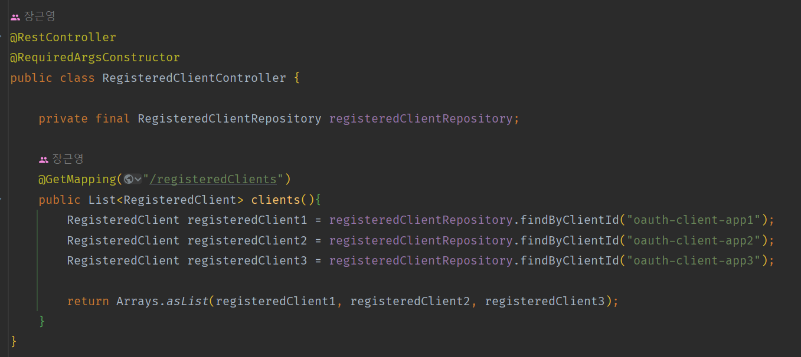

---

[메인 ⏫](https://github.com/genesis12345678/TIL/blob/main/Spring/security/oauth/main.md)

[다음 ↪️ - Spring Authorization Server - 주요 클래스(`OAuth2Authorization`)]()