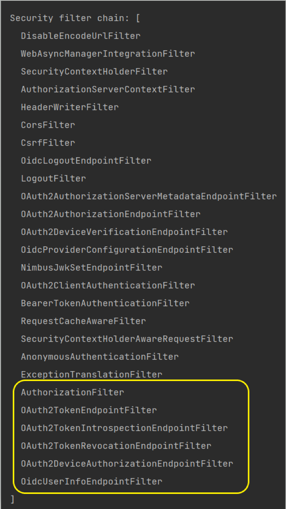
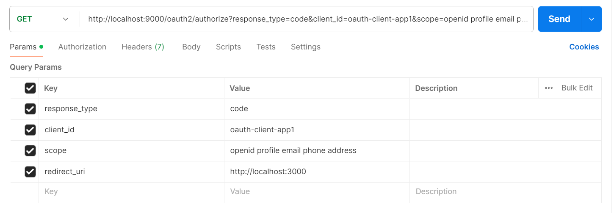
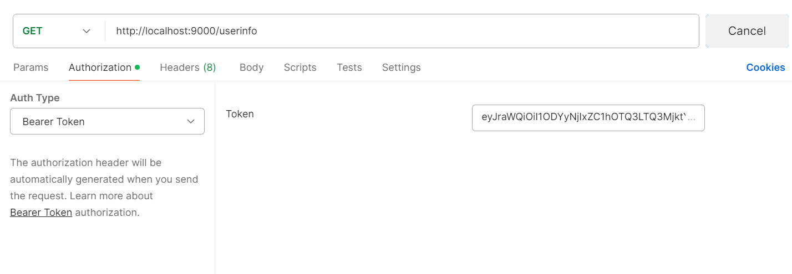
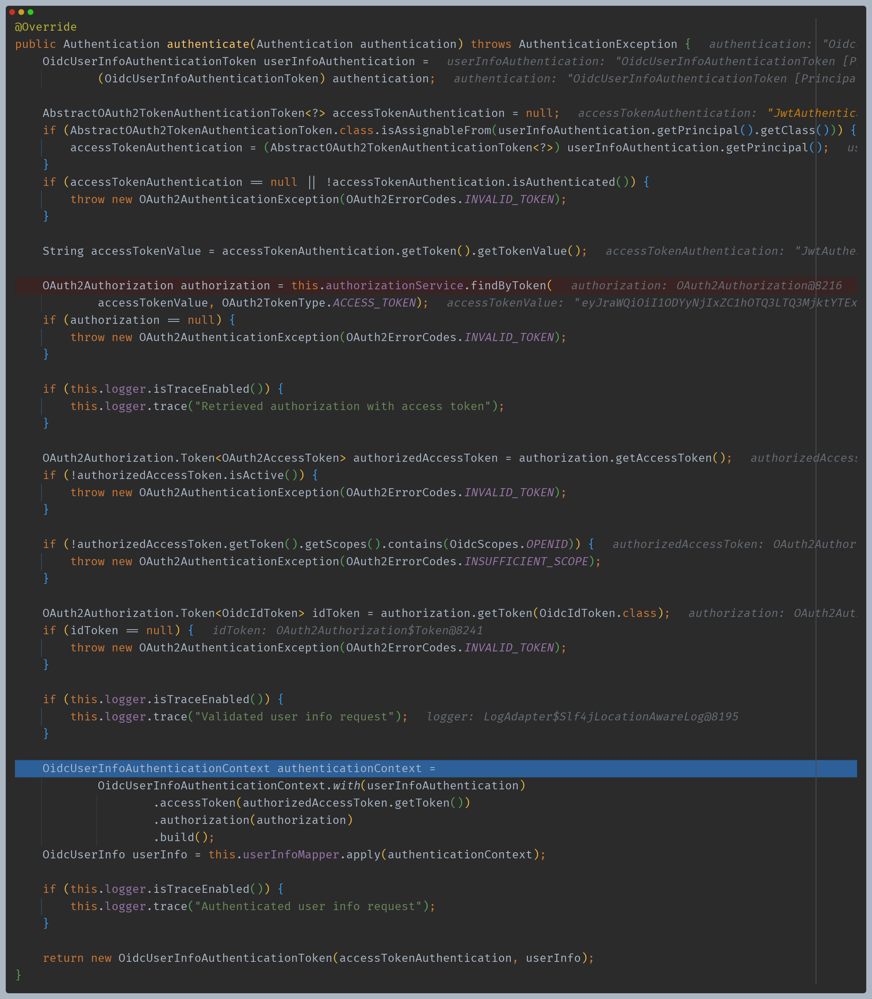

# Spring Authorization Server - 엔드포인트 프로토콜

# OpenID Connect 1.0 Endpoint

## OidcProviderConfigurationEndpointConfigurer

- OpenID Connect 1.0 Provider 엔드포인트에 대한 지원을 제공한다.
- `OidcProviderConfigurationEndpointFilter`를 구성하고 이를 OAuth2 인증 서버 `SecurityFilterChain` 빈에 등록한다.
- `OidcProviderConfigurationEndpointFilter`은 `OidcProviderConfiguration`을 반환하는 필터다.

## RequestMatcher

- `/.well-known/openid-configuration, GET`

---

## OidcLogoutEndpointConfigurer

- OpenID Connect 1.0 Logout 엔드포인트에 대한 지원을 제공한다.
- `OidcLogoutEndpointFilter`를 구성하고 이를 OAuth2 인증 서버 `SecurityFilterChain` 빈에 등록한다.
- `OidcLogoutEndpointFilter`는 다음 기본 설정으로 구성된다.
  - **AuthenticationConverter** : `OidcLogoutAuthenticationConverter`
  - **AuthenticationProvider** : `OidcLogoutAuthenticationProvider`
  - **AuthenticationSuccessHandler** : `OidcLogoutAuthenticationToken`을 처리하고 로그아웃을 수행하는 내부 구현체
  - **AuthenticationFailureHandler** : `OAuth2AuthenticationException`과 관련된 `OAuth2Error` 응답을 반환하는 내부 구현체

## RequestMatcher

- `/connect/logout, GET`
- `/connect/logout, POST`

---

## OidcUserInfoEndpointConfigurer

- OpenID Connect 1.0 UserInfo 엔드포인트에 대한 지원을 제공한다.
- `OidcUserInfoEndpointFilter`를 구성하고 이를 OAuth2 인증 서버 `SecurityFilterChain` 빈에 등록한다.
- `OidcUserInfoEndpointFilter`는 다음 기본 설정으로 구성된다.
    - **AuthenticationConverter** : `SecurityContext`에서 `Authentication`을 얻어 `OidcUserInfoAuthenticationToken`을 반환하는 익명 객체
    - **AuthenticationProvider** : `OidcUserInfoAuthenticationProvider`
    - **AuthenticationSuccessHandler** : 인증된  `OidcUserInfoAuthenticationToken`을 처리하고 `OidcUserInfo` 응답을 반환하는 내부 구현체
    - **AuthenticationFailureHandler** : `OAuth2AuthenticationException`과 관련된 `OAuth2Error` 응답을 반환하는 내부 구현체

## RequestMatcher

- `/userinfo, GET`
- `/userinfo, POST`

## UserInfo 엔드포인트 접근 조건

- UserInfo 엔드포인트 프로토콜은 `AuthorizationFilter` 이후에 위치하고 있기 때문에 기본적으로 인증을 받은 상태에서만 접근이 가능하다.
- UserInfo 엔드포인트 요청시 일반적으로 로그인 과정을 거치기 때문에 정상적으로 `access token` 발급이 가능하다.
- UserInfo 엔드포인트는 권한 부여 흐름 요청에서 받은 `access token`을 가지고 인가 서버로 요청하기 때문에 별도의 인증 과정을 거치도록 구성되어져야 한다.



- 그리고 인가 서버는 다음과 같은 구성을 통해 토큰에 대한 인증 과정을 거치도록 한다.
- **OpenID Connect 1.0 UserInfo 엔드포인트**에는 토큰을 디코딩하고 검증하기 위한 `JwtDecoder` 빈이 필요하다

```java
@Bean
public SecurityFilterChain authorizationServerSecurityFilterChain(HttpSecurity http) throws Exception {
	OAuth2AuthorizationServerConfigurer authorizationServerConfigurer =
		new OAuth2AuthorizationServerConfigurer();
	http.apply(authorizationServerConfigurer);

	...

	http.oauth2ResourceServer(resourceServer -> resourceServer.jwt(Customizer.withDefaults()));

	return http.build();
}

@Bean
public JwtDecoder jwtDecoder(JWKSource<SecurityContext> jwkSource) {
	return OAuth2AuthorizationServerConfiguration.jwtDecoder(jwkSource);
}
```

---

# UserInfo 엔드포인트 요청 흐름


## 1. 임시 코드 확인 후 액세스 토큰 요청

- 여기서 scope는 openid 에서 기본적으로 제공하는 scope 들이다.
- 물론 인가 서버 설정에서도 모두 적용되어 있어야 한다.




## 2. UserInfo 엔드포인트 요청



## 3. OidcUserInfoEndpointFilter

- `authenticationConverter`에서 `SecurityContext`에서 `Authentication`을 얻어와 `OidcUserInfoAuthenticationToken`을 반환한다.

## 4. ProviderManager -> OidcUserInfoAuthenticationProvider

- 토큰 유효성, 스코프 등을 확인한다.
- 스프링 시큐리티 인가 서버에서는 스코프에 `openid`가 없으면 예외를 반환한다.
- `apply()` 내부 과정에서 `openid` 전용 스코프가 아닌 scope 들은 모두 제거한다.(`sub`만 남게 된다.)
- 최종 `OidcUserInfoAuthenticationToken`을 반환한다.



## 5. OidcUserInfoEndpointFilter -> sendUserInfoResponse()


## 만약 openid 없이 요청하면?

- **예외가 발생한다.**


---

[이전 ↩️ - Spring Authorization Server(엔드포인트 프로토콜) - ]()

[메인 ⏫](https://github.com/genesis12345678/TIL/blob/main/Spring/security/oauth/main.md)

[다음 ↪️ - Spring Authorization Server(엔드포인트 프로토콜) - ]()