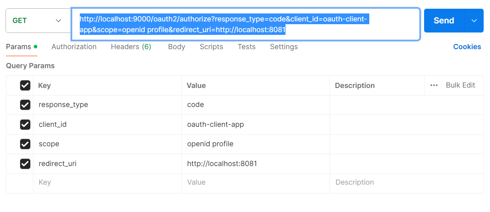
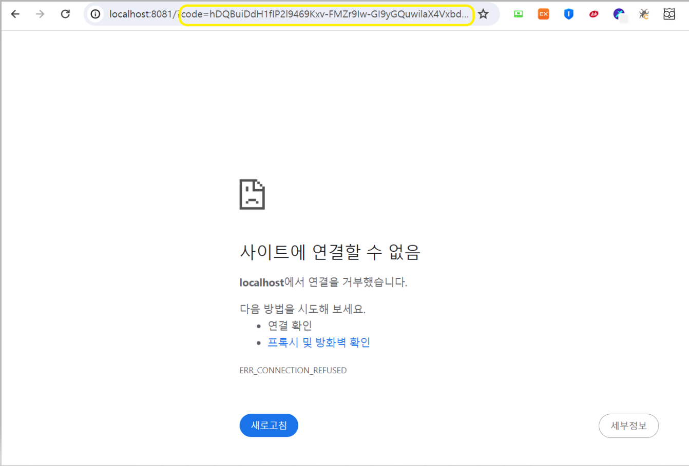
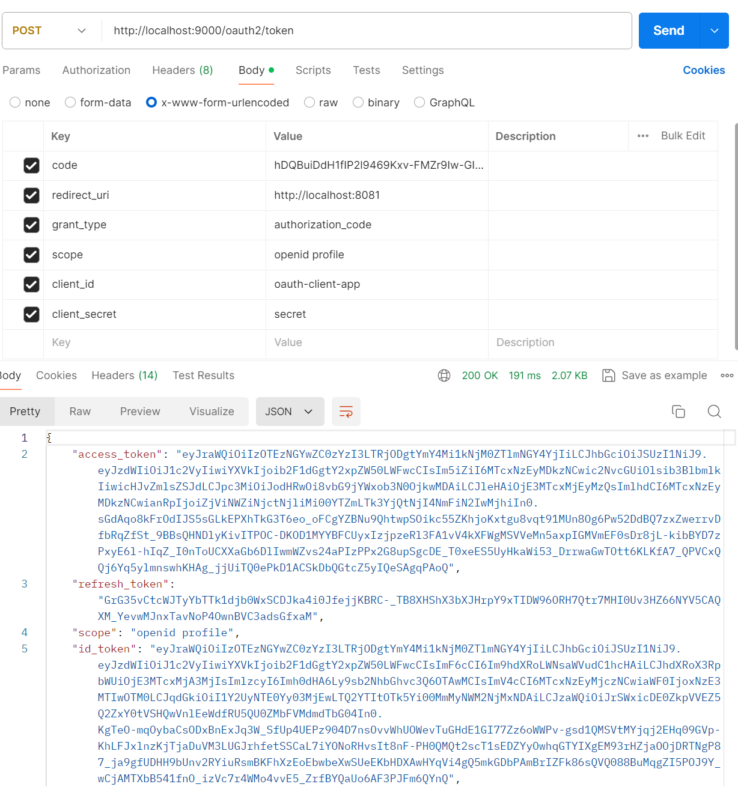
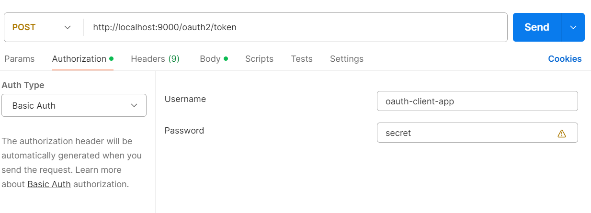
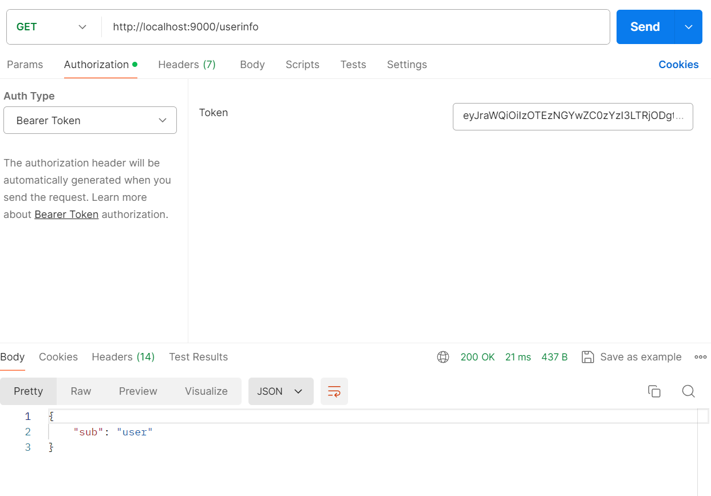

# Spring Authorization Server - 인가 서버 시작

**OAuth 2.0 Authorization Server 의 권한 부여 흐름에 대한 이해를 위해 설정만으로 간단한 애플리케이션 만들기**

---

## SecurityConfig

```java
@Configuration
@EnableWebSecurity
public class SecurityConfig {

    @Bean
    @Order(1)
    public SecurityFilterChain authorizationServerSecurityFilterChain(HttpSecurity http) throws Exception {
        // Spring Authorization Server 기본 설정 적용
        OAuth2AuthorizationServerConfiguration.applyDefaultSecurity(http);

        http.getConfigurer(OAuth2AuthorizationServerConfigurer.class)
                .oidc(Customizer.withDefaults()); //OpenID Connect 1.0 활성화

        http
                .exceptionHandling((exceptions) -> exceptions
                        .authenticationEntryPoint(
                                new LoginUrlAuthenticationEntryPoint("/login")
                        )
                )
                //JWT 액세스 토큰 검증 설정
                .oauth2ResourceServer((resourceServer) -> resourceServer
                        .jwt(Customizer.withDefaults()));

        return http.build();
    }

    @Bean
    @Order(2)
    public SecurityFilterChain defaultSecurityFilterChain(HttpSecurity http) throws Exception {
        http
                .authorizeHttpRequests((authorize) -> authorize
                        .anyRequest().authenticated()
                )
                .formLogin(Customizer.withDefaults());

        return http.build();
    }

    @Bean
    public UserDetailsService userDetailsService() {
        UserDetails userDetails = User.withUsername("user")
                .password("{noop}1234")
                .roles("USER")
                .build();

        return new InMemoryUserDetailsManager(userDetails);
    }

    @Bean
    public RegisteredClientRepository registeredClientRepository() {
        RegisteredClient oidcClient = RegisteredClient.withId(UUID.randomUUID().toString())
                .clientId("oidc-client")
                .clientSecret("{noop}secret")
                //클라이언트 자격증명 전송 방식 설정
                .clientAuthenticationMethod(ClientAuthenticationMethod.CLIENT_SECRET_BASIC)
                .clientAuthenticationMethod(ClientAuthenticationMethod.CLIENT_SECRET_POST)
                //권한부여 유형 설정
                .authorizationGrantType(AuthorizationGrantType.AUTHORIZATION_CODE)
                .authorizationGrantType(AuthorizationGrantType.REFRESH_TOKEN)
                .redirectUri("http://localhost:8081")
                .postLogoutRedirectUri("http://localhost:8081")
                .scope(OidcScopes.OPENID)
                .scope(OidcScopes.PROFILE)
                //사용자 동의 필수 여부
                .clientSettings(ClientSettings.builder().requireAuthorizationConsent(true).build())
                .build();

        return new InMemoryRegisteredClientRepository(oidcClient);
    }

    //액세스 토큰 서명을 위한 com.nimbusds.jose.jwk.source.JWKSource 의 인스턴스
    //운영 시에는 KeyStore 에 저장
    @Bean
    public JWKSource<SecurityContext> jwkSource() {
        KeyPair keyPair = generateRsaKey();
        RSAPublicKey publicKey = (RSAPublicKey) keyPair.getPublic();
        RSAPrivateKey privateKey = (RSAPrivateKey) keyPair.getPrivate();
        RSAKey rsaKey = new RSAKey.Builder(publicKey)
                .privateKey(privateKey)
                .keyID(UUID.randomUUID().toString())
                .build();
        JWKSet jwkSet = new JWKSet(rsaKey);
        return new ImmutableJWKSet<>(jwkSet);
    }

    //위의 JWKSource를 생성하는 데 사용되는 시작 시 생성된 키가 있는 java.security.KeyPair 의 인스턴스
    private static KeyPair generateRsaKey() {
        KeyPair keyPair;
        try {
            KeyPairGenerator keyPairGenerator = KeyPairGenerator.getInstance("RSA");
            keyPairGenerator.initialize(2048);
            keyPair = keyPairGenerator.generateKeyPair();
        }
        catch (Exception ex) {
            throw new IllegalStateException(ex);
        }
        return keyPair;
    }

    //서명된 액세스 토큰을 디코딩하기 위한 JwtDecoder 의 인스턴스
    @Bean
    public JwtDecoder jwtDecoder(JWKSource<SecurityContext> jwkSource) {
        return OAuth2AuthorizationServerConfiguration.jwtDecoder(jwkSource);
    }

    @Bean
    public AuthorizationServerSettings authorizationServerSettings() {
        return AuthorizationServerSettings.builder().issuer("http://localhost:9000").build();
    }

}
```
> 참고로 위 대부분 설정은 `application.yml`을 통해서도 가능하다.

---

## 동작 확인

### 1. 임시 코드 요청

**아래 URL 그대로 입력**


> 여기서 `redirect_uri`는 가상의 클라이언트 이고, 당연히 인가 서버 설정과 맞아야 한다.

**로그인(user, 1234)**


**사용자 동의 화면 확인**


**redirect_uri로 임시 코드 전송**



### 2. 토큰 요청

**code에 위에서 받은 코드를 넣고 필요한 정보 입력해서 Send**



> - 설정 클래스에서 클라이언트 자격증명 전송 방식을 `client_secret_basic` 방식과 `client_secret_post` 방식이 가능하게 설정했다.
> - 위와 같은 경우는 `client_secret_post` 방식이고, `client_secret_basic` 방식은 아래와 같이 하면 된다.
> 
> 

### 3. 사용자 정보 요청

**액세스 토큰으로 사용자 정보 요청**



### 추가 - 리프레시 토큰 요청

**토큰 요청에서 받은 `refresh_token`으로 액세스 토큰을 재발급 받을 수 있다.**


---

[이전 ↩️ - Spring Authorization Server - 초기화 과정(`AuthorizationServerContext`)]()

[메인 ⏫](https://github.com/genesis12345678/TIL/blob/main/Spring/security/oauth/main.md)