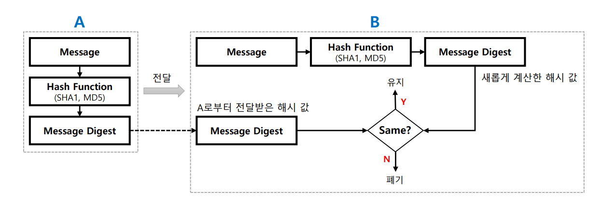
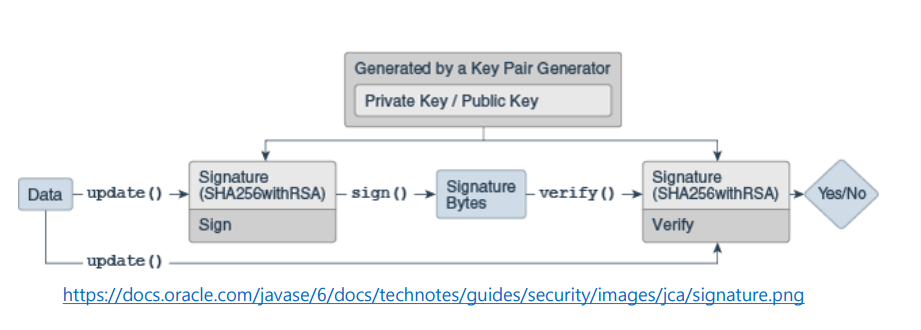

# OAuth 2.0 Resource Server 검증 기초 - JCA & JCE 구조

## JCA (Java Cryptography Architecture) & JCE (Java Cryptography Extension)

- 자바는 **JCA & JCE** 프레임워크를 통해 자체적인 보안 관련 기능을 제공하며 있으며 전자서명(Digital Signature), 메시지 다이제스트(Message Digest, hashs), 인증서와
    인증서 유효성 검사(Certificate Validation), 키 생성 및 관리 그리고 보안 랜덤 수(Secure Random Number) 생성 등 현대 정보 통신 암호 기술 중에서 필수적인 것은 모두 제공하고 있다.
- **JCA & JCE 프레임워크는 프로바이더 보안 구조를 사용하여 보안과 관련한 다양한 API를 제공하고 있다.**
- 프로바이더는 `java.security.Provider` 클래스의 구현체로 보안 알고리즘 구현체 목록을 포함하고 있고 이를 통해 보안 서비스를 구현할 수 있다.
- 예를 들어 특정 알고리즘의 인스턴스가 필요해지면, **JCA & JCE 프레임워크**는 프로바이더 저장소에서 해당 알고리즘의 적합한 구현체 클래스를 찾아 클래스 인스턴스를 생성하는데
    프로바이더를 직접 지정할 수도 있다.

### Cipher

- 암호화 및 복호화에 사용되는 암호화 암호의 기능을 제공한다.
- **암호화**는 일반 텍스트와 키를 가져와 암호화된 데이터를 생성하는 프로세스
- **복호화**는 암호화된 데이터와 키를 가져와서 일반 텍스트를 생성하는 역 과정

**Cipher 객체 인스턴스화하기**
- 인스턴스 생성 시 변환을 지정하는 데 변환은 `[암호화 알고리즘/피드백 모드/패딩]` 또는 `[암호화 알고리즘]`으로 지정한다.
  - `Cipher cipher = Cipher.getInstance("RSA/ECB/OAEPWithSHA1AndMGF1Padding);`
  - `Cipher cipher = Cipher.getInstance("RSA");`

**Cipher 초기화하기**
- `Cipher` 객체를 초기화 하기 위해서 `Cipher`의 작동 모드를 나타내는 `opmode`와 `Key` 또는 증명서(`Certificate`)를 인자로 전달하고 `init()` 메서드를 실행한다.
- `opmode`
  - `ENCRYPT_MODE` : cipher 객체를 암호화 모드로 초기화한다.
  - `DECRYPT_MODE` : cipher 객체를 복호화 모드로 초기화한다.
- `Cipher cipher = Cipher.getInstance("RSA");`
- `cipher.init(Cipher.ENCRYPT_MODE, PrivateKey);`
---

## MessageDigest

- 메시지 다이제스트의 목적은 **원본 파일이 그대로인지 파악하는 무결성 검사**이다.
- 메시지 다이제스트 알고리즘은 입력 값으로 전달된 다양한 길이의 원본 값을 고정 길이 해시 값으로 출력한다.
- 이 알고리즘은 단방향이기 때문에 **해시 값에서 거꾸로 원본 값을 도출할 수 없다.**

> - 값(`A`)과 을(`B`)의 교신 상황에서 갑은 을에게 전달하고자 하는 원본과 그 원본의 메시지 해시 값 그리고 메시지 다이제스트 알고리즘을 보낸다.
> - 을은 갑이 전달한 알고리즘과 원본을 가지고 메시지 해시 값을 계산한다.
> - 을이 계산한 메시지 해시 값과 갑이 전달한 메시지 해시 값이 일치하면, 갑이 전달한 원본이 네트워크를 통해 을에게 오기까지 변조되지 않았다는 것을 확인할 수 있다.

---

## Signature

- **Signature**는 초기화 시 제공받은 키를 사용해서 데이터를 서명하고 전자 서명의 유효성을 검증하는 데 사용된다.

- **서명**
  - **Signature** 객체는 개인 키로 서명 하기 위해 초기화 되고 서명할 원본 데이터가 저장된다.
  - **Signatrue**의 `sign()`은 개인 키로 원본 데이터를 서명 하면 해시된 데이터를 암호화한 **Signature Bytes**를 반환한다.
- **검증**
  - 검증이 필요한 경우 검증을 위해 **Signature** 객체를 생성 및 초기화하고 개인 키와 쌍을 이루는 해당 공개 키를 제공한다.
  - 원본 데이터와 **Signature Bytes**가 검증 **Signature** 객체에 전달되고 `verify()` 를 실행하면 공개 키로 **Signature Bytes**의 해시 데이터를 추출하고
    원본 데이터를 해시한 값과 비교해서 일치하면 **Signature** 객체가 성공을 보고한다.

> 서명은 메시지 다이제스트와 비대칭키 암호화가 결합한 형태로서 `SHA256WithRSA` 처럼 메시지 다이제스트 알고리즘은 `SHA256`을 사용하여 초기에 대규모 데이터를
> 보다 관리하기 쉬운 고정 길이의 형식으로 **압축**한 다음 비대칭키 암호화인 `RSA` 알고리즘으로 고정 길이의 32바이트 메시지 다이제스트에 서명한다.

---

[메인 ⏫](https://github.com/genesis12345678/TIL/blob/main/Spring/security/oauth/main.md)

[다음 ↪️ - OAuth 2.0 Resource Server 검증 기초 - JCA & JCE - 대칭키 & 비대칭키]()