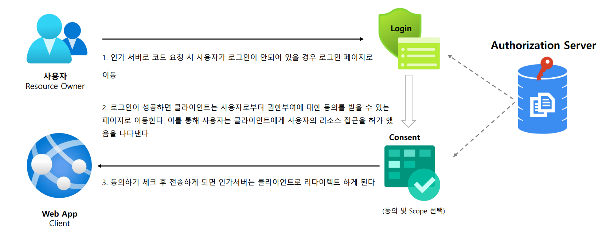
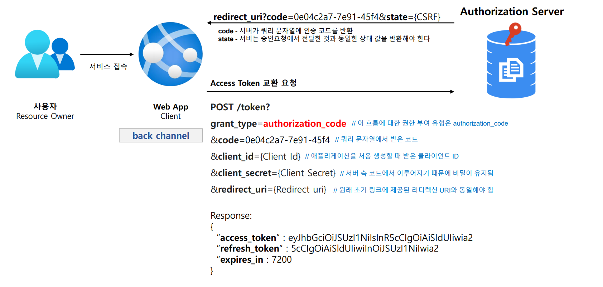
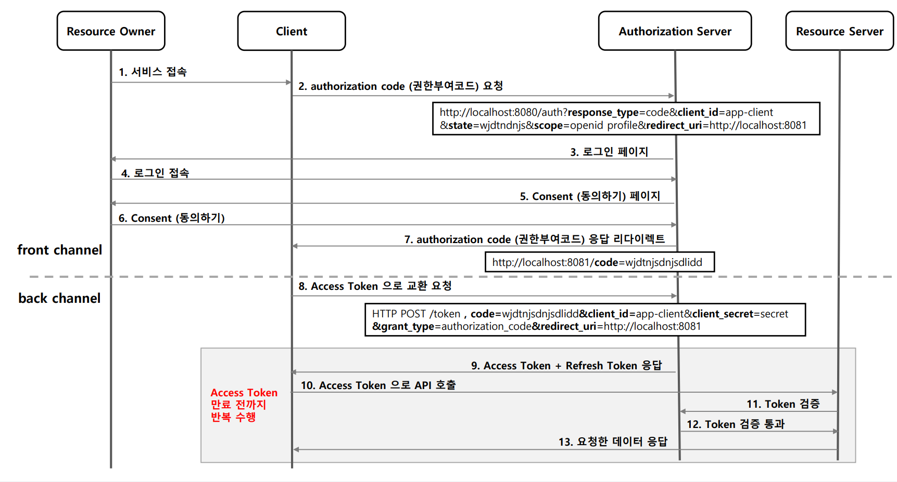

# OAuth 2.0 권한 부여 유형 - 권한 부여 코드 승인 방식

---

## Authorization Code Grant

서비스에서 가장 중요한 정보인 사용자 데이터가 외부로 전송되지 않아 안전하고, OAuth 에서 가장 잘 알려진 인증 방법이다.

### 1. 흐름 및 특징

1. 사용자가 애플리케이션을 승인하면 인가 서버는 Redirect URI로 임시 코드를 담아서 애플리케이션으로 다시 리다이렉트 한다.
2. 애플리케이션은 해당 임시 코드를 인가 서버로 전달하고 액세스 토큰으로 교환한다.
3. 애플리케이션이 액세스 토큰을 요청할 때 해당 요청을 클라이언트 암호로 인증할 수 있으므로 공격자가 인증 코드를 가로채서 스스로 사용할 위험이 줄어든다.
4. 액세스 토큰이 사용자 또는 브라우저에 표시되지 않고 애플리케이션에 다시 전달하는 가장 안전한 방법이므로 토큰이 다른 사람에게 누출된 위험이 줄어든다.

### 2. 권한 부여 코드 요청 시 매개변수
- **필수**
  - `response_type=code`
  - `cliend_id`
- 선택사항
  - `redirect_uri`
  - `scope`
  - `state`

### 3. 액세스 토큰 교환 요청 시 매개변수
- **필수**
  - `grant_type=authorization_code`
  - `code`
  - `redirect_uri` : 초기 승인 요청에 포함된 경우
  - `client_id`
  - `client_secret`

---

## 흐름

### 1. authorization code 요청 : 인가 서버에게 code를 요청한다.

### 2. 사용자 인증 및 동의하기 : 사용자의 승인 및 동의 하에 인가 서버가 클라이언트에게 코드를 발급한다.

### 3. Redirect 및 Access Token 교환 요청 : 클라이언트의 권한 부여가 승인되고 그 결과로 토큰을 획득한다.

---

---

[이전 ↩️ - OAuth 2.0 권한부여 유형 - OAuth 2.0 Grant Type]()

[메인 ⏫](https://github.com/genesis12345678/TIL/blob/main/Spring/security/oauth/main.md)

[다음 ↪️ - OAuth 2.0 권한부여 유형 - 암묵적 승인 방식]()