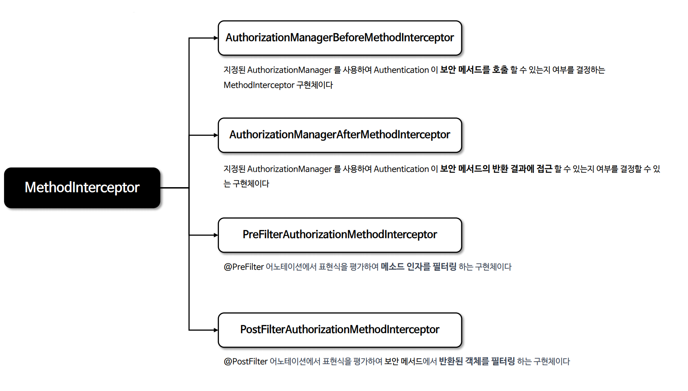
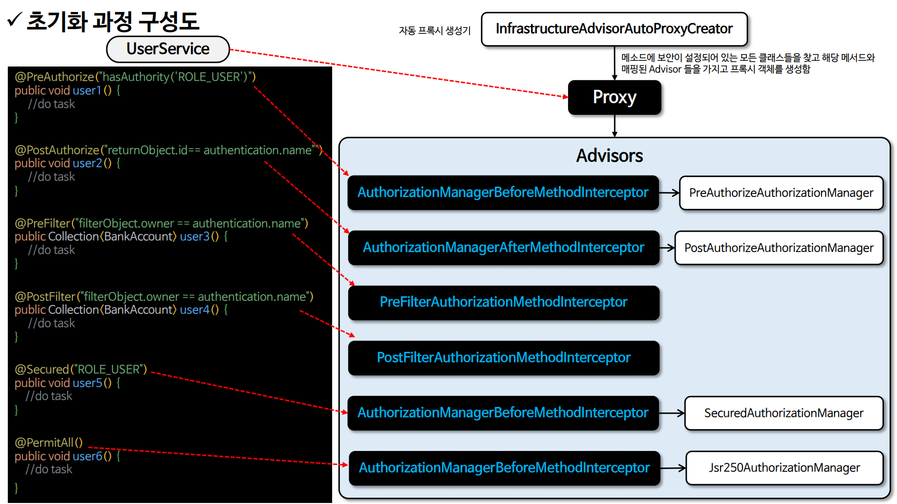
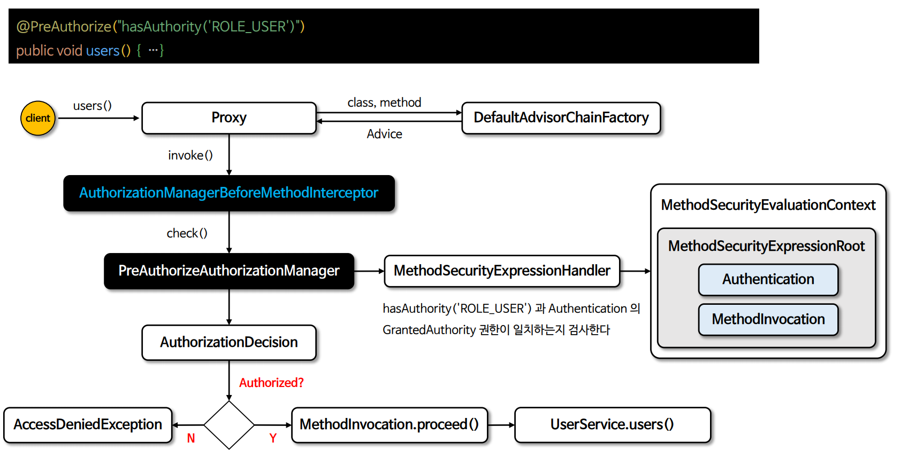
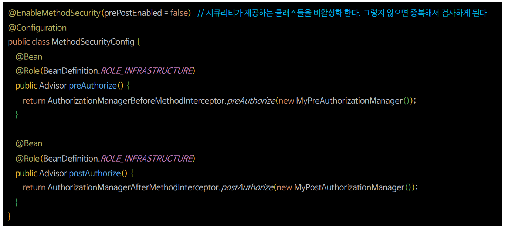
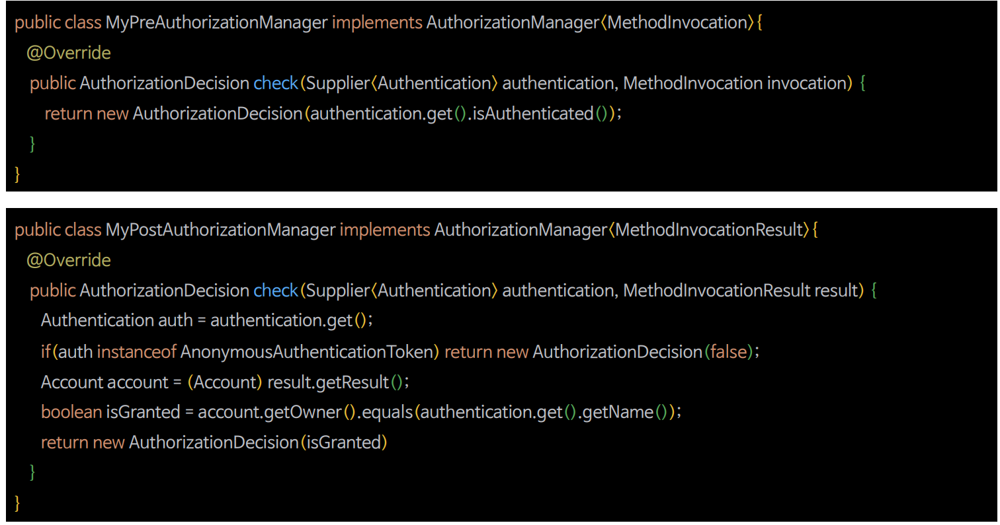

# 메서드 기반 인가 관리자

- 스프링 시큐리티는 메서드 기반의 인증된 사용자 및 특정 권한을 가진 사용자의 자원 접근 허용여부를 결정하는 인가 관리자 클래스들을 제공한다.
- `PreAuthorizeAuthorizationManager`, `PostAuthorizeAuthorizationManager`, `Jsr250AuthorizationManager`, `SecuredAuthorizationManager`가 있다.
- 메서드 기반 권한 부여는 내부적으로 **AOP 방식에 의해 초기화 설정이 이루어지며** 메서드의 호출을 `MethodInterceptor`가 가로 채어 처리하고 있다.


---

## 메서드 권한 부여 초기화 과정


> 1. 스프링은 초기화 시 생성되는 전체 빈을 검사하면서 **빈이 가진 메서드 중에서 보안이 설정된 메서드가 있는지 탐색한다.**
> 2. 보안이 설정된 메서드가 있다면 스프링은 **그 빈의 프록시 객체를 자동으로 생성한다.**(기본적으로 `CGLIB` 방식)
> 3. 보안이 설정된 메서드에는 **인가처리 기능을 하는 `Advice`를 등록한다.**
> 4. 스프링은 빈 참조 시 실제 빈이 아닌 **프록시 빈 객체를 참조**하도록 처리한다.
> 5. 초기화 과정이 종료된다.
> 6. 사용자는 **프록시 객체를 통해 메서드를 호출**하게 되고, 프록시 객체는 **`Advice`가 등록된 메서드가 있다면 호출하여 작동 시킨다.**
> 7. **`Advice`는 메서드 진입 전 인가 처리**를 하게 되고 인가 처리가 승인되면 **실제 객체의 메서드를 호출**하게 되고 인가 처리가 거부되면 예외가 발생하고 메서드 진입에 실패한다.

---

## 메서드 인터셉터 구조



- **AuthorizationManagerBeforeMethodInterceptor**
  - `@PreAuthorize`
- **AuthorizationManagerAfterMethodInterceptor**
  - `@PostAuthorize`
- **PreFilterAuthorizationMethodInterceptor**
  - `@PreFilter`
- **PostFilterAuthorizationMethodInterceptor**
  - `@PostFilter`



---

## @PreAuthorize 처리 구조 이해



---

## @PostAuthorize 처리 구조 이해


---

## 메서드 기반 Custom AuthorizationManager

- 사용자 정의 `AuthorizationManager` 를 생성해 메서드 보안을 구현할 수 있다.



### 사용자 정의 AuthorizationManager 구현



- 사용자 정의 `AuthorizationManager`는 여러 개 추가할 수 있으며, 그럴 경우 체인 형태로 연결되어 각각 권한 검사를 하게 된다.

### 인터셉터 순서 지정


> - 메서드 보안 어노테이션에 대응하는 AOP 메서드 인터셉터들은 AOP 어드바이저 체인에서 특정 위치를 차지한다.
> - 구체적으로 `@PreFilter` 메서드 인터셉터의 순서는 100, `@PreAuthorize` 의 순서는 200 등으로 설정되어 있다.
> - 이것이 중요한 이유는 **@EnableTransactionManagement** 와 같은 다른 AOP 기반 어노테이션들이 `Integer.MAX_VALUE`로 순서가 설정되어 있는데 기본적으로 이들은
>   어드바이저 체인의 끝에 위치하고 있다.
> - 만약 스프링 시큐리티보다 먼저 다른 어드바이스가 실행 되어야 할 경우, 예를 들어 `@Transactional`과 `@PostAuthorize`가 함께 어노테이션 된 메서드가 있을 때 `@PostAuthorize`가 실행될 때
>   트랜잭션이 여전히 열려 있어서 `AccessDeniedException` 이 발생하면 롤백이 일어나게 하고 싶을 수 있다.
> - 그래서 메서드 인가 어드바이스가 실행되기 전에 트랜잭션을 열기 위해서는 **@EnableTransactionManagement** 의 순서를 설정해야 한다.
> - **@EnableTransactionManagement(order = 0)**
> - 위의 `order = 0` 설정은 트랜잭션 관리가 `@PreFilter` 이전에 실행되도록 하며 `@Transactional` 어노테이션이 적용된 메서드가 스프링 시큐리티의 `@PostAuthorize` 와 같은
>   보안 어노테이션이 먼저 실행되어 트랜잭션이 열린 상태에서 보안 검사가 이루어지도록 할 수 있다. 이러한 설정은 트랜잭션 관리와 보안 검사의 순서에 따른 의도하지 않은 사이드 이펙트를 방지할 수 있다.
> - **AuthorizationInterceptorsOrder를 사용하여 인터셉터 간 순서를 지정할 수 있다.**

---

```java
@Configuration
@EnableWebSecurity
public class SecurityConfig {

    @Bean
    public SecurityFilterChain securityFilterChain(HttpSecurity http) throws Exception {

        http
                .authorizeHttpRequests(authorize -> authorize
                        .anyRequest().authenticated())
                .formLogin(Customizer.withDefaults())
                .csrf(AbstractHttpConfigurer::disable)
        ;
        return http.build();
    }

   @Bean
    public UserDetailsService userDetailsService() {
        UserDetails user = User.withUsername("user")
                .password("{noop}1111")
                .roles("USER")
                .build();

        UserDetails manager = User.withUsername("db")
                .password("{noop}1111")
                .roles("DB")
                .build();

       UserDetails admin = User.withUsername("admin")
               .password("{noop}1111")
               .roles("ADMIN", "SECURE")
               .build();

        return new InMemoryUserDetailsManager(user, manager, admin);
    }
}
```
```java
@Configuration
@EnableMethodSecurity(prePostEnabled = false)
public class MethodSecurityConfig {

    @Bean
    @Role(BeanDefinition.ROLE_INFRASTRUCTURE)
    public Advisor preAuthorize() {
        return AuthorizationManagerBeforeMethodInterceptor.preAuthorize(new MyPreAuthorizationManager());
    }

    @Bean
    @Role(BeanDefinition.ROLE_INFRASTRUCTURE)
    public Advisor postAuthorize() {
        return AuthorizationManagerAfterMethodInterceptor.postAuthorize(new MyPostAuthorizationManager());
    }
}
```
```java
public class MyPreAuthorizationManager implements AuthorizationManager<MethodInvocation> {
    @Override
    public AuthorizationDecision check(Supplier<Authentication> authentication, MethodInvocation object) {
        Authentication auth = authentication.get();

        if (auth instanceof AnonymousAuthenticationToken) {
            return new AuthorizationDecision(false);
        }

        return new AuthorizationDecision(auth.isAuthenticated());
    }
}
```
```java
public class MyPostAuthorizationManager implements AuthorizationManager<MethodInvocationResult> {
    @Override
    public AuthorizationDecision check(Supplier<Authentication> authentication, MethodInvocationResult object) {
        Authentication auth = authentication.get();

        if (auth instanceof AnonymousAuthenticationToken) {
            return new AuthorizationDecision(false);
        }

        Account account = (Account) object.getResult();
        boolean isGranted = account.getOwner().equals(auth.getName());

        return new AuthorizationDecision(isGranted);
    }
}
```
```java
@Getter
@AllArgsConstructor
public class Account {
    private String owner;
    private boolean isSecure;
}
```
```java
@Service
public class DataService {

    @PreAuthorize("")
    public String getUser() {
        return "user";
    }

    @PostAuthorize("")
    public Account getOwner(String name) {
        return new Account(name, false);
    }

    public String display() {
        return "display";
    }
}
```

---

[이전 ↩️ - `RequestMatcherDelegatingAuthorizationManager` 인가 설정 응용](https://github.com/genesis12345678/TIL/blob/main/Spring/security/security/AuthorizationProcess/RequestMatcherDelegatingAuthorizationManager.md)

[메인 ⏫](https://github.com/genesis12345678/TIL/blob/main/Spring/security/security/main.md)

[다음 ↪️ - 포인트컷 메서드 보안](https://github.com/genesis12345678/TIL/blob/main/Spring/security/security/AuthorizationProcess/Pointcut.md)