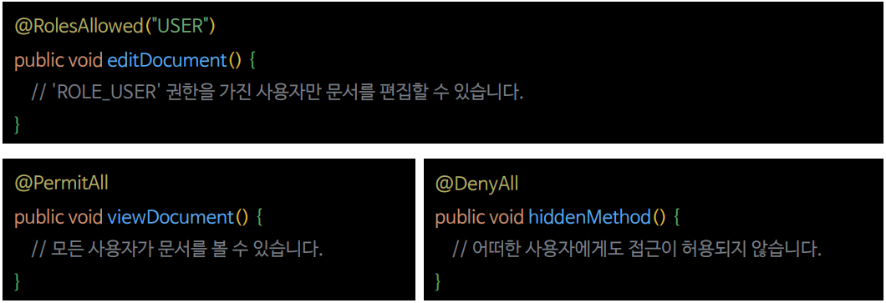
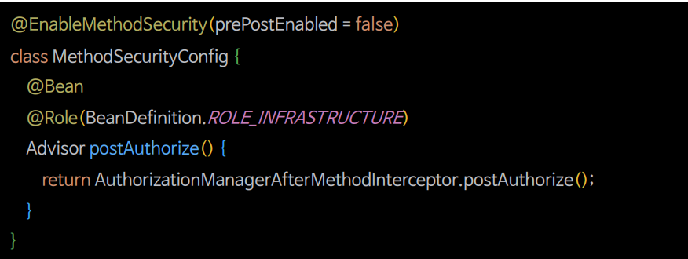
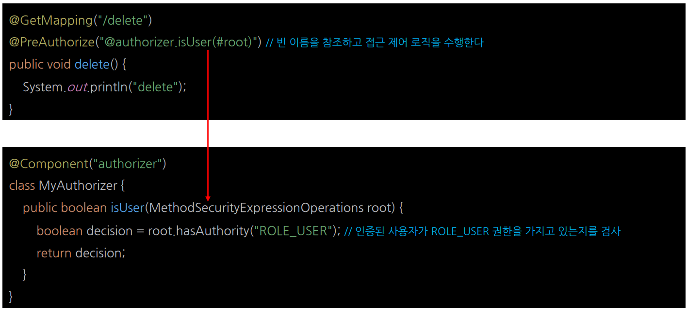

# 메서드 기반 권한 부여

--- 

## @Secured

- `@Secured` 어노테이션을 메서드에 적용하면 지정된 권한(역할)을 가진 사용자만 해당 메서드를 호출할 수 있으며 더 풍부한 형식을 지원하는 `@PreAuthorize` 사용을 권장한다.
- `@Secured` 어노테이션을 사용하려면 스프링 시큐리티 설정에서 **@EnableMethodSecurity(securedEnabled = true)** 설정을 활성화 해야 한다.


---

## JSR-250

- `JSR-250` 기능을 적용하면 **@RolesAllowed**, **@PermitAll** 및 **@DenyAll** 어노테이션 보안 기능이 활성화 된다.
- `JSR-250` 어노테이션을 적용하려면 스프링 시큐리티 설정에서 **@EnableMethodSecurity(jsr250Enabled = true)** 설정을 활성화 해야 한다.



---

## 메타 주석 사용

- 메서드 보안은 애플리케이션의 특정 사용을 위해 편리성과 가독성을 높일 수 있는 메타 주석을 지원한다.


- **특정 주석만 활성화**



`@PreAuthorize`, `@PostAuthorize`, `@PreFilter`, `@PostFilter` 를 비활성화 한 다음, `@PostAuthorize`를 활성화 한다.

---

## 커스텀 빈 표현식 구현



---

## 클래스 레벨 권한 부여


- 모든 메서드는 클래스 수준의 권한 처리 동작을 상속한다.


- 메서드에 어노테이션을 선언한 메서드는 클래스 수준의 어노테이션을 덮어쓰게 된다.

---

```java
@Configuration
@EnableWebSecurity
@EnableMethodSecurity(securedEnabled = true, jsr250Enabled = true)
public class SecurityConfig {

    @Bean
    public SecurityFilterChain securityFilterChain1(HttpSecurity http) throws Exception {

        http
                .authorizeHttpRequests(authorize -> authorize
                        .anyRequest().permitAll())
                .formLogin(Customizer.withDefaults())
                .csrf(AbstractHttpConfigurer::disable)
        ;
        return http.build();
    }


   @Bean
    public UserDetailsService userDetailsService() {
        UserDetails user = User.withUsername("user")
                .password("{noop}1111")
                .roles("USER")
                .build();

        UserDetails manager = User.withUsername("db")
                .password("{noop}1111")
                .roles("DB")
                .build();

       UserDetails admin = User.withUsername("admin")
               .password("{noop}1111")
               .roles("ADMIN", "SECURE")
               .build();

        return new InMemoryUserDetailsManager(user, manager, admin);
    }
}
```
```java
@Documented
@Retention(RUNTIME)
@Target({TYPE, METHOD})
@PreAuthorize("hasRole('ADMIN')")
public @interface IsAdmin {}
```
```java
@Documented
@Retention(RUNTIME)
@Target({TYPE, METHOD})
@PostAuthorize("returnObject.owner == authentication.name")
public @interface OwnerShip {}
```
```java
@RestController
@RequiredArgsConstructor
public class MethodController {

    @GetMapping("/user")
    @Secured("ROLE_USER")
    public String user() {
        return "user";
    }

    @GetMapping("/admin")
    @RolesAllowed("ADMIN")
    public String admin() {
        return "admin";
    }

    @GetMapping("/permitAll")
    @PermitAll
    public String permitAll() {
        return "permitAll";
    }

    @GetMapping("/denyAll")
    @DenyAll
    public String denyAll() {
        return "denyAll";
    }

    @GetMapping("/isAdmin")
    @IsAdmin
    public String isAdmin() {
        return "isAdmin";
    }

    @GetMapping("/ownerShip")
    @OwnerShip
    public Account ownerShip(@RequestParam("name") String name) {
        return new Account(name, false);
    }

    @GetMapping("/delete")
    @PreAuthorize("@myAuthorizer.isUser(#root)")
    public String delete() {
        return "delete";
    }
}
```
```java
@Component("myAuthorizer")
public class MyAuthorizer {

    public boolean isUser(MethodSecurityExpressionOperations root) {
        return root.hasAuthority("ROLE_USER");
    }
}
```
```java
@Getter
@Setter
@NoArgsConstructor
@AllArgsConstructor
public class Account {
    private String owner;
    private boolean isSecure;
}
```

---

[이전 ↩️ - 메서드 기반 권한 부여(`@PreFilter`, `@PostFilter`)](https://github.com/genesis12345678/TIL/blob/main/Spring/security/security/AuthorizeProcess/PreFIlter.md)

[메인 ⏫](https://github.com/genesis12345678/TIL/blob/main/Spring/security/security/main.md)

[다음 ↪️ - 정적 자원 관리](https://github.com/genesis12345678/TIL/blob/main/Spring/security/security/AuthorizeProcess/StaticResource.md)