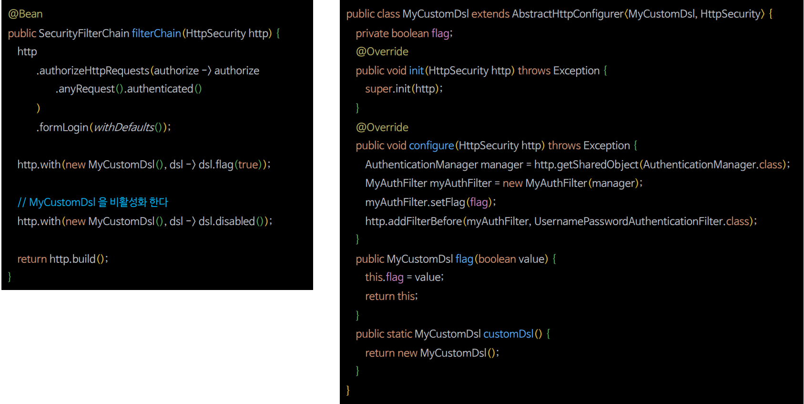

# Custom DSL

- 스프링 시큐리티는 사용자 정의 DSL을 구현할 수 있도록 지원한다.
- DSL을 구성하면 필터, 핸들러, 메서드, 속성 등을 한 곳에 정의하여 처리할 수 있는 편리함을 제공한다.

---

## AbstractHttpConfigurer<AbstractHttpConfigurer, HttpSecurityBuilder>

- 사용자 DSL을 구현하기 위해서 상속받는 추상 클래스로, 구현 클래스는 두 개의 메서드를 오버라이딩 한다.
  - `init(B builder)` : `HttpSecurity`의 구성요소를 설정 및 공유하는 작업 등
  - `confiture(B builder)` : 공통 클래스를 구성하거나 사용자 정의 필터를 생성하는 작업 등

### API

- **HttpSecurity.with(C Configure, Customizer<c> customizer)**
  - 과거에 `apply`가 deprecated 되었고 현재는 `with`를 사용하면 된다.
  - `Configure`
    - `AbstractHttpConfigurer`을 상속하고 DSL을 구현한 클래스가 들어간다.
  - `customizer`
    - DSL 구현 클래스에서 정의한 여러 API를 커스터 마이징 한다.
  - 동일한 클래스를 여러 번 설정하더라도 한 번만 적용된다.

---

## 예제 코드



---

```java
public class MyCustomDsl extends AbstractHttpConfigurer<MyCustomDsl, HttpSecurity> {

    private boolean flag;

    @Override
    public void init(HttpSecurity http) throws Exception {
        super.init(http);
    }

    @Override
    public void configure(HttpSecurity http) throws Exception {
        MyCustomFilter myCustomFilter = new MyCustomFilter();
        myCustomFilter.setFlag(flag);
        http.addFilterAfter(myCustomFilter, SecurityContextHolderAwareRequestFilter.class);
    }

    public static MyCustomDsl customDsl() {
        return new MyCustomDsl();
    }

    public void setFlag(boolean flag) {
        this.flag = flag;
    }
}
```
```java
@Slf4j
public class MyCustomFilter extends OncePerRequestFilter {

    private boolean flag;

    @Override
    protected void doFilterInternal(HttpServletRequest request, HttpServletResponse response, FilterChain filterChain) throws ServletException, IOException {
        if (flag) {
            try {
                String username = request.getParameter("username");
                String password = request.getParameter("password");
                request.login(username, password);
            }catch (Exception e){
                log.error(e.getMessage());
            }
        }
        filterChain.doFilter(request, response);
    }

    public void setFlag(boolean flag) {
        this.flag = flag;
    }
}
```
```java
@Configuration
@EnableWebSecurity
public class SecurityConfig {

    @Bean
    public SecurityFilterChain securityFilterChain(HttpSecurity http) throws Exception {

        http
                .authorizeHttpRequests(authorize -> authorize
                        .requestMatchers("/user").hasAuthority("ROLE_USER")
                        .requestMatchers("/db").hasAuthority("ROLE_DB")
                        .requestMatchers("/admin").hasAuthority("ROLE_ADMIN")
                        .anyRequest().authenticated())
                .formLogin(Customizer.withDefaults())
                .with(MyCustomDsl.customDsl(),dsl -> dsl.setFlag(true))
        ;

        return http.build();
    }


   @Bean
    public UserDetailsService userDetailsService() {
        UserDetails user = User.withUsername("user")
                .password("{noop}1111")
                .roles("USER")
                .build();

        UserDetails manager = User.withUsername("db")
                .password("{noop}1111")
                .roles("DB")
                .build();

       UserDetails admin = User.withUsername("admin")
               .password("{noop}1111")
               .roles("ADMIN", "SECURE")
               .build();

        return new InMemoryUserDetailsManager(user, manager, admin);
    }

}
```


- 스프링 시큐리티 초기화 시 생성되는 `Configurer`들 중에 직접 만든 `MyCustomDsl` 클래스도 추가되었다.

---

[이전 ↩️ - 다중 보안 설정](https://github.com/genesis12345678/TIL/blob/main/Spring/security/security/MultiSecurity/MultiSecurity.md)

[메인 ⏫](https://github.com/genesis12345678/TIL/blob/main/Spring/security/security/main.md)

[다음 ↪️ - `Redis`를 활용한 이중화 설정](https://github.com/genesis12345678/TIL/blob/main/Spring/security/security/MultiSecurity/Redis.md)