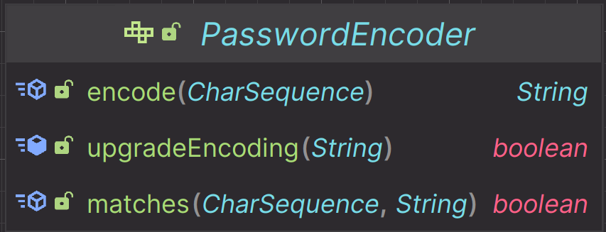
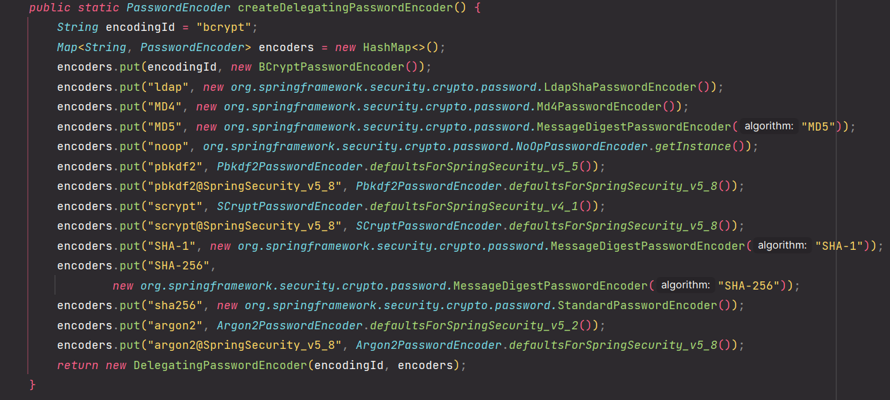
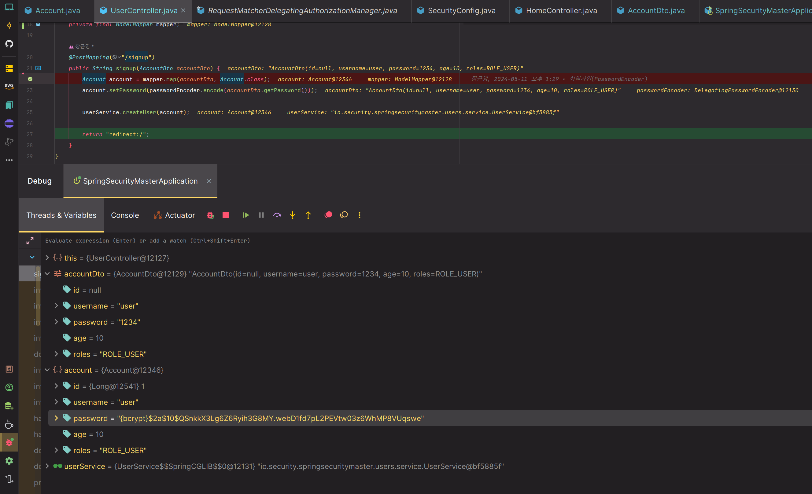

# 회원 인증 시스템 - 회원가입

---

## PasswordEncoder

- 스프링 시큐리티의 `PasswordEncoder` 인터페이스는 비밀번호를 안전하게 저장하기 위해 비밀번호의 **단방향 변환**을 수행하는 데 사용된다.
- 일반적으로 `PasswordEncoder`는 사용자의 비밀번호를 암호화하여 저장하거나 인증 시 검증을 위해 입력한 비밀번호와 암호화 되어 저장된 비밀번호를 서로 비교해야 할 때 사용된다.



> - `encode()` : 비밀번호를 지정된 암호화 방식으로 인코딩 한다.
> - `matches()` : 인코딩된 비밀번호와 제출된 원본 비밀번호를 인코딩한 후 일치하는지 검사한다.
> - `upgradeEncoding()` : 인코딩된 비밀번호가 보안상의 이유로 다시 인코딩되어야 할 경우 `true`, 그렇지 않을 경우 `false`를 반환한다.

---

## DelegatingPasswordEncoder

- `DelegatingPasswordEncoder`는 `{id}` 형식의 접두사를 사용하여 비밀번호가 어떤 방식으로 인코딩 되었는지 식별하는 클래스이다.
- 예를 들어 `{bcrypt}` 접두사는 비밀번호가 **BCrypt** 방식으로 인코딩 되었음을 나타낸다.


- `DelegatingPasswordEncoder`는 애플리케이션에서 사용하는 기본 인코딩 방식을 변경할 수 있도록 해 주며 새로운 인코딩 방식이 권장되거나 필요할 때 비밀번호 인코딩 전략을 유연하게 유지할 수 있다.

---

## DelegatingPasswordEncoder 빈 정의

### 기본 생성




> 스프링 시큐리티는 여러가지 암호화 알고리즘 유형을 지원하며, 기본적으로 `BCrypt`를 사용하는 것을 확인할 수 있다.

### 알고리즘 지정 생성


---

### build.gradle 추가

```text
implementation 'org.springframework.boot:spring-boot-starter-data-jpa'
implementation 'org.modelmapper:modelmapper:3.1.1'
``` 

### ModelMapper 빈 등록
```java
@SpringBootApplication
public class SpringSecurityMasterApplication {

    public static void main(String[] args) {
        SpringApplication.run(SpringSecurityMasterApplication.class, args);
    }

    @Bean
    public ModelMapper modelMapper() {
        ModelMapper mapper = new ModelMapper();
        mapper.getConfiguration()
                .setFieldAccessLevel(Configuration.AccessLevel.PRIVATE)
                .setFieldMatchingEnabled(true);
        return mapper;
    }

}
```
> `ModelMapper`의 기본 전략은 기본 생성자로 생성 후 `setter`로 값을 초기화하여 변환한다. `setter` 없이 변환 가능하도록 하기 위해 위와 같이 설정할 수 있다.
> 
> [참고 - `ModelMapper`보다는 `MapStruct`를 사용하자.](https://dev-splin.github.io/spring/Spring-ModelMapper,MapStruct/#%EC%9D%98%EC%A1%B4%EC%84%B1-%EC%84%A4%EC%A0%95)

### application.yml
```yaml
spring:
  datasource:
    url: jdbc:postgresql://localhost:5432/springboot
    username: postgres
    password: pass

  jpa:
    hibernate:
      ddl-auto: create
    properties:
      hibernate:
        format_sql: true
        jdbc:
          lob:
            non_contextual_creation: true
        show_sql: true
  thymeleaf:
    cache: false
```

> - 데이터베이스 : postgreSQL 사용
> - `spring.jpa.properties.hibernate.jdbc.lob.non_contextual_creation=true` : postgreSQL을 사용했을 때 발생하는 에러 로그 무시 설정([참고](https://medium.com/msolo021015/%EC%8A%A4%ED%94%84%EB%A7%81-%EB%B6%80%ED%8A%B8%EB%A1%9C-%EC%8B%9C%EC%9E%91%ED%95%98%EB%8A%94-%ED%85%8C%EC%8A%A4%ED%8A%B8-jpa-part-2-ef3c302cff52))
> - `spring.thymeleaf.cahce=false` : 타임리프를 수정하고 서버를 재시작할 필요 없이 새로 고침만으로 반영이 되도록 한다.

```java
@Controller
public class LoginController {

    @GetMapping("/login")
    public String login() {
        return "login/login";
    }

    @GetMapping("/signup")
    public String signup() {
        return "login/signup";
    }
}
```

- `login/signup.html`

```html
<!DOCTYPE html>
<html xmlns:th="http://www.thymeleaf.org">
<head>
...
</head>
<body>
<div th:replace="~{layout/header::header}"></div>
<div class="container-fluid">
    <div class="row">
        <div class="col-md-2 sidebar">
            <div th:replace="~{layout/sidebar::sidebar}"></div>
        </div>
        <div class="col-md-10 content">
            <div class="signup-form">
                <h2>Sign Up</h2>
                <form th:action="@{/signup}" method="post">
                    <div class="form-group">
                        <label for="username">Username</label>
                        <input type="text" class="form-control" id="username" name="username" required>
                    </div>
                    <div class="form-group">
                        <label for="password">Password</label>
                        <input type="password" class="form-control" id="password" name="password" required>
                    </div>
                    <div class="form-group">
                        <label for="age">Age</label>
                        <input type="number" class="form-control" id="age" name="age" required>
                    </div>
                    <div class="form-group">
                        <label for="roles">Authority</label>
                        <select class="form-control" id="roles" name="roles">
                            <option>ROLE_USER</option>
                            <option>ROLE_MANAGER</option>
                            <option>ROLE_ADMIN</option>
                        </select>
                    </div>
                    <button type="submit" class="btn btn-primary">Sign Up</button>
                </form>
            </div>
        </div>
    </div>
</div>
<div class="footer" th:replace="~{layout/footer::footer}"></div>
</body>
</html>
```

### AccountDto
```java
@Data
@Builder
public class AccountDto {

    private String id;
    private String username;
    private String password;
    private int age;
    private String roles;
}
```

### Account Entity

```java
@Entity
@Getter
public class Account {

    @Id
    @GeneratedValue
    private Long id;
    private String username;
    private String password;
    private int age;
    private String roles;

    public void setPassword(String password) {
        this.password = password;
    }
}
```

### PasswordEncoder 빈 등록
```java
@Configuration
@EnableWebSecurity
public class SecurityConfig {

    @Bean
    public SecurityFilterChain securityFilterChain(HttpSecurity http) throws Exception {
        http
                .authorizeHttpRequests(auth -> auth
                        .requestMatchers("/css/**", "/js/**", "/images/**", "/webjars/**", "/favicon.*", "/*/icon-*").permitAll() //정적 자원 관리
                        .requestMatchers("/", "/signup").permitAll()
                        .anyRequest().authenticated())
                .formLogin(form -> form.loginPage("/login").permitAll()); //커스텀 로그인 페이지

        return http.build();
    }

    @Bean
    public PasswordEncoder passwordEncoder() {
        return PasswordEncoderFactories.createDelegatingPasswordEncoder();
    }

    @Bean
    public UserDetailsService userDetailsService() {...}
}    
```

```java
@Controller
@RequiredArgsConstructor
public class UserController {

    private final PasswordEncoder passwordEncoder;
    private final UserService userService;
    private final ModelMapper mapper;

    @PostMapping("/signup")
    public String signup(AccountDto accountDto) {
        Account account = mapper.map(accountDto, Account.class);
        account.setPassword(passwordEncoder.encode(accountDto.getPassword()));

        userService.createUser(account);

        return "redirect:/";
    }
}
```
```java
@Service
@RequiredArgsConstructor
public class UserService {

    private final UserRepository userRepository;

    @Transactional
    public void createUser(Account account) {
        userRepository.save(account);
    }
}
```
```java
public interface UserRepository extends JpaRepository<Account, String> { }
```

- `http://localhost:8080/signup`




> **passwordEncoder**의 `encode()`를 통해 password가 암호화된 것을 확인할 수 있다.

---

[이전 ↩️ - 회원 인증 시스템 - 로그인 페이지 만들기](https://github.com/genesis12345678/TIL/blob/main/Spring/security/Projects/%ED%9A%8C%EC%9B%90_%EC%9D%B8%EC%A6%9D_%EC%8B%9C%EC%8A%A4%ED%85%9C/%EB%A1%9C%EA%B7%B8%EC%9D%B8%ED%8E%98%EC%9D%B4%EC%A7%80/Main.md)

[메인 ⏫](https://github.com/genesis12345678/TIL/blob/main/Spring/security/main.md)

[다음 ↪️ - 회원 인증 시스템 - 커스텀 `UserDetailsService` 구현](https://github.com/genesis12345678/TIL/blob/main/Spring/security/Projects/%ED%9A%8C%EC%9B%90_%EC%9D%B8%EC%A6%9D_%EC%8B%9C%EC%8A%A4%ED%85%9C/userDetailsService/UserDetailsService.md)