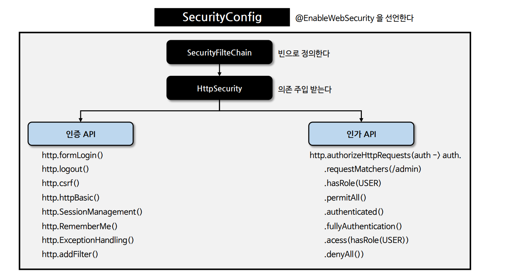

# 사용자 정의 보안 설정

- 한 개 이상의 **SecurityFilterChain** 타입의 빈을 정의한 후 인증 API 및 인가 API를 설정한다.



- `@EnableWebSecurity` 를 클래스에 정의한다.
- 모든 설정 코드는 람다 형식으로 작성해야 한다.(스프링 시큐리티 7 버전부터는 람다 형식만 지원 할 예정이다.)
- `SecurityFilterChain`을 빈으로 정의하면 자동 설정에 의한 `SecurityFilterChain` 빈은 생성되지 않는다.

---
- **사용자 추가 설정**

1. application.properties 나 application.yml 파일에 설정
```yml
spring:
  security:
    user:
      name: user
      password: 1111
      roles: USER 
```
2. 자바 설정 클래스에 직접 정의
```java
@Configuration
@EnableWebSecurity
public class SecurityConfig {
    
    @Bean
    public UserDetailsService userDetailsService() {
        UserDetails user = User.withUsername("user")
                .password("{noop}1111")
                .roles("USER")
                .build();

        return new InMemoryUserDetailsManager(user);
    }
}
```

- `new InMemoryUserDetailsManager()`는 `...` 문법으로 `UserDetails`를 받고 있다. 즉 한 번에 여러 개의 사용자를 추가할 수 있다.

---

[이전 ↩️ - DelegatingFilterProxy & FilterChainProxy](https://github.com/genesis12345678/TIL/blob/main/Spring/security/security/init/FilterChainProxy.md)

[메인 ⏫](https://github.com/genesis12345678/TIL/blob/main/Spring/security/security/main.md)