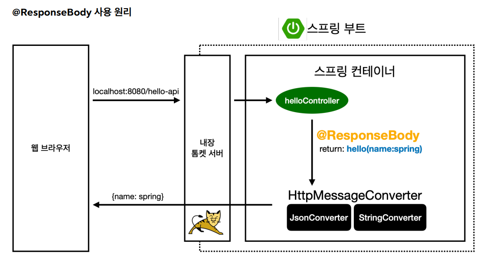
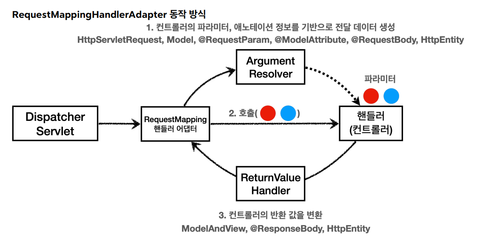
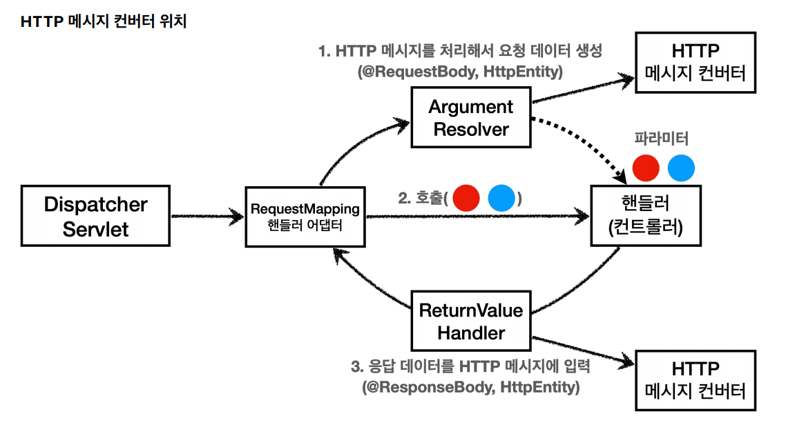

# 스프링 MVC - 기본 기능

## 요청 매핑

- 기본 매핑
```java
@RestController
@Slf4j
public class MappingController {
    /**
     * 기본 요청
     * HTTP 메서드 모두 허용 GET, HEAD, POST, PUT, PATCH, DELETE
     */
    @RequestMapping("/hello-basic")
    public String helloBasic() {
        log.info("helloBasic");
        return "ok";
    }
}
```
``@RestController``: ``@Controller``는 반환 값이 String 이면 뷰 이름으로 인식되고 뷰를 찾고 뷰를 렌더링한다. ``@RestController``는 뷰를 찾지 않고
HTTP 메시지 바디에 바로 입력한다.

- HTTP 메서드 매핑
```java
@RestController
@Slf4j
public class MappingController {
    /**
     * method 특정 HTTP 메서드 요청만 허용
     * GET, HEAD, POST, PUT, PATCH, DELETE
     */
    @RequestMapping(value = "/mapping-get-v1", method = RequestMethod.GET)
    public String mappingGetV1() {
        log.info("mappingGetV1");
        return "ok";
    }

    /**
     * 편리한 축약 애노테이션
     *
     * @GetMapping
     * @PostMapping
     * @PutMapping
     * @DeleteMapping
     * @PatchMapping
     */
    @GetMapping(value = "/mapping-get-v2")
    public String mappingGetV2() {
        log.info("mapping-get-v2");
        return "ok";
    }
}
```
지정한 HTTP 메서드와 다른 메서드로 요청이 오면 스프링 MVC는 405 상태코드(Method Not Allowed)를 반환한다.

- PathVariable(경로 변수) 사용
```java
@RestController
@Slf4j
public class MappingController {
    /**
     * PathVariable 사용
     */
    @GetMapping("/mapping/{userId}")
    public String mappingPath(@PathVariable("userId") String userId) {
        log.info("mappingPath userId = {}", userId);
        return "ok";
    }

    /**
     * PathVariable 사용 다중
     */
    @GetMapping("/mapping/users/{userId}/orders/{orderId}")
    public String mappingPath(@PathVariable("userId") String userId, @PathVariable("orderId") Long orderId) {
        log.info("mappingPath userId={}, orderId={}", userId, orderId);
        return "ok";
    }
}
```
최근 HTTP API는 리소스 경로에 식별자를 넣는 스타일을 선호한다.

- 특정 파라미터 조건 매핑
```java
@RestController
@Slf4j
public class MappingController {
    /**
     * 파라미터로 추가 매핑
     * params="mode",
     * params="!mode"
     * params="mode=debug"
     * params="mode!=debug"
     * params = {"mode=debug","data=good"}
     */
    @GetMapping(value = "/mapping-param", params = "mode=debug")
    public String mappingParam() {
        log.info("mappingParam");
        return "ok";
    }
}
```
특정 파라미터가 있거나 없는 조건을 추가할 수 있다.
- http://localhost:8080/mapping-param?mode=debug : ok
- http://localhost:8080/mapping-param : error

<br>

- 특정 헤더 조건 매핑
```java
@RestController
@Slf4j
public class MappingController {
    /**
     * 특정 헤더로 추가 매핑
     * headers="mode",
     * headers="!mode"
     * headers="mode=debug"
     * headers="mode!=debug"
     */
    @GetMapping(value = "/mapping-header", headers = "mode=debug")
    public String mappingHeader() {
        log.info("mappingHeader");
        return "ok";
    }
}
```
특정 파라미터 조건 매핑의 헤더 버전

- 미디어 타입 조건 매핑
```java
@RestController
@Slf4j
public class MappingController {
    /**
     * Content-Type 헤더 기반 추가 매핑 Media Type
     * consumes="application/json"
     * consumes="!application/json"
     * consumes="application/*"
     * consumes="*\/*"
     * MediaType.APPLICATION_JSON_VALUE
     */
    @PostMapping(value = "/mapping-consume", consumes =  MediaType.APPLICATION_JSON_VALUE)
    public String mappingConsumes() {
        log.info("mappingConsumes");
        return "ok";
    }

    /**
     * Accept 헤더 기반 Media Type
     * produces = "text/html"
     * produces = "!text/html"
     * produces = "text/*"
     * produces = "*\/*"
     */
    @PostMapping(value = "/mapping-produce", produces = MediaType.TEXT_HTML_VALUE)
    public String mappingProduces() {
        log.info("mappingProduces");
        return "ok";
    }
}
```
consumes : 들어오는 데이터 타입 정의(해당 URI를 호출하는 쪽에서는 Content-Type을 ``application/json``으로 명시 해줘야 한다.)

produces : 반환하는 데이터 타입 정의(해당 URI를 호출하는 쪽에서는 Accept를 ``Text/html``로 명시 해줘야 한다.)

<br>

## 요청 매핑 - API
- 회원 목록 조회: ``GET`` /users
- 회원 등록: ``POST`` /users
- 회원 조회: ``GET`` /users/{userId}
- 회원 수정: ``PATCH`` /users/{userId}
- 회원 삭제: ``DELETE`` /users/{userId}

<br>

- 컨트롤러
```java
@RestController
@RequestMapping("/mapping/users")
public class MappingClassController {
    /**
     * GET /mapping/users
     */
    @GetMapping
    public String users() {
        return "get users";
    }

    /**
     * POST /mapping/users
     */
    @PostMapping
    public String addUser() {
        return "post user";
    }

    /**
     * GET /mapping/users/{userId}
     */
    @GetMapping("/{userId}")
    public String findUser(@PathVariable("userId") String userId) {
        return "get userId=" + userId;
    }

    /**
     * PATCH /mapping/users/{userId}
     */
    @PatchMapping("/{userId}")
    public String updateUser(@PathVariable("userId") String userId) {
        return "update userId=" + userId;
    }

    /**
     * DELETE /mapping/users/{userId}
     */
    @DeleteMapping("/{userId}")
    public String deleteUser(@PathVariable("userId") String userId) {
        return "delete userId=" + userId;
    }
}
```

<br>

## HTTP 요청 - 헤더 조회

- 컨트롤러
```java
@Slf4j
@RestController
public class RequestHeaderController {

    @RequestMapping("/headers")
    public String headers(HttpServletRequest request,
                          HttpServletResponse response,
                          HttpMethod httpMethod,
                          Locale locale,
                          @RequestHeader MultiValueMap<String, String> headerMap,
                          @RequestHeader("Host") String host,
                          @CookieValue(value = "myCookie", required = false) String cookie) {

        log.info("request={}", request);
        log.info("response={}", response);
        log.info("httpMethod={}", httpMethod);
        log.info("locale={}", locale);
        log.info("headerMap={}", headerMap);
        log.info("header host={}", host);
        log.info("myCookie={}", cookie);

        return "OK";
    }
}
```
- ``HttpMethod`` : HTTP 메서드 조회
- ``Locale`` : Locale 정보 조회(언어)
- ``@RequestHeader MultiValueMap<String, String>`` : 모든 HTTP 헤더 조회
- ``@RequestHeader("Host")`` : 특정 HTTP 헤더 조회
- ``@CookieValue(value = "myCookie", required = false)`` : 특정 쿠키 조회
- ``MultiValueMap`` : 하나의 키에 여러 값을 받을 수 있다.

[``@Controller``의 사용 가능한 파라미터 목록](https://docs.spring.io/spring-framework/reference/web/webmvc/mvc-controller/ann-methods/arguments.html)
[``@Controller``의 사용 가능한 응답 값 목록](https://docs.spring.io/spring-framework/reference/web/webmvc/mvc-controller/ann-methods/return-types.html)

<br>

## HTTP 요청 - 쿼리 파라미터, HTML Form
> ``GET`` 쿼리 파라미터와 ``POST`` HTML Form은 둘 다 쿼리 파라미터로 보내기 때문에 같은 방식으로 조회할 수 있다.

```java
@Slf4j
@Controller
public class RequestParamController {

    @RequestMapping("/request-param-v1")
    public void requestParamV1(HttpServletRequest request, HttpServletResponse response) throws IOException {
        String username = request.getParameter("username");
        int age = Integer.parseInt(request.getParameter("age"));
        log.info("username = {}, age = {}", username, age);

        response.getWriter().write("OK");
    }

    /*
     * @RequestParam 사용
     * - 파라미터 이름으로 바인딩
     * @ResponseBody 추가
     * - View 조회를 무시하고, HTTP message body에 직접 해당 내용 입력
     */
    @ResponseBody
    @RequestMapping("/request-param-v2")
    public String requestParamV2(@RequestParam("username") String memberName, @RequestParam("age") int memberAge) {
        log.info("username={}, age={}", memberName, memberAge);
        return "ok";
    }
    
    /**
     * @RequestParam 사용
     * String, int 등의 단순 타입이면 @RequestParam 도 생략 가능
     */
    @ResponseBody
    @RequestMapping("/request-param-v4")
    public String requestParamV4(String username, int age) {
        log.info("username={}, age={}", username, age);
        return "ok";
    }

    /**
     * @RequestParam.required
     * /request-param-required -> username이 없으므로 예외
     *
     * 주의!
     * /request-param-required?username= -> 빈문자로 통과
     *
     * 주의!
     * /request-param-required
     * int age -> null을 int에 입력하는 것은 불가능, 따라서 Integer 변경해야 함(또는 다음에 나오는 defaultValue 사용)
     */
    @ResponseBody
    @RequestMapping("/request-param-required")
    public String requestParamRequired(@RequestParam(required = true) String username,
                                       @RequestParam(required = false) Integer age) {
        log.info("username={}, age={}", username, age);
        return "ok";
    }

    /**
     * @RequestParam
     * - defaultValue 사용
     * 참고: defaultValue는 빈 문자의 경우에도 적용
     * /request-param-default?username=
     */
    @ResponseBody
    @RequestMapping("/request-param-default")
    public String requestParamDefault(
            @RequestParam(required = true, defaultValue = "guest") String username,
            @RequestParam(required = false, defaultValue = "-1") int age) {
        log.info("username={}, age={}", username, age);
        return "ok";
    }

    /**
     * @RequestParam Map, MultiValueMap
     * Map(key=value)
     * MultiValueMap(key=[value1, value2, ...]) ex) (key=userIds, value=[id1, id2])
     */
    @ResponseBody
    @RequestMapping("/request-param-map")
    public String requestParamMap(@RequestParam Map<String, Object> paramMap) {
        log.info("username={}, age={}", paramMap.get("username"), paramMap.get("age"));
        return "ok";
    }
}
```

<br>

## HTTP 요청 파라미터 - @ModelAttribute
> 스프링은 요청 파라미터를 받아서 객체로 만들고 그 객체에 값을 자동으로 넣어줄 수 있다.

- 파라미터를 바인딩 할 객체
```java
@RestController
@RequestMapping("/mapping/users")
public class MappingClassController {
    /**
     * @ModelAttribute 사용
     * 참고: model.addAttribute(helloData) 코드도 함께 자동 적용됨
     */
    @ResponseBody
    @RequestMapping("/model-attribute-v1")
    public String modelAttributeV1(@ModelAttribute HelloData helloData) {
        log.info("username={}, age={}", helloData.getUsername(), helloData.getAge());
        log.info("HelloData = {}", helloData);
        return "ok";
    }

    /**
     * @ModelAttribute 생략 가능
     * String, int 같은 단순 타입 = @RequestParam
     * argument resolver 로 지정해둔 타입 외 = @ModelAttribute
     */
    @ResponseBody
    @RequestMapping("/model-attribute-v2")
    public String modelAttributeV2(HelloData helloData) {
        log.info("username={}, age={}", helloData.getUsername(), helloData.getAge());
        return "ok";
    }
}
```
스프링 MVC는 ``@ModelAttribute`` 있으면 다음을 실행한다.
- 객체를 생성한다.
- 요청 파라미터의 이름으로 객체의 프로퍼티를 찾는다. 그리고 해당 프로퍼티의 ``setter``를 호출해서 파라미터의 입력 값을 바인딩 한다.

``@ModelAttribute``와 ``@RequestParam``둘 다 생략이 가능해서 혼란이 올 수 있다.  

<br>

## HTTP 요청 - 단순 텍스트
> HTTP message body에 데이터를 직접 담아서 요청하면 ``@ModelAttribute``와 ``@RequestParam``을 사용할 수 없다.

- 컨트롤러
```java
@Slf4j
@Controller
public class RequestBodyStringController {

    @PostMapping("/request-body-string-v1")
    public void requestBodyString(HttpServletRequest request, HttpServletResponse response) throws IOException {
        ServletInputStream inputStream = request.getInputStream();
        String messageBody = StreamUtils.copyToString(inputStream, StandardCharsets.UTF_8);
        log.info("messageBody = {}", messageBody);
        response.getWriter().write("ok");
    }

    /**
     * InputStream(Reader): HTTP 요청 메시지 바디의 내용을 직접 조회
     * OutputStream(Writer): HTTP 응답 메시지의 바디에 직접 결과 출력
     */
    @PostMapping("/request-body-string-v2")
    public void requestBodyStringV2(InputStream inputStream, Writer responseWriter) throws IOException {
        String messageBody = StreamUtils.copyToString(inputStream, StandardCharsets.UTF_8);
        log.info("messageBody={}", messageBody);
        responseWriter.write("ok");
    }

    /**
     * HttpEntity: HTTP header, body 정보를 편리하게 조회
     * - 메시지 바디 정보를 직접 조회(@RequestParam X, @ModelAttribute X)
     * - HttpMessageConverter 사용 -> StringHttpMessageConverter 적용
     *
     * 응답에서도 HttpEntity 사용 가능
     * - 메시지 바디 정보 직접 반환(view 조회X)
     * - HttpMessageConverter 사용 -> StringHttpMessageConverter 적용
     */
    @PostMapping("/request-body-string-v3")
    public HttpEntity<String> requestBodyStringV3(HttpEntity<String> httpEntity) {
        String messageBody = httpEntity.getBody();
        log.info("messageBody={}", messageBody);
        return new HttpEntity<>("ok");
    }

    /**
     * @RequestBody
     * - 메시지 바디 정보를 직접 조회(@RequestParam X, @ModelAttribute X)
     * - HttpMessageConverter 사용 -> StringHttpMessageConverter 적용
     *
     * @ResponseBody
     * - 메시지 바디 정보 직접 반환(view 조회X)
     * - HttpMessageConverter 사용 -> StringHttpMessageConverter 적용
     **/
    @ResponseBody
    @PostMapping("/request-body-string-v4")
    public String requestBodyStringV4(@RequestBody String messageBody) {
        log.info("messageBody={}", messageBody);
        return "ok";
    }
}
```

<br>

## HTTP 요청 - JSON

- 컨트롤러
```java
/**
 * {"username":"hello", "age":20}
 * content-type: application/json
 */
@Slf4j
@Controller
public class RequestBodyJsonController {

    private final ObjectMapper objectMapper = new ObjectMapper();

    @PostMapping("/request-body-json-v1")
    public void requestBodyJsonV1(HttpServletRequest request, HttpServletResponse response) throws IOException {
        ServletInputStream inputStream = request.getInputStream();
        String messageBody = StreamUtils.copyToString(inputStream, StandardCharsets.UTF_8);

        log.info("messageBody={}", messageBody);

        HelloData data = objectMapper.readValue(messageBody, HelloData.class);
        log.info("username={}, age={}", data.getUsername(), data.getAge());

        response.getWriter().write("ok");
    }

    @ResponseBody
    @PostMapping("/request-body-json-v2")
    public String requestBodyJsonV2(@RequestBody String messageBody) throws IOException {

        log.info("messageBody={}", messageBody);

        HelloData data = objectMapper.readValue(messageBody, HelloData.class);
        log.info("username={}, age={}", data.getUsername(), data.getAge());

        return "ok";
    }

    @ResponseBody
    @PostMapping("/request-body-json-v3")
    public String requestBodyJsonV3(@RequestBody HelloData helloData) {
        log.info("username={}, age={}", helloData.getUsername(), helloData.getAge());
        return "ok";
    }

    @ResponseBody
    @PostMapping("/request-body-json-v4")
    public String requestBodyJsonV4(HttpEntity<HelloData> httpEntity) {
        HelloData data = httpEntity.getBody();
        log.info("username={}, age={}", data.getUsername(), data.getAge());
        return "ok";
    }

    /**
     * @RequestBody 생략 불가능(@ModelAttribute 가 적용되어 버림)
     * HttpMessageConverter 사용 -> MappingJackson2HttpMessageConverter (content-type:application/json)
     *
     * @ResponseBody 적용
     * - 메시지 바디 정보 직접 반환(view 조회X)
     * - HttpMessageConverter 사용 -> MappingJackson2HttpMessageConverter 적용(Accept:application/json)
     */
    @ResponseBody
    @PostMapping("/request-body-json-v5")
    public HelloData requestBodyJsonV5(@RequestBody HelloData data) {
        log.info("username={}, age={}", data.getUsername(), data.getAge());
        return data;
    }
}
```

<br>

## HTTP 응답 - 정적 리소스, 뷰 템플릿
- 스프링 서버에서 응답 데이터를 만드는 방법
  - 정적 리소스
    - ``/static``,``/public``,``resources``,``META-INF/resources`` 디렉토리에 있는 정적 리소스를 제공한다.
    - 해당 파일을 변경 없이 그대로 응답한다.
  - 뷰 템플릿
    - 뷰 템플릿을 거쳐서 HTML이 동적으로 생성되고 뷰가 응답을 만들어서 전달한다.
    - ``src/main/resources/templates``
  - HTTP 메시지

<br>

- 뷰 템플릿 생성
```html
<!DOCTYPE html>
<html xmlns:th="http://www.thymeleaf.org">
<head>
    <meta charset="UTF-8">
    <title>Title</title>
</head>
<body>
<p th:text="${data}">empty</p>
</body>
</html>
```

- 뷰 템플릿을 호출하는 컨트롤러
```java
@Controller
public class ResponseViewController {

    @RequestMapping("/response-view-v1")
    public ModelAndView responseView1() {
        ModelAndView mav = new ModelAndView("response/hello")
                .addObject("data", "hello!");
        return mav;
    }

    @RequestMapping("/response-view-v2")
    public String responseView2(Model model) {
        model.addAttribute("data", "hello");

        return "response/hello";
    }

    @RequestMapping("/response/hello")
    public void responseViewV3(Model model) {
        model.addAttribute("data", "hello!!");
    }
}
```

<br>

## HTTP 응답 - HTTP API, 메시지 바디 직접 입력

- 컨트롤러
```java
@Controller
public class ResponseBodyController {

    @GetMapping("/response-body-string-v1")
    public void responseBodyV1(HttpServletResponse response) throws IOException {
        response.getWriter().write("ok");
    }

    /**
     * HttpEntity, ResponseEntity(Http Status 추가)
     * @return
     */
    @GetMapping("/response-body-string-v2")
    public ResponseEntity<String> responseBodyV2() {
        return new ResponseEntity<>("ok", HttpStatus.OK);
    }

    @ResponseBody
    @GetMapping("/response-body-string-v3")
    public String responseBodyV3() {
        return "ok";
    }

    @GetMapping("/response-body-json-v1")
    public ResponseEntity<HelloData> responseBodyJsonV1() {
        HelloData helloData = new HelloData();
        helloData.setUsername("userA");
        helloData.setAge(20);
        return new ResponseEntity<>(helloData, HttpStatus.OK);
    }

    @ResponseStatus(HttpStatus.OK)
    @ResponseBody
    @GetMapping("/response-body-json-v2")
    public HelloData responseBodyJsonV2() {
        HelloData helloData = new HelloData();
        helloData.setUsername("userA");
        helloData.setAge(20);
        return helloData;
    }
}
```

<br>

## HTTP 메시지 컨버터

- @ResponseBody 사용 원리



- HTTP body에 문자 내용을 직접 반환한다.
- ``viewResolver`` 대신에 ``HttpMessageConverter``가 동작한다.
- 기본 문자처리는 ``StringHttpMessageConverter``
- 기본 객체처리는 ``MappingJackson2HttpMessageConverter``

다음 경우 HTTP 메시지 컨버터 적용
- HTTP 요청 : ``@RequestBody``, ``HttpEntity(RequestEntity)``
- HTTP 응답 : ``@ResponseBody``, ``HttpEntity(ResponseEntity)``

``HttpMessageConverter`` 인터페이스는 HTTP 요청, 응답 둘 다 사용된다.
- ``canRead()``,``canWrite()``: 해당 클래스, 미디어타입을 지원하는지 확인
- ``read()``, ``write()``: 메시지 컨버터를 통해서 메시지를 읽고 쓰는 기능


스프링 부트 주요 메시지 컨버터
- 0 = ``ByteArrayHttpMessageConverter`` - byte[] 데이터 처리
  - 클래스 타입:``byte[]``, 미디어타입:``*/*``
  - 응답 미디어타입: ``application/octet-stream``
- 1 = ``StringHttpMessageConverter`` - String 데이터 처리
  - 클래스 타입:``String``, 미디어타입:``*/*``
  - 응답 미디어타입: ``text/plain``
- 2 = ``MappingJackson2HttpMessageConverter``
  - 클래스 타입: 객체 또는 HashMap, 미디어타입: ``application/json`` 관련
  - 응답 미디어타입: ``application/json`` 관련

<br>

## 요청 매핑 핸들러 어댑터 구조



어노테이션 기반 컨트롤러를 처리하는 ``RequestMappingHandlerAdaptor``는 ``ArgumentResolver``를 호출해서 컨트롤러(핸들러)가 필요로 하는
파라미터를 생성해서 넘겨준다.

```java
public interface HandlerMethodArgumentResolver {

	boolean supportsParameter(MethodParameter parameter);

	@Nullable
	Object resolveArgument(MethodParameter parameter, @Nullable ModelAndViewContainer mavContainer,
			NativeWebRequest webRequest, @Nullable WebDataBinderFactory binderFactory) throws Exception;

}
```
``supportsParameter()``에서 해당 파라미터를 지원하는지 체크하고 지원하면 ``resolveArgument()``를 호출해서 실제 객체를 생성하고 컨트롤러 호출시 넘어간다.

직접 이 인터페이스를 구현해서 원하는 ``ArgumentResolver``를 만들 수도 있다.

<br>

### HTTP 메시지 컨버터

