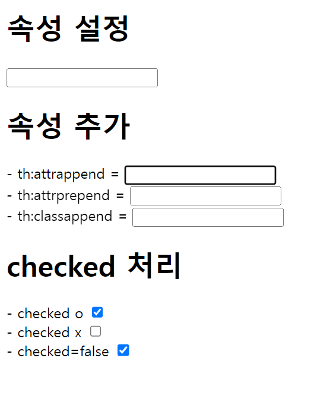

# 속성 값 설정
> 타임리프는 주로 HTML 태그에 ``th:*`` 속성을 지정하는 방식으로 동작하는데 기존 속성을 대체하고 없으면 새로 만든다. 

- 컨트롤러
```java
@GetMapping("/attribute")
    public String attribute() {
        return "basic/attribute";
    }
```

- HTML
```html
<!DOCTYPE html>
<html xmlns:th="http://www.thymeleaf.org">
<head>
    <meta charset="UTF-8">
    <title>Title</title>
</head>
<body>
<h1>속성 설정</h1>
<input type="text" name="mock" th:name="userA" />
<h1>속성 추가</h1>
- th:attrappend = <input type="text" class="text" th:attrappend="class=' large'" /><br/>
- th:attrprepend = <input type="text" class="text" th:attrprepend="class='large '" /><br/>
- th:classappend = <input type="text" class="text" th:classappend="large" /><br/>
<h1>checked 처리</h1>
- checked o <input type="checkbox" name="active" th:checked="true" /><br/>
- checked x <input type="checkbox" name="active" th:checked="false" /><br/>
- checked=false <input type="checkbox" name="active" checked="false" /><br/>
</body>
</html>
```



- 렌더링 된 HTML
```html
<!DOCTYPE html>
<html>
<head>
    <meta charset="UTF-8">
    <title>Title</title>
</head>
<body>
<h1>속성 설정</h1>
<input type="text" name="userA" />
<h1>속성 추가</h1>
- th:attrappend = <input type="text" class="text large" /><br/>
- th:attrprepend = <input type="text" class="large text" /><br/>
- th:classappend = <input type="text" class="text large" /><br/>
<h1>checked 처리</h1>
- checked o <input type="checkbox" name="active" checked="checked" /><br/>
- checked x <input type="checkbox" name="active" /><br/>
- checked=false <input type="checkbox" name="active" checked="false" /><br/>
</body>
</html>
```

- 속성 추가
  - ``th:attrapend`` : 속성 값의 뒤에 값을 추가한다.
  - ``th:attrprepend``: 속성 값의 앞에 값을 추가한다.
  - ``th:classapend``: class 속성에 자연스럽게 추가한다.

- checked 처리
  - HTML에서 ``checked`` 속성은 ``checked``라는 속성만 있어도 체크가 되는데 ``th:checked``는 값이 false인 경우 ``checked`` 속성 자체를 제거한다.