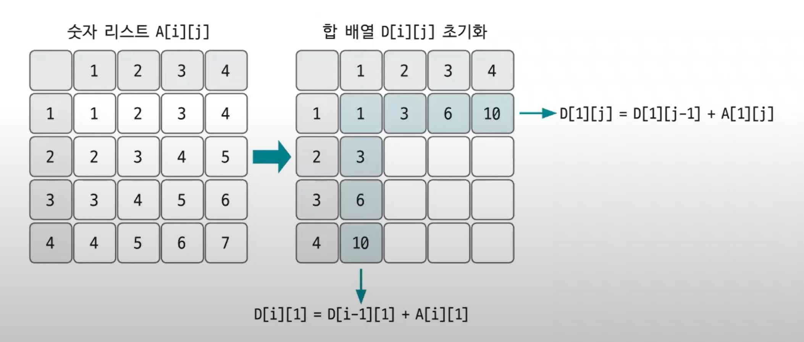
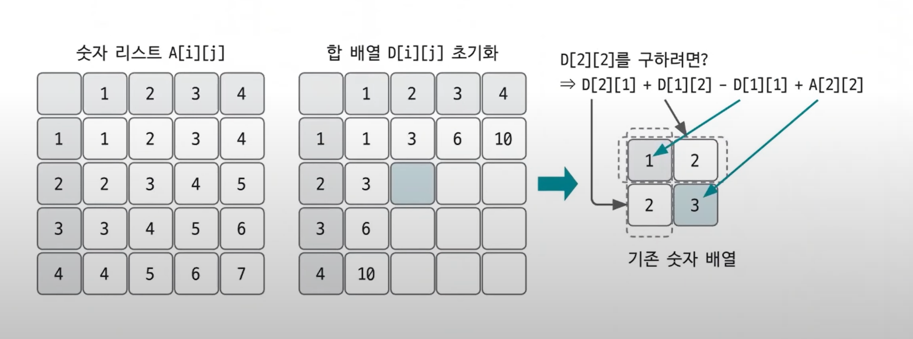
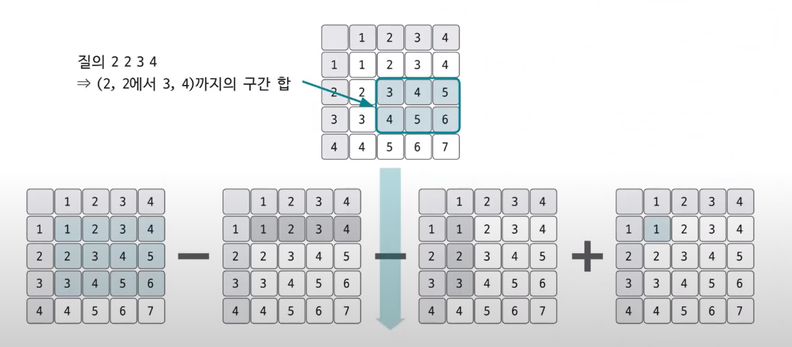

# 구간 합 예제 - 2

### [문제(백준(11659번 - 구간 합 구하기 5))](https://www.acmicpc.net/problem/11660)

### 문제 분석
- 질의 개수가 최대 100,000이므로 질의마다 합을 구하면 안되고, 구간 합 배열을 이용해야 한다.
- 처음에 먼저 정답 판을 만들어 놓고 질의가 오면 바로 답을 출력하는 형태로 풀어가면 된다.

### 손으로 풀어보기
1. 2차원 구간 합 배열의 `1행,1열`부터 구한다.



2. 이를 통해 2차원 구간 합 배열을 채운다.



**`D[i][j]`의 값을 채우는 구간 합 공식**
- `D[i][j]` = `D[i][j-1]` + `D[i-1][j]` - `D[i-1][j-1]` + `A[i][j]` 



- 원본 리스트로 질의에 대한 도출하기 위한 과정은 이렇다.
- 질의가 `2 2 3 4`라면 `(3,4)`구간 합에서 `(1,4)`구간 합, `(3,1)`구간 합을 뺀 다음 중복하여 뺀 `(1,1)` 구간합을 더하면 된다.
- 이것을 다시 구간 합 배열로 표현하면 다음과 같다.


**질의 `X1`, `Y1`, `X2`, `Y2`에 대한 답을 구간 합으로 구하는 방법**
- `D[X2][Y2]` - `D[X1-1][Y2]` - `D[X2][Y1-1]` + `D[X1-1][Y1-1]`

### 슈도코드
```text
n(리스트 크기), m(질의 수)
A(원본 리스트), D(합 배열)

for n만큼 반복:
    원본 리스트 데이터 저장
    
for i를 1~n 반복:
    for j를 1~n 반복:
        합 배열 저장
        D[i][j] = D[i][j-1] + D[i-1][j] - D[i-1][j-1] + A[i][j]
        
for m만큼 반복:
    질의에 대한 결과 계산 및 출력
    결과 = D[x2][y2] - D[x1-1][y2] - D[x2][y1-1] + D[x1-1][y1-1]
```

### 코드 구현
```python
import sys

input = sys.stdin.readline

n, m = map(int, input().split())
A = [[0] * (n + 1) for _ in range(n + 1)]
D = [[0] * (n + 1) for _ in range(n + 1)]

for i in range(1, n+1):
    A[i][1:] = map(int, input().split())

for i in range(1, n+1):
    for j in range(1, n+1):
        D[i][j] = D[i][j-1] + D[i-1][j] - D[i-1][j-1] + A[i][j]

str_list = []

for _ in range(m):
    x1, y1, x2, y2 = map(int, input().split())
    str_list.append(str(D[x2][y2] - D[x1-1][y2] - D[x2][y1-1] + D[x1-1][y1-1]))

result = "\n".join(str_list)
print(result)
```
- `A`랑 `D` 배열을 2차원 배열로 선언한다.
- 슬라이싱(`1:`)문법으로 1열부터 끝열까지 값을 채워넣는다.(0행 0열 라인은 값을 넣지 않으니 `0`으로 남아 있는다.)
- 공식을 사용해서 값을 구한 뒤 정답을 출력한다.