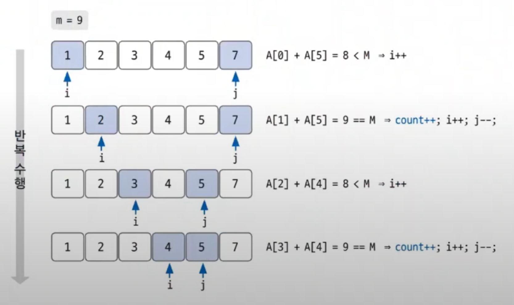

# 투 포인터 예제 - 2

### [문제(백준(1940번 - 주몽))](https://www.acmicpc.net/problem/1940)

### 문제 분석
- 번호의 합, 즉 크기를 비교하므로 값을 정렬하면 문제를 좀 더 쉽게 해결할 수 있다.
- `N`의 최대 범위가 15,000이므로 `O(nlogn)` 시간 복잡도를 갖는 정렬 알고리즘을 사용해도 문제가 없다.
- 입력한 `N`개의 재룟값을 정렬한 다음, 양쪽 끝의 위치를 투 포인터로 지정해 문제를 해결할 수 있다.

### 손으로 풀어보기
1. **재료 데이터를 배열 `A`에 저장한 후 오름차순 정렬한다.**
2. **투 포인터 `i`, `j`를 양쪽 끝에 위치시킨 후 문제의 조건에 적합한 투 포인터 이동 원칙을 활용하여 탐색을 수행한다.**
   - `A[i] + A[j] > M; j--;` : 번호의 합이 `M`보다 크면 큰 번호 `index`를 내린다.
   - `A[i] + A[j] < M; i++;` : 번호의 합이 `M`보다 작으면 작은 번호 `index`를 올린다.
   - `A[i] + A[j] == M; i++; j--;` : 양쪽 포인터를 모두 이동시키고 count를 증가시킨다.
   - 정렬을 했기 때문에 이 조건대로 움직일 수 있다.
3. **2단계를 `i`와 `j`가 만날 때까지 반복한다.**



### 슈도코드
```text
n(재료 개수), m(갑옷이 되는 번호)
A(재료 데이터 저장 리스트)
A 정렬
i(시작 인덱스 = 0)
j(종료 인덱스 = n - 1)
count(정답값 = 0)

while i < j:
    if 재료 합 < m: 작은 번호 재료를 한 칸 위로 변경
    elif 재료 합 > m: 큰 번호 재료를 한 칸 아래로 변경
    else: 경우의 수 증가, 양쪽 index 변경
   
count 출력
```

### 코드 구현 - 파이썬
```python
import sys
input = sys.stdin.readline

n = int(input())
m = int(input())
A = list(map(int, input().split()))
A.sort()

i = 0
j = n - 1
count = 0

while i < j:
    if A[i] + A[j] < m:
        i += 1
    elif A[i] + A[j] > m:
        j -= 1
    else:
        count += 1
        i += 1
        j -= 1

print(count)
```

### 코드 구현 - 자바
```java
import java.io.BufferedReader;
import java.io.IOException;
import java.io.InputStreamReader;
import java.util.Arrays;
import java.util.StringTokenizer;

public class Main {
    public static void main(String[] args) throws IOException {
        BufferedReader br = new BufferedReader(new InputStreamReader(System.in));
        int n = Integer.parseInt(br.readLine());
        int m = Integer.parseInt(br.readLine());
        int[] a = new int[n];
        StringTokenizer st = new StringTokenizer(br.readLine());
        
        for (int i = 0; i < n; i++) {
            a[i] = Integer.parseInt(st.nextToken());
        }
        
        Arrays.sort(a);

        int i = 0;
        int j = n - 1;
        int count = 0;

        while (i < j) {
            if (a[i] + a[j] < m) {
                i++;
            } else if (a[i] + a[j] > m) {
                j--;
            } else {
                count++;
                i++;
                j--;
            }
        }
        
        System.out.println(count);
    }
}
```