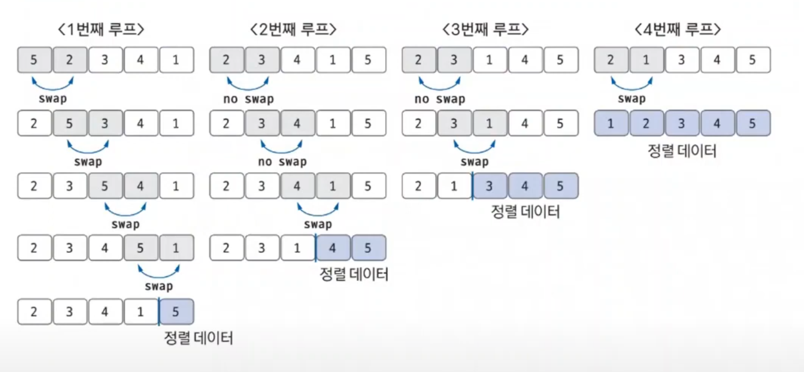

# 버블 정렬 예제 - 1

### [문제(백준(2750번 - 수 정렬하기))](https://www.acmicpc.net/problem/2750)

### 문제 분석
- 프로그래밍 언어에서 `sort()`함수를 제공하지만, 버블 정렬을 직접 구현해 본다.
- `N`의 최대 범위가 1,000으로 매우 작기 때문에 `O(n^2)` 시간 복잡도 알고리즘으로 풀 수 있다.

### 손으로 풀어보기



### 슈도코드
```text
n(수의 개수)
a(수 저장 리스트 선언 및 입력 데이터 저장)

for i 0 ~ n-1 반복:
    for j n-1-i 반복:
        현재 a 리스트의 값보다 1칸 오른쪽 리스트의 값이 더 작으면 두 수 바꾸기
        
a 리스트 출력  
```

### 코드 구현 - 파이썬
```python
n = int(input())
a = []

for i in range(n):
    a.append(int(input()))

for i in range(n - 1):  # 0 ~ n-1 : 0, 1, 2, 3
    for j in range(n - 1 - i):  # 반복이 진행 될수록 마지막 데이터는 정렬 되기 때문에 마지막에 i만큼 빼준다.
        if a[j] > a[j+1]:
            temp = a[j]
            a[j] = a[j+1]
            a[j+1] = temp

for i in range(n):
    print(a[i])


```

### 코드 구현 - 자바
```java
import java.io.BufferedReader;
import java.io.IOException;
import java.io.InputStreamReader;

public class Main {
    public static void main(String[] args) throws IOException {
        BufferedReader br = new BufferedReader(new InputStreamReader(System.in));

        int n = Integer.parseInt(br.readLine());

        int[] arr = new int[n];

        for (int i = 0; i < n; i++) {
            arr[i] = Integer.parseInt(br.readLine());
        }

        for (int i = 0; i < n - 1; i++) {
            for (int j = 0; j < n - 1 - i; j++) {
                if (arr[j] > arr[j + 1]) {
                    int temp = arr[j];
                    arr[j] = arr[j + 1];
                    arr[j + 1] = temp;
                }
            }
        }

        for (int num : arr) {
            System.out.println(num);
        }
    }
}

```