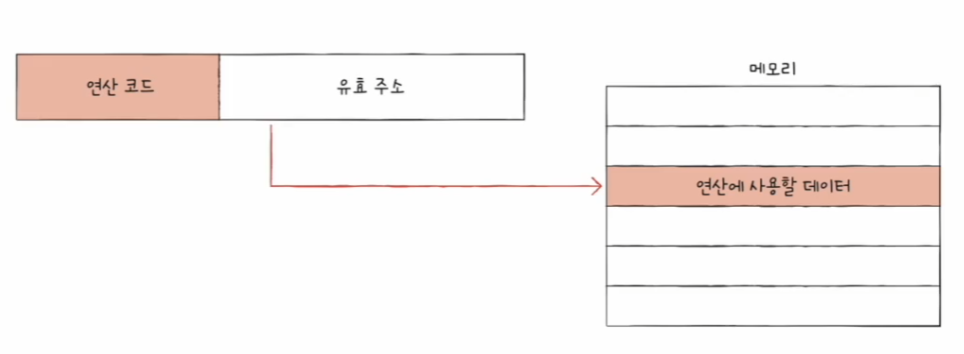
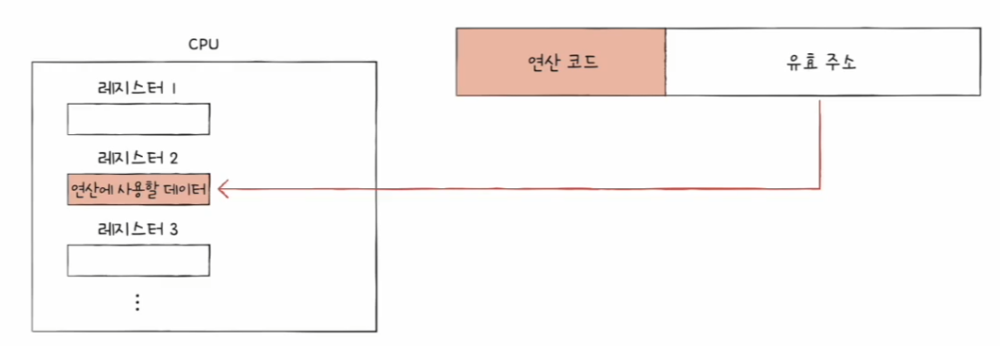
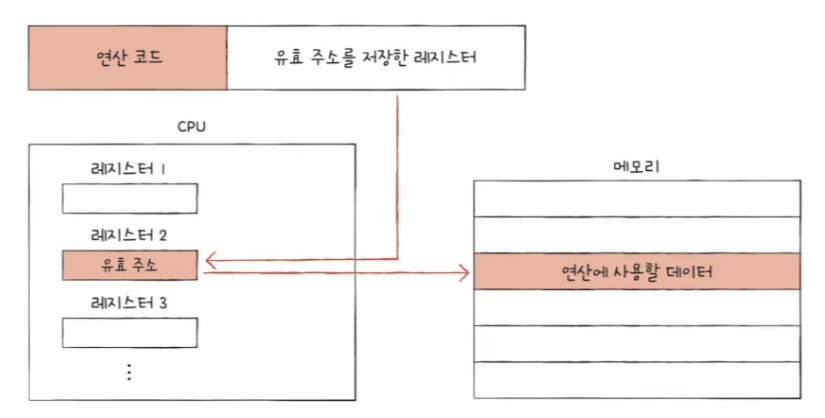

# 컴퓨터 구조와 운영체제

# 명령어 - 명령어의 구조

## 연산 코드와 오퍼랜드

- 컴퓨터 속 명령어는 무엇을 대상으로, 어떤 작동을 수행하라는 구조로 되어 있다.
- 아래 그림에서 색이 있는 필드는 명령의 작동, 즉 연산을 담고 있고, 나머지 필드는 연산에 사용할 데이터 또는 연산에 사용할 데이터가 저장된 위치를 담고 있다.

- **명령어**는 연산 코드와 오퍼랜드로 구성되어 있다.
- 명령어가 수행할 연산을 **연산 코드(또는 연산자)** 라 하고, 연산에 사용할 데이터 또는 연산에 사용할 데이터가 저장된 위치를 **오퍼랜드(또는 피연산자)** 라고 한다.
- 연산 코드가 담기는 영역을 **연산 코드 필드**라고 부르고, 오퍼랜드가 담기는 영역을 **오퍼랜드 필드**라고 한다.
- 참고로 기계어와 어셈블리어도 명령어이기 때문에 연산 코드와 오퍼랜드로 구성되어 있다.

### 오퍼랜드

- **오퍼랜드**는 연산에 사용할 데이터 또는 연산에 사용할 데이터가 저장된 위치를 의미한다.
- 하지만 실질적으로 연산에 사용할 데이터를 직접 명시하기보다는, 연산에 사용할 데이터가 저장된 위치, 즉 메모리 주소나 레지스터 이름이 담긴다. 그래서 오퍼랜드 필드를
    **주소 필드**라고 부르기도 한다.
- 오퍼랜드는 명령어 안에 0개 이상 있을 수 있으며 아래 그림과 같이 개수에 따라 명령어 이름을 다르게 부르기도 한다.

### 연산 코드

- 연산 코드는 명령어가 수행할 연산을 의미한다.
- 연산 코드 유형은 매우 많으며, CPU 마다 연산 코드의 종류와 생김새가 모두 다르다. 다음은 CPU가 공통으로 이해하는 대표적인 연산 코드의 종류이다.
- **데이터 전송**
  - `MOVE`, `STORE`, `PUSH`, `POP` 등
- **산술/논리 연산**
  - `ADD`, `INCREMENT`, `AND`, `OR` 등
- **제어 흐름 변경**
  - `JUMP`, `CALL`, `RETURN` 등
- **입출력 제어**
  - `READ`, `WRTIE`, `START_IO` 등

---

## 주소 지정 방식

- 위에서 오퍼랜드 필드에는 메모리나 레지스터의 주소를 담는 경우가 많다고 했는데, 굳이 왜 그런 것일까?
- 이는 **명령어 길이** 때문이다. 예를 들어 `n` 비트로 구성되어 있는 명령어 중 연산 코드 필드가 `m` 비트인 경우, 오퍼랜드 필드의 크기는 오퍼랜드 필드 개수에 비례하여 작아진다.

- 아래는 16비트 크기의 명령어 중 연산 코드 필드가 4비트인 2-주소 명령어이다.
- 이 경우 오퍼랜드 필드당 6비트 밖에 남지 않으므로 하나의 오퍼랜드 필드 당 2^6개 밖에 표현할 수 없다.

- 아래는 16비트 크기의 명령어 중 연산 코드 필드가 4비트인 3-주소 명령어이다.
- 이 경우 오퍼랜드 필드당 4비트 밖에 남지 않으므로 하나의 오퍼랜드 필드 당 2^4개 밖에 표현할 수 없다.

**하지만 만약 오퍼랜드 필드 안에 메모리 주소가 담긴다면 표현할 수 있는 데이터의 크기는 하나의 메모리 주소에 저장할 수 있는 공간만큼 커질 수 있다.**

- 예를 들어 한 주소에 16비트를 저장할 수 있는 메모리가 있을 때, 이 메모리 안에 데이터를 저장하고, 오퍼랜드 필드 안에 해당 메모리 주소를 명시한다면
    표현 범위가 `2^16`이 된다.

- 마찬가지로 메모리 주소 대신 레지스터 이름을 명시할 때도 표현의 범위는 해당 레지스터가 저장할 수 있는 공간만큼 커진다.

연산 코드에 사용할 데이터가 저장된 위치, 즉 연산의 대상이 되는 데이터가 저장된 위치를 **유효 주소**라고 한다.

이렇게 오퍼랜드 필드에 데이터가 저장된 위치를 명시할 때 연산에 사용할 데이터 위치를 찾는 방법을 **주소 지정 방식**이라고 한다. 즉, 주소 지정 방식은 유효 주소를 찾는 방법이다.

대표적인 주소 지정 방식 5가지를 알아보자.

### 1. 즉시 주조 지정 방식

- **즉시 주조 지정 방식**은 연산에 사용할 데이터를 오퍼랜드 필드에 직접 명시하는 방식이다. 가장 간단하다.
- 표현할 수 있는 데이터의 크기가 작아지지만, 연산에 사용할 데이터를 메모리나 레지스터로부터 찾는 과정이 없기 때문에 다른 주소 지정 방식들보다 빠르다.

### 2. 직접 주소 지정 방식

- **직접 주소 지정 방식**은 오퍼랜드 필드에 유효 주소를 직접적으로 명시하는 방식이다.
- 표현할 수 있는 데이터의 크기는 위 방식보다 크지만, 여전히 유효 주소를 표현할 수 있는 범위가 연산 코드의 비트 수만큼 줄어들었다.

### 3. 간접 주소 지정 방식

- **간접 주소 지정 방식**은 유효 주소의 주소를 오퍼랜드 필드에 명시하는 방식이다.
- 바로 위 방식보다 표현할 수 있는 유효 주소의 범위는 더 넓어졌지만, 두 번의 메모리 접근이 필요하기 때문에 일반적으로 느린 방식이다.

### 4. 레지스터 주소 지정 방식

- **레지스터 주소 지정 방식**은 직접 주소 지정 방식과 비슷하게 연산에 사용할 데이터를 저장한 레지스터를 오퍼랜드 필드에 직접 명시하는 방식이다.
- 일반적으로 메모리에 접근하는 속도보다 CPU 내부에 있는 레지스터에 접근하는 것이 더 빠르기 때문에 이 방식은 빠르게 데이터에 접근할 수 있다.
- 다만 직접 주소 지정 방식과 비슷하게 표현할 수 있는 레지스터 크기에 제한이 생길 수 있다는 단점이 있다.

### 5. 레지스터 간접 주소 지정 방식

- **레지스터 간접 주소 지정 방식**은 연산에 사용할 데이터를 메모리에 저장하고, 그 주소(유효 주소)를 저장한 레지스터를 오퍼랜드 필드에 명시하는 방식이다.
- 유효 주소를 찾는 과정은 간접 주소 지정 방식과 비슷하지만, 메모리에 접근하는 횟수가 한 번인 것이 차이이자 장점이다.
- 메모리 접근보다 레지스터에 접근하는 것이 더 빠르기 때문에 이 방식은 간접 주소 지정 방식보다 빠르다.

---

### 정리

- 연산에 사용할 데이터를 찾는 방법을 **주소 지정 방식**이라고 하며, 연산에 사용할 데이터가 저장된 위치를 **유효 주소**라고 한다.
- 대표적인 주소 지정 방식은 다음과 같다. (방식 : 오퍼랜드 필드에 명시하는 값)
  - **즉시 주조 지정 방식** : 연산에 사용할 데이터
  - **직접 주소 지정 방식** : 유효 주소(메모리 주소)
  - **간접 주소 지정 방식** : 유효 주소의 주소
  - **레지스터 주소 지정 방식** : 유효 주소(레지스터 이름)
  - **레지스터 간접 주소 지정 방식** : 유효 주소를 저장한 레지스터

---

[이전 ↩️ - 컴퓨터 구조(명령어) - 소스 코드와 명령어](https://github.com/genesis12345678/TIL/blob/main/cs/command/SourceCode.md)

[메인 ⏫](https://github.com/genesis12345678/TIL/blob/main/cs/Main.md)

[다음 ↪️ - 컴퓨터 구조(CPU 작동 원리) - ALU와 제어장치](https://github.com/genesis12345678/TIL/blob/main/cs/cpu/ALU.md)