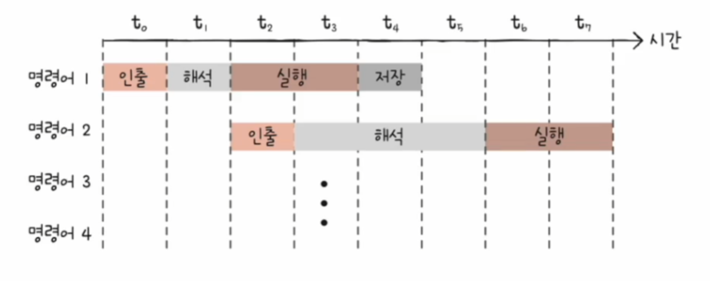
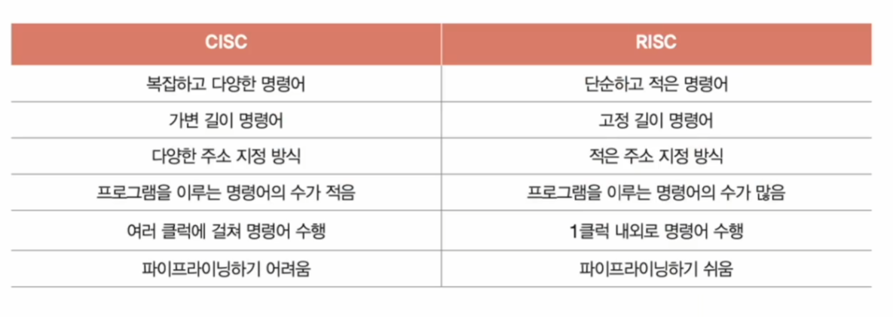

# 컴퓨터 구조와 운영체제

# CPU의 성능 향상 기법 - CISC & RISC

- 명령어 파이프라이닝과 슈퍼스칼라 기법을 실제로 CPU에 적용하려면 명령어가 파이프라이닝에 최적화되어 있어야 한다.
- 파이프라이닝 하기 쉬운 명령어에 대해 알아보자.

## 명령어 집합

- CPU는 명령어를 실행한다. 이 세상 모든 CPU들이 똑같이 생긴 명령어를 실행할까?
- 그렇지 않다. 명령어로 할 수 있는 연산, 주소 지정 방식 등은 CPU마다 조금씩 차이가 있다.
- CPU가 이해할 수 있는 명령어들의 모음을 **명령어 집합** 또는 **명령어 집합 구조(ISA)** 라고 한다. 즉, CPU마다 **ISA**가 다를 수 있다는 것이다.
- 같은 소스 코드로 만들어진 같은 프로그램이라 할지라도 `ISA`가 다르면 CPU가 이해할 수 있는 명령어도 어셈블리어(명령어를 읽기 편하게 표현한 언어)도 달라진다.
- `ISA`가 같은 CPU끼리는 서로의 명령어를 이해할 수 있지만, `ISA`가 다르면 서로의 명령어를 이해하지 못한다. `ISA`는 일종의 CPU 언어인 셈이다. 또한 CPU가 이해하는 명령어들이 달라짐에 따라 CPU 하드웨어 설계에도 큰 영향을 미치게 된다. 
- `ISA`는 CPU의 언어임과 동시에 CPU를 비롯한 하드웨어가 소프트웨어를 어떻게 이해할지에 대한 약속이라고도 볼 수 있다.

---

## CISC

- Complex Instruction Set Computer, 복잡한 명령어 집합을 활용하는 컴퓨터(CPU)
- **CISC**는 다양하고 강력한 기능의 명령어 집합을 활용하기 때문에 명령어의 형태와 크기가 다양한 **가변 길이 명령어**를 활용한다.

- 다양하고 강력한 명령어를 활용한다는 말은 상대적으로 적은 수의 명령어로도 프로그램을 실행할 수 있다는 것을 의미한다.
- 이런 장점으로 **CISC**는 메모리를 최대한 아끼며 개발해야 했던 시절에 인기가 높았다. 최대한 적은 수의 명령으로 메모리 공간을 절약시킬 수 있기 때문이다.
- 하지만 단점은 활용하는 명령어가 워낙 복잡하고 다양한 기능을 제공하는 탓에 명령어의 크기와 실행되기까지의 시간이 일정하지 않다. 그리고 복잡한 명령어 때문에 명령어 하나를
    실행하는 데에 여러 클럭 주기를 필요로 한다.
- 이는 명령어 파이프라인을 구현하는 데 적합하지 않다. 명령어 파이프라인 기법을 위한 이상적인 명령어는 각 단계에 소요되는 시간이 동일해야 한다.(가급적 1클럭)
- 하지만 **CISC**가 활용하는 명령어는 명령어 수행 시간이 길고 가지각색이기 때문에 파이프라인이 효율적으로 명령어를 처리할 수 없다.
- 현대 CPU에서 명령어 파이프라인은 높은 성능을 내기 위해 절대 놓쳐서는 안 되는 핵심 기술이기 때문에 현대 CPU에서 아주 치명적인 약점이다.

> **정리**
> 
> - **CISC** 명령어 집합은 복잡하고 다양한 기능을 제공하기 때문에 적은 수의 명령으로 프로그램을 동작시키고 메모리를 절약할 수 있다.
> - 하지만 명령어의 규격화가 어려워 파이프라이닝이 어려울 뿐더러, 대다수의 복잡한 명령어는 그 사용 빈도가 낮다는 큰 단점이 있다.

---

## RISC

- Reduced Instruction Set Computer, 이름 그대로 CISC에 비해 명령어의 종류가 적다.
- **RISC**는 CISC와 달리 짧고 규격화된 명령어, 되도록 1클럭 내외 실행되는 명령어를 지향하며, **고정 길이 명령어**를 활용한다.

- 명령어가 규격화 되어 있고, 하나의 명령어가 1클럭 내외로 실행되기 때문에 RISC 명령어 집합은 명령어 파이프라이닝에 최적화 되어 있다.
- 그리고 RISC는 메모리에 직접 접근하는 명령어를 `load`, `store` 두 개로 제한할 만큼 메모리 접근을 단순화하고 최소화를 추구한다. 때문에 CISC보다 주소 지정 방식의 종류가 적은 경우가 많다.

> **정리**
> 
> - **RISC** 명령어 집합은 메모리 접근을 단순화, 최소화 하는 대신 레지스터를 적극적으로 활용한다. 그래서 CISC보다 레지스터를 이용하는 연산이 많고, 일반적인 경우보다 범용
>   레지스터 개수도 더 많다.
> - 다만 사용 가능한 명령어 종류가 CISC보다 적기 때문에 RISC는 CISC보다 많은 명령어로 프로그램을 작동시킨다.

---

## 총 정리

- CPU의 언어인 `ISA`와 각기 다른 성격의 `ISA`를 기반으로 만들어진 CPU 설계 방식에는 **CISC**와 **RISC**가 있다.

---

[이전 ↩️ - 컴퓨터 구조(CPU의 성능 향상 기법) - 명령어 병렬 처리 기법](https://github.com/genesis12345678/TIL/blob/main/cs/cpu/Parallelism.md)

[메인 ⏫](https://github.com/genesis12345678/TIL/blob/main/cs/Main.md)

[다음 ↪️ - 컴퓨터 구조(메모리와 캐시 메모리) - ]()