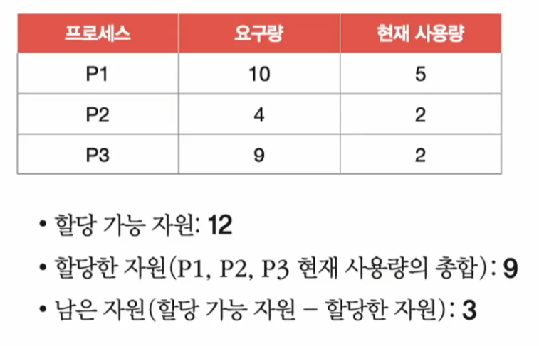
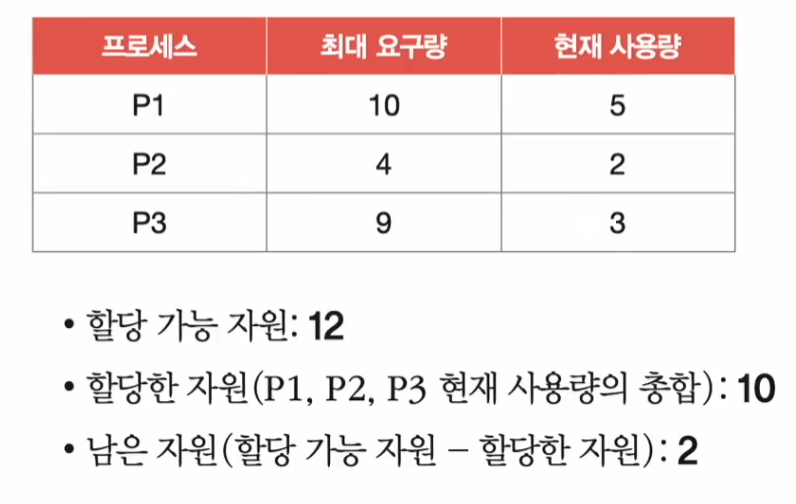
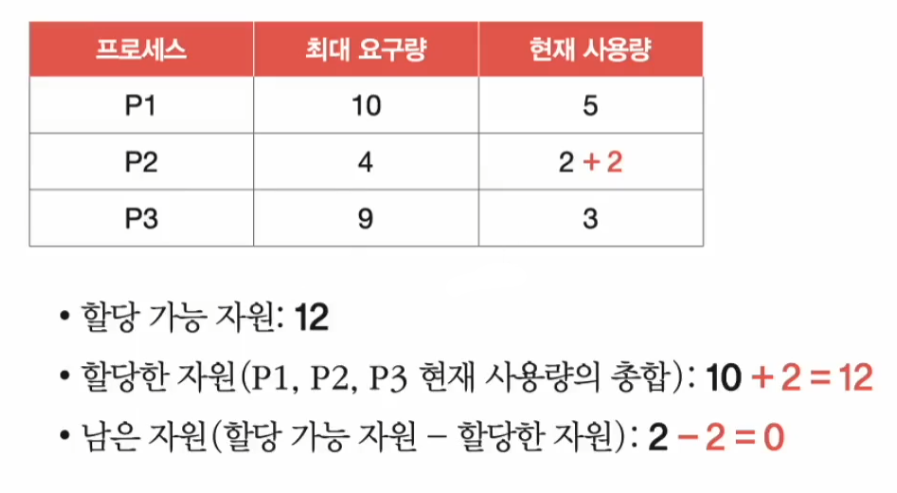
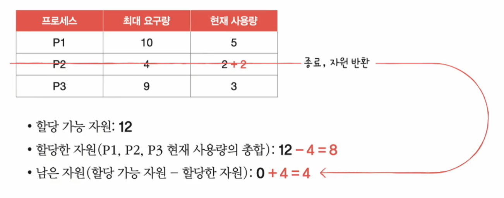

# 컴퓨터 구조와 운영체제

# 운영체제 - 교착 상태

## 교착 상태 해결 방법

교착 상태를 해결하는 방법에는 크게 **예방**, **회피**, **검출 후 회복**하는 방법이 있다.

---

## 교착 상태 예방

- 교착 상태를 예방하는 방법은 교착 상태 발생 조건 네 가지 중 하나를 충족하지 못하게 하는 방법이다.
- 즉 네 가지 조건 중 하나라도 부정을 하면 교착 상태는 발생하지 않는다.

### 상호 배제 부정

- 자원의 상호 배제를 없앤다는 말은 모든 자원을 공유 가능하게 만든다는 것이다.
- 이론적으로는 교착 상태를 없앨 수 있지만, 현실적으로 모든 자원의 상호 배제를 없애기는 어렵기 때문에 무리가 있다.

### 점유와 대기 부정

- 점유와 대기를 없애면 운영체제는 특정 프로세스에 자원을 모두 할당하거나, 아예 할당하지 않는 방식으로 배분한다.
- 이론적으로는 교착 상태를 해결할 수 있지만, 자원의 활용률이 낮아질 수 있다는 단점이 있다.
- 점유와 대기를 없애면 한 프로세스에 필요한 자원들을 몰아주고, 그 다음에 다른 프로세스에 필요한 자원들을 몰아줘야 한다.
- 이는 당장 자원이 필요해도 기다릴 수밖에 없는 프로세스와 사용되지 않으면서 오랫동안 할당되는 자원을 다수 양산하기 때문에 자원의 활용률이 낮아진다.

### 비선점 부정

- 비선점 조건을 없애면 자원을 이용 중인 프로세스로부터 해당 자워을 빼앗을 수 있다.
- 이 방식은 CPU와 같이 선점하여 사용할 수 있는 일부 자원에 대해서는 효과적이다.
- 하지만 모든 자원이 선점 가능한 것은 아니기 때문에 다소 범용성이 떨어지는 방안이다.

### 원형 대기 부정

- 모든 자원에 번호를 붙이고, 오름차순으로 자원을 할당하면 원형 대기는 발생하지 않는다.
- 식사하는 철학자 문제로 예를 들면 철학자는 낮은 포크에서 높은 포크 순으로 집어들게 한다면 원형 대기는 발생하지 않는다. 다음과 같이 5번 포크 다음에 1번 포크를 들 수 없기 때문이다.

- 원형 대기 부정은 앞의 세 방식에 비하면 비교적 현실적이고 실용적인 방식이지만, 역시 단점은 있다.
- 모든 자원에 번호를 붙이는 일은 어려운 작업이며, 각 자원에 어떤 번호를 붙이는지에 따라 특정 자원의 활용률이 떨어질 수 있다.

> 이렇게 교착 상태의 발생 조건을 원천적으로 제거하여 교착 상태를 사전에 방지하는 예방 방식은 교착 상태가 발생하지 않음을 
> 보장할 수는 있지만 여러 부작용이 따른다.

---

## 교착 상태 회피

- 교착 상태가 발생하지 않을 정도로만 자원을 할당하는 방식이다. 교착 상태 회피 방식에서는 교착 상태를 한정된 자원의 무분별한 할당으로 인해 발생하는 문제로 간주한다.
- **안전 상태**
  - 교착 상태가 발생하지 않고 모든 프로세스가 정상적으로 자원을 할당받고 종료될 수 있는 상태
- **불안전 상태**
  - 교착 상태가 발생할 수도 있는 상태
- **안전 순서열**
  - 교착 상태 없이 안전하게 프로세스들에 자원을 할당할 수 있는 순서
  - 안전 순서열이 있는 상태를 안전 상태라고 볼 수 있다.

예를 들어 12개의 자원이 있고 P1, P2, P3 3개의 프로세스가 실행 중이며, 각각 5개, 2개, 2개의 자원을 할당받아 사용 중이라고 가정해본다.

운영체제가 프로세스에 배분할 수 있는 자원은 3개가 남고, 3개의 프로세스는 각각 최대 10개, 4개, 9개의 자워을 요구할 수 있다고 가정해본다.

이 상태는 P2 > P1 > P3 라는 안전 순서열이 있기 때문에 안전 상태이다.

프로세스가 모두 최대로 자원을 요구한 최악의 상황일 때를 살펴보자.(P1이 5개, P2가 2개, P3가 7개의 자원을 요구한 상황)

P2는 이미 자원을 2개 가지고 있으므로 남은 자원에서 2개를 배분하면 된다.

P2는 정상적으로 작업을 끝내고 가지고 있던 자원을 반환한다. 남은 자원은 5개가 된다.

P1에 남은 자원 5개를 할당하면 P1 또한 작업을 정상적으로 완료하고 자원을 반환할 수 있다.

그리고 남은 자원을 P3에 할당하면 된다.

이렇게 P2 > P1 > P3라는 안전 순서열대로 자원을 배분하면 모두 자원을 할당받아 교착 상태 없이 모든 프로세스를 실행할 수 있다.

이번에는 교착 상태가 발생할 수 있는 불완전 상태를 알아보자.

앞의 예시와 동일한 상황에서 P3가 자원을 하나 더 가지고 있는 상황이다.

역시 프로세스 모두 최대로 자원을 요구한 최악의 상황을 살펴보자.(P1이 5개, P2가 2개, P3가 6개의 자원을 요구한 상황)

P2에 남은 2개의 자원을 배분하여 P2 작업을 끝내고 자원을 반환하더라도 자원 4개로는 P1과 P3의 요구를 모두 들어줄 수 없다. P1과 P3는 서로가 보유하고 있는
자원을 바라보며 무한정 기다릴 수밖에 없다. 불완전 상태로 교착 상태가 발생한 것이다.

즉, 운영체제가 교착 상태를 회피하기 위해서는 시스템 상태가 안전 상태에서 안전 상태로 움직이는 경우에만 자원을 할당하면 된다. 
교착 상태 회피 방식은 항시 안전 상태를 유지하도록 자원을 할당하는 방식이다.

교착 상태 회피 방식의 대표적인 예로 **은행원 알고리즘**이 있다.

---

## 교착 상태 검출 후 회복

- 교착 상태 발생을 인정하고 사후에 조치하는 방식이다.
- 운영체제는 프로세스들이 자원을 요구할 때마다 그때그때 모두 할당되며, 교착 상태 발생 여부를 주기적으로 검사한다. 그리고 교착 상태가 검출되면
    그때서야 다음과 같은 방식으로 회복한다.

### 선점을 통한 회복

- 교착 상태가 해결될 때까지 한 프로세스씩 자원을 몰아주는 방식
- 교착 상태가 해결될 때까지 다른 프로세스로부터 자원을 강제로 빼앗고 한 프로세스에 할당하는 방식

### 프로세스 강제 종료를 통한 회복

- 가장 단순하면서 확실한 방식으로, 운영체제는 교착 상태에 놓인 프로세스를 모두 강제 종료할 수도 있고, 교착 상태가 없어질 때까지 한 프로세스씩 강제 종료할 수 있다.
- 전자는 가장 확실한 방식이지만 그만큼 작업 내역을 잃게 될 가능성이 있고, 후자는 교착 상태가 없어졌는지 여부를 확인하는 과정에서 오버헤드를 야기한다.

> **타조 알고리즘** : 드물게 발생하는 잠재적 문제를 무시로 대처하는 방식으로 교착 상태를 아예 무시하는 방법이다.

---

[이전 ↩️ - 운영체제(교착 상태) - 교착 상태란]()

[메인 ⏫](https://github.com/genesis12345678/TIL/blob/main/cs/Main.md)

[다음 ↪️ - 운영체제() - ]()