# 컴퓨터 구조와 운영체제

# 입출력장치 - 다양한 입출력방법

## 프로그램 입출력

- 프로그램 속 명령어로 입출력장치를 제어하는 방법
- CPU가 프로그램 속 명령어를 실행하는 과정에서 입출력 명령어를 만나면 CPU는 입출력장치에 연결된 장치 컨트롤러와 상호작용하며 입출력 작업을 수행한다.
- 메모리에 저장된 정보를 하드 디스크에 백업하는 상황을 예로 알아보자.

1. CPU는 하드 디스크 컨트롤러의 제어 레지스터에 쓰기 명령을 보낸다.

2. 하드 디스크 컨트롤러는 하드 디스크 상태를 확인하고, 상태 레지스터에 준비되었다고 표시한다.

3. CPU는 상태 레지스터를 **주기적으로 읽어보며** 하드 디스크의 준비 여부를 확인한다. 하드 디스크가 준비됐음을 CPU가 알게 되면 백업할 메모리의 정보를
    데이터 레지스터에 쓴다. 아직 백업 작업(쓰기 작업)이 끝나지 않았다면 1번부터 반복하고, 쓰기가 끝났따면 작업을 종료한다.

- 이렇게 프로그램 입출력 방법은 CPU가 장치 컨트롤러의 레지스터 값을 읽고 씀으로써 이루어지는데, CPU는 입출력장치들의 주소를(장치 컨트롤러의 레지스터들을) 어떻게 알 수 있는 걸까?
- CPU 내부에 있는 레지스터들과는 달리 CPU는 여러 장치 컨트롤러 속 레지스터들을 모두 알고 있기란 어렵다. 
- 이를 알기 위한 방법으로 **메모리 맵 입출력** 방식과 **고립형 입출력** 방식이 있다.

### 메모리 맵 입출력

- 메모리에 접근하기 위한 주소 공간과 입출력장치에 접근하기 위한 주소 공간을 하나의 주소 공간으로 간주하는 방법

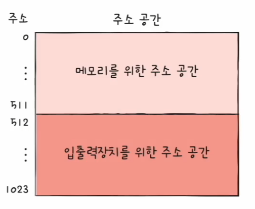

- 이 방식의 중요한 점은 CPU는 메모리의 주소들이나 장치 컨트롤러의 레지스터들이나 모두 똑같이 메모리 주소를 대하듯 하면 된다는 점이다.
    그래서 메모리에 접근하는 명령어와 입출력장치에 접근하는 명령어는 굳이 다를 필요가 없다.

### 고립형 입출력

- 메모리를 위한 주소 공간과 입출력장치를 위한 주소 공간을 분리하는 방법

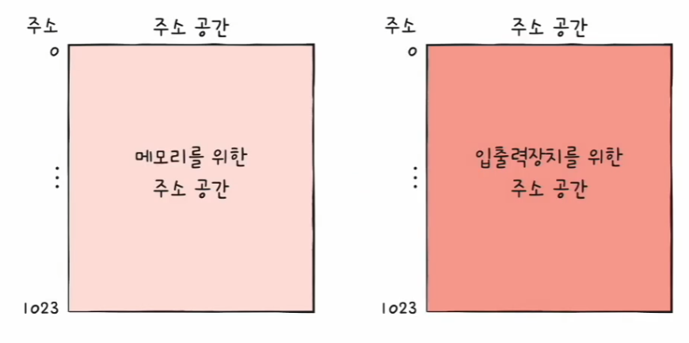

- 이 방식은 메모리 앱 입출력 방식과 대조적으로 메모리에 접근하는 명령어와 입출력장치에 접근하는 명령어는 서로 다르다.

---

## 인터럽트 기반 입출력

- 입출력장치에 의한 하드웨어 인터럽트는 정확히 말하자면 입출력장치가 아닌 장치 컨트롤러에 의해 발생한다.
- CPU는 장치 컨트롤러에 입출력 작업을 명령하고, 장치 컨트롤러가 입출력장치를 제어하며 입출력을 수행하는 동안 CPU는 다른 일을 할 수 있다.

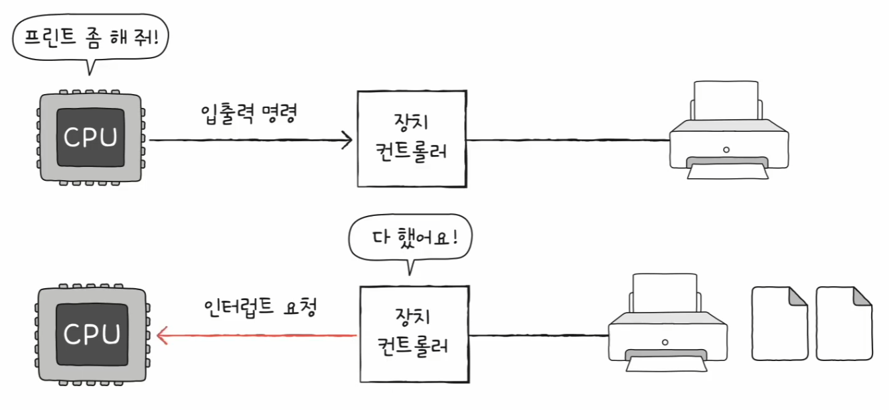

- 이렇게 인터럽트를 기반으로 하는 입출력을 **인터럽트 기반 입출력**이라고 한다.

그렇다면 **여러 입출력장치에서 인터럽트가 동시에 발생한 경우** 인터럽트들을 어떻게 치리해야 할까?

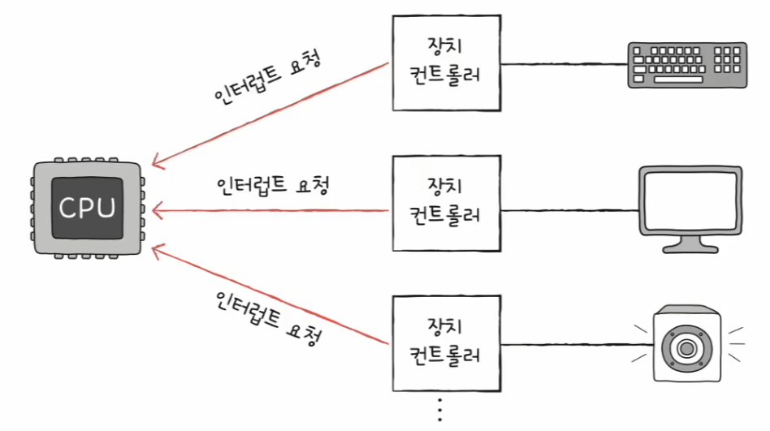

- 가장 간단한 방법은 인터럽트가 발생한 순서대로 인터럽트를 처리하는 것이다.
- 이 방식은 CPU가 플래그 레지스터 속 인터럽트 비트를 비활성화한 채 인터럽트를 처리하는 경우다.

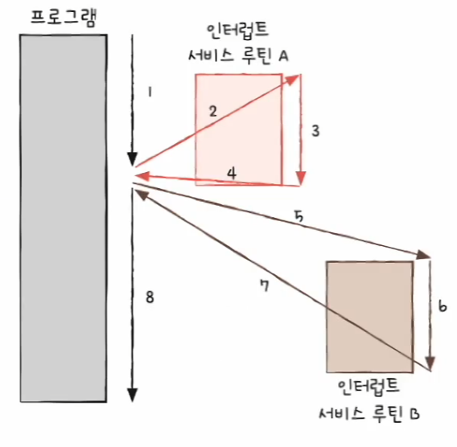

- 하지만 인터럽트 중에서도 더 빨리 처리해야 하는 인터럽트가 있기 때문에 현실적으로 순차적 처리로만 해결할 수 없다.
- 플래그 레지스터 속 인터럽트 비트가 활성화되어 있는 경우 또는 인터럽트 비트를 비활성화해도 무시할 수 없는 인터럽트가 발생한 경우 CPU는 우선순위가 높은 인터럽트부터 처리한다.

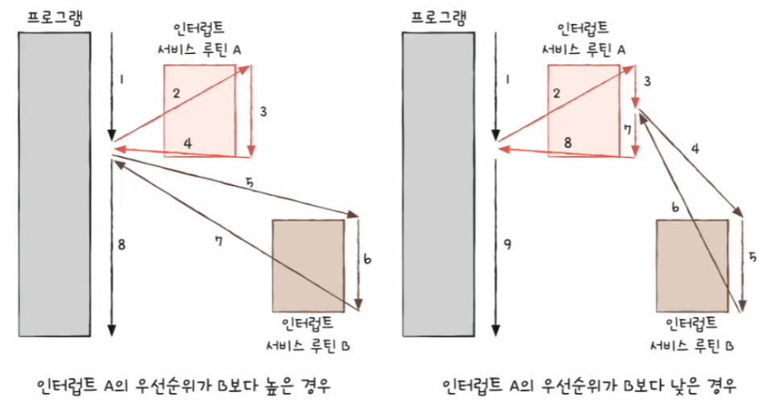

- 우선순위를 반영하여 다중 인터럽트를 처리하는 방법에는 여러 가지가 있는데, 많은 컴퓨터에서는 **프로그래머블 인터럽트 컨트롤러(PIC)** 라는 하드웨어를 사용한다.
- **PIC**는 여러 장치 컨트롤러에 연결되어 장치 컨트롤러에서 보낸 하드웨어 인터럽트 요청들의 우선순위를 판별한 뒤 CPU에 지금 처리해야 할 하드웨어 인터럽트는 무엇인지를 알려주는 장치이다.

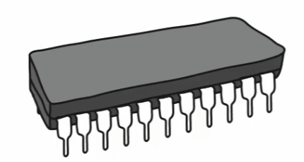

- PIC에는 여러 핀이 있다. 각 핀에는 CPU에 하드웨어 인터럽트 요청을 보낼 수 있는 약속된 하드웨어가 연결되어 있다.
- PIC에 연결된 장치 컨트롤러들이 동시에 하드웨어 인터럽트 요청을 보내면 PIC는 이들의 우선순위를 판단하여 CPU에 가장 먼저 처리할 인터럽트를 알려준다.

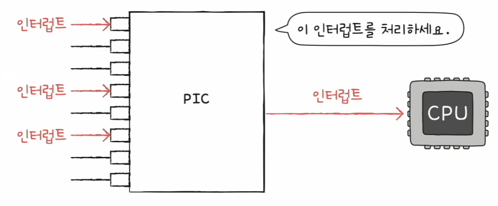

- 다음과 같이 여러 개의 PIC를 계층적으로 구성하여 더 많고 복잡한 장치들의 인터럽트를 관리할 수 있다.

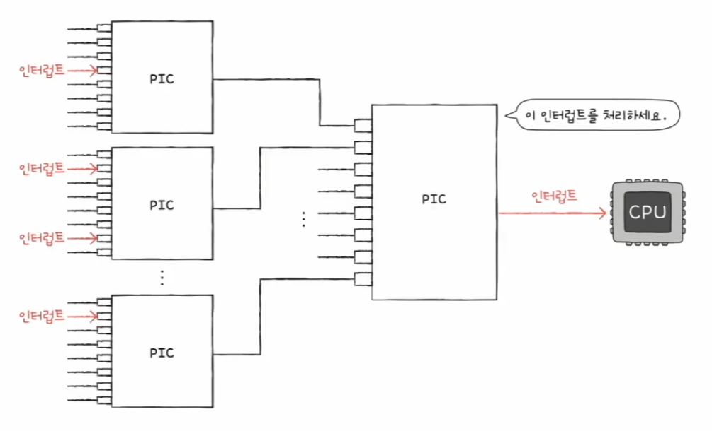

> PIC는 무시할 수 없는 인터럽트까지 우선순위를 판별하지는 않는다. 이 인터럽트는 우선순위가 가장 높아 우선순위 판별이 불필요하기 때문이다.
> 인터럽트 비트를 통해 막을 수 있는 하드웨어 인터럽트만 우선순위를 조정해준다.

---

## DMA 입출력

- 프로그램 기반 입출력과 인터럽트 기반 입출력에 공통점이 있는데, 입출력장치와 메모리 간의 데이터 이동은 **CPU가 주도**하고, 이동하는 데이터도 반드시 **CPU를 거친다**는 점이다.

입출력장치의 데이터를 메모리에 저장하는 경우

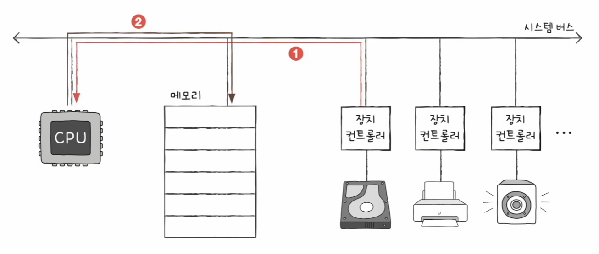

메모리 속 데이터를 입출력장치에 내보내는 경우

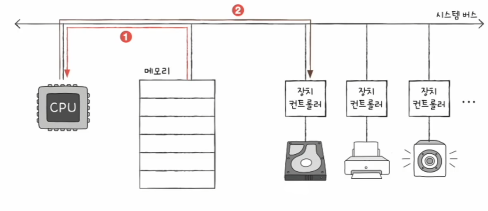

- 입출력장치와 메모리 사이에 전송되는 모든 데이터가 반드시 CPU를 거쳐야 한다면 바쁘게 움직여야 하는 CPU는 입출력장치를 위한 연산 때문에 시간을 뺏기게 된다.
- 그래서 입출력장치와 메모리가 CPU를 거치지 않고도 상호작용할 수 있는 입출력 방식인 **DMA(Direct Memory Access)** 가 등장하였다.
- DMA는 이름 그대로 직접 메모리에 접근할 수 있는 입출력 기능으로, DMA 입출력을 하기 위해서는 시스템 버스에 연결된 **DMA 컨트롤러**라는 하드웨어가 필요하다.

일반적인 DMA 입출력 과정을 메모리 내의 정보를 하드 디스크에 백업하는 작업을 예로 알아보자.

1. CPU는 DMA 컨트롤러에 하드 디스크 주소, 수행할 연산(쓰기), 백업할 내용이 저장된 메모리의 주소 등의 정보와 함께 입출력 작업을 명령한다.

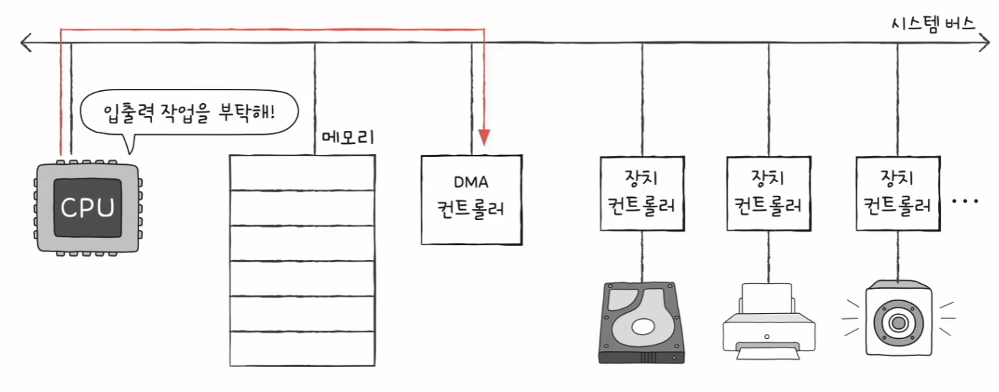

2. DMA 컨트롤러는 CPU 대신 장치 컨트롤러와 상호작용하며 입출력 작업을 수행한다.이때 DMA 컨트롤러는 필요한 경우 메모리에 직접 접근하며 정보를 읽거나 쓴다.

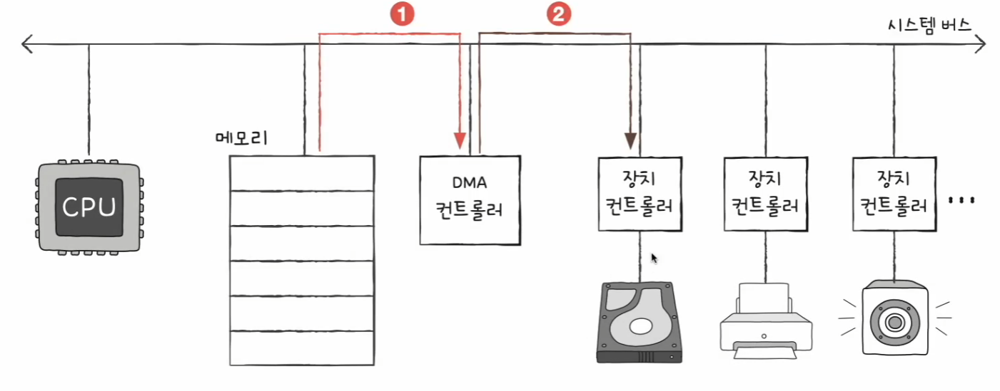

3. 입출력 작업이 끝나면 DMA 컨트롤러는 CPU에 인터럽트를 걸어 작업이 끝났음을 알린다.

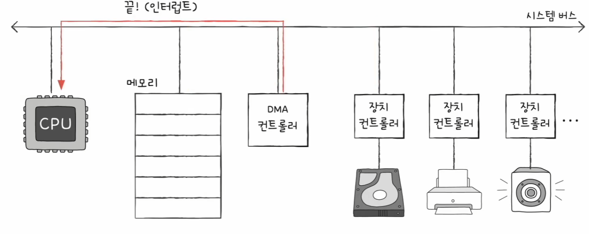

- 결과적으로 입출력장치와 메모리 사이에 주고받을 데이터는 CPU를 거치지 않는다. 즉, CPU는 오직 입출력 작업의 시작과 끝에만 관여하면 된다.
- 하지만 문제는 DMA 컨트롤러는 시스템 버스로 메모리에 직접 접근이 가능하지만, 시스템 버스는 공용 자원이기 때문에 동시 사용이 불가능하다.
- CPU와 DMA 컨트롤러는 동시에 시스템 버스를 사용할 수 없다.
- 그래서 DMA 컨트롤러는 CPU가 시스템 버스를 사용하지 않을 때마다 조금씩 시스템 버스를 이용하거나, CPU가 일시적으로 시스템 버스를 이용하지 않도록 하고 시스템 
    버스를 집중적으로 이용한다.

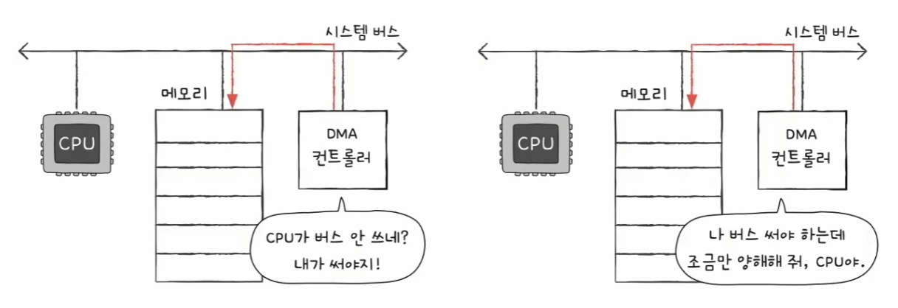

> CPU 입장에서는 버스에 접근하는 주기를 도둑 맞는 기분이 들 것이다. 이러한 DMA의 시스템 버스 이용을 **사이클 스틸링**이라고 부른다.

### 입출력 버스

- CPU, 메모리, DMA 컨트롤러, 장치 컨트롤러가 모두 같은 버스를 공유하는 구성에서는 DMA를 위해 한 번 메모리에 접근할 때마다 시스템 버스를 두 번 사용하게 되는 부작용이 있다.
- 다음 그림의 경우, 메모리에서 DMA 컨트롤러로 데이터를 가져오기 위해 한 번, DMA 컨트롤러의 데이터를 장치 컨트롤러로 옮기기 위해 또 한 번 사용한다.

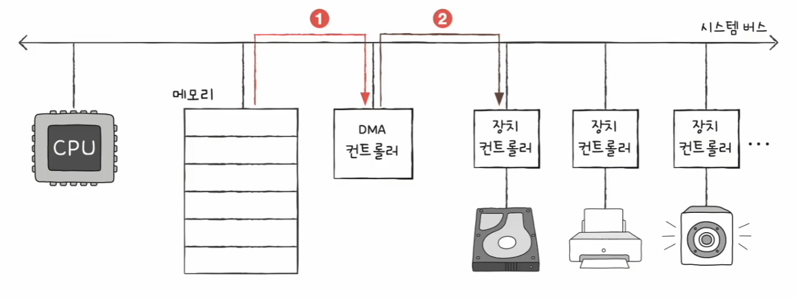

- DMA를 위해 시스템 버스를 너무 자주 사용하면 그만큼 CPU가 시스템 버스를 이용하지 못한다.
- 이 문제는 DMA 컨트롤러와 장치 컨트롤러들을 **입출력 버스**라는 별도의 버스에 연결하여 해결할 수 있다.
- DMA 컨트롤러와 장치 컨트롤러가 서로 데이터를 전송할 때는 시스템 버스를 이용할 필요가 없으므로 시스템 버스의 사용 빈도를 줄일 수 있다.

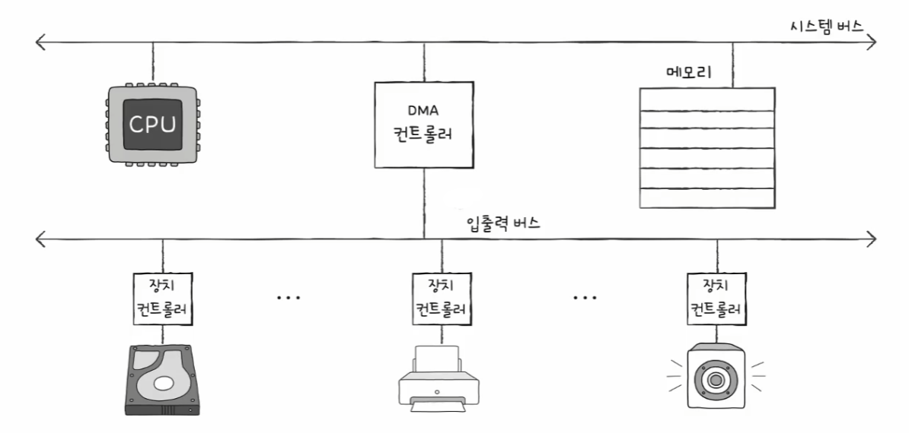

---

[이전 ↩️ - 컴퓨터 구조(입출력장치) - 장치 컨트롤러와 장치 드라이버](https://github.com/genesis12345678/TIL/blob/main/cs/iodevice/DeviceDriver.md)

[메인 ⏫](https://github.com/genesis12345678/TIL/blob/main/cs/Main.md)

[다음 ↪️ - 운영체제 - 운영체제란?](https://github.com/genesis12345678/TIL/blob/main/cs/os/OS.md)