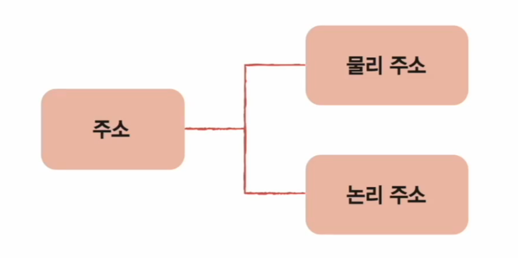
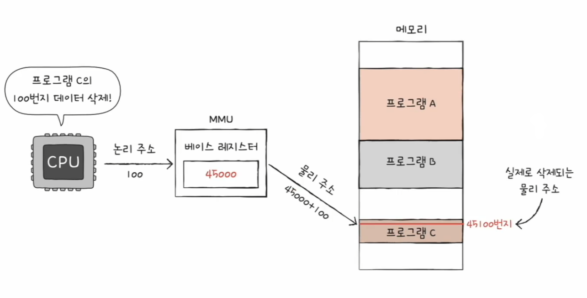
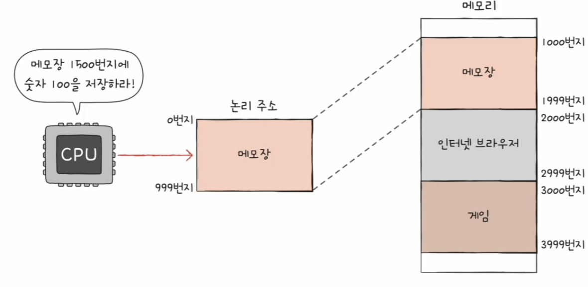
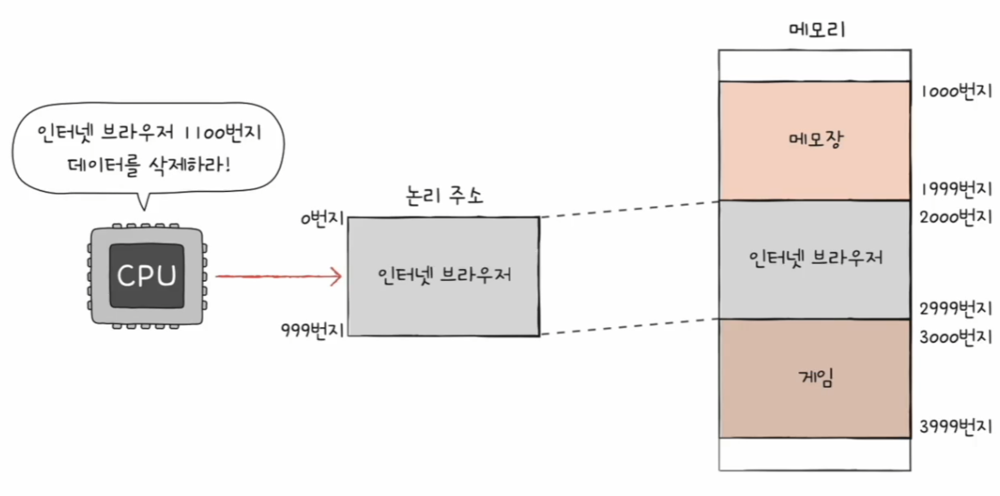
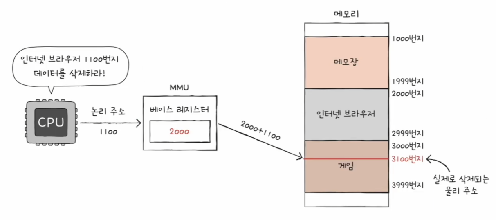

# 컴퓨터 구조와 운영체제

# 메모리와 캐시 메모리 - 메모리의 주소 공간

## 물리 주소와 논리 주소

CPU와 실행 중인 프로그램은 현재 메모리 몇 번지에 무엇이 저장되어 있는지 다 알고 있을까?

- 그렇지 않다, 왜냐하면 메모리에 저장된 정보는 시시각각 변하기 때문이다.
- 메모리에는 새롭게 실행되는 프로그램이 적재되고, 실행이 끝난 프로그램은 삭제된다. 또한 같은 프로그램을 실행하더라도 실행할 때마다 적재되는 주소는 달라질 수 있다.
- 주소에는 메모리가 사용하는 물리 주소가 있고, CPU와 실행 중인 프로그램이 사용하는 논리 주소가 있다.

- **물리 주소**
  - 메모리가 사용하는 주소로, 말 그대로 정보가 실제로 저장된 하드웨어상의 주소를 의미
- **논리 주소**
  - CPU와 실행 중인 프로그램이 사용하는 주소로, 실행 중인 프로그램 각각에게 부여된 0번지부터 시작되는 주소를 의미

- CPU가 이해하는 주소가 논리 주소이고, CPU가 메모리와 상호 작용하려면 논리 주소와 물리 주소간의 변환이 이루어져야 한다.

- 논리 주소와 물리 주소 간의 변환은 CPU와 주소 버스 사이에 위치한 **메모리 관리 장치(MMU)** 라는 하드웨어에 의해 수행된다.
- MMU는 CPU가 발생시킨 논리 주소에 **베이스 레지스터** 값을 더하여 논리 주소를 물리 주소로 변환한다.

즉, **베이스 레지스터**는 프로그램의 가장 작은 물리 주소, 프로그램의 첫 물리 주소를 저장하는 셈이고, **논리 주소**는 프로그램의 시작점으로부터 떨어진 거리인 셈이다.

---

## 메모리 보호 기법

다음과 같은 명령어는 실행되어도 안전할까?

- 당연히 위와 같은 명령어들은 실행되어서 안된다. 프로그램의 논리 주소 영역을 벗어나기 때문이다.
- 위 명령어들이 실행된다면 전혀 관련 없는 프로그램에 접근하게 된다.

- 이렇게 다른 프로그램의 영역을 침범할 수 있는 명령어는 위험하기 때문에 논리 주소 범위를 벗어나는 명령어 실행을 방지하고 실행 중인 프로그램이 다른 프로그램에 영향을
    받지 않도록 보호할 방법이 필요한데, 이는 **한계 레지스터**라는 레지스터가 담당한다.
- 베이스 레지스터가 실행 중인 프로그램의 가장 작은 물리 주소를 저장한다면, 한계 레지스터는 논리 주소의 최대 크기를 저장한다.
- 즉, 프로그램의 물리 주소 범위는 베이스 레지스터 값 이상, 베이스 레지스터 값 + 한계 레지스터 값 미만이 된다.

- CPU가 접근하려는 논리 주소는 한계 레지스터가 저장한 값보다 커서는 안 된다. 한계 레지스터보다 높은 주소 값에 접근하는 것은 곧 프로그램의 범위에 벗어난
    메모리에 접근하는 것과 같기 때문이다.
- **CPU는 메모리에 접근하기 전에 접근하고자 하는 논리 주소가 한계 레지스터보다 작은지를 항상 검사한다.**
- 만약 CPU가 한계 레지스터보다 높은 논리 주소에 접근하려고 하면 인터럽트(트랩)를 발생시켜 실행을 중단한다.

- 이러한 방식으로 실행 중인 프로그램의 독립적인 실행 공간을 확보하고, 하나의 프로그램이 다른 프로그램을 침범하지 못하게 보호할 수 있다.

---

[이전 ↩️ - 컴퓨터 구조(메모리와 캐시 메모리) - RAM 특징과 종류]()

[메인 ⏫](https://github.com/genesis12345678/TIL/blob/main/cs/Main.md)

[다음 ↪️ - 컴퓨터 구조(메모리와 캐시 메모리) - 캐시 메모리]()