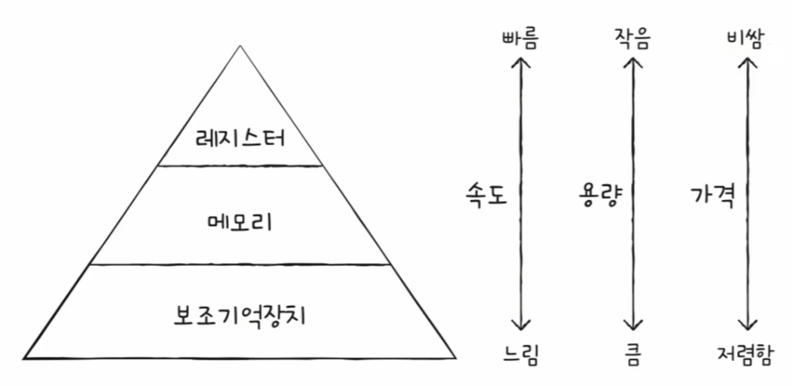
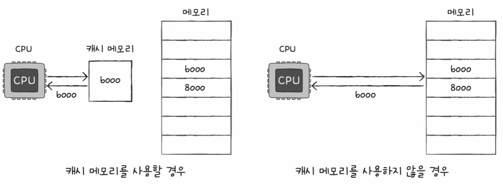
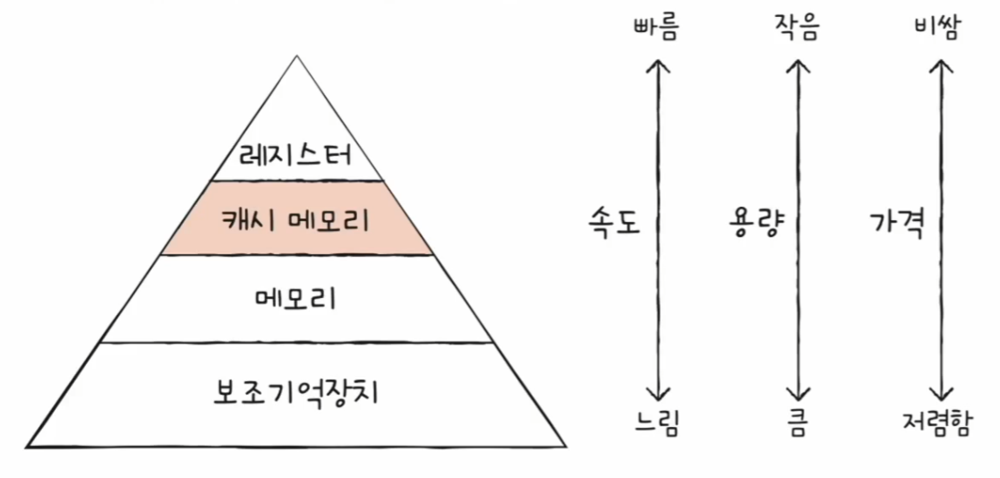
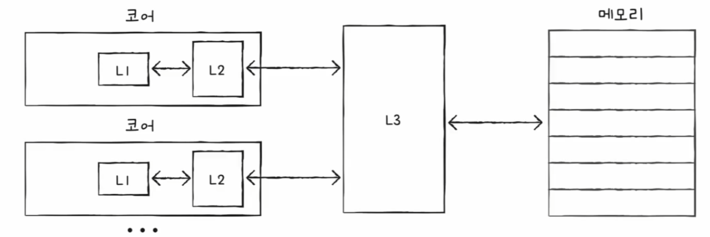
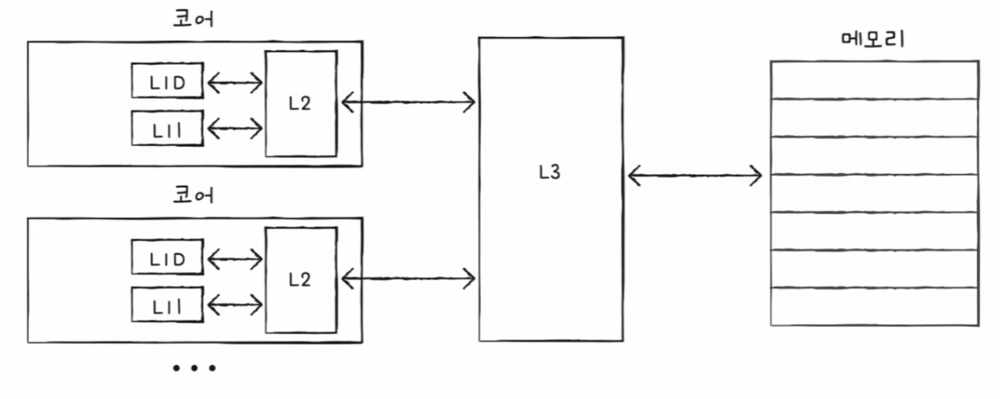
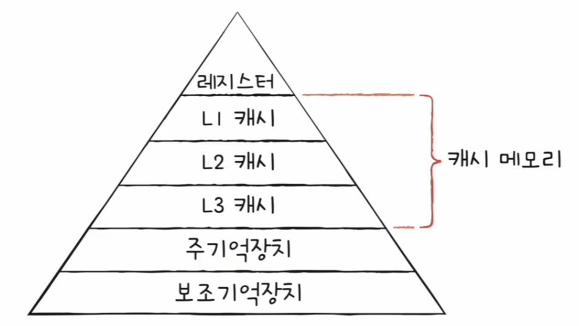
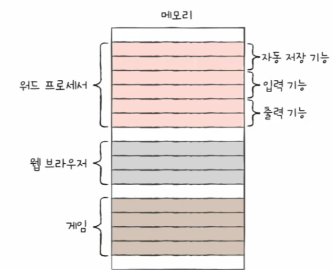

# 컴퓨터 구조와 운영체제

# 메모리와 캐시 메모리 - 캐시 메모리

- CPU는 프로그램을 실행하는 과정에서 메모리에 저장된 데이터를 빈번하게 사용된다.
- 하지만 CPU가 메모리에 접근하는 시간은 CPU의 연산 속도보다 느리다. 이를 극복하기 위한 저장 장치가 **캐시 메모리**이다.

## 저장 장치 계층 구조

> 1. CPU와 가까운 저장 장치는 빠르고, 멀리 있는 저장 장치는 느리다.
> 2. 속도가 빠른 저장 장치는 저장 용량이 작고, 가격이 비싸다.

- 즉, 낮은 가격대의 대용량 저장 장치를 원한다면 느린 속도는 감수해야 하고, 빠른 메모리를 원한다면 작은 용량과 비싼 가격은 감수해야 한다.
- 컴퓨터가 사용하는 저장 장치들은 CPU에 얼마나 가까운가를 기준으로 계층적으로 나타낼 수 있는데, 이를 **저장 장치 계층 구조**라고 한다.

---

## 캐시 메모리

- 캐시 메모리는 CPU와 메모리 사이에 위치하고, 레지스터보다 용량이 크고 메모리보다 빠른 SRAM 기반의 저장 장치이다.
- CPU의 연산 속도와 메모리 접근 속도의 차이를 조금이나마 줄이기 위해 탄생했다. 
- 메모리에서 CPU가 사용할 일부 데이터를 미리 캐시 메모리로 가지고 와서 활용하자는 아이디어다.

캐시 메모리까지 반영한 저장 장치 계층 구조는 다음과 같다.

- 컴퓨터 내부에는 여러 개의 캐시 메모리가 있다. 이 캐시 메모리들은 CPU(코어)와 가까운 순서대로 계층을 구성한다.
- 코어와 가장 가까운 **L1 캐시**, 그 다음 가까운 **L2 캐시**, 그 다음 가까운 **L3 캐시**가 있다.

> 일반적으로 L1 캐시와 L2 캐시는 코어 내부에, L3 캐시는 코어 외부에 위치해 있다.

- 캐시 메모리의 용량은 L1, L2, L3 순으로 커지고, 속도는 L3, L2, L1 순으로 빨라지며, 가격은 L3, L2, L1 순으로 비싸진다.
- CPU는 우선 L1 캐시를 확인하고, 없다면 L2, L3 캐시 순으로 데이터를 검색한다.
- 멀티 코어 프로세서에서 캐시 메모리는 다음과 같이 구현된다. L1, L2 캐시는 코어마다 고유한 캐시 메모리로 할당되고, L3 캐시는 여러 코어가 공유하는 형태로 사용된다.

> **분리형 캐시**
> 
> 코어와 가장 가까운 L1 캐시는 조금이라도 접근 속도를 빠르게 만들기 위해 명령어만을 저장하는 `L1I` 캐시와 데이터만을 저장하는 `L1D` 캐시로 분리하는 경우도 있다.
> 
> 

계층적 캐시 메모리까지 반영한 저장 장치 계층 구조는 다음과 같다.

---

## 참조 지역성 원리

- 캐시 메모리는 용량이 작기 때문에 메모리의 일부를 복사하여 저장하는데, 이때 캐시 메모리는 무엇을 저장해야 할까?
- 캐시 메모리는 CPU가 자주 사용할 법한 대상을 예측하여 저장한다. 이때 실제로 예측이 들어맞아 캐시 메모리 내 데이터가 CPU에서 활용될 경우를 **캐시 히트**라고 한다.

- 반대로 예측이 틀려 메모리에서 필요한 데이터를 직접 가져와야 하는 경우를 **캐시 미스**라고 한다.

- 캐시가 히트되는 비율을 캐시 적중률이라 하고, 다음과 같이 계산한다.
  - `캐시 히트 횟수` / `(캐시 히트 횟수 + 캐시 미스 횟수)`
- 캐시 메모리의 이점을 활용하려면 CPU가 사용할 법한 데이터를 제대로 예측해서 캐시 적중률을 높여야 한다. 그러면 CPU가 사용할 법한 데이터는 어떻게 알 수 있을까?
- 캐시 메모리는 **참조 지역성의 원리**에 따라 메모리로부터 가져올 데이터를 결정한다. 참조 지역성의 원리란 **CPU가 메모리에 접근할 때의 주된 경향**을 바탕으로 만들어진 원리이다.

### 1. CPU는 최근에 접근했던 메모리 공간에 다시 접근하려는 경향이 있다.

- 프로그래밍에서 변수에 값을 저장하고 나면 언제든 변수에 다시 접근하여 변수에 저장된 값을 사용할 수 있다.
- 즉, CPU는 변수가 저장된 메모리 공간을 언제든 다시 참조할 수 있다는 것을 의미한다.
- 변수에 저장된 값은 일반적으로 한 번만 사용되지 않고 프로그램이 실행되는 동안 여러 번 사용된다. CPU는 최근에 접근했던 메모리 공간을 여러 번 다시 접근할 수 있다.

- 변수 `num`과 `i`는 여러 번 사용된다. 이렇게 최근에 접근했던 메모리 공간에 다시 접근하려는 경향을 **시간 지역성**이라고 한다.

### 2. CPU는 접근한 메모리 공간 근처를 접근하려는 경향이 있다.

- CPU가 실행하려는 프로그램은 보통 관련 데이터들끼리 한데 모여있다. 그리고 하나의 프로그램 내에서도 관련 있는 데이터들은 모여서 저장된다.

- CPU가 워드 프로세서 프로그램을 실행하면 워드 프로세서 프로그램이 모여 있는 공간 근처를 집중적으로 접근할 것이고, 사용자가 입력을 하면 입력 기능이 모여 있는
    공간 근처를 집중적으로 접근할 것이다.
- 이렇게 메모리 공간 근처를 접근하려는 경향을 **공간 지역성**이라고 한다.

---

[이전 ↩️ - 컴퓨터 구조(메모리와 캐시 메모리) - 메모리 주소 공간]()

[메인 ⏫](https://github.com/genesis12345678/TIL/blob/main/cs/Main.md)

[다음 ↪️ - 컴퓨터 구조() - ]()