# 네트워크 - 네트워크 기본 개념

## 네트워크 기본 구조

- 네트워크란 여러 장치가 서로 연결되어 정보를 주고받을 수 있는 통신망이다. 그리고 이 모양은
노드와 노드를 연결하는 간선으로 이루어진 그래프 형태를 띠고 있다.
- 노드는 정보를 주고받을 수 있는 장치, 간선은 정보를 주고받을 수 있는 유무선의 통신 매체로 비유할 수 있다.

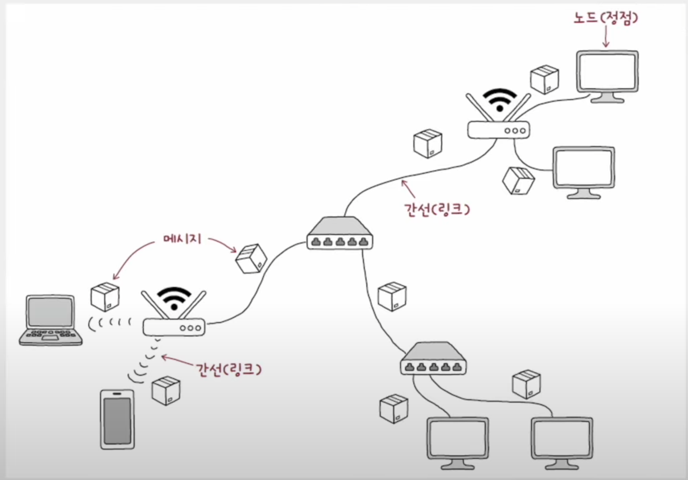

### 호스트

- 네트워크의 가장자리에 위치한 노드는 네트워크를 통해 흐르는 정보를 최초로 생성 및 송신하고,
최종적으로 수신한다.
- 일상에서 사용하는 네트워크 기기 대부분이 여기에 속하며, 이러한 가장자리 노드를 네트워크에서는
**호스트** 라고 부른다. 또는 네트워크의 가장자리에 자리 잡고 있다는 점에서 종단 시스템(end system)이라고도 한다.

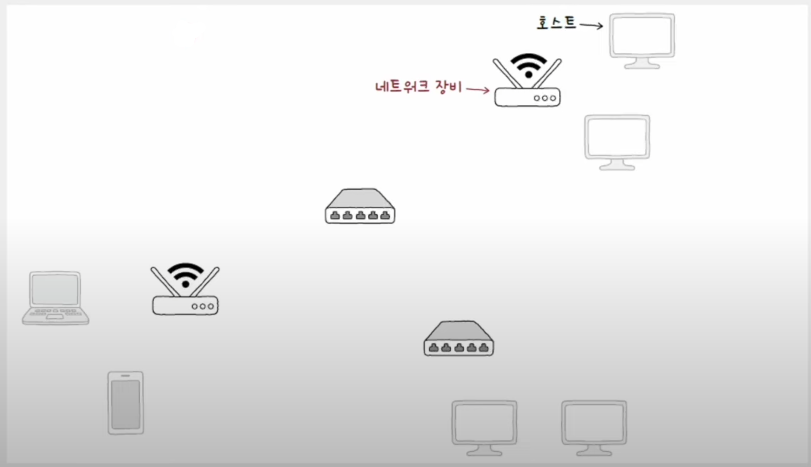

> 호스트는 역할에 따라 구분할 수 있는데, 대표적인 역할로 **서버와 클라이언트**가 있다.

### 네트워크 장비

- 네트워크 가장자리에 위치하지 않은 노드, 즉 호스트 간 주고받을 정보가 중간에 거치는 노드이며, 중간 노드라고 한다.
- 대표적으로 이더넷 허브, 스위치, 라우터, 공유기 등이 있다.
- 네트워크 장비는 호스트 간 주고받는 정보가 원하는 수신지까지 안정적이고 안전하게 전송될 수 있도록 한다.

### 통신 매체

- 각 노드를 연결하는 간선을 의미하며, 유선 매체와 무선 매체가 있다.

### 메시지

- 통신 매체로 연결된 노드가 주고받는 정보를 **메시지**라고 한다.

---

## 네트워크 분류

### 범위에 따른 네트워크 분류

#### LAN (Local Area Network)

- 가까운 지역을 연결한 근거리 통신망을 의미한다.
- 가정, 기업, 학교처럼 한정된 공간에서의 네트워크를 `LAN`이라고 부른다.

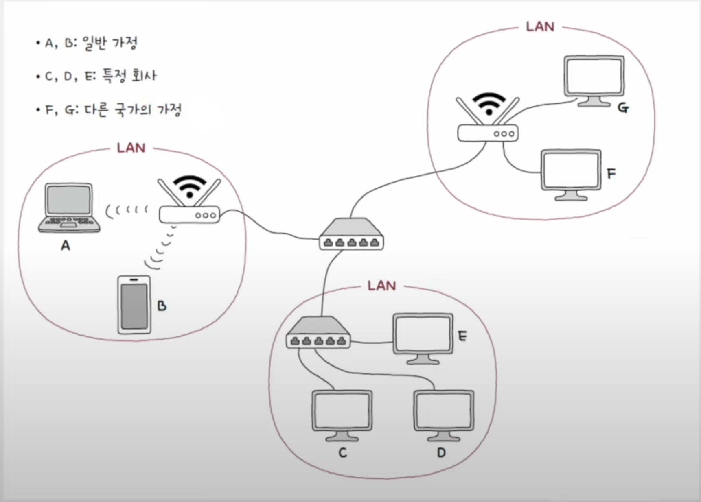

#### WAN (Wide Area Network)

- 먼 지역을 연결하는 광역 통신망을 의미한다.
- 멀리 떨어진 LAN을 연결할 수 있는 네트워크가 바로 `WAN`이다.
- 인터넷이 `WAN`으로 분류되며, 다른 `LAN`에 속한 호스트와 메시지를 주고받아야 할 때 `WAN`이 필요하다.

### 메시지 교환 방식에 따른 네트워크 분류

#### 회선 교환 방식

- 메시지를 주고받기 전 메시지 전송로인 회선(circuit)을 설정하고 이를 통해 메시지를 주고 받는 방식이다.

예를 들어 A와 D가 통신하려고 할 때 메시지를 주고받기 전에 A와 D 사이의 회선을 미리 확보하고 해당 경로로
메시지를 주고받는 것이다.

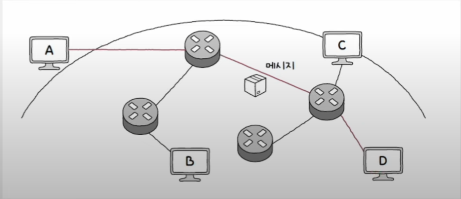

> 호스트 사이에 일대일 전송로를 확보하는 네트워크 장비로는 **회선 스위치**가 있다.

- 회선 교환 방식은 두 호스트 사이에 연결을 확보한 후에 메시지를 주고받는 특성 덕분에 주어진
시간 동안 전송되는 정보의 양이 비교적 일정하다는 장점이 있다.
- 하지만 회선의 이용 효율이 낮아질 수 있는 문제가 있다.
- 가능한 모든 회선에 끊임없이 메시지가 흐르고 있어야 회선의 이용 효율이 높아질텐데, 메시지를
주고받지 않으면서 회선을 점유하는 것은 낭비이다.

#### 패킷 교환 방식

- 회선 교환 방식의 문제점을 해결한 방식으로, 메시지를 **패킷**이라는 작은 단위로 쪼개어 전송한다.
  - **패킷(packet)** : 패킷 교환 네트워크상에서 송수신되는 메시지의 단위
- 쪼개어 전송된 패킷들은 수신지에서 재조립된다.
- 패킷 교환 방식은 회선 교환 방식과 달리 메시지를 송수신하는 두 호스트가 하나의 전송 경로를
점유하지 않기 때문에 네트워크 이용 효율이 상대적으로 높다.

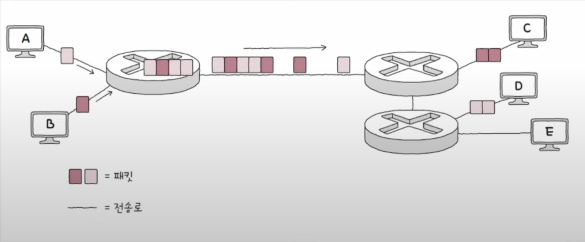

- 메시지를 주고받는 과정에서 메시지는 다양한 중간 노드를 거칠 수 있는데, 중간 노드를 패킷 스위치라고 한다.
- 패킷 스위치는 패킷이 수신지까지 올바르게 도달할 수 있도록 최적의 경로를 결정하거나 패킷의 송수신지를 식별한다.
- 대표적인 패킷 스위치 네트워크 장비로는 **라우터**와 **스위치**가 있다.

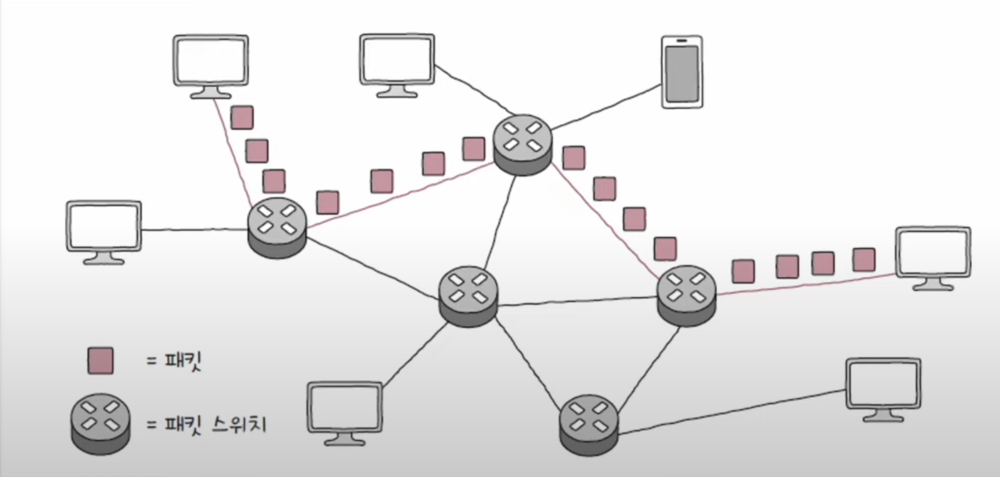

> 패킷은 전송하고자 하는 데이터인 페이로드와 부가 정보인 헤더 및 트레일러로 구성된다.

---

## 프로토콜

- 노드 간에 정보를 올바르게 주고받기 위해 합의된 규칙이나 방법을 의미한다.
- 즉, 서로 다른 통신 장치들이 정보를 주고받으려면 프로토콜이 통해야 한다.
- `IP`, `ARP`, `HTTP`, `HTTPS`, `TCP`, `UDP` 등의 프로토콜이 존재한다.
- **모든 프로토콜에는 각각의 목적과 특징이 있다.** 따라서 특정 프로토콜로 주고받는 패킷의 부가 정보도
달라질 수 있고, 프로토콜마다 패킷의 헤더 내용이 달라질 수 있다.

---

## 네트워크 참조 모델

- 네트워크를 통해 정보를 주고받을 때는 정형화된 여러 단계를 거친다. 이 과정은 계층으로 표현할 수 있다.
- 통신이 일어나는 각 과정을 계층으로 나눈 구조를 네트워크 참조 모델 또는 네트워크 계층 모델이라고 한다.

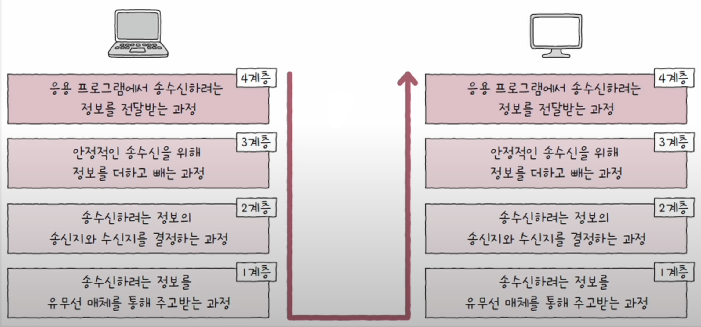

통신 과정을 계층으로 나누는 이유는 크게 두 가지가 있다.

1. **네트워크 구성과 설계가 용이하다.**
- 각 계층이 수행해야 할 역할이 정해져 있으므로 계층의 목적에 맞게 프로토콜과 네트워크 장비를
    계층적으로 구성할 수 있다.
2. **네트워크 문제 진단과 해결이 용이하다.**
- 통신 과정에서 문제가 발생하더라도 문제의 원인을 계층별로 진단하기 수월하다.

대표적인 네트워크 참조 모델에는 OSI 모델과 TCP/IP 모델이 있다.

### OSI 모델 (OSI 7계층)

- 국제 표준화 기구(ISO)에서 만든 네트워크 참조 모델로 통신 단계를 7개의 계층으로 나눈다.

#### 1. 물리 계층

- OSI 모델의 최하단에 있는 계층으로, 1과 0으로 표현되는 비트 신호를 주고받는 계층이다.
- 가장 근원적인 통신이 이루어지는 계층이며, 통신 매체에 맞는 신호로 운반되도록 비트 데이터의 변환이
이루어지고 통신 매체를 통한 송수신이 이루어지는 계층이다.

#### 2. 데이터 링크 계층

- 네트워크 내 주변 장치 간의 정보를 올바르게 주고받기 위한 계층이다.
- 물리 계층을 통해 주고받는 정보에 오류가 없는지 확인하고, MAC 주소라는 주소 체계를 통해 
네트워크 내 송수신지를 특정할 수 있다. 때로는 전송 과정에서 발생할 수 있는 충돌 문제를 해결하는 계층이기도 하다.

#### 3. 네트워크 계층

- 메시지를 다른 네트워크에 속한 수신지까지 전달하는 계층이다.
- 데이터 링크 계층에서 네트워크 내의 주변 장치 간의 통신이 이루어진다면, 네트워크 계층에서는
네트워크 간의 통신이 이루어진다.
- IP 주소라는 주소 체계를 통해 통신하고자 하는 수신지 호스트와 네트워크를 식별하고, 원하는 수신지에
도달하기 위한 최적의 경로를 설정한다.

#### 4. 전송 계층

- 신뢰성 있고 안정성 있는 전송을 해야 할 때 필요한 계층이다.
- 패킷의 흐름을 제어하거나 전송 오류를 점검해 신뢰성 있고 안정적인 전송이 이루어지도록 한다.
- 또한 포트라는 정보를 통해 실행 중인 응용 프로그램의 식별이 이루어지기도 한다.

#### 5. 세션 계층

- 세션(통신을 주고받는 호스트의 응용 프로그램 간 연결 상태)을 관리하는 계층이다.
- 연결 상태를 생성하거나 유지하고, 종료되었을 때 끊어 주는 역할을 담당한다.

#### 6. 표현 계층

- 사람이 이해할 수 있는 언어인 문자를 컴퓨터가 이해할 수 있는 코드로 변환하거나(인코딩),
    압축, 암호화와 같은 작업이 이루어지는 계층이다.

#### 7. 응용 계층

- 사용자 및 사용자가 이용하는 응용 프로그램과 가장 밀접하게 맞닿아 있는 계층이다.
- 사용자가 이용하는 응용 프로그램에 다양한 네트워크 서비스를 제공한다.
- 응용 프로그램에 다양한 서비스가 제공될 수 있는 만큼 다른 계층에 비해 응용 계층에 속한 프로토콜이 많다.

### TCP/IP 모델 (TCP/IP 4계층)

- OSI 모델은 네트워크를 이론적으로 기술하고 이해할 때 사용한다면, TCP/IP 모델은 이론보다는
    구현에 중점을 둔 네트워크 참조 모델이다.
- `TCP`와 `IP`라는 두 프로토콜이 현대 네트워크 구현의 핵심으로 간주되어 두 프로토콜 이름이 붙었다.

#### 1. 네트워크 액세스 계층

- OSI 모델의 데이터 링크 계층과 유사하다.

#### 2. 인터넷 계층

- OSI 모델의 네트워크 계층과 유사하다.

#### 3. 전송 계층

- OSI 모델의 전송 계층과 유사하다.

#### 4. 응용 계층

- OSI 모델의 세션 계층, 표현 계층, 응용 계층을 합친 것과 유사하다.

---

## 캡슐화와 역캡슐화

패킷은 송신 과정에서 **캡슐화**, 수신 과정에서 **역캡슐화**가 이루어진다.

### 캡슐화 (Encapsulation)

- 어떤 정보를 송신할 때 각 계층에서는 상위 계층으로부터 내려받은 패킷을 페이로드로 삼아,
프로토콜에 걸맞은 헤더(또는 트레일러)를 덧붙인 후 하위 계층으로 전달한다.
- 즉, 한 단계 아래 계층은 바로 위의 계층으로부터 받은 패킷에 헤더 및 트레일러를 추가해 나간다.
- 이렇게 송신 과정에서 헤더 및 트레일러를 추가해 나가는 과정을 **캡슐화**라고 한다.

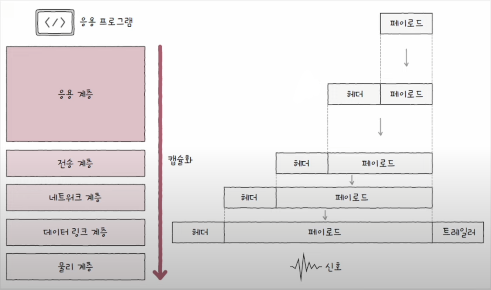

### 역캡슐화 (Decapsulation)

- 어떤 메시지를 수신할 때 캡슐화 과정에서 붙였던 헤더 및 트레일러를 각 계층에서 확인한 뒤 제거한다.
- 이러한 과정을 **역캡슐화**라고 한다.

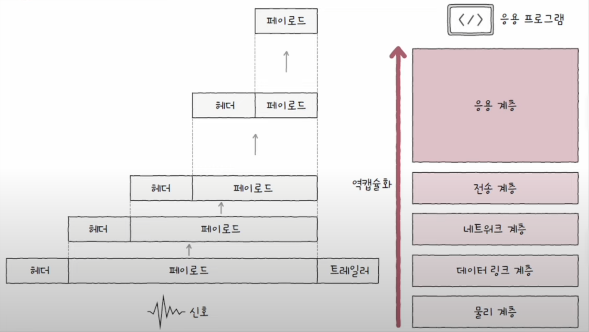

### PDU

각 계층에서 송수신되는 메시지의 단위를 PDU(Protocol Data Unit)라고 한다.

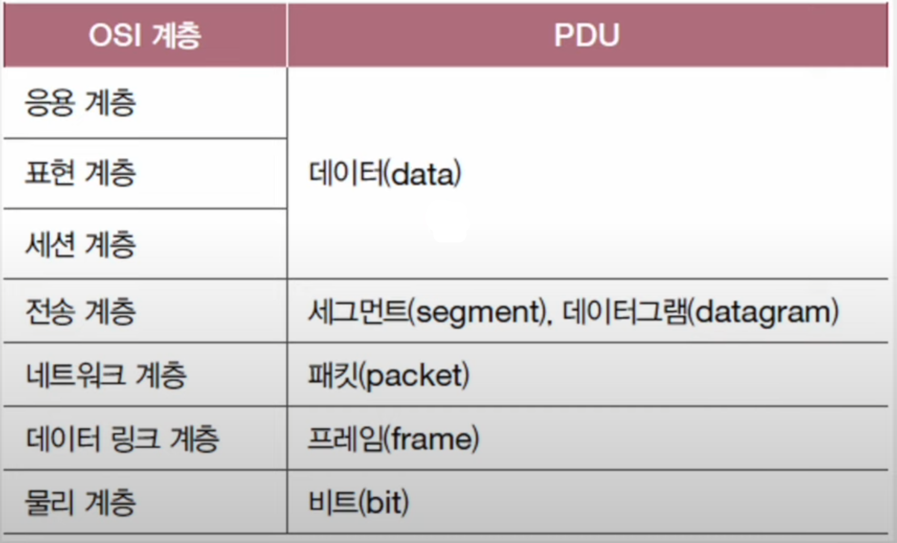

전송 계층의 PDU는 TCP 프로토콜이 사용되었을 경우 세그먼트, UDP 프로토콜이 사용되었을 경우
데이터그램이 된다.

---

## 네트워크 성능 지표

- 네트워크에는 트래픽이라는 용어가 있다. **트래픽**은 네트워크 내의 정보량을 의미한다.
- 특정 노드에 트래픽이 몰리면 해당 노드가 특정 시간 동안 처리해야 할 정보가 많아 해당 노드에 **과부하**가 생길 수 있다.
- 트래픽이 몰려 특정 노드에 과부하가 생기면 성능 저하로 이어질 수 있다.

네트워크 성능을 평가할 수 있는 대표적인 세 가지 지표가 있다.

### 1. 처리율 (Throughput)

- 처리율이란 단위 시간당 네트워크를 통해 실제로 전송되는 정보량을 의미한다.
- `bps`, `Mbps`, `Gbps`, `pps(packets per second)` 등의 단위가 있다.

### 2. 대역폭 (Bandwidth)

- 단위 시간 동안 통신 매체를 통해 송수신할 수 있는 최대 정보량을 의미한다.
- `bps`, `Mbps`, `Gbps` 등의 단위를 사용하며, 통신 매체가 높은 대역폭을 가지고 있다면
많은 정보를 송수신할 수 있음을 의미한다.

### 3. 패킷 손실 (Packet loss)

- 송수신되는 패킷이 손실된 상황을 의미한다.
- 높은 트래픽으로 인해 노드가 순간적으로 처리해야 할 패킷이 너무 많아지거나 네트워크상에
예기치 못한 장애가 발생해서 패킷을 처리하지 못하면 패킷 손실이 발생할 수 있다.
- 패킷 손실은 전체 패킷 중 유실된 패킷을 백분위로 표현한 값을 사용하는 경우가 많다.

> `ping` 명령어로 패킷 손실을 확인한 결과
> 
> 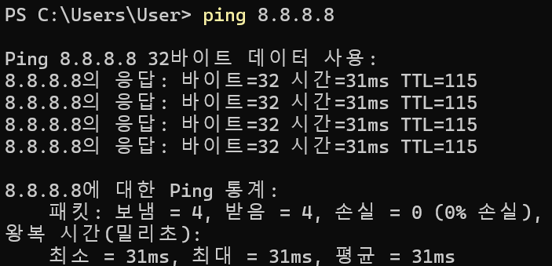

---

[메인 ⏫](https://github.com/genesis12345678/TIL/blob/main/cs/network/Main.md)

[다음 ↪️ - 네트워크(물리 & 데이터링크 계층) - 이더넷]()