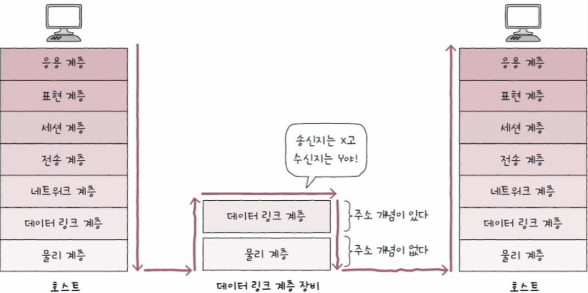
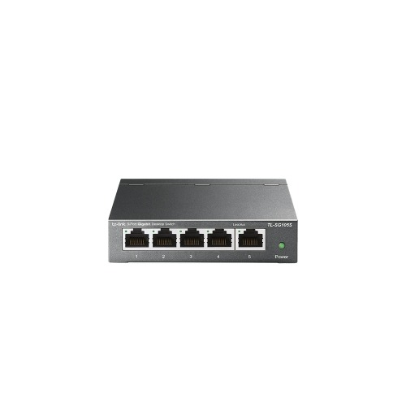
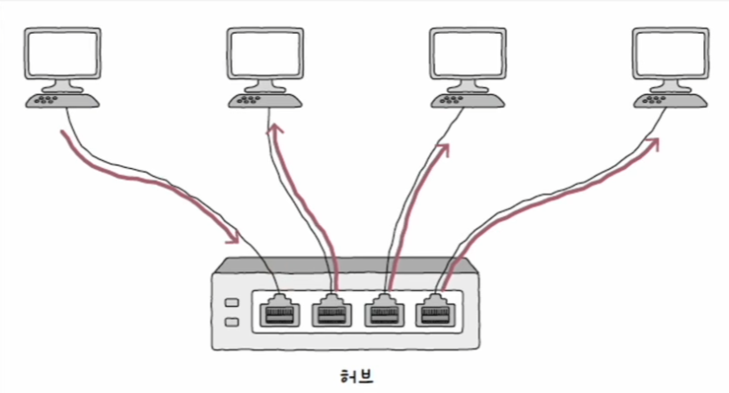
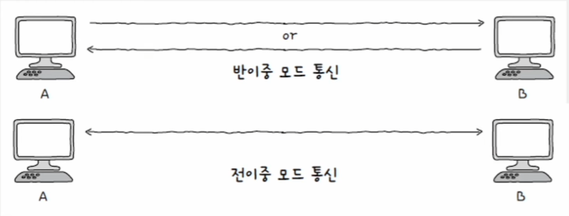
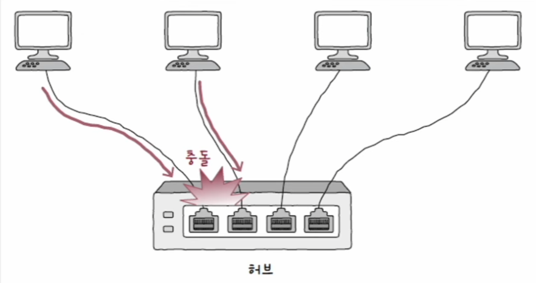
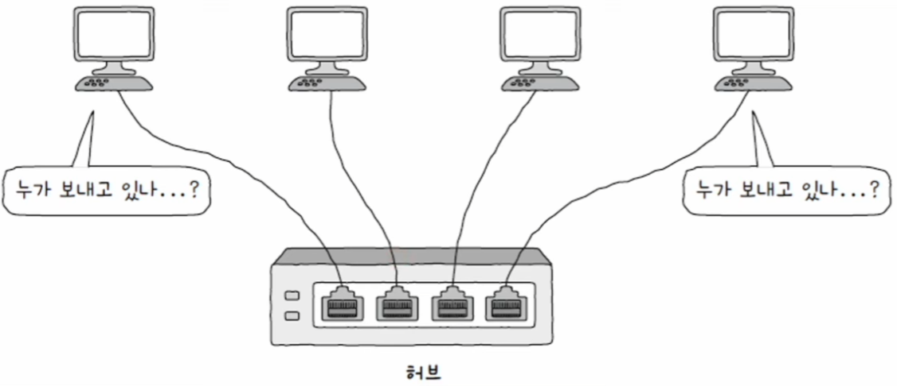
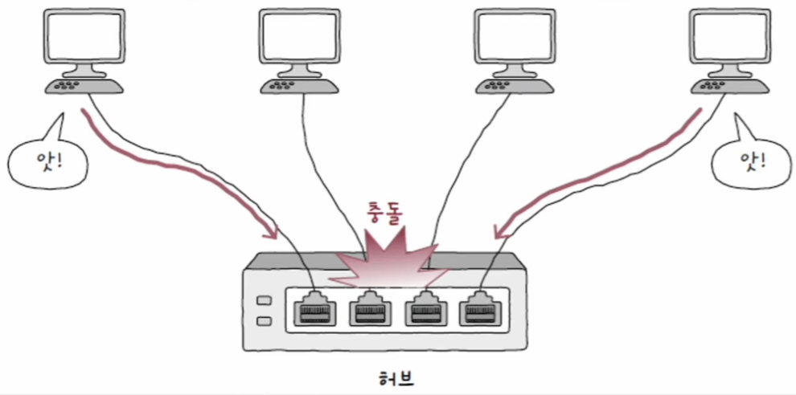
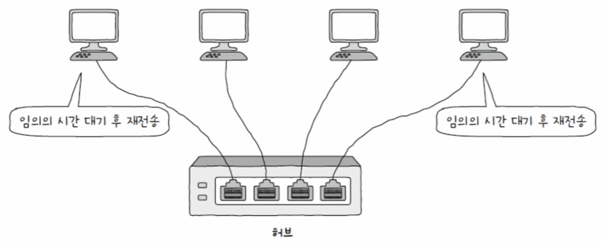

# 네트워크 - 물리 & 데이터 링크 계층

## 물리 계층의 대표적인 장비 - 허브

> **<주소 개념이 없는 물리 계층>**
> 
> - 송수신지를 특정할 수 있는 주소는 데이터 링크 계층부터 존재한다. 즉, 물리 계층에는 주소 개념이 없다.
> - 물리 계층에서는 호스트와 통신 매체 간의 연결과 통신 매체상의 송수신이 이루어질 뿐이다. 그렇기에 물리 계층의
> 네트워크 장비는 송수신되는 정보에 대한 어떤 조작이나 판단을 하지 않는다.
> - 반면 데이터 링크 계층에는 MAC 주소라는 주소 개념이 있다.
> - 따라서 데이터 링크 계층의 장비나 그 이상 계층의 장비들은 송수신지를 특정할 수 있고, 주소를 바탕으로
> 송수신되는 정보에 대한 조작과 판단을 할 수 있다.
> 
> 

- 물리 계층의 허브(hub)는 여러 대의 호스트를 연결하는 장치이다.
- 허브는 커넥터를 연결할 수 있는 연결 지점인 **포트**가 있다. 포트에 호스트와 연결된 통신 매체를 연결할 수 있다.

---

## 허브의 특징

### 1. 전달받은 신호를 다른 모든 포트로 그대로 다시 내보낸다.

- 허브는 물리 계층에 속한 장비이고, **물리 계층에서는 주소 개념이 없어 허브는 수신지를 특정할 수 없다.**
- 따라서 신호를 전달받으면 어떠한 조작이나 판단도 하지 않고 송신지를 제외한 모든 포트에 그저 내보내기만 한다.
- 허브를 통해 이 신호를 전달받은 모든 호스트는 데이터 링크 계층에서 패킷의 MAC 주소를 확인하고 자신과 관련 없는
    주소는 폐기한다.

### 2. 반이중 모드로 통신한다.

- 반이중(half duplex) 모드는 한 번에 한 방향으로만 전송할 수 있는 통신 방식을 의미한다.
- 반대로 전이중(full duplex) 모드는 송수신을 동시에 양방향으로 할 수 있는 통신 방식을 의미한다.

> **<콜리전 도메인>**
> 
> 허브는 반이중 통신을 지원하기 때문에 동시에 허브를 송신하면 **충돌(collision)** 이 발생할 수 있다.
> 
> 
> 
> 허브에 호스트가 많이 연결되어 있을수록 충돌 발생 가능성은 높아진다. 이렇게 충돌이 발생할 수 있는 영역을
> **콜리전 도메인**이라고 한다. 허브에 연결된 모든 호스트는 같은 콜리전 도메인에 속한다.
> 
> 
> 
> 콜리전 도메인은 작을수록 충돌 발생 가능성이 줄어들기 때문에 좋다. 허브의 넓은 콜리전 도메인으로 인한
> 충돌 문제를 해결하려면 CSMA/CD 프로토콜을 사용하거나 스위치 장비를 사용해야 한다.

---

## CSMA/CD (Carrier Sense Multiple Access with Collision Detection)

허브에서 충돌이 발생하는 근본적인 이유는 허브가 반이중 모드로 통신하기 때문이다.

이러한 충돌 문제를 해결하기 위한 대표적인 프로토콜이 **CSMA/CD**이다.

### Carrier Sense - 캐리어 감지

통신 매체의 현재 사용 가능 여부를 검사한다. 즉, 메시지를 보내기 전에 현재 네트워크 상에서 전송 중인 것이
있는지를 확인한다.

### Multiple Access - 다중 접근

캐리어 감지를 하는 데도 두 개 이상의 호스트가 동시에 네트워크를 사용하려 할 때가 있다.
복수의 호스트가 네트워크에 접근하려는 상황을 다중 접근이라고 하며, 이때 충돌이 발생한다.

### Collision Detection - 충돌 검출

- 충돌이 발생하면 이를 검출한다.
- 충돌을 감지하면 전송이 중단되고, 충돌을 검출한 호스트는 다른 이들에게 충돌이 발생했음을 알리는 잼 신호(jam signal)를 보낸다.
- 그리고 임의의 시간 동안 기다린 뒤에 다시 전송한다.

---

[이전 ↩️ - 물리 & 데이터 링크 계층 - NIC와 케이블]()

[메인 ⏫](https://github.com/genesis12345678/TIL/blob/main/cs/network/Main.md)

[다음 ↪️ - 물리 & 데이터 링크 계층 - 스위치]()