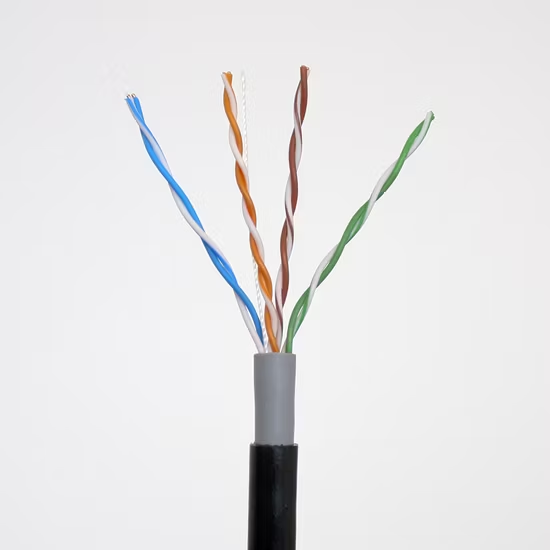
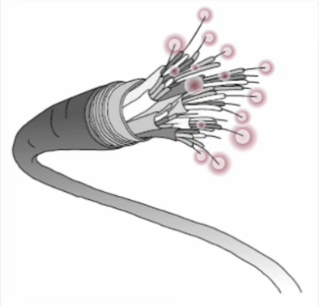
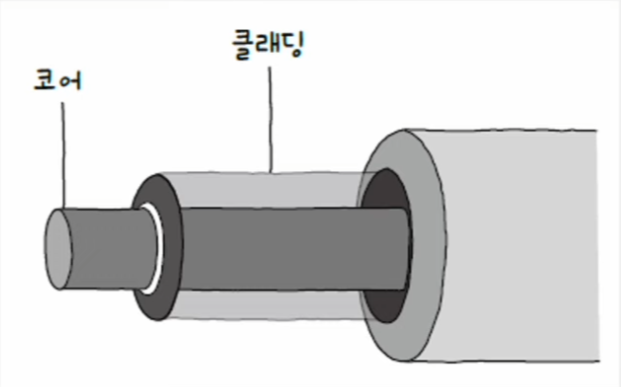
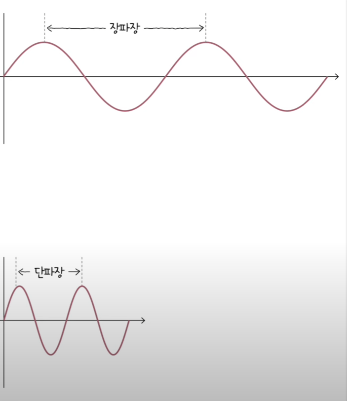
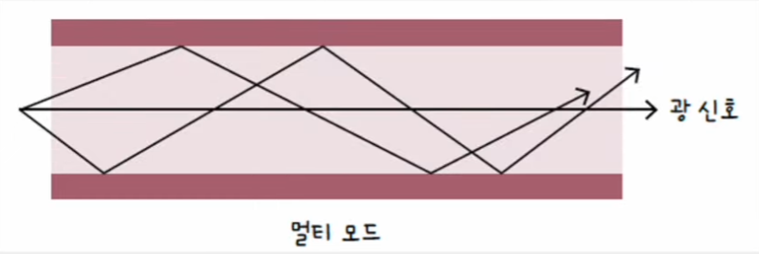

# 네트워크 - 물리 & 데이터 링크 계층

## NIC (Network Interface Controller)

- 통신 매체에는 전기, 빛, 등 다양한 신호가 흐를 수 있다. 
- 호스트가 이를 제대로 이해하려면 통신 매체를 통해 전달되는 신호와 컴퓨터가 이해할 수 있는 정보 간에 변환이 이루어져야 한다.
- 이때 호스트와 유무선 통신 매체를 연결하고 이러한 변환을 담당하는 네트워크 장비가 **NIC**이다.
- NIC는 호스트를 네트워크(LAN)에 연결하기 위한 하드웨어인 것이다.

### NIC의 역할

- NIC는 통신 매체에 흐르는 신호를 호스트가 이해하는 프레임으로 변환하거나, 반대로 호스트가 이해하는 프레임을
통신 매체에 흐르는 신호로 변환한다.
- 호스트가 네트워크를 통해 송수신하는 정보는 NIC를 거치며, NIC는 네트워크와의 연결점을 담당한다는 점에서
**네트워크 인터페이스** 역할을 수행한다고도 한다.
- NIC는 MAC 주소를 통해 자기 주소와 수신지 주소를 인식한다. 그래서 자신과는 관련 없는 수신지 MAC 주소가 명시된 프레임이라면
폐기할 수 있고, FCS 필드를 토대로 오류를 검출해 잘못된 프레임을 폐기할 수도 있다.

---

## 트위스티드 페어 케이블 (Twisted Pair Cable)

- 구리 선으로 전기 신호를 주고받는 통신 매체

**케이블 본체**와 **커넥터**로 이루어져 있다. 트위스티드 페어 케이블에서 주로 활용하는 커넥터를 `RJ-45`라고 부른다.

케이블 본체 내부는 구리 선이 두 가닥씩 꼬아져 있다.

- 본체가 구리 선으로 이루어진 상태에서 전기 신호를 주고받다 보면 전기 신호를 왜곡시킬 수 있는
**노이즈**에 민감하다.
- 그래서 구리선을 구리 선 주변을 감싸 노이즈를 감소시키는 방식(**차폐**)을 사용하며, 이것에 사용된 그물
모양의 철사와 포일을 각각 **브레이드 실드** 또는 **포일 실드**라고 한다.

### 실드에 따른 트위스티드 페어 케이블 분류

기본적으로 트위스티드 페어 케이블은 실드에 따라 분류할 수 있다.

- `STP`(Shielded Twisted Pair) - 브레이드 실드로 감싼 케이블
- `FTP`(Foil Twisted Pair) - 포일 실드로 감싼 케이블
- `UTP`(Unshielded Twisted Pair) - 아무것도 감싸지 않은 케이블

실제로는 다음과 같이 더 세분화하여 나눌 수 있다.

- `XX`에는 케이블 외부를 감싸는 실드의 종류가 명시된다.(하나 혹은 두 개)
- `Y`에는 꼬인 구리 선 쌍을 감싸는 실드의 종류가 명시된다.
- `X`와 `Y`에는 `U, S, F`를 명시할 수 있다.
  - `U` : 실드 없음
  - `S` : 브레이드 실드
  - `F` : 포일 실드

예를 들면 다음과 같다.

- `S/FTP` 케이블
  - 케이블 위부는 브레이드 실드, 꼬인 각 구리 선 쌍은 포일 실드로 감싼 케이블
- `F/FTP` 케이블
  - 케이블 외부와 각 구리 선 쌍을 모두 포일 실드로 감싼 케이블
- `SF/FTP` 케이블
  - 케이블 외부는 브레이드 실드와 포일 실드, 각 구리 선 쌍은 포일 실드로 감싼 케이블
- `U/UTP` 케이블
  - 아무것도 감싸지 않은 케이블

### 카테고리 분류에 따른 트위스티드 페어 케이블 분류

트위스티드 페어 케이블은 카테고리에 따라서도 분류할 수 있다. 카테고리는 케이블 성능의 등급을 구분하는 역할을 한다.
높은 카테고리에 속한 케이블일수록 지원 가능한 대역폭이 높아지고, 송수신할 수 있는 데이터의 양이 많아지며, 
더 빠른 전송이 가능하다.

---

 

## 광섬유 케이블

- 빛(광신호)을 이용해 정보를 주고받는 케이블
- 빛을 이용하기 때문에 전기 신호를 이용하는 케이블에 비해 속도도 빠르고, 먼 거리까지 전송이 가능하다.
- 또한 노이즈로부터 간섭받는 영향도 적어 대륙 간 네트워크 연결에도 사용된다.

광섬유 케이블은 케이블 본체와 커넥터로 이루어져 있다. 
대표적인 커넥터 종류로는 LC 커넥터, SC 커넥터, FC 커넥터, ST 커넥터가 있다.

광섬유 케이블 본체 내부는 광섬유로 이루어져 있다. 광섬유는 빛을 운반하는 매체이다.

광섬유 한 가닥을 확대해보면 광섬유 중심에는 코어가 있고, 코어를 둘러싸는 클래딩이 있다. 
**코어(core)** 는 광섬유에서 실질적으로 빛이 흐르는 부분이고, **클래딩(cladding)** 은 빛이 코어 안에서만
흐르도록 빛을 가두는 역할을 한다.

광섬유 케이블은 코어의 지름에 따라 싱글 모두 광섬유 케이블과 멀티 모드 광섬유 케이블로 나뉜다.

### 싱글 모드 광섬유 케이블 (SMF, Single Mode Fiber)

- 코어의 지름이 8~10um 정도로, 멀티 모드 광섬유 케이블에 비해 작다.
- 코어의 지름이 작다면 빛이 이동할 수 있는 경로가 많지 않을 것이다. 즉, 코어의 지름이 작다는 것은
빛의 이동 경로가 하나 이상을 갖기 어렵고, 이를 "모드(mode)가 하나(single)"라고 표현한다.

- 싱글 모드 케이블은 신호 손실이 적어 장거리 전송에 적합하며, 비용이 높다.
- 또한 파장이 긴 **장파장**의 빛을 사용한다.

### 멀티 모드 광섬유 케이블(MMF, Multi Mode Fiber)

- 코어의 지름이 50~62.5um 정도로 싱글 모드보다 크다.
- 빛이 여러 경로로 이동할 수 있으며, 이를 "모드(mode)가 여러 개(multi)"라고 표현한다.

- 멀티 모드는 싱글 모드보다 전송 시 신호 손실이 클 수 있어 장거리 전송에는 부적합하다. 비교적 근거리를 연결하는 데 주로 사용된다.
- 또한 파장이 짧은 단파장의 빛을 사용한다.

---

[이전 ↩️ - 물리 & 데이터 링크 계층 - 이더넷]()

[메인 ⏫](https://github.com/genesis12345678/TIL/blob/main/cs/network/Main.md)

[다음 ↪️ - 물리 & 데이터 링크 계층 - 허브]()