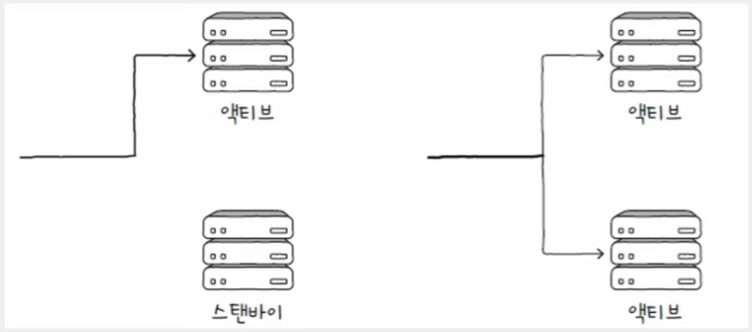
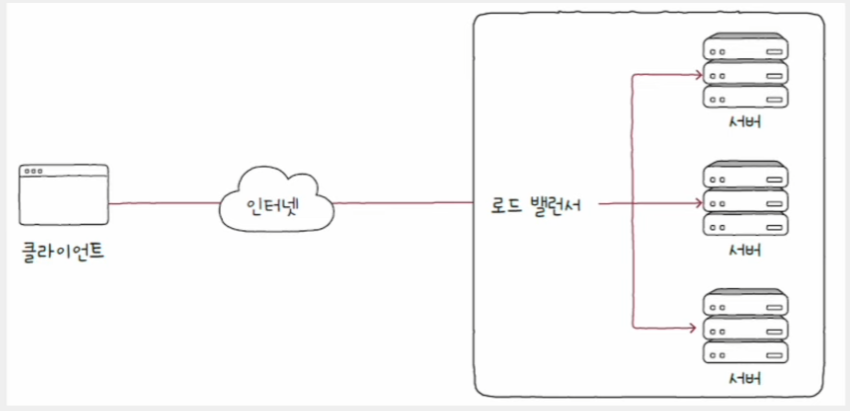

# 네트워크 - 안정성을 위한 기술

## 가용성

- 컴퓨터 시스템이 특정 기능을 실제로 수행할 수 있는 시간의 비율을 의미한다.
- 즉, 전체 사용 시간 중에서 정상적인 사용 시간을 의미한다.
  - 정상적인 사용 시간을 업타임(uptime), 정상적인 사용이 불가능한 시간을 다운타임(downtime)으로 정의하며, 수식은 다음과 같다.
  - `가용성 = 업타임 / (업타임 + 다운타임)`
- 위 수식의 결괏값이 크다는 것을 "가용성이 높다"라고 표현하며, 가용성이 높은 성질을 **고가용성(HA**, High Availability)이라고 한다.

가용성을 높이려면 다운타임을 낮추면 된다. 하지만 다운타임의 발생 원인을 모두 찾아 원천적으로 차단하기는 현실적으로 어렵다.
핵심은 문제가 발생하지 않도록 하는 것이 아니라, **문제가 발생해도 계속 기능할 수 있도록 설계하는 것**이다. 문제가 발생하더라도 기능할 수 있는
능력을 **결함 감내**라고 한다. 

---

## 이중화

- 말 그대로 "무언가를 이중으로 두는 기술"로, 예비(백업)를 마련하는 방법이다. 결함을 감내하여 가용성을 높이기 위한 가장 기본적이고 대표적인 방법이다.
- 이중화할 수 있는 대상들은 대부분 "문제가 발생할 경우 시스템 전체가 중단될 수 있는 대상"이다.
  - **단일 장애점** : SPOF (Single Point Of Failure)
- 가용성을 높이기 위해서는 SPOF를 이중화하는 것이 좋다.

1. **이중화 구성 방식 - 액티브/스탠바이**
   - 한 시스템은 가동하고, 다른 시스템은 백업 용도로 대기 상태로 두는 구성 방식
   - 액티브 상태인 시스템에 문제가 발생할 경우 스탠바이 시스템이 자동으로 액티브 시스템을 대신하여 동작한다.
   - 안정한 구성 방식이지만, 하나의 장비를 사용할 때에 비해 성능상의 큰 변화를 기대하긴 어렵다. 두 장비가 동시에 가동되지 않고 한 번에 
        하나만 가동되기 때문이다.
2. **이중화 구성 방식 - 액티브/액티브**
   - 두 시스템 모두를 가동 상태로 두는 구성 방식
   - 부하를 분산시킬 수 있고, 두 시스템이 함께 가동되므로 성능상이 이점이 있다.
   - 하지만 한 시스템에 문제가 발생하면 다른 시스템에 부하가 급증할 수 있으며, 이로 인해 추가적인 문제가 발생할 수 있다.

> 이중화의 확장 개념으로, "무언가를 이중 이상으로 여러 개 두는 기술"을 **다중화**라고 한다.

---

## 로드 밸런싱

- 고가용성을 요구하는 호스트는 클라이언트보다는 일반적으로 서버이다.
- 서버를 다중화했더라도 트래픽을 분배해야 한다. 트래픽은 서버의 가용성에 큰 영향을 끼치는 요소이다.
- 트래픽의 고른 분배를 위해 사용되는 기술이 **로드 밸런싱(load balancing)** 이다. 로드 밸런싱은 **로드 밸런서(load balancer)** 에 의해 수행된다.
- 로드 밸런서는 전용 네트워크 장비인 **"L4 스위치", "L7 스위치"** 로 수행된다.
  - L4 스위치는 IP 주소와 포트 번호와 같은 전송 계층까지의 정보를 바탕으로 로드 밸런싱을 수행
  - L7 스위치는 URI, HTTP 메시지 일부, 쿠키 등 응용 계층의 정보까지 활용하여 로드 밸런싱을 수행
- 로드 밸런싱 소프트웨어를 설치하면 일반 호스트도 로드 밸런서로 사용 가능하다.
  - 대표적인 소프트웨어로 HAProxy, Envoy가 있으며, 대표적인 웹 서버 소프트웨어인 Nginx에도 로드 밸런싱 기능이 내포되어 있다.

로드 밸런서는 일반적으로 이중화나 다중화된 서버와 클라이언트 사이에 위치한다. 클라이언트들은 로드 밸런서에 요청을 보내고, 로드 밸런서는
해당 요청을 각 서버에 균등하게 분배한다.

> **헬스 체크(health check)**
> 
> - 서버들의 건강 상태를 주기적으로 모니터링하고 체크하는 것을 의미한다.
> - 주로 로드 밸런서에 의해 이루어지며, HTTP, ICMP 등 다양한 프로토콜을 활용할 수 있다.
> 
> 
> 
> - 로드 밸런서가 주도하는 헬스 체크 이외에도 서버 간에 하트비트(heartbeat)라는 메시지를 주기적으로 주고받는 방법도 있다.
> - 서버끼리 주기적으로 하트비트 메시지를 주고받다가, 신호가 끊겼을 때 문제 발생을 감지하는 방법이다.

### 로드 밸런싱 알고리즘

부하가 균등하게 분산되도록 부하 대상을 선택하는 방법

- **라운드 로빈 알고리즘**
  - 단순히 서버를 돌아가며 부하를 전달
- **최소 연결 알고리즘**
  - 연결이 적은 서버부터 우선적으로 부하를 전달
- 외에도 단순히 무작위로 고르는 알고리즘, 해시 자료 구조를 이용하는 알고리즘, 응답 시간이 가장 짧은 서버를 선택하는 알고리즘이 있다.

> **가중치가 부여된 알고리즘**
> 
> - 서버마다 가중치를 부여해 가중치가 높은 서버가 더 많이 선택되어 더 많은 부하를 받도록 하는 것이다.
> - 가중치가 부여된 알고리즘을 **가중치 라운드 로빈 알고리즘**, **가중치 최소 연결 알고리즘**이라고 한다.
> - 서버 간 성능이 다른 경우 주로 가중치가 적용된 알고리즘이 사용된다.

---

## 포워드 프록시와 리버스 프록시

- 클라이언트와 서버 사이에는 수많은 서버들이 존재할 수 있다.
- 클라이언트가 최정적으로 메시지를 주고받는 대상, 자원을 생성하고 클라이언트에게 권한 있는 응답을 보낼 수 있는 HTTP 서버를 **오리진 서버**라고 한다.
  (기존에 서버라고 지칭한 대상)

> - 인바운드(inbound) 메시지 : 오리진 서버를 향하는 메시지
> - 아웃바운드(outbound) 메시지 : 클라이언트를 향하는 메시지

대표적인 HTTP 중간 서버의 유형으로 프록시와 게이트웨이가 있다. **프록시는 포워드 프록시**, **게이트웨이는 리버스 프록시**라고도 한다.

### 프록시 (포워드 프록시)

- 인터넷 표준 문서 기준, **프록시**는 **클라이언트가 선택한** 메시지 전달 대리자를 의미한다.
- 어떤 프록시를 언제 어떻게 사용할지는 클라이언트가 선택한다. 따라서 일반적으로 프록시는 오리진 서버보다 클라이언트와 더 가까이 위치해 있다.
- 프록시는 주로 캐시 저장, 클라이언트 암호화 및 접근 제한 등의 기능을 제공한다.

### 게이트웨이 (리버스 프록시)

- 게이트웨이의 일반적인 의미는 네트워크 간의 통신을 가능하게 하는 입구 역할을 하는 하드웨어 혹은 소프트웨어를 의미한다.
- 인터넷 표준 문서 기준, 게이트웨이는 **아웃바운드 연결에 대해 오리진 서버 역할**을 하지만, 수신된 요청을 변환하여 다른 인바운드 서버(들)로 
전달하는 중개자 역할을 의미한다.
- 게이트웨이는 네트워크 외부에서 보면 오리진 서버와 같이 보인다. 하지만 게이트웨이에 요청을 보내면 오리진 서버에게 요청을 전달하게 된다.
- 일반적으로 게이트웨이는 오리진 서버(들)에 더 가까이 위치한다.
- 게이트웨이도 캐시를 저장할 수 있고, 로드 밸런서로 동작할 수 있다.

---

[메인 ⏫](https://github.com/genesis12345678/TIL/blob/main/cs/network/Main.md)