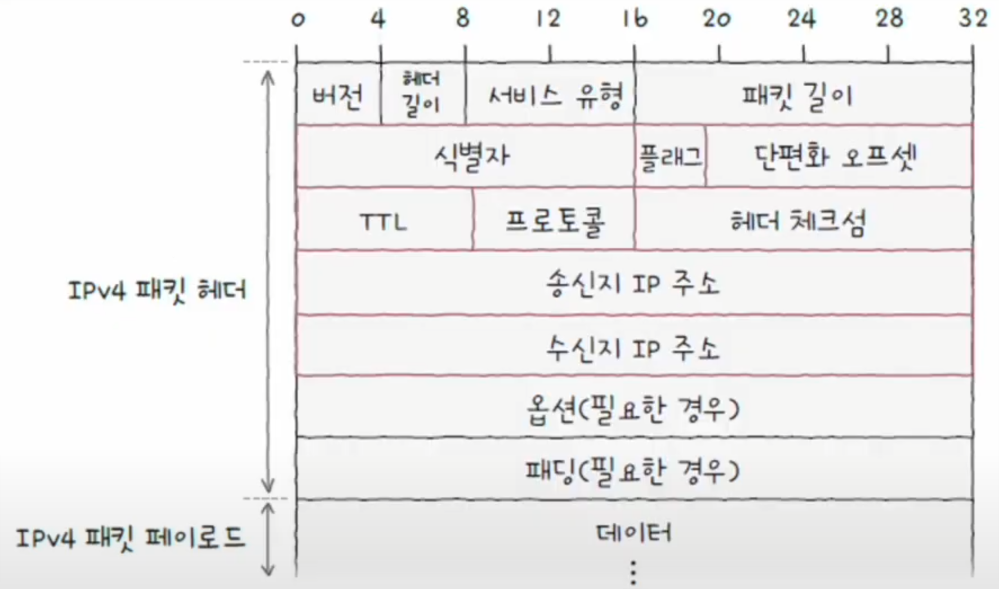
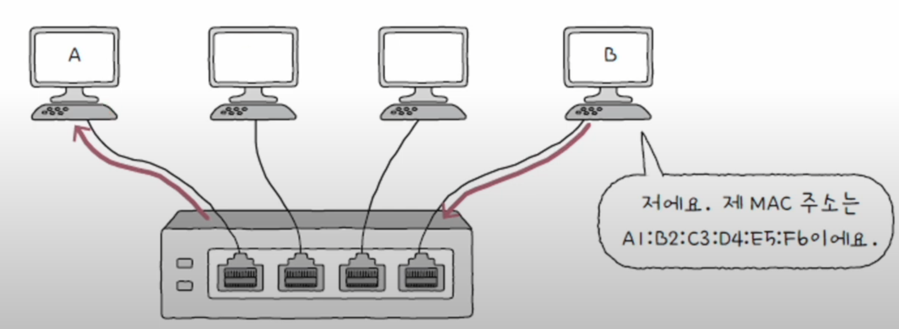
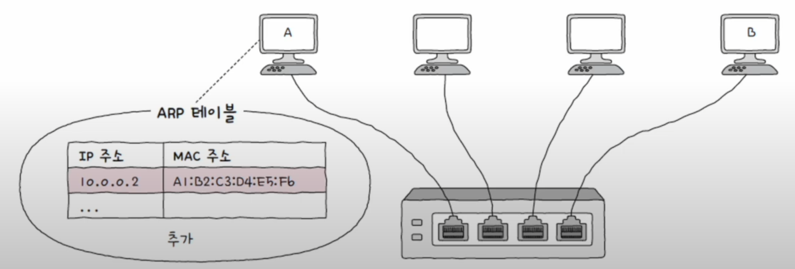
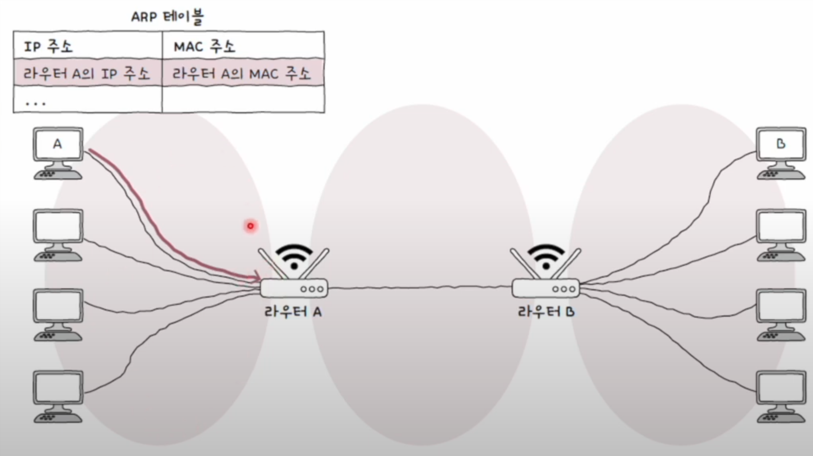
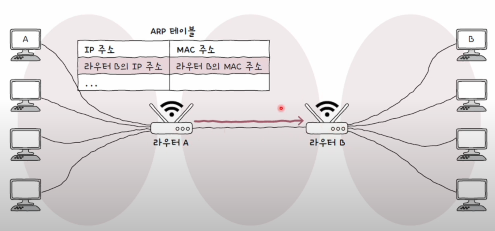
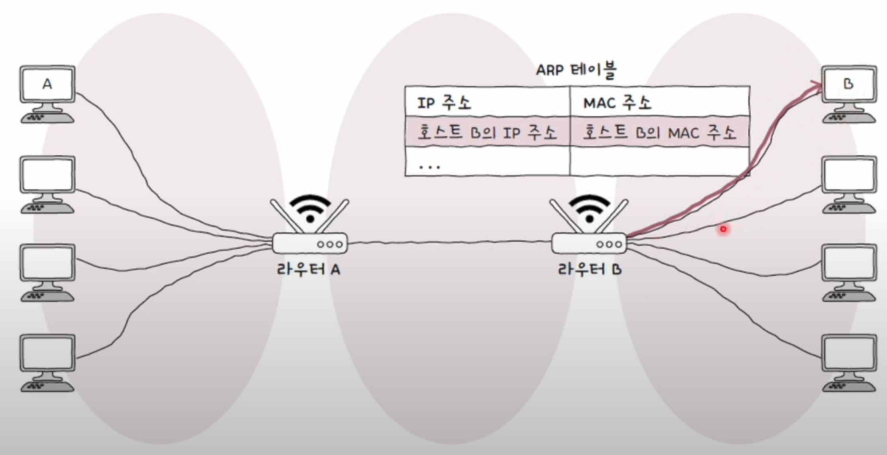

# 네트워크 - 네트워크 계층

## 물리 & 데이터 링크 계층의 한계

> 데이터 링크 계층에는 송수신지를 특정할 수 있는 정보인 MAC 주소라는 개념이 있지만, LAN을 넘어서 통신하기는 어렵다.
> 그 이유에 대해 알아보자.

### 1. 물리 계층과 데이터 링크 계층만으로는 다른 네트워크까지의 도달 경로를 파악하기 어렵다.

- 물리 계층과 데이터 링크 계층은 기본적으로 LAN을 다루는 계층이다. 하지만 우리는 대부분 LAN에 속한
호스트끼리만 통신하지 않는다.
- 패킷은 서로에게 도달하기까지 수많은 네트워크 장비를 거치며 다양한 경로를 통해 이동한다.
- 통신을 빠르게 주고받으려면 이 중에 최적의 경로로 패킷이 이동해야 한다. 패킷이 이동할 최적의 경로를 결정하는 것을
**라우팅(routing)** 이라고 한다.
- 물리 계층과 데이터 링크 계층의 장비로는 라우팅을 수행할 수 없지만, 네트워크 계층의 장비로는 가능하다. 
라우팅을 수행하는 대표적인 장비로는 **라우터(router)** 가 있다.

### 2. MAC 주소만으로는 모든 네트워크에 속한 호스트의 위치를 특정하기 어렵다.

- 현실적으로 모든 호스트가 모든 네트워크에 속한 모든 호스트의 MAC 주소를 알고 있기란 어렵다.
- 택배의 수신인 역할을 하는 정보가 MAC 주소라면, 수신지 역할을 하는 정보는 네트워크 계층의 **IP 주소**이다.
- MAC 주소와 IP 주소는 함께 사용되고, 기본적으로 IP 주소를 우선으로 활용한다.
- MAC 주소를 물리 주소라고도 부르듯이 **IP 주소는 논리 주소**라고도 부른다. MAC 주소는 일반적으로 NIC마다
할당되는 고정된 주소이지만, IP 주소는 호스트에 직접 할당이 가능하다. **DHCP** 라는 프로토콜을 통해 자동으로 할당받거나
사용자가 직접 할당할 수도 있고, 한 호스트가 복수의 IP 주소를 가질 수도 있다.

---

## 인터넷 프로토콜 (IP : Internet Protocol)

네트워크 계층의 가장 핵심적인 프로토콜이다.

> - (IPv4 기준) IP 주소는 4바이트(32비트)로 주소를 표현할 수 있고, 숫자당 8비트로 표현되어 `0~255` 범위 안에 있는
> 4개의 10진수로 표기된다.
> - 각 10진수는 점(`.`)으로 구분되며, 점으로 구분된 8비트를 **옥텟(octet)** 이라고 한다.

IP의 대표적인 기능은 크게 두 가지가 있는데, **IP 주소 지정과 IP 단편화**이다.

- **IP 주소 지정**은 IP 주소를 바탕으로 송수신 대상을 지정하는 것을 의미한다.
- **IP 단편화**는 전송하고자 하는 패킷의 크기가 MTU라는 최대 전송 단위보다 클 경우, 이를 MTU 크기 이하의
복수의 패킷으로 나누는 것을 의미한다.

> **MTU (Maximum Transmission Unit)**
> 
> 한 번에 전송 가능한 IP 패킷의 최대 크기를 의미한다. IP 패킷의 헤더도 MTU 크기에 포함된다.
> 일반적으로 MTU 크기는 1500바이트이며, MTU 크기 이하로 나누어진 패킷은 수신지에 도착하면 다시 재조합된다.

### IPv4

IPv4 패킷은 프레임의 페이로드로 데이터 필드에 명시된다.

여기서 중요한 필드는 **식별자, 플래그, 단편화 오프셋, TTL, 프로토콜, 송신지 & 수신지 IP 주소**이다.
이중 식별자, 플래그, 단편화 오프셋 필드는 IP 단편화 기능에 관여하고, 송신지 & 수신지 IP 주소는 IP 주소 지정 기능에 관여한다.

#### 1. 식별자

- 패킷에 할당된 번호
- 메시지 전송 과정에서 IPv4 패킷이 여러 조각으로 쪼개져서 전송되었다면, 수신지에서는 이들을 재조합해야 한다.
- 이때 잘게 쪼개져서 수신지에 도착한 IPv4 패킷들이 어떤 메시지에서부터 쪼개졌는지를 알기 위해 식별자를 사용한다.

#### 2. 플래그

- 총 세 개의 비트로 구성된 필드
- 이 중 첫번째 비트는 항상 0으로 예약된 비트로 현재 사용되지 않는다.
- **DF 비트** (Don't Fragment) : IP 단편화를 수행하지 말라는 표시
  - 1이라면 : IP 단편화 수행하지 않는다.
  - 0이라면 : IP 단편화 가능
- **MF 비트** (More Fragment) : 단편화된 패킷이 더 있는지를 나타낸다.
  - 1이라면 : 쪼개진 패킷이 아직 더 있다를 의미
  - 0이라면 : 이 패킷이 마지막 패킷임을 의미

#### 3. 단편화 오프셋

- 패킷이 단편화되기 전에 패킷의 초기 데이터에서 몇 번째로 떨어진 패킷인지를 나타낸다.
- 단편화되어 전송되는 패킷들은 수신지에 순서대로 도착하지 않을 수 있기 때문에 수신지가 패킷들을 순서대로 재조합하려면
단편화된 패킷이 초기 데이터에서 몇 번째 데이터에 해당하는 패킷인지 알아야 한다. 이를 판단하기 위해 단편화 오프셋이 활용된다.

#### 4. TTL (Time To Live)

- 패킷의 수명을 의미한다.
- 호스트끼리 통신할 때 패킷은 여러 라우터를 거쳐 이동할 수 있다. 패킷이 하나의 라우터를 거칠 때마다 TTL이 1씩 감소
하며, TTL 값이 0으로 떨어진 패킷은 폐기된다.
- 패킷이 호스트 또는 라우터에 한 번 전달되는 것을 **홉(hop)** 이라고 한다. 즉, TTL 필드의 값은 홉마다 1씩 감소한다.
- TTL 필드는 무의미한 패킷이 네트워크상에서 지속적으로 남아있는 것을 방지하기 위해 존재한다.

#### 5. 프로토콜

- IP 패킷의 프로토콜은 상위 계층의 프로토콜이 무엇인지를 나타내는 필드다.
- 예를 들어 TCP는 6번, UDP는 17번이다.

#### 6. 송신지 & 수신지 IP 주소

- 이름 그대로 송수신지의 IPv4 주소를 알 수 있다.

### IPv6

- 이론적으로 할당 가능한 IPv4의 주소는 `2^32`으로 약 43억 개이다. 이는 쉽게 고갈될 수 있기 때문에 **IPv6**가 등장했다.
- IPv6 주소는 16바이트(128비트)로 주소를 표현할 수 있다. 이론적으로 할당 가능한 IPv6 주소는 `2^128`개이다.(사실상 무한)

IPv6 패킷의 헤더는 IPv4에 비해 간소화되어 있다.

#### 1. 다음 헤더

- 상위 계층의 프로토콜을 가리키거나 확장 헤더를 가리키는 필드
- IPv6는 기본 헤더와 더불어 확장 헤더라는 추가 헤더를 가질 수 있다.
- 확장 헤더는 기본 헤더와 페이로드 데이터 사이에 위치하며, 또 다른 확장 헤더를 가질 수도 있다.
- 확장 헤더의 종류는 다양해 상황에 맞는 다양한 정보를 운반할 수 있다.

> **<IPv6의 단편화>**
> 
> IPv6는 IPv4와 달리 기본 헤더에 단편화 관련 필드가 없고, **단편화 확장 헤더**를 통해 단편화가 이루어진다.
> 단편화 확장 헤더는 다음과 같은 구조로 이루어져 있다.
> 
> 
> 
> - 단편화 확장 헤더에도 **다음 헤더** 필드가 있다. (기본 헤더처럼 확장 헤더에도 다음 헤더 필드가 있는 것은 또 다른
> 확장 헤더 또는 상위 프로토콜을 가리키기 위함이다.)
> - **예약됨**과 **예약** 필드는 0으로 설정되어 사용되지 않는다.
> - **단편화 오프셋** : 전체 메시지에서 현재 단편화된 패킷의 위치를 나타낸다.(IPv4의 단편화 오프셋 필드)
> - **M 플래그** : 1일 경우 더 많은 단편화된 패킷이 있음을, 0일 경우 마지막 패킷임을 나타낸다.(IPv4의 MF 플래그 필드)
> - **식별자** : 동일한 메시지에서부터 단편화된 패킷임을 식별하기 위해 사용된다.(IPv4의 식별자 필드)

#### 2. 홉 제한

- IPv4 패킷의 TTL 필드와 비슷하게 패킷의 수명을 나타내는 필드

#### 3. 송신지 & 수신지 IP 주소

- 송수신지 주소를 통해 IPv6 주소 지정이 가능하다. 

---

## ARP (Address Resolution Protocol)

- MAC 주소와 IP 주소는 함께 사용하지만, 기본적으로는 IP 주소를 사용한다.
- 이 과정에서 상대 호스트의 IP 주소는 알지만, MAC 주소는 알지 못하는 상황이 있을 수 있는데, 이럴 때 **ARP**라는 프로토콜을 사용한다.
- ARP는 IP 주소를 통해 MAC 주소를 알아내는 프로토콜이다. 동일 네트워크 내에 있는 송수신 대상의 IP 주소를 통해 
MAC 주소를 알아낼 수 있다.

호스트 A와 B가 동일한 네트워크에 속한 상태에서 A가 B에게 패킷을 보낸다고 해보자.

### 1. ARP 요청 (ARP Request)

- 우선 호스트 A는 네트워크 내의 모든 호스트에게 브로드캐스트 메시지를 보낸다.
- 이 메시지는 **ARP 요청**이라는 ARP 패킷이다.

> **브로드캐스트** : 자신을 제외한 네트워크상의 모든 호스트에게 전송하는 방식

### 2. ARP 응답 (ARP Reply)

- 네트워크 내의 모든 호스트가 ARP 요청 메시지를 수신하지만, B를 제외한 나머지 호스트는 자신의 IP 주소가
아니므로 이를 무시한다.
- B는 자신의 MAC 주소를 담은 메시지를 A에게 전송한다. 이 유니캐스트 메시지는 **ARP 응답**이라는 ARP 패킷이다.
- B의 MAC 주소가 포함된 메시지를 수신한 A는 B의 MAC 주소를 알게 된다.

> **유니캐스트** : 하나의 수신지에 메시지를 전송하는 방식

### 3. ARP 테이블 갱신

- ARP를 활용할 수 있는 모든 호스트는 IP 주소와 그에 맞는 MAC 주소의 연관 관계 정보를 유지하는 **ARP 테이블**이 있다.
- ARP 테이블 항목은 일정 시간이 지나면 삭제되고, 임의로 삭제할 수도 있다.
- ARP 테이블에 등록된 호스트에 대해선 굳이 브로드캐스트로 ARP 요청을 보낼 필요가 없어진다.

---

## 두 호스트가 다른 네트워크에 속해 있을 경우

- ARP는 "동일 네트워크" 내에 있는 호스트의 IP 주소를 통해 MAC 주소를 알아내는 프로토콜이다.
- 그렇다면 통신하고자 하는 두 호스트가 서로 다른 네트워크에 속한다면 어떻게 될까?

우선 (호스트 A가 라우터 A의 MAC 주소를 모른다면) **ARP 요청 - ARP 응답** 과정을 통해 라우터 A의 MAC 주소를
알아낸 뒤, 이를 향해 패킷을 전송한다.

라우터 A에서도 라우터 B의 MAC 주소를 모른다면 한번 더 **ARP 요청 - ARP 응답** 과정을 거쳐 라우터 B의
MAC 주소를 얻어오게 된다.

라우터 B에서도 호스트 B의 MAC 주소를 모른다면 똑같이 **ARP 요청 - ARP 응답** 과정을 거쳐 호스트 B의
MAC 주소를 얻어와야 호스트 B에게 패킷을 전달할 수 있다.

---

## IP 단편화를 피하는 방법

- 데이터가 여러 패킷으로 쪼개지면 전송해야 할 패킷의 헤더들도 많아지고, 이는 불필요한 트래픽 증가와
대역폭 낭비로 이어질 수 있기 때문에 IP 단편화는 되도록 하지 않는 것이 좋다.
  - 쪼개진 IP 패킷들을 하나로 합치는 과정에서 발생하는 부하도 성능 저하를 야기할 수 있다.

IP 단편화를 피하려면 IP 패킷을 주고받는 모든 노드가 **IP 단편화 없이 주고받을 수 있는 최대 크기** 만큼만
전송해야 한다.

이 크기를 **경로 MTU**라고 한다. 즉, IP 단편화를 피하는 방법은 경로 MTU 만큼의 데이터를 전송하는 것이다.

경로 MTU를 구하고 해당 크기만큼만 송수신하여 IP 단편화를 회피하는 기술을 **경로 MTU 발견**이라고 한다.

---

[이전 ↩️ - 물리 & 데이터 링크 계층 - 스위치](https://github.com/genesis12345678/TIL/blob/main/cs/network/data_layer/Switch.md)

[메인 ⏫](https://github.com/genesis12345678/TIL/blob/main/cs/network/Main.md)

[다음 ↪️ - 네트워크 계층 - IP 주소](https://github.com/genesis12345678/TIL/blob/main/cs/network/network_layer/IP.md)