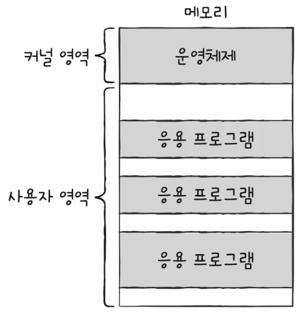
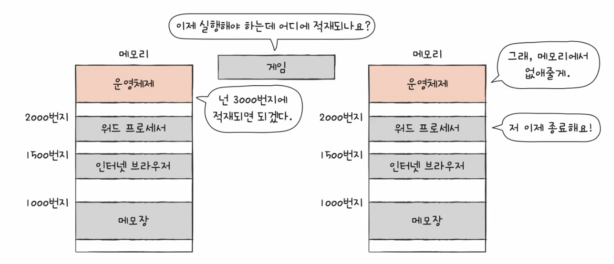
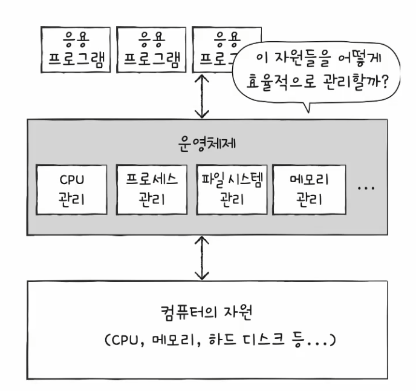
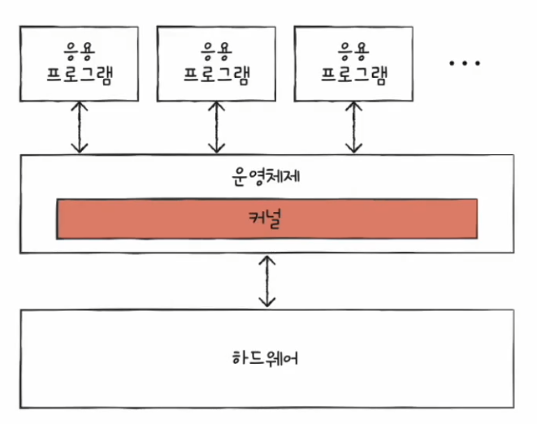
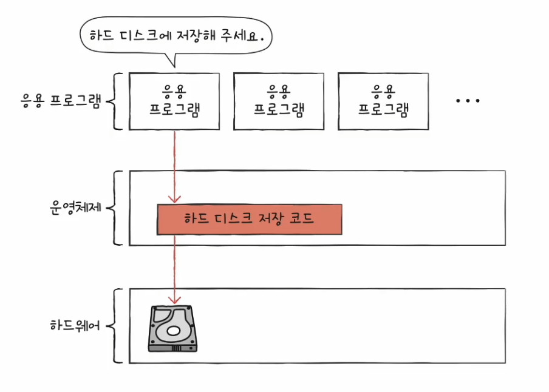
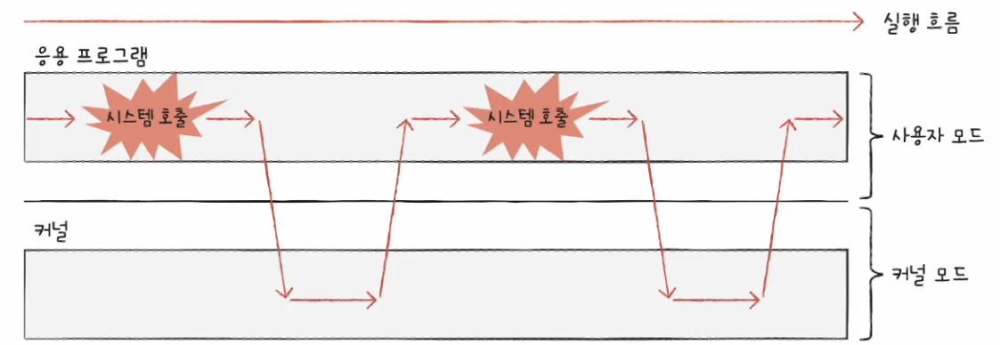

# 컴퓨터 구조와 운영체제

# 운영체제 - 운영체제란?

- 모든 프로그램은 하드웨어를 필요로 한다. 이때 프로그램 실행에 필요한 요소들을 **시스템 자원** 또는 **자원**이라고 한다.
- 여기서 실행할 프로그램에 필요한 자원을 할당하고, 프로그램이 올바르게 실행되도록 돕는 특별한 프로그램이 **운영체제**이다.
- 운영체제는 프로그램과 마찬가지로 메모리에 적재되어야 한다. 하지만 운영체제는 매우 특별한 운영체제이기 때문에 항상 컴퓨터가 부팅될 때 메모리 내 **커널 영역**이라는
    공간에 따로 적재되어 실행된다.
- **커널 영역**을 제외한 나머지 영역, 사용자가 이용하는 응용 프로그램이 적재되는 영역을 사용자 영역이라고 한다.
- 즉, 운영체제는 커널 영역에 적재되어 사용자 영역에 적재된 프로그램들에 자원을 할당하고 이들이 올바르게 실행되도록 돕는다.

- 운영체제는 실행할 프로그램을 메모리에 적재하고, 더 이상 실행되지 않는 프로그램을 메모리에서 삭제하며 지속적으로 메모리 자원을 관리한다.

- 또한 운영체제는 어느 한 프로그램이 CPU를 독점하면 다른 프로그램들은 올바르게 실행될 수 없기 때문에 최대한 공정하게 여러 프로그램에 CPU 자원을 할당한다.
- 그리고 응용 프로그램과 하드웨어 사이에서 응용 프로그램에 필요한 자원을 할당하고, 응용 프로그램이 올바르게 실행되도록 관리하는 역할을 맡는다.

**운영체제는 응용 프로그램에 자원을 효율적으로 배분하고, 실행할 프로그램들이 지켜야 할 규칙을 만들어 컴퓨터 시스템 전체를 관리한다.**

---

## 커널

- 운영체제는 현존하는 프로그램 중 규모가 가장 큰 프로그램 중 하나이다. 
- 또 다양한 운영체제가 있고, 운영체제가 응용 프로그램에 제공하는 기능들, 운영체제 서비스 또한 매우 다양하다.
- 운영체제가 응용 프로그램에 제공하는 서비스 종류는 다양하지만, 그중에서도 가장 핵심적인 서비스들이 있는데, 이런 운영체제의 핵심 서비스를 담당하는 부분을 **커널**이라고 한다.

- 운영체제가 제공하는 서비스 중 커널에 포함되지 않는 서비스도 있는데, 대표적으로 사용자 인터페이스가 있다.
- **사용자 인터페이스**는 윈도우의 바탕화면과 같이 사용자가 컴퓨터와 상호작용할 수 있는 통로이다.
- 운영체제가 제공하는 사용자 인터페이스의 종류에는 **그래픽 유저 인터페이스(GUI)** 와 **커맨드 라인 인터페이스(CLI)** 가 있다.
- **GUI**는 그래픽을 기반으로, **CLI**는 명령어를 기반으로 컴퓨터와 상호작용할 수 있는 인터페이스이다.
- 이러한 사용자 인터페이스는 운영체제가 제공하는 서비스이지만, 이는 그저 컴퓨터와 상호작용하기 위한 통로일 뿐 커널에 속한 기능은 아니다.

---

## 이중 모드와 시스템 호출

- 운영체제는 사용자가 실행하는 응용 프로그램이 하드웨어 **자원에 직접 접근하는 것을 방지**하여 자원을 보호한다.
- 자원에 직접 접근이 가능하다면 자원이 무질서하게 관리될 것이고, 응용 프로그램이 조금만 실수해도 컴퓨터 전체에 큰 악영향을 끼칠 수 있다.
- 그래서 운영체제는 응용 프로그램들이 자원에 접근하려고 할 때 오직 자신을 통해서만 접근하도록 하여 자원을 보호한다.
- **응용 프로그램이 자원에 접근하기 위해서는 운영체제에 도움을 요청**해야 하며, 이때 운영체제에 도움을 요청한다는 말은 운영체제 코드를 실행하려고 한다는 말과 같다.
- 응용 프로그램의 요청을 받은 운영체제는 응용 프로그램 대신 자원에 접근하여 요청한 작업을 수행한다.

- 운영체제는 이중 모드로 위와 같은 역할을 수행한다.
- **이중 모드**란 CPU가 명령어를 실행하는 모드를 크게 사용자 모드와 커널 모드로 구분하는 방식이다. CPU는 명령어를 사용자 모드 또는 커널 모드로써 실행할 수 있다.
- **사용자 모드**
  - 운영체제 서비스를 제공받을 수 없는 실행 모드
  - 커널 영역의 코드를 실행할 수 없는 모드
  - 일반적인 응용 프로그램은 기본적으로 사용자 모드로 실행된다.
  - 자원에 접근할 수 없다.
- **커널 모드**
  - 운영체제 서비스를 제공받을 수 있는 실행 모드
  - 커널 영역의 코드를 실행할 수 있는 모드
  - 자원에 접근하는 명령어를 비롯한 모든 명령어를 실행할 수 있으며, 자원에 접근할 수 있다.

> CPU가 사용자 모드 또는 커널 모드로 실행 중인지는 플래그 레지스터 속 [슈퍼바이저 플래그](https://github.com/genesis12345678/TIL/blob/main/cs/cpu/ALU.md#alu%EA%B0%80-%EB%82%B4%EB%B3%B4%EB%82%B4%EB%8A%94-%EC%A0%95%EB%B3%B4)를 보면 알 수 있다.

- 사용자 모드로 실행되는 프로그램이 자원에 접근하는 운영체제 서비스를 제공받으려면 운영체제에 요청을 보내 커널 모드로 전환되어야 한다.
- 이때 운영체제 서비스를 제공받기 위한 요청을 **시스템 호출**(시스템 콜)이라고 한다.
- 사용자 모드로 실행되는 프로그램은 시스템 호출을 통해 커널 모드로 전환하여 운영체제 서비스를 제공받을 수 있다.

- 시스템 호출은 일종의 인터럽트이다. 정확히는 소프트웨어적인 인터럽트이다.
- CPU가 시스템 호출을 처리하는 순서는 인터럽트 처리 순서와 유사하다.
- 시스템 호출을 발생시키는 명령어가 실행되면 CPU는 지금까지의 작업을 백업하고, 커널 영역 내에 시스템 호출을 수행하는 코드(인터럽트 서비스 루틴)를 실행한 뒤
    다시 기존에 실행하던 응용 프로그램으로 복귀하여 실행을 계속해 나간다.

- 일반적으로 응용 프고르매은 실행 과정에서 운영체제 서비스들을 매우 빈번하게 이용한다. 
- 그 과정에서 빈번하게 시스템 호출을 발생시키고 사용자 모드와 커널 모드를 오가며 실행된다.

---

## 운영체제의 핵심 서비스

### 프로세스 관리

- 실행 중인 프로그램을 **프로세스**라고 한다.
- 일반적으로 하나의 CPU는 한 번에 하나의 프로세스만 실행할 수 있기 때문에 CPU는 이 프로세스들을 매우 빠른 속도로 조금씩 번갈아가며 실행한다.
- 이때 각 프로세스는 상태, 사용하고자 하는 자원도 다양하다. I/O 바운드 프로레스, CPU 바운드 프로세스, 당장 실행해야 하는 프로세스, 당장 실행이 불가능한 프로세스 등이 있을 수 있다.
- 그래서 운영체제는 다양한 프로세스를 일목요연하게 관리하게 실행한다. 
- 또한 여러 프로세스가 동시에 실행되는 환경에서 프로세스 동기화와 교착 상태를 해결한다.

### 자원 접근 및 할당

모든 프로세스는 실행을 위해 자원을 필요로 하고, 운영체제는 프로세스들이 사용할 자원에 접근하고 조작함으로써 프로세스에 필요한 자원을 할당해준다.

#### CPU

- 일반적으로 메모리에는 여러 프로세스가 적재되고, 하나의 CPU는 한 번에 하나의 프로세스만 실행할 수 있다.
- 그래서 하나의 프로세스가 CPU를 이용하고 있다면 다른 프로세스는 기다려야 한다. 
- 운영체제는 **CPU 스케줄링**을 통해 프로세스들이 공정하게 CPU를 할당할 수 있도록 해준다. 

#### 메모리

- 메모리에 적재된 프로세스들은 크기, 적재되는 주소가 모두 다르다. 같은 프로세스도 실행할 때마다 적재되는 주소가 달라질 수 있다.
- 그래서 운영체제는 새로운 프로세스가 적재될 때마다 어느 주소에 적재해야 할 지를 결정해야 한다.
- 메모리가 이미 차있어 프로세스를 적재할 공간이 없는 경우도 있고, 메모리에 공간이 남아 있어도 프로세스를 적재하지 못하는 상황도 발생한다.
- 운영체제는 메모리 할당과 메모리가 부족할 경우 극복해야 하는 역할이 있다.

#### 입출력장치

- 인터럽트 서비스 루틴은 운영체제가 제공하는 기능으로 커널 영역에 있다. 입출력장치가 발생시키는 하드웨어 인터럽트도 마찬가지이다.
- 입출력장치가 CPU에 하드웨어 인터럽트 요청 신호를 보내면 CPU는 하던 작업을 백업한 뒤 커널 영역에 있는 인터럽트 서비스 루틴을 실행한다.
- 이처럼 운영체제는 인터럽트를 처리하는 프로그램, 즉 인터럽트 서비스 루틴을 제공함으로써 입출력작업을 수행한다.

### 파일 시스템 관리

- 컴퓨터를 사용할 때는 파일과 파일들을 묶은 폴더(디렉터리)로 관리하는데, 이런 **파일 시스템**도 운영체제가 지원하는 핵심 서비스이다.

---

[이전 ↩️ - 컴퓨터 구조(입출력장치) - 다양한 입출력방법](https://github.com/genesis12345678/TIL/blob/main/cs/iodevice/IOway.md)

[메인 ⏫](https://github.com/genesis12345678/TIL/blob/main/cs/Main.md)

[다음 ↪️ - 운영체제(프로레스와 스레드) - 프로세스](https://github.com/genesis12345678/TIL/blob/main/cs/process/Process.md)