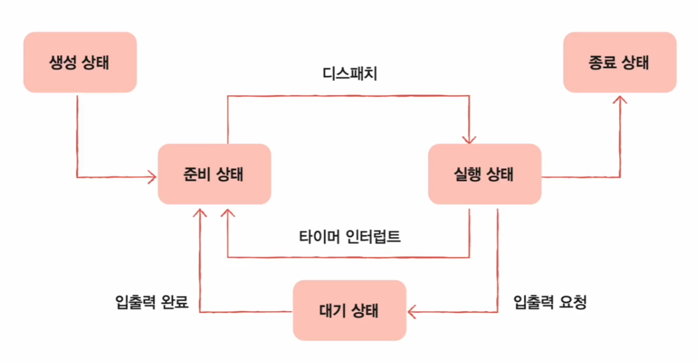
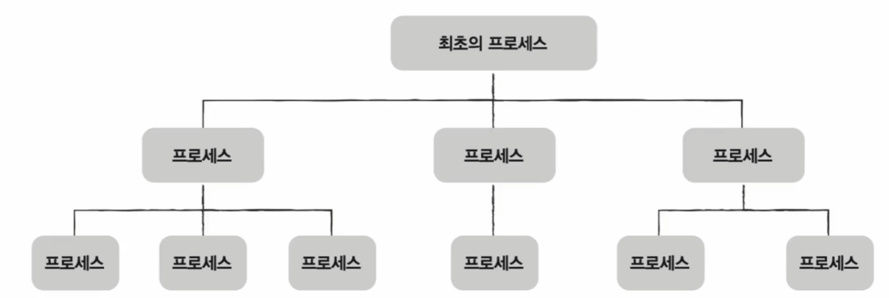
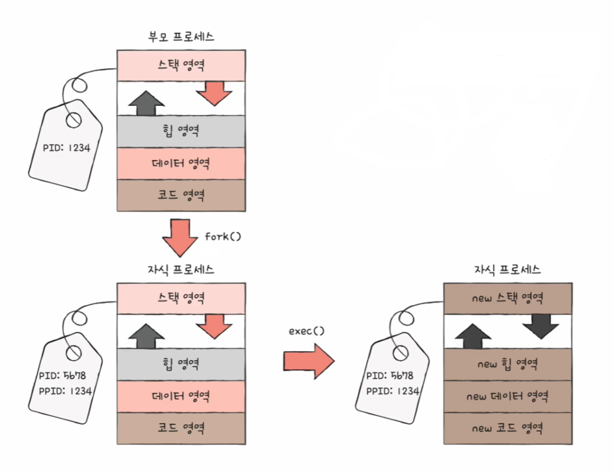
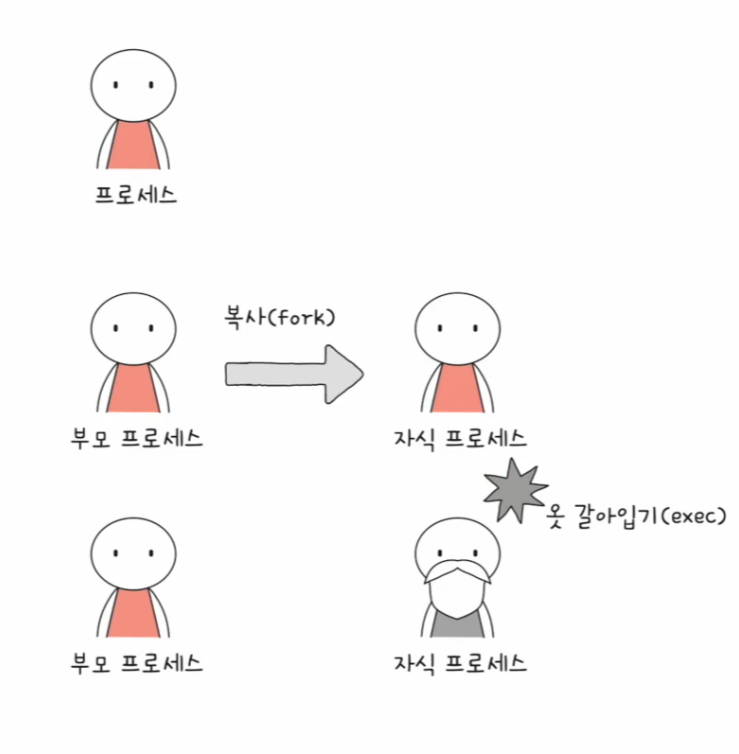

# 컴퓨터 구조와 운영체제

# 운영체제 - 프로세스 상태와 계층 구조

## 프로세스 상태

- 컴퓨터는 여러 프로세스들을 빠르게 번갈아가며 실행하고, 그 과정에서 하나의 프로세스는 여러 상태를 거치며 실행된다.
- 그리고 운영체제는 프로세스의 상태를 PCB를 통해 인식하고 관리한다.

### 생성 상태

- 프로세스를 생성 중인 상태, 이제 막 메모리에 적재되어 PCB를 할당받은 상태
- 생성 상태를 거쳐 실행할 준비가 완료된 프로세스는 곧바로 실행되지 않고 준비 상태가 되어 CPU의 할당을 기다린다.

### 준비 상태

- 당장이라도 CPU를 할당받아 실행할 수 있지만, 아직 자신의 차례가 아니기에 기다리고 있는 상태
- 준비 상태 프로세스는 차례가 되면 CPU를 할당받아 실행 상태가 된다.
- 준비 상태인 프로세스가 실행 상태로 전환되는 것을 **디스패치**라고 한다.

### 실행 상태

- CPU를 할당받아 실행 중인 상태
- 할당된 일정 시간 동안만 CPU를 사용할 수 있다.
- 할당된 시간을 모두 사용한다면(타이머 인터럽트가 발생하면) 다시 준비 상태가 되고, 실행 도중 입출력장치를 사용하여 입출력 장치의 작업이 끝날 때까지 기다려야 한다면 대기 상태가 된다.

### 대기 상태

- 프로세스는 실행 도중 입출력장치를 사용하는 경우가 있다.
- 입출력 작업은 CPU에 비해 처리 속도가 느리기 때문에 **대기 상태**로 접어든다.
- 입출력 작업이 완료되면 해당 프로세스는 다시 준비 상태로 CPU 할당을 기다린다.

### 종료 상태

- 프로세스가 종료된 상태
- 프로세스가 종료되면 운영체제는 PCB와 프로세스가 사용한 메모리를 정리한다.

---

## 프로세스 계층 구조

- 프로세스는 실행 도중 시스템 호출을 통해 다른 프로세스를 생성할 수 있는데, 새 프로세스를 생성한 프로세스를 **부모 프로세스**, 부모 프로세스에 의해 생성된 프로세스를 **자식 프로세**스라고 한다.
- 부모 프로세스와 자식 프로세스는 엄연히 다른 프로세스이기 때문에 다른 PID를 가진다.
- 많은 운영체제는 프로세스가 프로세스를 낳는 계층적인 구조로 프로세스들을 관리한다.

---

## 프로세스 생성 기법

- 부모 프로세스를 통해 생성된 자식 프로세스들은 **복제와 옷 갈아입기**를 통해 실행된다.
- 부모 프로세스는 **fork**를 통해 자신의 복사본을 자식 프로세스로 생성해내고, 만들어진 복사본(자식 프로세스)은 **exec**를 통해 자신의 메모리 공간을 다른 프로그램으로 교체한다.
- **fork**와 **exec**은 시스템 호출이다. 부모 프로세스는 **fork** 시스템 호출을 통해 자신의 복사본을 자식 프로세스로 생성한다.
- 즉, **fork**는 자기 자신 프로세스의 복사본을 만드는 시스템 호출이다.
- 자식 프로세스는 부모 프로세스의 복사본이기 때문에 메모리 내의 내용, 열린 파일의 목록 등과 같은 부모 프로세스의 자원들이 자식 프로세스에 상속된다.

- **fork**를 통해 복사본이 만들어진 뒤에 자식 프로세스는 **exec** 시스템 호출을 통해 새로운 프로그램으로 전환된다.
- **exec**는 자신의 메모리 공간을 새로운 프로그램으로 덮어쓰는 시스템 호출이다. (새로운 프로그램 내용으로 전환하여 실행하는 시스템 호출)
- **exec**를 호출하면 코드 영역과 데이터 영역의 내용이 실행할 프로그램의 내용으로 바뀌고, 나머지 영역은 초기화된다.

- 정리하면, 부모가 자식 프로세스를 실행하며 프로세스 계층 구조를 이루는 과정은 **fork**와 **exec**가 반복되는 과정이라 볼 수 있다.
- 부모 프로세스로부터 자식 프로세스가 복사되고, 자식 프로세스는 새로운 프로그램으로 옷을 갈아입는 과정이 계층적으로 실행되는 것이다.

- 부모 프로세스가 자식 프로세스를 **fork** 한 뒤, 부모와 자식 누구도 **exec**를 호출하지 않는 경우도 있는데, 이 경우 부모와 자식 프로세스는 같은 코드를 병행하여 실행하는 프로세스가 된다.

---

[이전 ↩️ - 운영체제(프로세스와 스레드) - 프로세스](https://github.com/genesis12345678/TIL/blob/main/cs/process/Process.md)

[메인 ⏫](https://github.com/genesis12345678/TIL/blob/main/cs/Main.md)

[다음 ↪️ - 운영체제(프로세스와 스레드) - 스레드](https://github.com/genesis12345678/TIL/blob/main/cs/process/Thread.md)