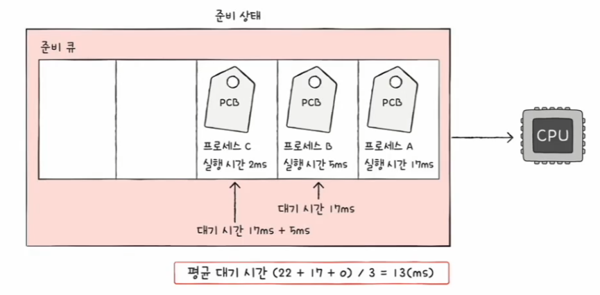
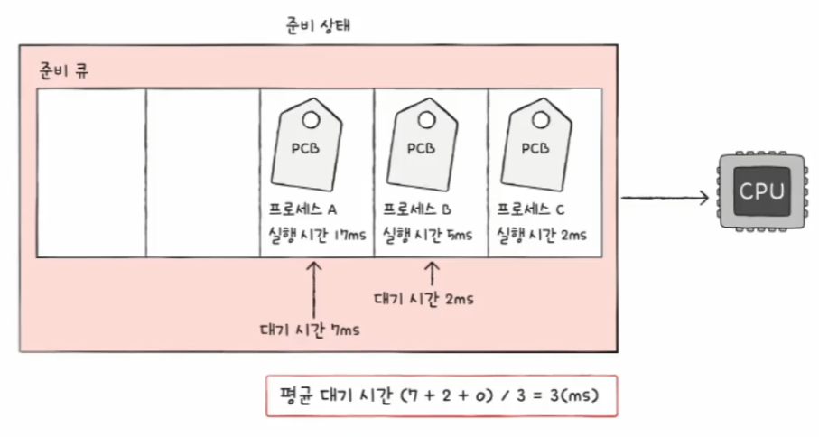
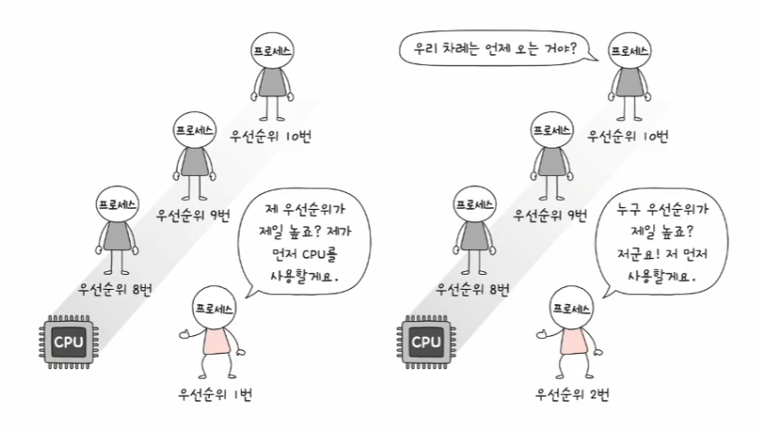
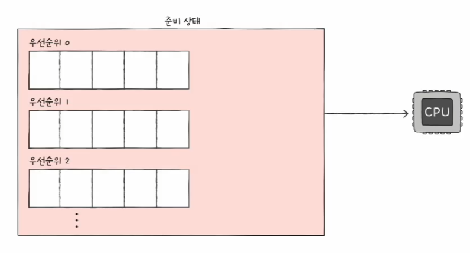
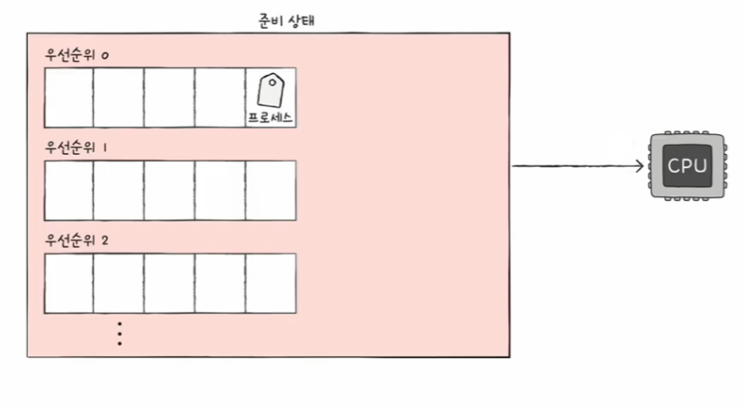
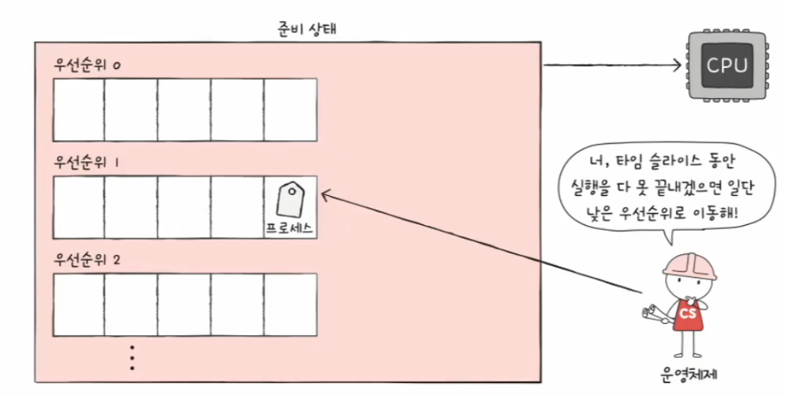
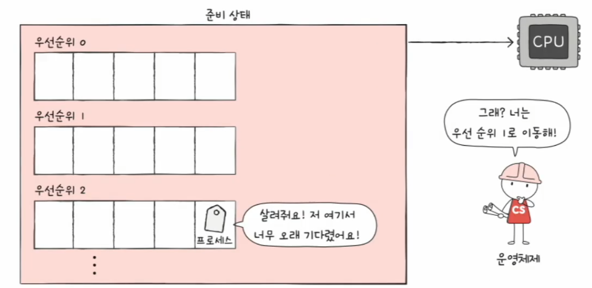
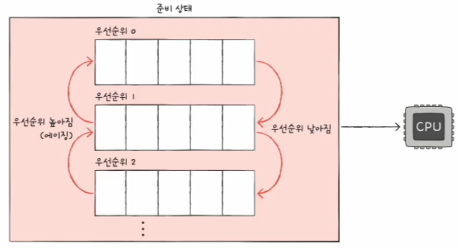

# 컴퓨터 구조와 운영체제

# 운영체제 - CPU 스케줄링 알고리즘

## 선입 선처리 스케줄링

- **FCFS - First Come First Served** 
- 단순히 준비 큐에 삽입된 순서대로 프로세스들을 처리하는 **비선점형 스케줄링**, 즉 CPU를 먼저 요청한 프로세스부터 CPU를 할당하는 스케줄링 방식
- 가장 공정해 보이지만, 프로세스들이 기다리는 시간이 매우 길어질 수 있다.(호위 효과)

- 프로세스 C는 고작 2ms를 실행하기 위해 22ms를 기다려야만 한다.
- 호위 효과를 방지하려면 CPU 사용 시간이 긴 프로세스는 나중에 실행하고, CPU 사용 시간이 짧은 프로세스를 먼저 실행하면 된다.

---

## 최단 작업 우선 스케줄링

- **SJF - Shortest Job First**
- 준비 큐에 삽입된 프로세스들 중 CPU 이용 시간의 길이가 가장 짧은 프로세스부터 실행하는 스케줄링 방식
- 기본적으로 **비선점형 스케줄링**으로 분류되지만, 선점형으로 구현될 수도 있는데 이를 **최소 잔여 시간 우선 스케줄링(SRT)** 이라고 한다.

---

## 라운드 로빈 스케줄링

- 선업 선처리 스케줄링에 타임 슬라이스라는 개념이 더해진 스케줄링 방식
- **타임 슬라이스**란 각 프로세스가 CPU를 사용할 수 있는 정해진 시간을 의미한다.
- 즉, 정해진 타임 슬라이스만큼의 시간 동안 돌아가며 CPU를 이용하는 **선점형 스케줄링 방식**이다.
- 큐에 삽입된 프로세스들은 삽입된 순서대로 CPU를 이용하되 정해진 시간만큼만 CPU를 이용하고, 정해진 시간을 모두 사용해도 아직 프로세스가 완료되지 않았다면
    다시 큐의 맨 뒤에 삽입된다. 이때 문맥 교환이 발생한다.

- 라운드 로빈 스케줄링에서는 타임 슬라이스 크기가 매우 중요하다.
- 타임 슬라이스가 너무 크면 선입 선처리 스케줄링과 다를 바 없어 호위 효과가 생길 여지가 있다.
- 반대로 타임 슬라이스가 너무 작으면 문맥 교환이 발생하는 비용이 커 CPU는 프로세스를 처리하는 일보다 프로세스를 전환하는 데 시간을 더 쓸 것이다.

---

## 최소 잔여 시간 우선 스케줄링

- **SRT - Shortest Remaining Time**
- 최단 작업 우선 스케줄링(SJF)과 라운드 로빈 스케줄링(RR)을 합친 스케줄링 방식
- 정해진 타임 슬라이스만큼 CPU를 이용하되, CPU를 사용할 다음 프로세스로는 남아있는 작업 시간이 가장 적은 프로세스가 선택된다.

---

## 우선순위 스케줄링

- 프로세스들에 우선순위를 부여하고, 가장 높은 우선순위를 가진 프로세스부터 실행하는 스케줄링 알고리즘
  - 우선순위가 같다면 선입 선처리
- 최단 작업 우선 스케줄링(SJF), 최소 잔여 시간 우선 스케줄링(SRT)은 우선순쉬 스케줄링의 일종으로 볼 수 있다.
  - SJF는 작업 시간이 짧은, SRT는 남은 시간이 짧은 프로세스에 높은 우선순위를 부여하는 방식이다.
- **기아(starvation) 현상**
  - 우선순위가 낮은 프로세스는 우선순위가 높은 프로세스들에 실행이 계속해서 연기되는 현상

- 기아 현상을 방지하기 위한 대표적인 기법으로 **에이징**이 있다.
- 오랫동안 대기한 프로세스의 우선순위를 점차 높이는 방식이다.
- 에이징 기법을 적용하면 우선순위가 낮더라도 언젠가는 높은 우선순위가 될 수 있어 우선순위가 낮아 마냥 기다리기만 하는 프로세스가 없어진다.

---

## 다단계 큐 스케줄링

- 우선순위 스케줄링의 발전된 형태로, 우선순위별로 준비 큐를 여러 개 사용하는 스케줄링 방식
- 우선순위가 가장 높은 큐에 있는 프로세스들을 먼저 처리하고, 우선순위가 가장 높은 큐가 비어있으면 그 다음 우선순위 큐에 있는 프로세스들을 처리한다.

- 이렇게 큐를 여러 개 두면 프로세스 유형별로 우선순위를 구분하여 실행하는 것이 편리해진다.
- 어떤 큐에는 우선순위가 비교적 높은 I/O 바운드 프로세스가, 어떤 큐에는 우선순위가 비교적 낮은 CPU 바운드 프로세스가 삽입될 수 있다.
- 또한 큐별로 타임 슬라이스를 여러 개 지정할 수도 있고, 큐마다 다른 스케줄링 알고리즘을 사용할 수도 있다.

---

## 다단계 피드백 큐 스케줄링

- 다단계 큐 스케줄링의 발전된 형태
- 다단계 큐 스케줄링에서는 프로세스들이 큐 사이를 이동할 수 없는데, 이는 우선순위가 낮은 프로세스는 계속 연기될 여지가 있다. 즉, 기아 현상이 발생할 수 있다.
- 다단계 피드백 큐 스케줄링은 프로세스들이 큐 사이를 이동할 수 있다.
- 새로 준비 상태가 된 프로세스가 있다면 우선 우선순위가 가장 높은 우선순위 큐에 삽입되고 일정 시간(타임 슬라이스)동안 실행된다.

- 만약 프로세스가 해당 큐에서 실행이 끝나지 않는다면 다음 우선순위 큐에 삽입되어 실행된다. 또 해당 큐에서 끝나지 않는다면 다음 우선순위 큐에 삽입된다.
- 결국 CPU를 오래 사용해야 하는 프로세스는 점차 우선순위가 낮아진다.

- CPU 바운드 프로세스는 자연스레 우선순위가 낮아지고, I/O 바운드 프로세스는 자연스레 우선순위가 높은 큐에서 실행이 끝난다.
- 다단계 피드백 큐 스케줄링에서는 프로세스들이 큐 사이를 이동할 수 있는 방식이기 때문에 낮은 우선순위 큐에서 너무 오래 기다리고 있는 프로세스가 있다면
    점차 우선순위가 높은 큐로 이동시키는 **에이징 기법**을 적용하여 기아 현상을 예방한다.

- 즉, 다단계 피드백 큐 스케줄링은 어떤 프로세스의 CPU 이용 시간이 길면 낮은 우선순위 큐로 이동시키고, 어떤 프로세스가 낮은 우선순위 큐에서 너무 오래
    기다린다면 높은 우선순위 큐로 이동시킬 수 있는 알고리즘이다.

---

[이전 ↩️ - 운영체제(CPU 스케줄링) - CPU 스케줄링 알고리즘]()

[메인 ⏫](https://github.com/genesis12345678/TIL/blob/main/cs/Main.md)

[다음 ↪️ - 운영체제(프로세스 동기화) - 동기화란]()