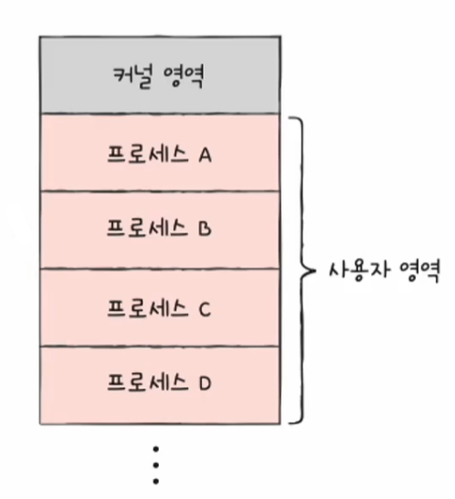
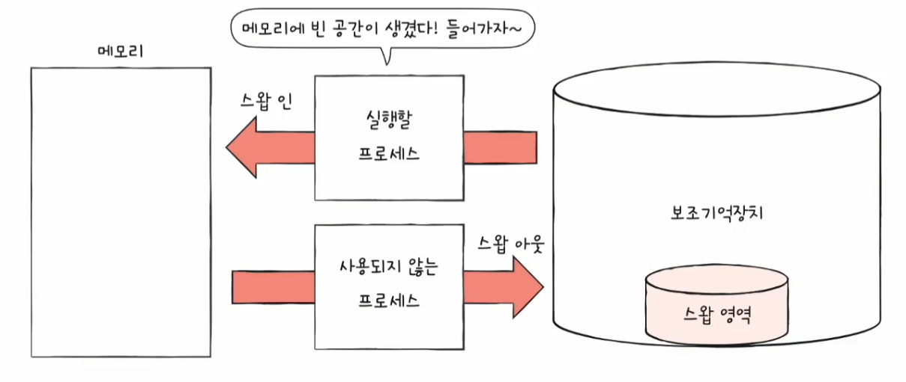
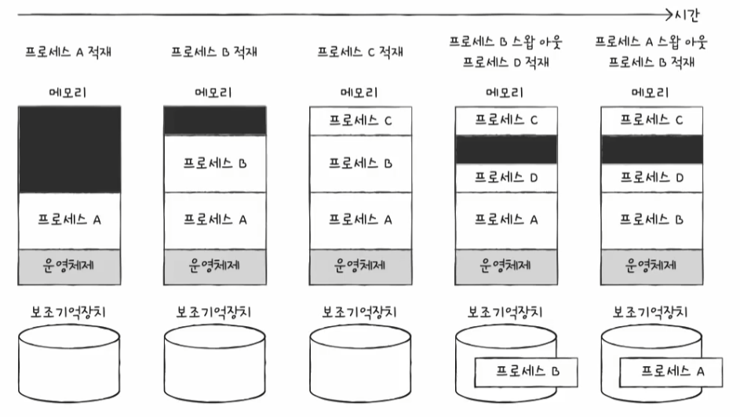
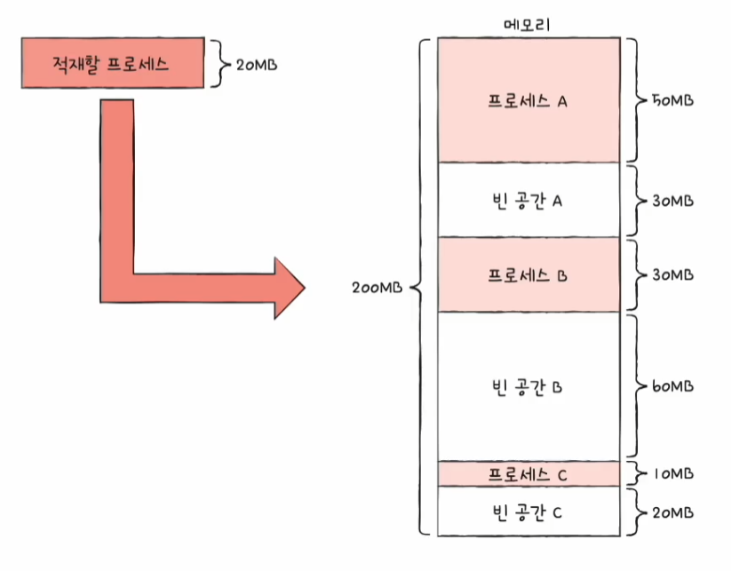
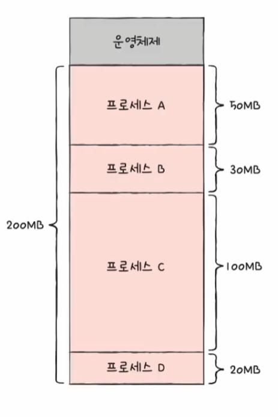
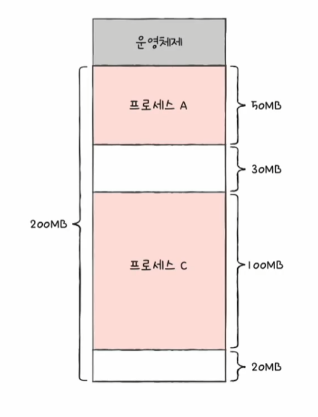
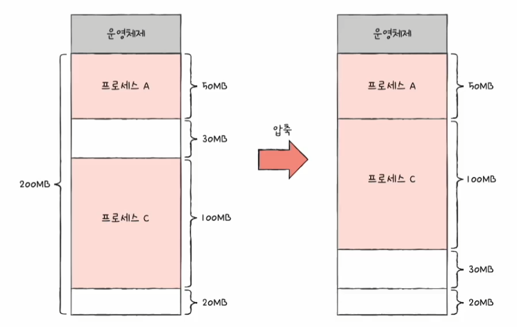

# 컴퓨터 구조와 운영체제

# 운영체제 - 가상 메모리

## 연속 메모리 할당

- 프로세스에 연속적인 메모리 공간을 할당하는 방식을 **연속 메모리 할당** 방식이라고 한다.
- 이와 같이 프로세스들을 메모리에 연속적으로 할당할 때 무엇을 고려해야 하는지, 어떤 잠재적인 문제가 있는지 알아보자.

---

## 스와핑

- 메모리에 적재된 프로세스들 중에는 현재 실행되지 않는 프로세스가 있을 수 있다.
  - 입출력 작업 대기 상태, 오랫동안 사용되지 않은 프로세스 등
- 이러한 프로세스들을 임시로 보조기억장치 일부 영역으로 쫓아내고, 그렇게 해서 생긴 메모리의 빈 공간에 또 다른 프로세스를 적재하여 실행하는 방식을 **스와핑**이라고 한다.

- 이때 프로세스들이 쫓겨나는 보조기억장치의 일부 영역을 **스왑 영역**이라고 한다.
- 그리고 현재 실행되지 않는 프로세스가 메모리에서 스왑 영역으로 옮겨지는 것을 **스왑 아웃**, 반대로 스왑 영역에 있던 프로세스가 다시 메모리로 옮겨지는 것을 **스왑 인**이라고 한다.
- 스왑 아웃되었던 프로세스가 다시 스왑 인될 때는 스왑 아웃되기 전의 물리 주소와 다른 주소에 적재될 수 있다.

**스와핑을 사용하면 프로세스들이 요구하는 메모리 주소 공간의 크기가 실제 메모리 크기보다 큰 경우에도 프로세스들을 동시에 실행할 수 있다.**

다음 그림처럼 네 개의 프로세스 크기를 합하면 메모리의 크기보다 크지만, 스와핑을 통해 네 개의 프로세스를 동시에 실행할 수 있다.

---

## 메모리 할당

- 프로세스는 메모리 내의 빈 공간에 적재되어야 하는데, 메모리 내에 빈 공간이 여러 개 있다면 프로세스를 어디에 배치해야 할까?
- 비어 있는 메모리 공간에 프로세스를 연속적으로 할당하는 방식에는 대표적으로 **최초 적합**, **최적 적합**, **최악 적합**이 있다.
- 다음 상황에서 각 방식에 대해 알아보자.

### 최초 적합

- 운영체제가 메모리 내의 빈 공간을 순서대로 검색하다가 적재할 수 있는 공간을 발견하면 그 공간에 프로세스를 배치하는 방식
- 프로세스가 적재될 수 있는 공간을 발견하는 즉시 메모리를 할당하는 방식이므로 검색을 최소화할 수 있고 결과적으로 빠른 할당이 가능하다.

### 최적 적합

- 운영체제가 빈 공간을 모두 검색해 본 후, 프로세스가 적재될 수 있는 공간 중 가장 작은 공간에 프로세스를 배치하는 방식

### 최악 적합

- 운영체제가 빈 공간을 모두 검색해 본 후, 프로세스가 적재될 수 있는 공간 중 가장 큰 공간에 프로세스를 배치하는 방식

---

## 외부 단편화

- 프로세스를 메모리에 연속적으로 배치하는 연속 메모리 할당은 메모리를 효율적으로 사용하는 방법이 아니다.
- 연속 메모리 할당은 **외부 단편화**라는 문제를 내포하고 있기 때문이다.

예를 들어 다음과 같이 네 개의 프로세스를 차례대로 적재했다.

이 상황에서 프로세스 B와 D의 실행이 끝나면 다음과 같아진다.

- 현재 메모리에 남아 있는 빈 공간의 총합은 50MB이지만, 50MB 크기의 프로세스를 적재할 수 없다. 왜냐하면 빈 공간의 총합은 50MB이지만 어느 빈 공간에도 50MB 
    크기의 프로세스가 적재될 수 없기 때문이다.
- 프로세스들이 메모리에 연속적으로 할당되는 환경에서는 프로세스들이 실행되고 종료되기를 반복하며 메모리 사이사이에 빈 공간들이 생긴다.
- 프로세스 바깥에 생기는 빈 공간들은 분명 빈 공간이지만 그 공간보다 큰 프로세스를 적재하기 어려운 상황을 초래하고, 결국 메모리 낭비로 이어진다. 이러한 현상을
**외부 단편화**라고 한다.
- 즉, **외부 단편화**는 프로세스를 할당하기 어려울 만큼 작은 메모리 공간들로 인해 메모리가 낭비되는 현상을 의미한다.

외부 단편화를 해결할 수 있는 대표적인 방안으로 메모리를 **압축**하는 방법이 있다.

- 메모리 조각 모음이라고도 부르는 압축은 흩어져 있는 빈 공간들을 하나로 모으는 방식으로, 메모리 내에 저장된 프로세스를 적당히 재배치시켜 흩어져 있는 작은 빈 공간들을
    하나의 큰 공간으로 만드는 방법이다.
- 압축 방식의 단점은 작은 빈 공간들을 하나로 모으는 동안 시스템은 하던 일을 중지해야 하고, 메모리에 있는 내용을 옮기는 작업은 많은 오버헤드를 야기한다.
- 이에 외부 단편화를 없앨 수 있는 또 다른 해결 방안이 등장했는데 가상 메모리 기법, 그 중에서도 **페이징 기법**이 있다.

---

[이전 ↩️ - 운영체제(교착 상태) - 교착 상태 해결 방법](https://github.com/genesis12345678/TIL/blob/main/cs/deadlock/DeadlockSolve.md)

[메인 ⏫](https://github.com/genesis12345678/TIL/blob/main/cs/Main.md)

[다음 ↪️ - 운영체제(가상 메모리) - 페이징을 통한 가상 메모리 관리](https://github.com/genesis12345678/TIL/blob/main/cs/virtualmemory/paging.md)