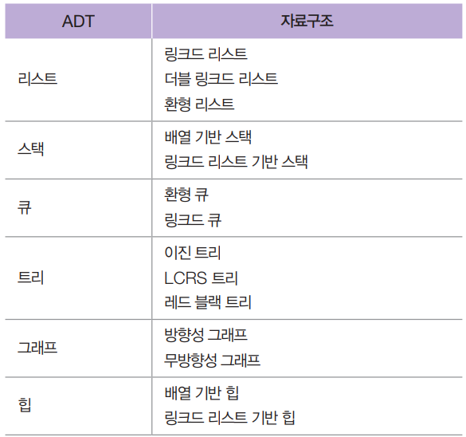

# 자료 구조

### 자료구조란

---
> **Data Structure** : 컴퓨터가 데이터를 효율적으로 다룰 수 있게 도와주는
> 데이터 보관 방법과 데이터에 관한 연산의 총체를 뜻한다. 
> 더 정확히 말해, 자료 구조는 데이터 값의 모임, 또 데티어 간의 관계, 그리고
> 데이터에 적용할 수 있는 함수나 명령을 의미힌다. 신중히 선택한 자료구조는 보다 효율적인
> **알고리즘**을 사용할 수 있게 한다.

자료구조는 그림과 같이 ``단순 자료구조``와 ``복합 자료구조``로 나뉜다. 
int나 long같은 기본 데이터 형식도 자료구조가 될 수 있다.

복합 자료구조는 다시 ``선형 자료구조``와 ``비선형 자료구조``로 나뉜다. 
**선형 자료구조는 데이터 요소를 순차적으로 연결하는 자료구조로 구현하기도 쉽고 
사용하기도 쉽다.** 
**비선형 자료구조는 데이터 요소를 비순차적으로 연결한다. 한 데이터 요소에서 여러 데이터
요소로 연결되기도 하고, 여러 데이터 요소가 하나의 데이터 요소로 연결되기도 한다.**

자료구조와 관련해서 알아두면 좋은 개념이 있는데 바로 ADT(Abstract Data Types), 추상 데이터 형식이다.
이것은 자료구조의 동작 방법을 표현하는 데이터 형식이다. 즉 ADT는 자료구조가 갖춰야 할
일련의 연산이라고 할 수 있다.

### 알고리즘

---

> 어떤 문제를 해결하기 위해 사용되는 풀이과정. 즉 **문제해결방법**을 말한다.
>
> 여러가지 문제해결방법 중 **가장 효율이 좋은 방법**을 **어떤 문제에 대한 알고리즘**이라고 한다.

 
 

### 시간 복잡도 점근 표기법

---

> **시간복잡도** : 입력값과 문제를 해결하는 데 걸리는 시간을 **함수 관계**로 나타낸 것.
> 즉 실행시간을 기준으로, 알고리즘이 **얼마나 효율적인 지**를 판단할 수 있는 척도이다.

- 최상의 경우 : 오메가 표기법(Big-Ω Notation)
- 평균의 경우 : 세타 표기법(Big-θ Notation)
- **최악의 경우 : 빅오 표기법(Big-O Notation)**

알고리즘을 구할 때는 항상 최악의 경우를 생각해서 구해야 하기 때문에 보통 빅오 표기법을 많이 사용한다.

### 큐(Queue)

---

> FIFO : **First In First Out**
>
> **선입선출** 구조를 띄며, 티켓팅 하기 위해 줄을 서는 사람들이라고 생각하면 된다.
>
> 데이터가 들어오는 위치는 가장 뒤(Rear 또는 Back)에 있고, 데이터가 나가는 위치는 가장 앞(Front)에 있어서 먼저 들어오는 데이터는 가장 먼저 나가게 된다.
>
> 입력 동작은 **Enqueue**, 출력 동작은 **Dequeue**라고 한다.

 

 

### 덱(Deque)

---

> 양쪽 끝에서 삽입과 삭제가 모두 가능한 자료 구조의 한 형태이다.
>
> 두 개의 포인터를 사용하여 양쪽에서 삭제와 삽입을 발생시킬 수 있다.

 
 
 
 
 

## 정리

- **큐 Queue**

  - **FIFO(First In First Out)** 방식으로 동작하며 데이터가 삽입되는 곳을 `rear`, 데이터가 제거되는 곳을 `front`라 한다.
  - 데이터를 삭제하기 전에는 큐가 `empty`한지, 데이터를 추가하기 전에는 큐가 `full`인지 확인 후 진행해야 한다.
  - **시간 복잡도**

    - 삽입, 삭제 : O(1)
    - 탐색 : O(N)

 

- **스택 Stack**

  - **LIFO(Last In First Out)** 방식으로 동작한다.
  - 한 쪽 끝에서만 자료를 넣고 빼는 작업이 이루어지고 가장 최근에 스택에 삽입된 자료의 위치를 `top`이라 한다.
  - `push`로 새로운 데이터를 추가하고, `pop`로 가장 최근에 삽입된 데이터를 스택에서 삭제한다.
  - `top`이 아닌 위치의 데이터에 대한 접근, 삽입, 삭제는 모두 불가능하다.
  - 스택이 비어있을 때 `pop`을 시도하는 것을 `stack underflow`라 하고 스택의 크기가 비어있을 때 **push**를 시도하면 **stack overflow**가 발생한다.
  - **시간 복잡도**

    - 삽입, 삭제 : O(1)
    - 탐색 : O(N)

 

- **덱 Deque**

  - 큐와 스택의 기능을 모두 가지고 있고 `front, rear`에서 삽입과 삭제가 모두 가능한 자료구조이다.
  - **연속적인 메모리**를 기반으로 하고 선언 이후 크기를 줄이거나 늘릴 수 있는 **가변적 크기**를 갖는다.
  - `index`를 통해 임의의 원소에 바로 접근이 가능하다.
  - 중간에 데이터가 삽입될 때 다른 요소들을 앞, 뒤로 밀 수 있으며 **앞, 뒤에서 삽입과 삭제**가 모두 가능하다.
  - **시간 복잡도**

    - 삽입, 삭제, 탐색 : O(1)
