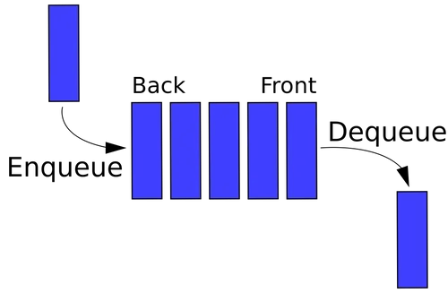

# Queue - 큐

<br>

## 큐(Queue)란
> 기본적인 자료 구조의 한 가지로, 먼저 집어 넣는 데이터가 먼저 나오는 ``FIFO``구조로
> 저장하는 형식을 말한다. 표를 사기 위해 일렬로 서 있는 사람들을 생각하면 된다.<br>
> 나중에 집어 넣은 데이터가 먼저 나오는 스택과 반대되는 개념이다.

- **선입선출(FIFO : First In First Out)**

큐의 대표적인 특징으로 집어넣은 순서대로 데이터가 나온다는 뜻이다.

<br>

## 큐의 구조



데이터가 들어오는 위치는 가장 뒤(Rear 또는 Back)에 있고, 데이터가 나가는 위치는 가장 앞(Front)에 있어서,
먼저 들어오는 데이터가 먼저 나가게 된다.<br>
입력 동작은 ``Enqueue``, 출력 동작은 ``Dequeue``라고 한다.

<br>

## 기본 JCF Queue
```java
import java.util.LinkedList;
import java.util.Queue;
public class Main {
    public static void main(String[] args) {
        Queue<Integer> queue = new LinkedList<>();
        queue.offer(1);
        queue.offer(2);
        queue.offer(3);
        queue.offer(4);
        queue.offer(5);
        System.out.println(queue); // [1, 2, 3, 4, 5]

        System.out.println(queue.remove()); // 1
        System.out.println(queue.poll()); // 2
        System.out.println(queue); // [3, 4, 5]

        System.out.println(queue.element()); // 3
        System.out.println(queue.peek()); // 3
    }
}
```

자바에서 기본적으로 제공하는 Queue의 기능들이다. <br>
Queue는 단순히 인터페이스이고, 타고 들어가보면 기능들에 대한 설명이 써 있다.

<br>

## 큐의 시간복잡도

| **연산** | **시간복잡도** |
|--------|:---------:|
| 삽입     |   O(1)    |
| 삭제     |   O(1)    |  
| 검색     |   O(N)    |
