# AVL 트리

## 기본 개념

**스스로 균형을 잡는** [이진 탐색 트리](https://github.com/genesis12345678/TIL/blob/main/dataStructure/non_linear/bst/BST.md)의 한 종류로, 삽입과 삭제 시에 **트리의 균형도를
계산하여 불균형을 완화하는** 트리이다.

AVL 트리의 균형도(balance factor)는 **{-1, 0, 1}** 만 존재하며,
균형도를 통해 왼쪽 서브 트리가 비대한지 우측 서브 트리가 비대한지 알 수 있다.

노드를 삽입하거나 삭제한 후 균형도를 계산한다. 균형도는 `(왼쪽 자식 노드 높이) - (오른쪽 자식 노드 높이)`로 계산된다.
만약 균형도가 절댓값 2 이상이면 불균형 트리이므로 어떻게 불균형되었는지에 따라 (LL, RR, LR, RL) 회전을 한다.

---

## 노드의 높이

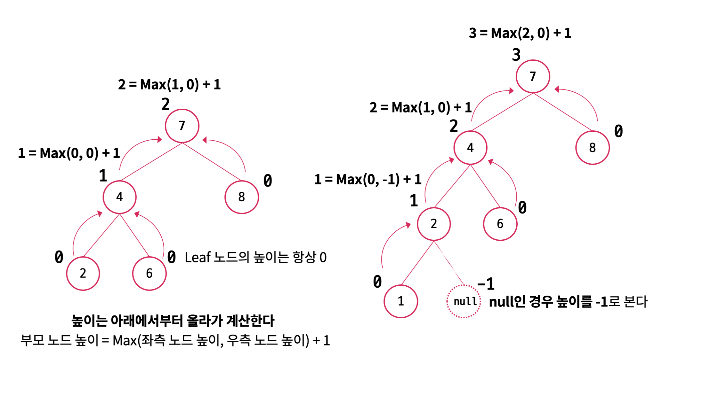

**트리가 균형인지 불균형인지 알기 위해서는 먼저 노드의 높이를 계산해야 한다.**

노드의 높이를 계산하는 방법은 **가장 깊은 리프 노드부터 위 노드로 올라가면서 높이를 계산하면** 된다.
그리고 왼쪽 자식 노드의 높이와 오른쪽 자식 노드의 높이 중 가장 큰 높이에 1을 더한 것이
부모 노드의 높이가 된다.

만약 왼쪽 또는 오른쪽 자식 노드가 존재하지 않으면 높이를 -1로 계산한다.

---

## 노드의 균형도

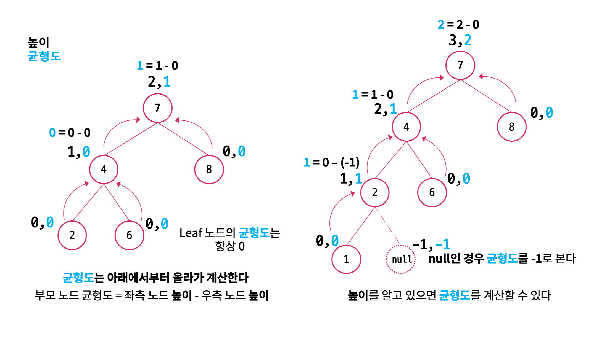

노드의 균형도는 서브 트리가 왼쪽으로 비대한지 또는 오른쪽으로 비대한지 알 수 있는 지표로,
**균형도는 왼쪽 자식 노드 높이에서 오른쪽 자식 노드의 높이를 빼주면 된다.**

높이를 계산하는 방법과 마찬가지로 균형도도 아래에서부터 계산해야 한다.
**리프 노드의 균형도는 항상 0**이며, **균형도가 양수인 경우 왼쪽 서브 트리가 비대한 트리**이고,
**균형도가 음수인 경우 오른쪽 서브 트리가 비대한 트리**이다.

만약 왼쪽 또는 오른쪽 자식 노드가 존재하지 않으면 균형도를 -1로 계산한다.

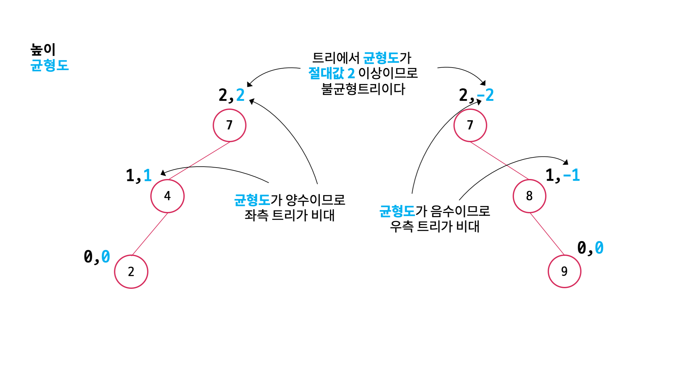

위와 같이 균형도가 절댓값 2 이상인 트리를 불균형 트리라고 한다.
부모 노드 기준 균형도가 양수이면 왼쪽이 비대한 트리이고, 음수이면 오른쪽이 비대한 트리이다.
즉 양수와 음수를 판단하여 어떤 불균형 트리인지 알 수 있으며, 불균형의 종류로는
LL, RR, LR, RL 불균형 트리가 존재한다.

---

## 불균형 트리

### LL 불균형 트리

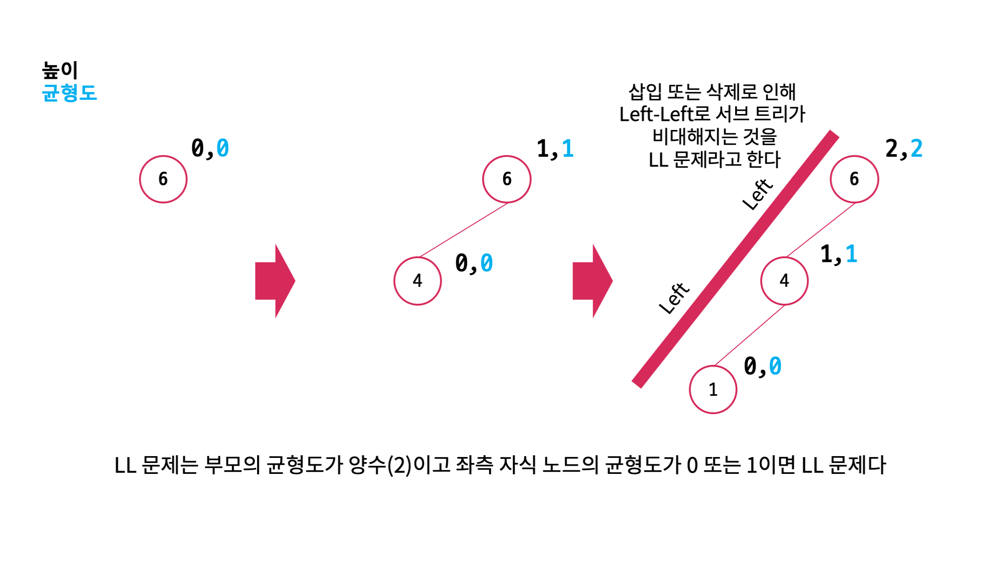

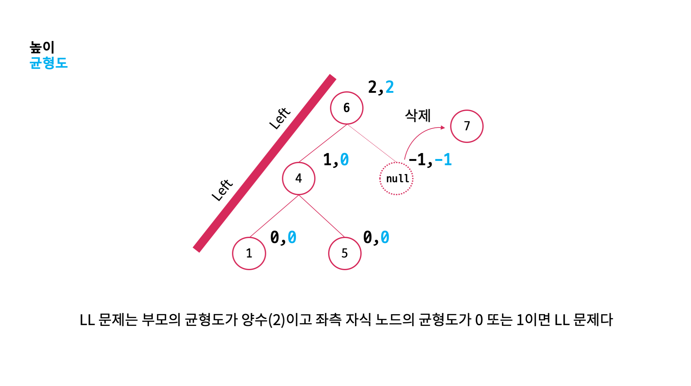

삽입 또는 삭제로 인해 부모 노드 기준 왼쪽 서브 트리가 비대해지는 것을 **LL(Left-Left) 문제**라고 한다.
삽입 또는 삭제 후 **부모의 균형도가 양수(2)이고, 왼쪽 자식 노드의 균형도가 0 또는 양수(1)이면 LL 문제**로 볼 수 있다.

### RR 불균형 트리

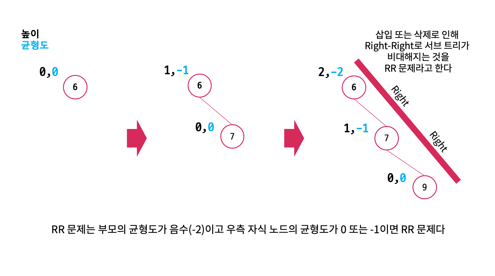

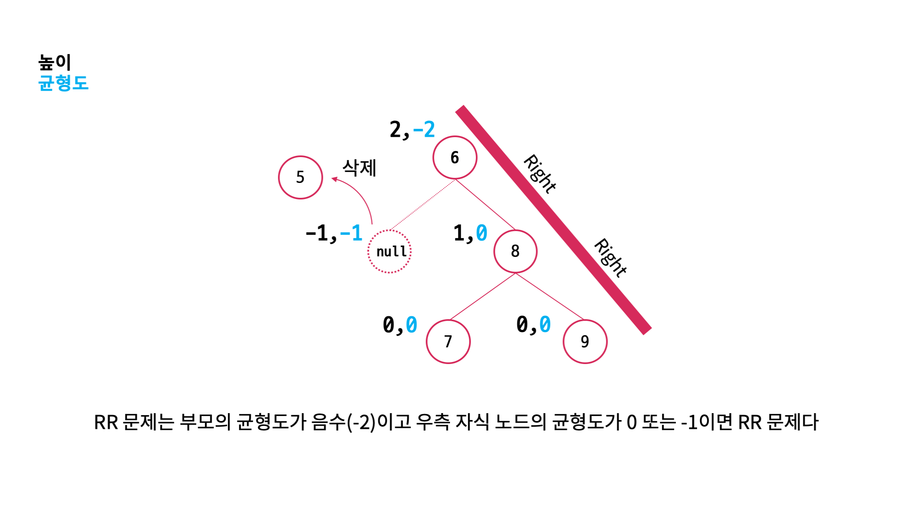

삽입 또는 삭제로 인해 부모 노드 기준 오른쪽 서브 트리가 비대해지는 것을 **RR(Right-Right) 문제**라고 한다.
삽입 또는 삭제 후 **부모의 균형도가 음수(-2)이고, 오른쪽 자식 노드의 균형도가 0 또는 음수(-1)이면 RR 문제**로 볼 수 있다.

### LR 불균형 트리


삽입 또는 삭제로 인해 부모 노드 기준 왼쪽 서브 트리가 비대하나 자식 노드가
왼쪽, 손자 노드가 오른쪽 노드로 연결된 상태를 **LR(Left-Right) 문제**라고 한다.
삽입 또는 삭제 후 **부모의 균형도가 양수(2)이고, 왼쪽 자식 노드의 균형도가 음수(-1)이면 LR 문제**로 볼 수 있다.

### RL 불균형 트리


삽입 또는 삭제로 인해 부모 노드 기준 오른쪽 서브 트리가 비대하나 자식 노드가
오른쪽, 손자 노드가 왼쪽 노드로 연결된 상태를 **RL(Right-Left) 문제**라고 한다.
삽입 또는 삭제 후 **부모의 균형도가 음수(-2)이고, 오른쪽 자식 노드의 균형도가 양수(1)이면 RL 문제**로 볼 수 있다.

---

## 노드 회전

### LL 회전 - LL 불균형 해결


LL 문제를 해결하기 위해 노드를 회전 시켜 균형도를 맞추는 것을 **LL 회전**이라고 한다.

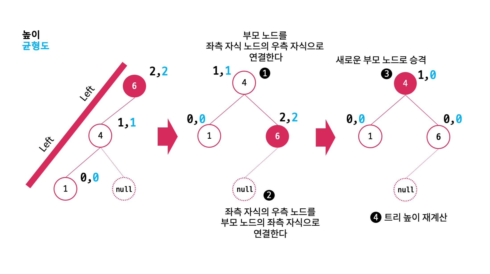

LL 회전은 항상 **부모 노드, 왼쪽 자식 노드, 왼쪽 자식 노드의 오른쪽 자식 노드를 생각해야 한다.**

- 부모 노드를 왼쪽 자식 노드의 오른쪽 자식 노드로 연결한다.
- 왼쪽 자식 노드의 오른쪽 자식 노드가 존재할 시, 부모 노드의 왼쪽 자식 노드로 연결한다.
- 회전이 완료되었으면 새로운 부모 노드로 승격시킨다.
- 트리의 높이를 이전 부모 노드부터 루트 노드까지 위로 올라가며 트리 높이를 재계산한다.

### RR 회전 - RR 불균형 해결

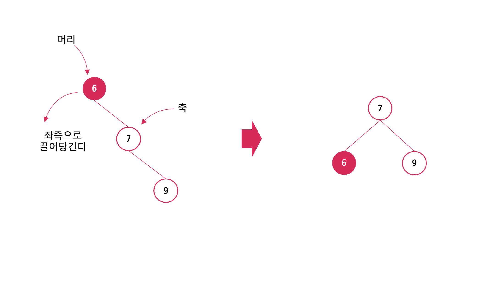

RR 문제를 해결하기 위해 노드를 회전 시켜 균형도를 맞추는 것을 **RR 회전**이라고 한다.

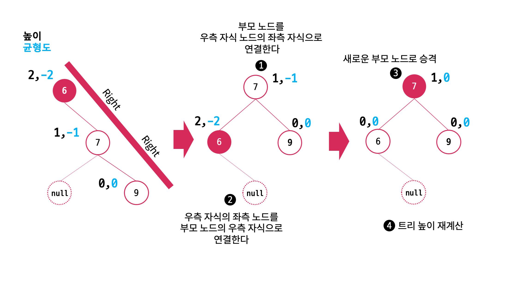

RR 회전은 항상 **부모 노드, 오른쪽 자식 노드, 오른쪽 자식 노드의 왼쪽 자식 노드를 생각해야 한다.**

- 부모 노드를 오른쪽 자식 노드의 왼쪽쪽 자식 노드로 연결한다.
- 오른쪽 자식 노드의 왼쪽 자식 노드가 존재할 시, 부모 노드의 오른쪽 자식 노드로 연결한다.
- 회전이 완료되었으면 새로운 부모 노드로 승격시킨다.
- 트리의 높이를 이전 부모 노드부터 루트 노드까지 위로 올라가며 트리 높이를 재계산한다.

### LR 회전 - LR 불균형 해결

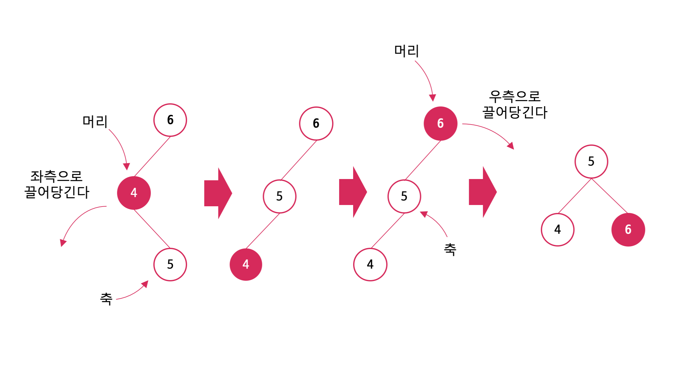

LR 문제를 해결하기 위해 노드를 회전 시켜 균형도를 맞추는 것을 **LR 회전**이라고 한다.

LR 문제는 LL 문제와 RR 문제가 합쳐져 있는 문제로 LR 문제를 해결하기 위해서는
먼저 RR 문제를 해결한 후 LL 문제를 해결하면 된다.

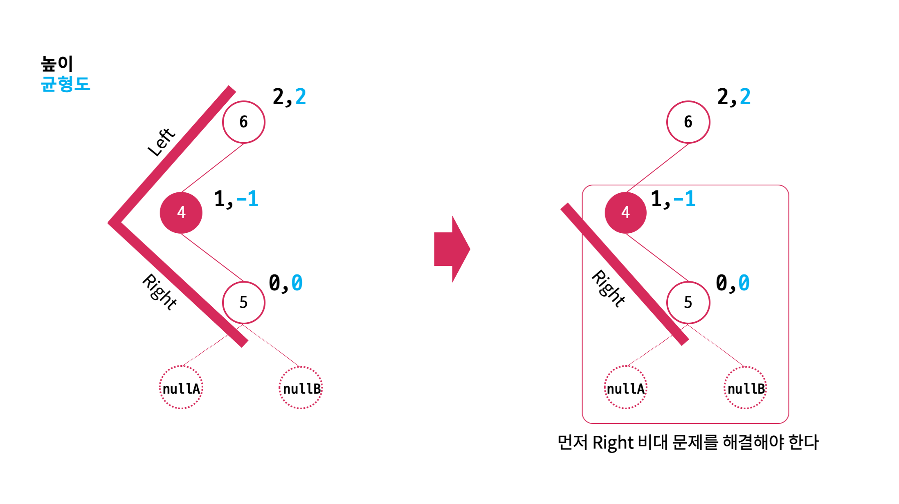

LR 문제를 해결하기 위해 먼저 Right 비대 문제를 해결해야 한다. 일단 부모 노드가 아닌
왼쪽 자식 노드를 부모 노드라고 생각하고 RR 문제를 해결하면 된다.


부모 노드를 기준으로 RR 문제를 해결하면 되므로 RR 회전을 하면 된다.

RR 회전은 항상 **부모 노드, 오른쪽 자식 노드, 오른쪽 자식 노드의 왼쪽 자식 노드를 생각해야 한다.**

- 부모 노드를 오른쪽 자식 노드의 왼쪽쪽 자식 노드로 연결한다.
- 오른쪽 자식 노드의 왼쪽 자식 노드가 존재할 시, 부모 노드의 오른쪽 자식 노드로 연결한다.
- 회전이 완료되었으면 새로운 부모 노드로 승격시킨다.
- 트리의 높이를 이전 부모 노드부터 루트 노드까지 위로 올라가며 트리 높이를 재계산한다.

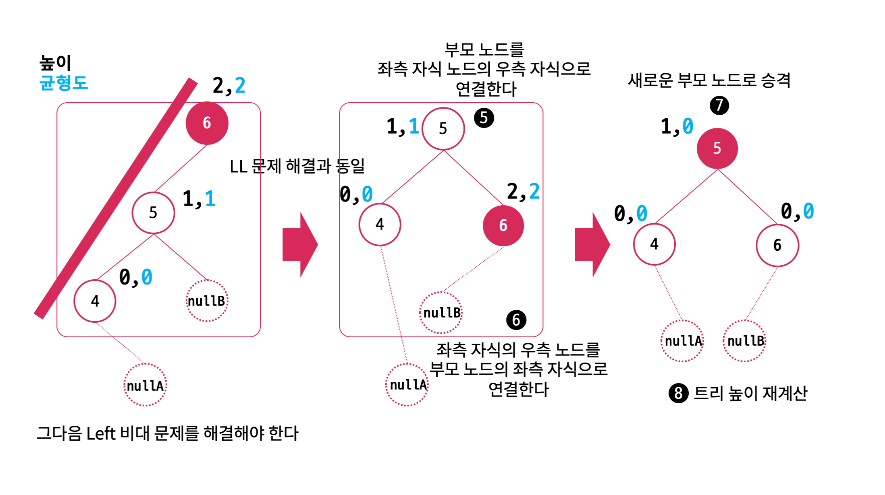

그리고 LL 문제를 해결하기 위해 부모 노드를 기준으로 LL 회전을 하면 된다.

LL 회전은 항상 **부모 노드, 왼쪽 자식 노드, 왼쪽 자식 노드의 오른쪽 자식 노드를 생각해야 한다.**

- 부모 노드를 왼쪽 자식 노드의 오른쪽 자식 노드로 연결한다.
- 왼쪽 자식 노드의 오른쪽 자식 노드가 존재할 시, 부모 노드의 왼쪽 자식 노드로 연결한다.
- 회전이 완료되었으면 새로운 부모 노드로 승격시킨다.
- 트리의 높이를 이전 부모 노드부터 루트 노드까지 위로 올라가며 트리 높이를 재계산한다.

### RL 회전 - RL 불균형 해결

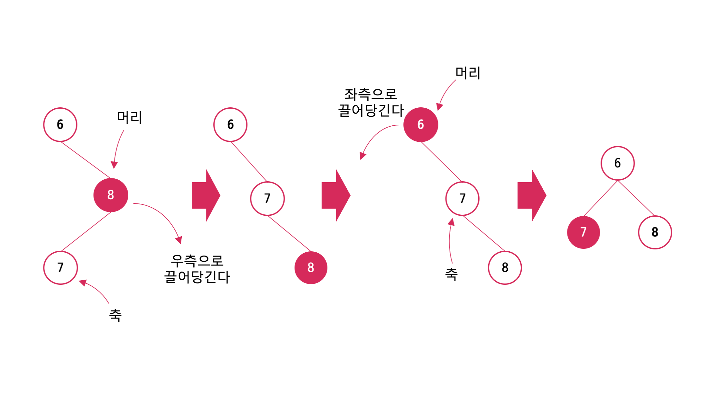

RL 문제를 해결하기 위해 노드를 회전 시켜 균형도를 맞추는 것을 **RL 회전**이라고 한다.

RL 문제는 RR 문제와 LL 문제가 합쳐져 있는 문제로 RL 문제를 해결하기 위해서는
먼저 LL 문제를 해결한 후 RR 문제를 해결하면 된다.

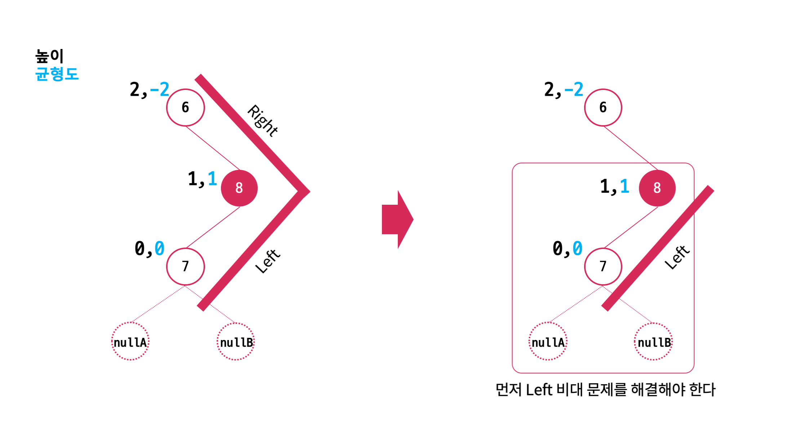

RL 문제를 해결하기 위해 먼저 Left 비대 문제를 해결해야 한다. 일단 부모 노드가 아닌
오른쪽 자식 노드를 부모 노드라고 생각하고 LL 문제를 해결하면 된다.

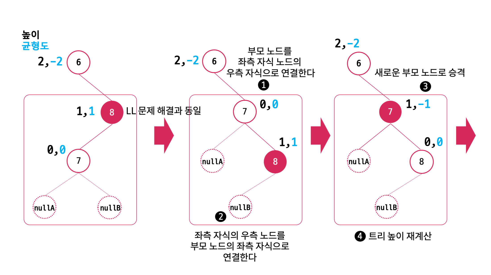

부모 노드를 기준으로 LL 문제를 해결하면 되므로 LL 회전을 하면 된다.

LL 회전은 항상 **부모 노드, 왼쪽 자식 노드, 왼쪽 자식 노드의 오른쪽 자식 노드를 생각해야 한다.**

- 부모 노드를 왼쪽 자식 노드의 오른쪽 자식 노드로 연결한다.
- 왼쪽 자식 노드의 오른쪽 자식 노드가 존재할 시, 부모 노드의 왼쪽 자식 노드로 연결한다.
- 회전이 완료되었으면 새로운 부모 노드로 승격시킨다.
- 트리의 높이를 이전 부모 노드부터 루트 노드까지 위로 올라가며 트리 높이를 재계산한다.

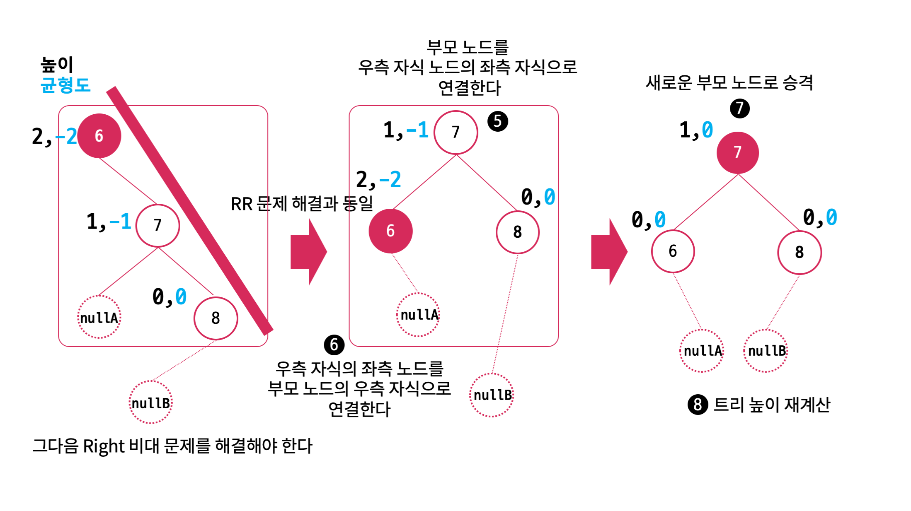

**그리고 RR 문제를 해결하기 위해 부모 노드를 기준으로 RR 회전을 하면 된다.**

RR 회전은 항상 **부모 노드, 오른쪽 자식 노드, 오른쪽 자식 노드의 왼쪽 자식 노드를 생각해야 한다.**

- 부모 노드를 오른쪽 자식 노드의 왼쪽쪽 자식 노드로 연결한다.
- 오른쪽 자식 노드의 왼쪽 자식 노드가 존재할 시, 부모 노드의 오른쪽 자식 노드로 연결한다.
- 회전이 완료되었으면 새로운 부모 노드로 승격시킨다.
- 트리의 높이를 이전 부모 노드부터 루트 노드까지 위로 올라가며 트리 높이를 재계산한다.

---

## 시간복잡도

- 트리의 노드 수: `N`

|    | 평균      | 최악      |
|----|---------|---------|
| 검색 | O(logN) | O(logN) |
| 삽입 | O(logN) | O(logN) |
| 삭제 | O(logN) | O(logN) |

---

## 장점

- 이진 탐색 트리의 단점인 한쪽으로 편향된 트리의 검색/삽입/삭제 시간 복잡도를
`O(N)`에서 `O(logN)`으로 개선한다.

## 단점

- 엄격하게 균형을 유지하기 때문에 삽입/삭제 시 트리 균형을 확인하고
만약 균형이 깨졌다면 트리 구조를 재조정하기 때문에 이 과정에서 시간이 소요된다.

---

# AVL 트리 구현

```java
public class Node<E extends Comparable<E>> {
    E key;
    Node<E> left;
    Node<E> right;
    int height = 0;

    public Node(E key) {
        this.key = key;
    }
}
```

AVL 트리 구현에 사용될 노드 객체로, 유연하게 다양한 형태의 객체들을
저장할 수 있도록 `Comparable`을 구현한 객체들이 저장될 수 있도록 한다.

```java
public interface BinarySearch<E extends Comparable<E>> {
    void add(E key);
    void remove(E key);
    E search(E key);
}

public interface AVLTree<E extends Comparable<E>> extends BinarySearch<E> {
    int getHeight(Node<E> node);            //노드의 높이를 계산
    int getBalance(Node<E> node);           //노드의 균형도를 계산
    void changeNodeHeight(Node<E> node);    //노드의 높이를 변경
    Node<E> LL_rotate(Node<E> node);        //LL 회전
    Node<E> RR_rotate(Node<E> node);        //RR 회전
    Node<E> rotate(Node<E> node);           //균형을 맞추기 위해 회전
}
```

AVL 트리는 이진 탐색 트리의 일종이기 때문에 기본적으로 이진 탐색 트리의 기본 행위는 모두 구현해야 한다.
그리고 AVL 트리는 균형을 유지하기 위해 추가적인 처리가 필요하기 때문에 그에 맞는
행위들을 추가로 구현해주어야 한다.

## 노드의 높이 & 균형도 계산

```java
public class AVLTreeImpl<E extends Comparable<E>> implements AVLTree<E> {

    @Override
    public int getHeight(Node<E> node) {
        /*노드의 높이를 계산*/
        int leftChildHeight = (node.left != null) ? node.left.height : -1;
        int rightChildHeight = (node.right != null) ? node.right.height : -1;

        return Math.max(leftChildHeight, rightChildHeight) + 1;
    }

    @Override
    public int getBalance(Node<E> node) {
        /*노드의 균형도를 계산*/
        int leftChildHeight = (node.left != null) ? node.left.height : -1;
        int rightChildHeight = (node.right != null) ? node.right.height : -1;

        return leftChildHeight - rightChildHeight;
    }
}
```

- **노드의 높이** : 왼쪽 자식 노드와 오른쪽 자식 노드의 높이 중 가장 큰 값에 1을 더한 값
- **노드의 균형도** : 왼쪽 자식 노드의 높이 - 오른쪽 자식 노드의 높이
- 자식 노드가 없으면 `-1`로 계산한다.

## 노드의 높이를 변경

```java
public class AVLTreeImpl<E extends Comparable<E>> implements AVLTree<E> {
    
    @Override
    public void changeNodeHeight(Node<E> node) {
        /*노드의 높이를 변경*/
        node.height = getHeight(node);
    }
}
```

## LL 회전

```java
public class AVLTreeImpl<E extends Comparable<E>> implements AVLTree<E> {
    
    @Override
    public Node<E> LL_rotate(Node<E> node) {
        /*LL 회전*/
        Node<E> L = node.left; //왼쪽 자식 노드
        Node<E> LR = L.right;  //왼쪽 자식 노드의 오른쪽 자식 노드

        L.right = node;     //부모 노드를 왼쪽 자식 노드의 오른쪽 자식 노드로 연결
        node.left = LR;     //왼쪽 자식 노드의 오른쪽 자식 노드를 부모의 왼쪽 자식 노드로 연결

        //높이에 영향을 받은 노드 높이 재계산
        changeNodeHeight(node);
        changeNodeHeight(L);

        return L; //새로운 부모 노드가 될 왼쪽 자식 노드를 반환
    }
}
```

## RR 회전

```java
public class AVLTreeImpl<E extends Comparable<E>> implements AVLTree<E> {
    
    @Override
    public Node<E> RR_rotate(Node<E> node) {
        /*RR 회전*/
        Node<E> R = node.right; //오른쪽 자식 노드
        Node<E> RL = R.left;    //오른쪽 자식 노드의 왼쪽 자식 노드

        R.left = node;      //부모 노드를 오른쪽 자식 노드의 왼쪽 자식 노드로 연결
        node.right = RL;    //오른쪽 자식 노드의 왼쪽 자식 노드를 부모 노드의 오른쪽 자식 노드로 연결

        //높이에 영향을 받은 노드 높이 재계산
        changeNodeHeight(node);
        changeNodeHeight(R);

        return R; //새로운 부모 노드가 될 오른쪽 자식 노드를 반환
    }
}
```

## 노드 회전

```java
public class AVLTreeImpl<E extends Comparable<E>> implements AVLTree<E> {
    
    @Override
    public Node<E> rotate(Node<E> node) {
        int balance = getBalance(node);

        //균형도가 절댓값 2 이상일 때만 회전한다.
        if (Math.abs(balance) > 1) {
            /*회전으로 인해 변경된 새로운 node를 반환*/

            if (balance > 1) {
                //부모의 균형도가 양수 && 왼쪽 자식 노드의 균형도가 양수 == LL 문제
                if (getBalance(node.left) == 1) {
                    node = LL_rotate(node);
                }
                //부모의 균형도가 양수 && 왼쪽 자식 노드의 균형도가 음수 == LR 문제
                else if (getBalance(node.left) == -1) {
                    node.left = RR_rotate(node.left);
                    node = LL_rotate(node);
                }
            }
            else if (balance < -1) {
                //부모의 균형도가 음수 && 오른쪽 자식 노드의 균형도가 음수 == RR 문제
                if (getBalance(node.right) == -1) {
                    node = RR_rotate(node);
                }
                //부모의 균형도가 음수 && 오른쪽 자식 노드의 균형도가 양수 == RL 문제
                else if (getBalance(node.right) == 1) {
                    node.right = LL_rotate(node.right);
                    node = RR_rotate(node);
                }
            }
        }

        //균형도가 {-1, 0, 1}이면 아무 일도 하지 않는다.
        return node;
    }
}
```

- **LL 문제인 경우**
  - LL 회전 후 새로운 부모 노드 반환
- **LR 문제인 경우**
  - 왼쪽 자식 노드를 부모 노드라고 생각하고 RR 회전 후 반환된 새로운
    부모 노드를 왼쪽 자식 노드로 연결
  - LL 회전 후 새로운 부모 노드 반환
- **RR 문제인 경우**
  - RR 회전 후 새로운 부모 노드 반환
- **RL 문제인 경우**
  - 오른쪽 자식 노드를 부모 노드라고 생각하고 LL 회전 후 반환된 새로운
    부모 노드를 오른쪽 자식 노드로 연결
  - RR 회전 후 새로운 부모 노드 반환

## 키를 추가

```java
public class AVLTreeImpl<E extends Comparable<E>> implements AVLTree<E> {

    @Override
    public void add(E key) {
        /*키를 추가*/
        root = insertNode(root, key);
    }

    private Node<E> insertNode(Node<E> node, E key) {
        if (node == null) {
            return new Node<>(key);
        }
        int compare = node.key.compareTo(key);

        if (compare > 0) {
            node.left = insertNode(node.left, key);
        } else if (compare < 0) {
            node.right = insertNode(node.right, key);
        }

        //AVL 트리 추가
        changeNodeHeight(node);
        return rotate(node);
    }
}
```

- AVL 트리도 이진 탐색 트리이기 때문에 키를 추가하는 과정은 이진 탐색 트리와
완전히 같다.
- 다만 항상 균형을 유지해야 하기 때문에 키를 추가하기 위해 거쳤던 노드들을
다시 재귀적으로 올라가면서 높이를 재계산하고 필요시 노드를 회전하는 추가 로직이 필요하다.

## 키를 삭제

```java
public class AVLTreeImpl<E extends Comparable<E>> implements AVLTree<E> {

    @Override
    public void remove(E key) {
        /*키를 삭제*/
        this.root = removeNode(root, key);
    }

    private Node<E> removeNode(Node<E> node, E key) {
        if (node == null) {
            throw new RuntimeException("Not exists node");
        }

        /*삭제할 키를 찾는 과정*/
        int compare = node.key.compareTo(key);

        if (compare > 0) {
            node.left = removeNode(node.left, key);
        } else if (compare < 0) {
            node.right = removeNode(node.right, key);
        }
        /*삭제할 키를 찾는 과정*/

        else {
            /*삭제할 키를 찾으면 swap 가능한 선임자 또는 후임자 값을 찾는 과정*/
            if (node.left != null) {
                Node<E> predecessor = getLargestNode(node.left); //왼쪽 서브 트리 중 가장 큰 값
                swap(node, predecessor); //swap
                node.left = removeNode(node.left, key);
            }
            else if (node.right != null) {
                Node<E> successor = getSmallestNode(node.right); //오른쪽 서브 트리 중 가장 큰 값
                swap(node, successor); //swap
                node.right = removeNode(node.right, key);
            }
            /*삭제할 키를 찾으면 swap 가능한 선임자 또는 후임자 값을 찾는 과정*/

            else {
                return null; //리프 노드의 경우 연결을 끊는다.
            }
        }

        //AVL 트리 추가
        changeNodeHeight(node);
        return rotate(node);
    }

    private void swap(Node<E> node, Node<E> alterNode) {
        E temp = node.key;
        node.key = alterNode.key;
        alterNode.key = temp;
    }

    private Node<E> getLargestNode(Node<E> node) {
        if (node.right == null) {
            return node;
        }
        return getLargestNode(node.right);
    }

    private Node<E> getSmallestNode(Node<E> node) {
        if (node.left == null) {
            return node;
        }
        return getSmallestNode(node.left);
    }
}
```

- AVL 트리도 이진 탐색 트리이기 때문에 키를 삭제하는 과정은 이진 탐색 트리와
  완전히 같다.
- 다만 항상 균형을 유지해야 하기 때문에 키를 삭제하기 위해 거쳤던 노드들을
  다시 재귀적으로 올라가면서 높이를 재계산하고 필요시 노드를 회전하는 추가 로직이 필요하다.

## 키 검색

```java
public class AVLTreeImpl<E extends Comparable<E>> implements AVLTree<E> {

    @Override
    public E search(E key) {
        /*키 검색*/
        return searchNode(root, key).key;
    }

    private Node<E> searchNode(Node<E> node, E key) {
        if (node == null) throw new RuntimeException("Not exists node");

        int compare = node.key.compareTo(key);

        if (compare > 0) {
            return searchNode(node.left, key);
        }
        else if (compare < 0) {
            return searchNode(node.right, key);
        }

        return node;
    }
}
```

- AVL 트리도 이진 탐색 트리이기 때문에 키를 검색하는 과정은 이진 탐색 트리와
  완전히 같다.

## 전체 구현 및 사용 코드

```java
import java.util.ArrayList;
import java.util.List;
import java.util.stream.Collectors;

public class AVLTreeImpl<E extends Comparable<E>> implements AVLTree<E> {

    private Node<E> root;

    @Override
    public int getHeight(Node<E> node) {
        /*노드의 높이를 계산*/
        int leftChildHeight = (node.left != null) ? node.left.height : -1;
        int rightChildHeight = (node.right != null) ? node.right.height : -1;

        return Math.max(leftChildHeight, rightChildHeight) + 1;
    }

    @Override
    public int getBalance(Node<E> node) {
        /*노드의 균형도를 계산*/
        int leftChildHeight = (node.left != null) ? node.left.height : -1;
        int rightChildHeight = (node.right != null) ? node.right.height : -1;

        return leftChildHeight - rightChildHeight;
    }

    @Override
    public void changeNodeHeight(Node<E> node) {
        /*노드의 높이를 변경*/
        node.height = getHeight(node);
    }

    @Override
    public Node<E> LL_rotate(Node<E> node) {
        /*LL 회전*/
        Node<E> L = node.left; //왼쪽 자식 노드
        Node<E> LR = L.right;  //왼쪽 자식 노드의 오른쪽 자식 노드

        L.right = node;     //부모 노드를 왼쪽 자식 노드의 오른쪽 자식 노드로 연결
        node.left = LR;     //왼쪽 자식 노드의 오른쪽 자식 노드를 부모의 왼쪽 자식 노드로 연결

        //높이에 영향을 받은 노드 높이 재계산
        changeNodeHeight(node);
        changeNodeHeight(L);

        return L; //새로운 부모 노드가 될 왼쪽 자식 노드를 반환
    }

    @Override
    public Node<E> RR_rotate(Node<E> node) {
        /*RR 회전*/
        Node<E> R = node.right; //오른쪽 자식 노드
        Node<E> RL = R.left;    //오른쪽 자식 노드의 왼쪽 자식 노드

        R.left = node;      //부모 노드를 오른쪽 자식 노드의 왼쪽 자식 노드로 연결
        node.right = RL;    //오른쪽 자식 노드의 왼쪽 자식 노드를 부모 노드의 오른쪽 자식 노드로 연결

        //높이에 영향을 받은 노드 높이 재계산
        changeNodeHeight(node);
        changeNodeHeight(R);

        return R; //새로운 부모 노드가 될 오른쪽 자식 노드를 반환
    }

    @Override
    public Node<E> rotate(Node<E> node) {
        int balance = getBalance(node);

        //균형도가 절댓값 2 이상일 때만 회전한다.
        if (Math.abs(balance) > 1) {
            /*회전으로 인해 변경된 새로운 node를 반환*/

            if (balance > 1) {
                //부모의 균형도가 양수 && 왼쪽 자식 노드의 균형도가 양수 == LL 문제
                if (getBalance(node.left) == 1) {
                    node = LL_rotate(node);
                }
                //부모의 균형도가 양수 && 왼쪽 자식 노드의 균형도가 음수 == LR 문제
                else if (getBalance(node.left) == -1) {
                    node.left = RR_rotate(node.left);
                    node = LL_rotate(node);
                }
            }
            else if (balance < -1) {
                //부모의 균형도가 음수 && 오른쪽 자식 노드의 균형도가 음수 == RR 문제
                if (getBalance(node.right) == -1) {
                    node = RR_rotate(node);
                }
                //부모의 균형도가 음수 && 오른쪽 자식 노드의 균형도가 양수 == RL 문제
                else if (getBalance(node.right) == 1) {
                    node.right = LL_rotate(node.right);
                    node = RR_rotate(node);
                }
            }
        }

        //균형도가 {-1, 0, 1}이면 아무 일도 하지 않는다.
        return node;
    }

    @Override
    public void add(E key) {
        /*키를 추가*/
        root = insertNode(root, key);
    }

    private Node<E> insertNode(Node<E> node, E key) {
        if (node == null) {
            return new Node<>(key);
        }
        int compare = node.key.compareTo(key);

        if (compare > 0) {
            node.left = insertNode(node.left, key);
        } else if (compare < 0) {
            node.right = insertNode(node.right, key);
        }

        //AVL 트리 추가
        changeNodeHeight(node);
        return rotate(node);
    }

    @Override
    public void remove(E key) {
        /*키를 삭제*/
        this.root = removeNode(root, key);
    }

    private Node<E> removeNode(Node<E> node, E key) {
        if (node == null) {
            throw new RuntimeException("Not exists node");
        }

        /*삭제할 키를 찾는 과정*/
        int compare = node.key.compareTo(key);

        if (compare > 0) {
            node.left = removeNode(node.left, key);
        } else if (compare < 0) {
            node.right = removeNode(node.right, key);
        }
        /*삭제할 키를 찾는 과정*/

        else {
            /*삭제할 키를 찾으면 swap 가능한 선임자 또는 후임자 값을 찾는 과정*/
            if (node.left != null) {
                Node<E> predecessor = getLargestNode(node.left); //왼쪽 서브 트리 중 가장 큰 값
                swap(node, predecessor); //swap
                node.left = removeNode(node.left, key);
            }
            else if (node.right != null) {
                Node<E> successor = getSmallestNode(node.right); //오른쪽 서브 트리 중 가장 큰 값
                swap(node, successor); //swap
                node.right = removeNode(node.right, key);
            }
            /*삭제할 키를 찾으면 swap 가능한 선임자 또는 후임자 값을 찾는 과정*/

            else {
                return null; //리프 노드의 경우 연결을 끊는다.
            }
        }

        //AVL 트리 추가
        changeNodeHeight(node);
        return rotate(node);
    }

    private void swap(Node<E> node, Node<E> alterNode) {
        E temp = node.key;
        node.key = alterNode.key;
        alterNode.key = temp;
    }

    private Node<E> getLargestNode(Node<E> node) {
        if (node.right == null) {
            return node;
        }
        return getLargestNode(node.right);
    }

    private Node<E> getSmallestNode(Node<E> node) {
        if (node.left == null) {
            return node;
        }
        return getSmallestNode(node.left);
    }

    @Override
    public E search(E key) {
        /*키 검색*/
        return searchNode(root, key).key;
    }

    private Node<E> searchNode(Node<E> node, E key) {
        if (node == null) throw new RuntimeException("Not exists node");

        int compare = node.key.compareTo(key);

        if (compare > 0) {
            return searchNode(node.left, key);
        }
        else if (compare < 0) {
            return searchNode(node.right, key);
        }

        return node;
    }

    //오름차순 순회(중위 순회)
    public void traversal() {
        List<E> result = new ArrayList<>();
        inOrder(this.root, result);

        System.out.println(
            result.stream()
                  .map(E::toString)
                  .collect(Collectors.joining(" => "))
        );
    }

    private void inOrder(Node<E> node, List<E> result) {
        if (node == null) {
            return;
        }
        inOrder(node.left, result);
        result.add(node.key);
        inOrder(node.right, result);
    }
}
```
```java
public class Main {
    public static void main(String[] args) {

        AVLTreeImpl<Integer> avl = new AVLTreeImpl<>();
        avl.add(5);
        avl.add(2);
        avl.add(9);
        avl.add(3);
        avl.add(7);
        avl.add(4); //회전 발생
        avl.add(8); //회전 발생
        avl.add(1);
        avl.add(6);

        avl.traversal();
        avl.remove(9); //회전 발생
        avl.traversal();
    }
}
```
```text
1 => 2 => 3 => 4 => 5 => 6 => 7 => 8 => 9
1 => 2 => 3 => 4 => 5 => 6 => 7 => 8
```

---

### 참고

- [자료구조 시각화 사이트](https://www.cs.usfca.edu/~galles/visualization/AVLtree.html)
- [유튜브](https://www.youtube.com/watch?v=syGPNOhsnI4&list=PLcXyemr8ZeoR82N8uZuG9xVrFIfdnLd72&index=9)
- [사이트](https://www.codelatte.io/courses/java_data_structure/7NPGIERM1X8R4IEW)