# Red-Black 트리

## 기본 개념

**Red-Black 트리**는 [이진 탐색 트리](https://github.com/genesis12345678/TIL/blob/main/dataStructure/non_linear/bst/BST.md)의 규칙을 가지고 있으며
[AVL 트리](https://github.com/genesis12345678/TIL/blob/main/dataStructure/non_linear/avl/AVLTree.md)와 비슷하게 스스로 균형을 잡는 이진 탐색 트리이다. 삽입/삭제 시 노드가 가지고 있는
색깔을 이용한 규칙을 통해 불균형을 완화한다.

---

## AVL 트리와 차이점

- AVL 트리에 비해 균형을 엄격하게 맞추지 않으며 노드의 재배치를 빈번하게
실행하지 않기 때문에 삽입/삭제 연산이 AVL 트리보다 평균적으로 더 나은 성능을 가진다.
- AVL 트리보다 덜 균형하기 때문에 평균적인 탐색 횟수는 AVL 트리보다 더 많을 수 있다.

삽입/삭제 연산이 빈번한 경우 **Red-Black 트리**를 이용하는 것이 좀 더 낫고,
삽입/삭제 연산이 빈번하지 않고 탐색의 성능이 더 중요한 경우 **AVL 트리**를 이용하는 것이
더 낫다.

---

## 5가지 규칙

### 1.모든 노드는 빨강 또는 검정이다.

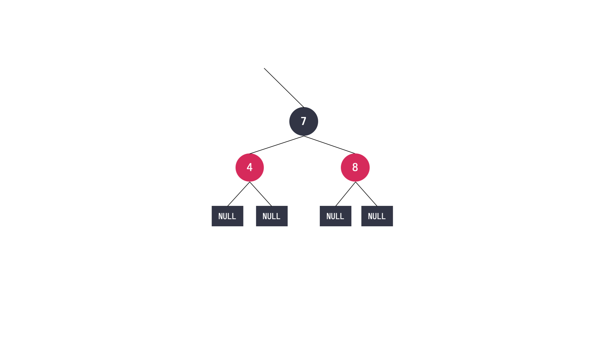

> Red-Black 트리는 빨강 또는 검정으로 이루어져 있는 노드로 구성되어 있다.
> 이 외의 색깔의 노드는 존재할 수 없다.

### 2. 루트 노드는 항상 검정이다.

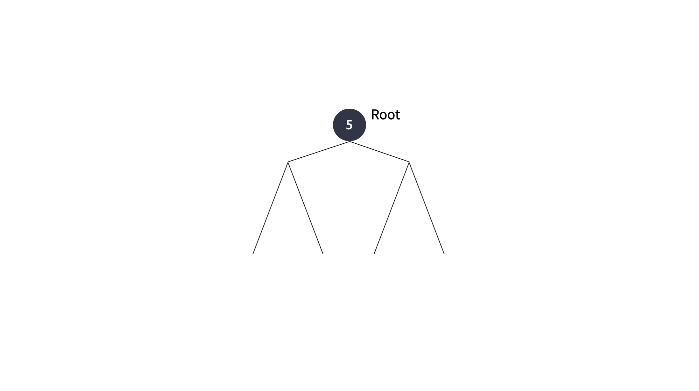

> Red-Black 트리에서 삽입/삭제로 인한 노드의 재배치가 실행될 때 일시적으로
> 루트 노드가 빨강 노드가 될 순 있으나 최종적으로는 항상 검정 노드여야 한다.

### 3. 모든 리프 노드는 검정이다.

### 4. 모든 빨강 노드의 자식은 검정 노드이다.

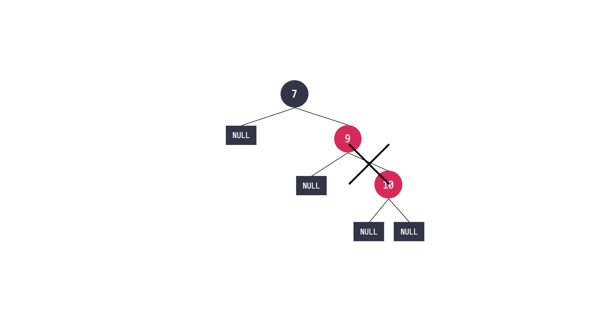

> 빨강 노드의 자식 노드로 검정 노드만 배치될 수 있다. 즉 빨강 노드가 
> 연속적으로 존재할 수 없으며 빨강 노드의 자식 노드로 빨강 노드가 오는 것을
> **Double Red**라고 한다. 해당 규칙을 어기면 노드 재배치가 실행된다.

### 5. 임의의 노드에서 리프 노드로 가는 모든 경로에는 동일한 수의 검정 노드가 존재한다.


> 특정 노드를 기준으로 리프 노드로 가는 모든 경로를 봤을 때 항상 동일한 수의
> 검정 노드가 존재해야 한다(자기 자신은 제외). 해당 규칙을 어기면 노드 재배치가 실행된다.

---

## Red-Black 트리의 삽입

기본적으로 Red-Black 트리는 이진 탐색 트리이기 때문에 노드를 삽입하는 과정은
이진 탐색 트리와 동일하다. 그러나 Red-Black 트리의 5가지 규칙을 유지하기 위해서
추가적인 재배치가 실행될 수 있다.

1. 삽입 시 이진 탐색 트리의 규칙에 의해 노드의 위치가 정해지며 항상 **빨강 노드로 삽입**된다.
   - 삽입 후에도 5번 속성을 만족하기 위해 삽입하는 노드는 항상 빨강 노드이다.
2. Red-Black 트리 규칙에 의해 삽입된 위치에서 부모 노드가 빨강 노드인 경우 재배치를 실행한다. (Double Red)
3. 루트 노드인 경우 해당 노드를 검정색으로 변경한다.

**노드가 재배치되는 상황을 네 가지로 나눌 수 있다.**
(밑의 내용은 네 가지이지만, 오른쪽-왼쪽 대칭으로 인해 총 여덟 가지가 된다.)

### 1. 삼촌 빨강, 오른쪽-오른쪽(왼쪽-왼쪽) Double Red

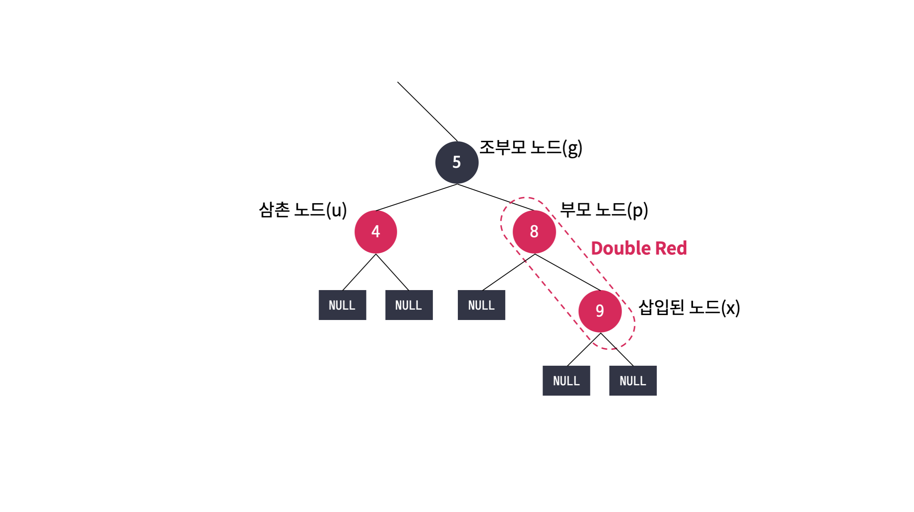

4번 규칙(모든 빨강 노드의 자식은 검정 노드)에 위배된 상황이며 부모와 삼촌(부모의 형제)이 빨강,
부모의 오른쪽(왼쪽) 자식으로 빨강 노드가 삽입된 경우이다. 이런 경우는
노드의 색깔만 변경하는 방식을 사용한다.

- 조부모 노드(부모의 부모)의 색깔을 빨강으로 변경한다.
- 삼촌 노드와 부모 노드의 색깔을 검정으로 변경한다.

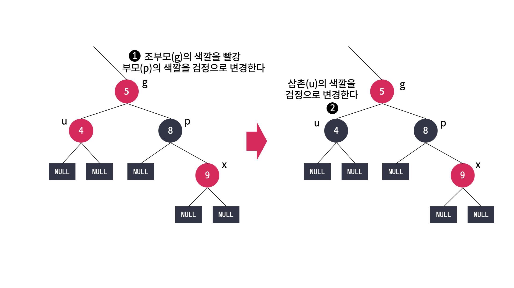

### 2. 삼촌 빨강, 오른쪽-왼쪽(왼쪽-오른쪽) Double Red

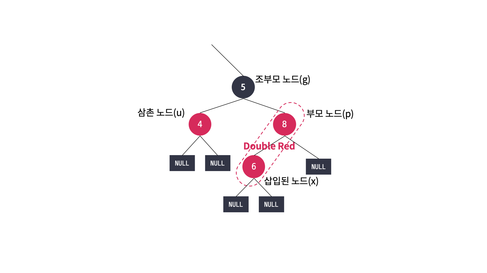

부모와 삼촌이 빨강, 부모의 왼쪽(오른쪽) 자식으로 빨강 노드가 삽입된 경우이다.

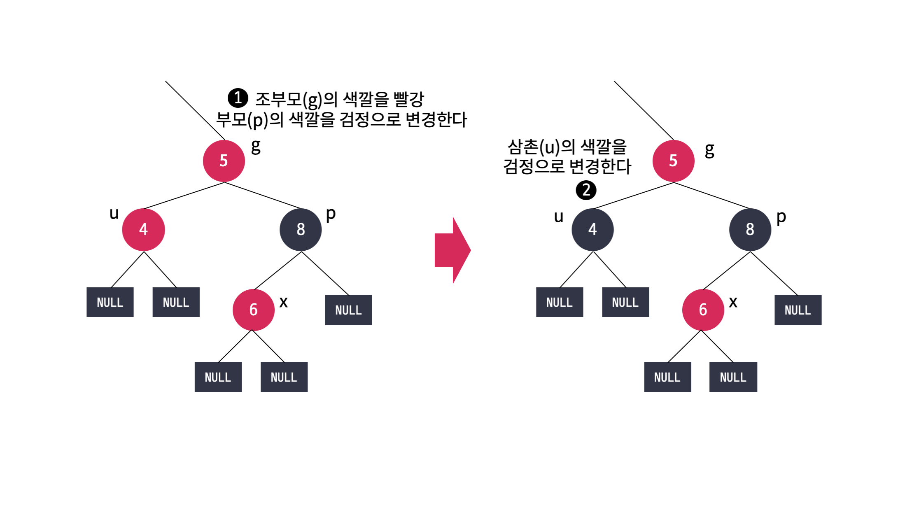

1번 상황과 마찬가지로 똑같은 방법을 사용하면 된다.

### 3. 삼촌 검정, 오른쪽-오른쪽(왼쪽-왼쪽) Double Red

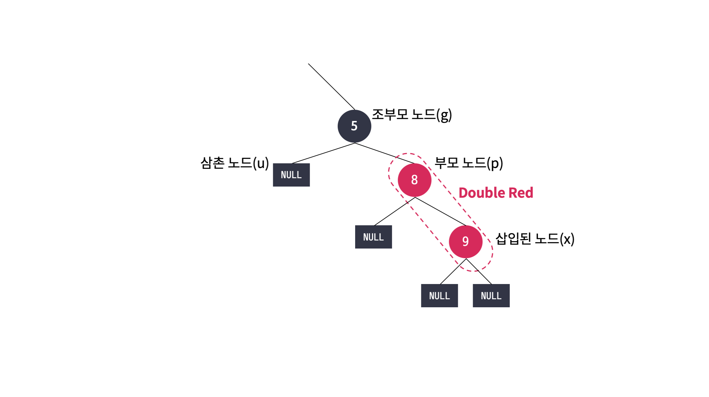

4번 규칙(모든 빨강 노드의 자식은 검정 노드)에 위배된 상황이며 부모가 빨강, 삼촌(부모의 형제)이 검정,
부모의 오른쪽(왼쪽) 자식으로 빨강 노드가 삽입된 경우이다. 이런 경우는
노드를 회전시키는 방식을 사용한다.

1. 조부모 노드(부모의 부모)와 부모 노드의 색깔을 swap한다.
2. 부모 노드를 축으로 **Left-Rotation(Right-Rotation)** 을 실행한다. ([AVL 트리의 RR(LL) 회전](https://github.com/genesis12345678/TIL/blob/main/dataStructure/non_linear/avl/AVLTree.md#%EB%85%B8%EB%93%9C-%ED%9A%8C%EC%A0%84)과 동일)

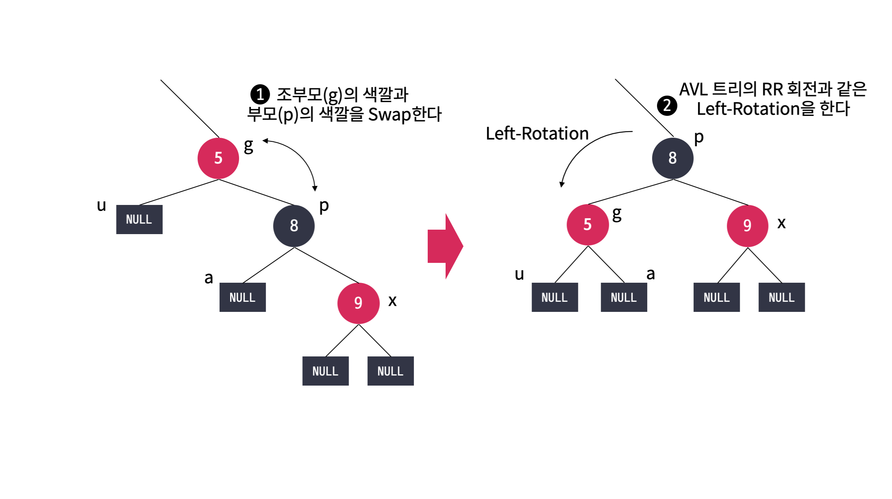

### 4. 삼촌 검정, 오른쪽-왼쪽(왼쪽-오른쪽) Double Red

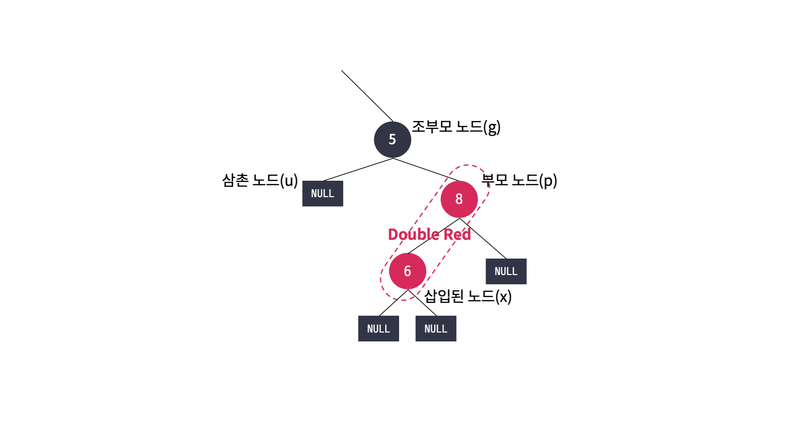

4번 규칙(모든 빨강 노드의 자식은 검정 노드)에 위배된 상황이며 부모가 빨강, 삼촌(부모의 형제)이 검정,
부모의 오른쪽(왼쪽) 자식으로 빨강 노드가 삽입된 경우이다. 이런 경우는
노드를 회전시키는 방식을 사용한다.

- 부모 노드를 축으로 **Right-Rotation(Left-Rotation)** 을 실행한다. ([AVL 트리의 LL(RR) 회전](https://github.com/genesis12345678/TIL/blob/main/dataStructure/non_linear/avl/AVLTree.md#%EB%85%B8%EB%93%9C-%ED%9A%8C%EC%A0%84)과 동일)
- 조부모 노드와 새로운 부모 노드의 색깔을 swap한다.
- 새로운 부모 노드를 축으로 **Left-Rotation(Right-Rotation)** 을 실행한다. ([AVL 트리의 RR(LL) 회전](https://github.com/genesis12345678/TIL/blob/main/dataStructure/non_linear/avl/AVLTree.md#%EB%85%B8%EB%93%9C-%ED%9A%8C%EC%A0%84)과 동일)

즉 색깔을 변경하는 것을 제외하면 AVL 트리의 RL 회전(LR 회전)과 동일한 방식으로 회전한다.

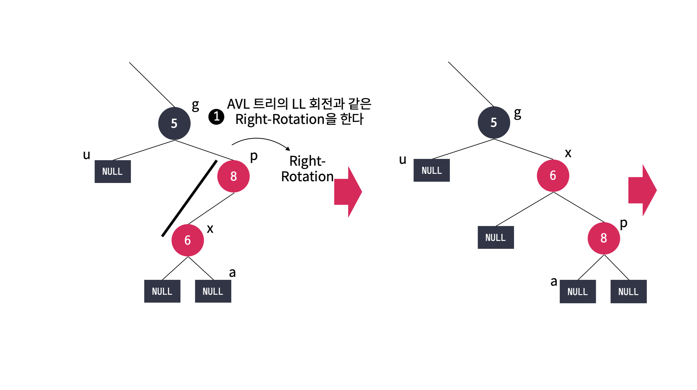

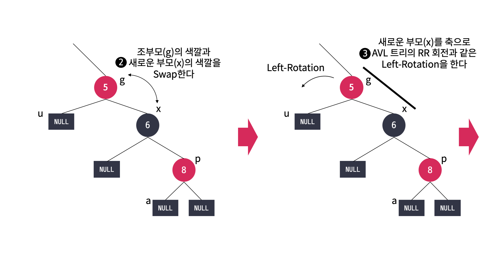


---

## Red-Black 트리의 삭제

기본적으로 Red-Black 트리는 이진 탐색 트리이기 때문에 삭제하는 노드를 찾아내고 재배치하는 
과정은 이진 탐색 트리와 동일하다. 그러나 Red-Black 트리의 5가지 규칙을 유지하기 위해서
추가적인 재배치가 실행될 수 있다.

**빨강 노드가 삭제되면 트리의 균형은 무너지지 않는다.**
빨강 노드가 삭제되는 것은 **4번 규칙**(모든 빨강 노드의 자식은 검정 노드)과
**5번 규칙**(임의의 노드에서 리프 노드로 가는 모든 경로에는 동일한 수의 검정 노드가 존재한다)을
위반할 일이 없기 때문에 트리가 재배치되지 않는다.

**반면 검정 노드가 삭제되면 트리의 규칙이 무너질 수 있다.**
만약 검정 노드가 삭제되면 **5번 규칙**(임의의 노드에서 리프 노드로 가는 모든 경로에는 동일한 수의 검정 노드가 존재한다)을
충분히 위반할 수 있기 때문에 이때 여러 가지 방법으로 노드의 재배치를 수행해야 한다.

### Case 1 - 형제 노드가 빨강 노드

만약 삭제할 노드의 형제 노드가 빨강 노드인 경우에 삭제할 노드의 서브 트리의
검정 노드의 개수가 부족하므로 개수를 늘려주어야 한다. 이를 위해 가장 먼저
부모 노드의 색깔과 형제 노드의 색깔을 swap한다.

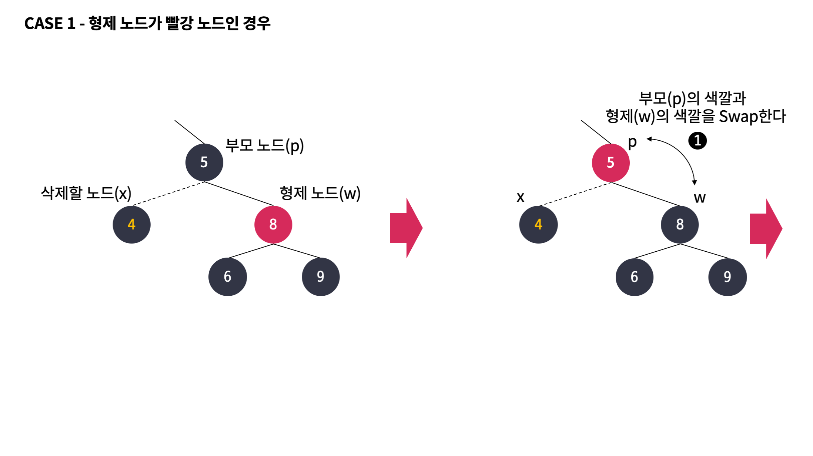

그리고 형제 노드를 축으로 [AVL 트리의 RR 회전](https://github.com/genesis12345678/TIL/blob/main/dataStructure/non_linear/avl/AVLTree.md#rr-%ED%9A%8C%EC%A0%84---rr-%EB%B6%88%EA%B7%A0%ED%98%95-%ED%95%B4%EA%B2%B0)과 같은 **Left-Rotation**을 한다.
그러나 경로상 검정 노드의 개수가 동일하지 않은 문제가 생기므로 추가적인 재배치가 필요하다.
이는 밑의 Case - 2, 3, 4 중에 하나로 해결한다.

### Case 2 - 형제 노드의 자식이 모두 검정

형제 노드의 자식 노드 색깔이 모두 검정색인 경우는 리프 노드 또는 데이터가 존재하는
검정 노드인 경우이다. Case 2 문제에서는 오른쪽(왼쪽) 서브 트리의 검정 노드 개수를 줄이기 위해
형제 노드의 색깔을 빨간색으로 변경한다. 그러나 반대편의 서브 트리는 균형이 안 맞을 수 있기 때문에
상위 노드로 올라가 다시 Case 2 문제를 해결하거나 Case 1, 3, 4의 문제를 해결해야 할 수 있다.

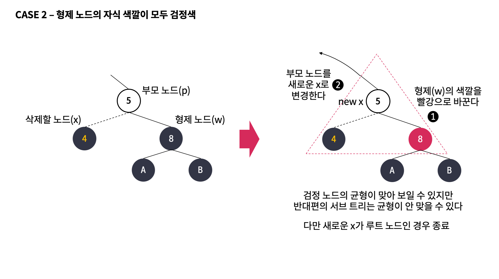

### Case 3 - 형제 노드의 왼쪽 자식이 빨강, 오른쪽 자식이 검정

형제 노드의 왼쪽 자식 노드가 빨강이고 오른쪽 자식 노드가 검정 노드인 경우
형제 노드의 색깔과 형제 노드의 왼쪽 자식 노드와 색깔을 swap한다.

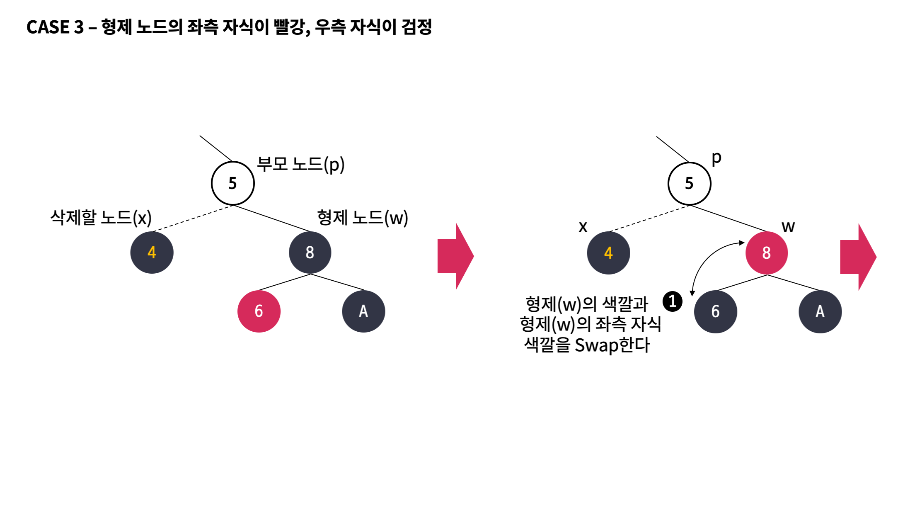

형제 노드의 왼쪽 자식 노드를 축으로 [AVL 트리의 LL 회전](https://github.com/genesis12345678/TIL/blob/main/dataStructure/non_linear/avl/AVLTree.md#ll-%ED%9A%8C%EC%A0%84---ll-%EB%B6%88%EA%B7%A0%ED%98%95-%ED%95%B4%EA%B2%B0)과 같은 **Right-Rotation**을 한다.
Case 3의 문제를 해결하면 반드시 Case 4의 상황으로 해결한다.

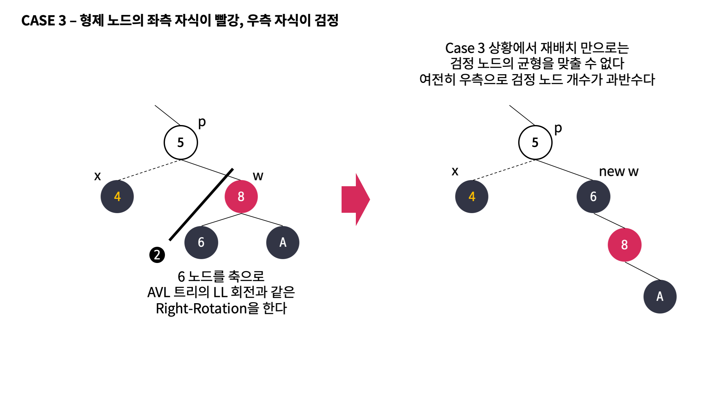

### Case 4 - 형제 노드의 오른쪽 자식이 빨강, 왼쪽 자식은 상관 없음

부모 노드의 색깔과 형제 노드의 왼쪽 자식 노드의 색깔은 빨강 또는 검정 노드일 수 있다.
먼저 부모 노드의 색깔과 형제 노드의 색깔을 swap 한다.

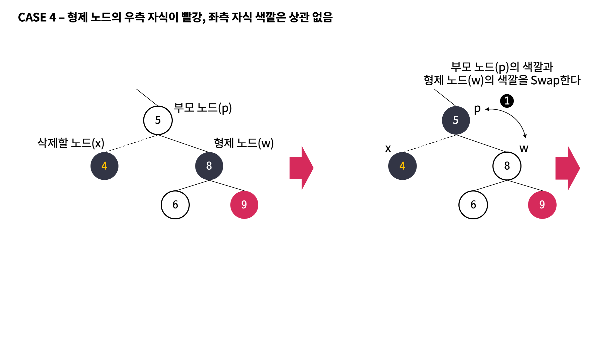

형재 노드의 오른쪽 자식 노드의 색깔을 검정색으로 변경하고, 형제 노드를 축으로
[AVL 트리의 RR 회전](https://github.com/genesis12345678/TIL/blob/main/dataStructure/non_linear/avl/AVLTree.md#rr-%ED%9A%8C%EC%A0%84---rr-%EB%B6%88%EA%B7%A0%ED%98%95-%ED%95%B4%EA%B2%B0)과 같은 **Left-Rotation**을 한다.

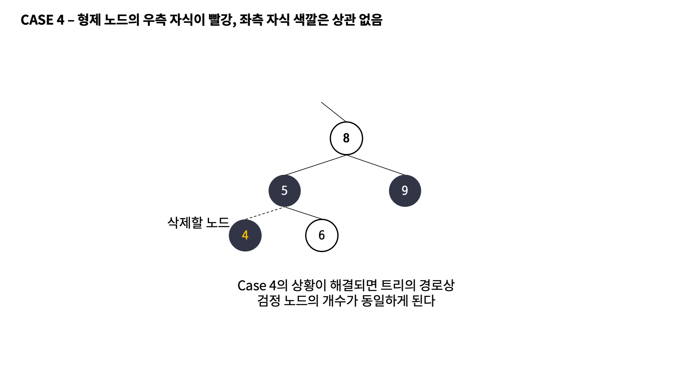

Case 4의 상황이 해결되면 트리의 경로상 검정 노드의 개수가 동일하게 된다.

---

## Red-black 트리 삭제 예시

검정 노드가 삭제되어 노드의 재배치가 수행되다보면 다음과 같은 상황이 발생할 수 있다.
예를 들어 Case 1의 상황이 발생하면 그 다음 상황으로 Case 2, 3, 4의 상황으로 진행될 수 있다.

### 예제 1 - (Case 2 → Case 2 → 종료)

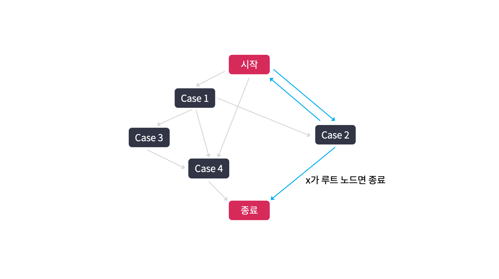

다음과 같은 트리가 있다고 해보자. (모든 노드가 검정 노드인 경우도 Red-Black 트리의 규칙을 위반하지 않는다.)


만약 노드 1을 삭제할 때 **Case 2 - 형제 노드의 자식이 모두 검정**인 상황이다.

1. 형제 노드(3)의 색깔을 빨간색으로 변경한다.
2. 부모 노드(2)를 새로운 `x`로 변경한다.


그러면 또 다시 **Case 2 - 형제 노드의 자식이 모두 검정**인 상황이다.

1. 형제 노드(6)의 색깔을 빨간색으로 변경한다.
2. 부모 노드(4)를 새로운 `x`로 변경한다.
3. 변경된 `x`가 루트 노드이므로 재배치가 종료된다.

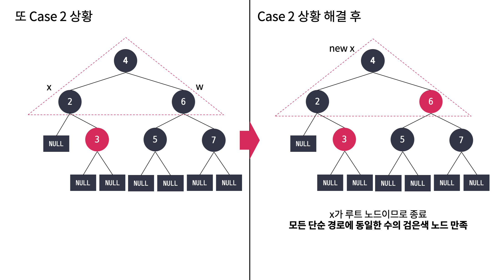

### 예제 2 - (Case 2 → Case 4 → 종료)

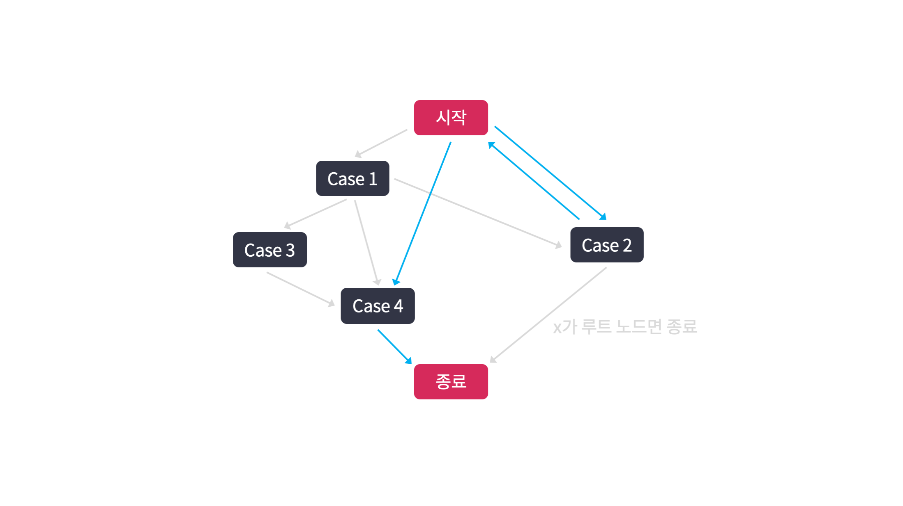

다음 트리에서 노드 1을 삭제할 때 **Case 2 - 형제 노드의 자식이 모두 검정**인 상황이다.

1. 형제 노드(3)의 색깔을 빨간색으로 변경한다.
2. 부모 노드(2)를 새로운 `x`로 변경한다.

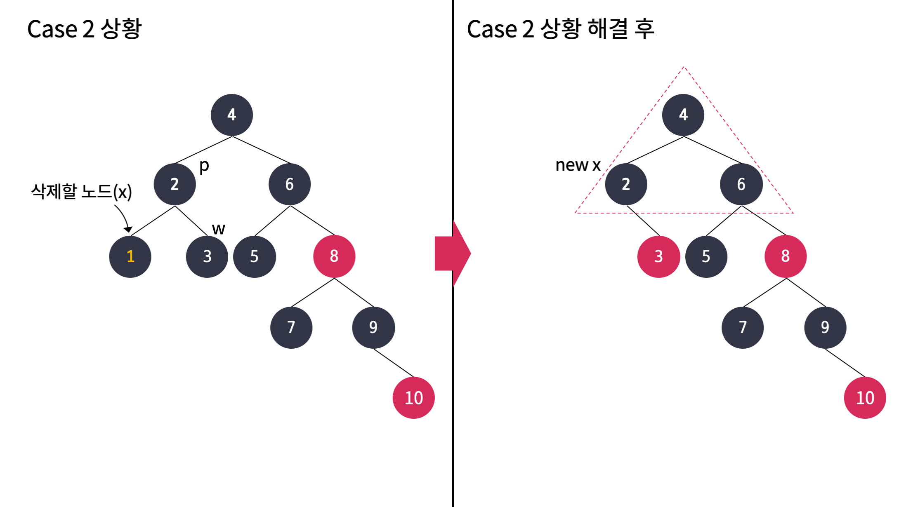

그러면 `x`를 기준으로 **Case 4 - 형제 노드의 오른쪽 자식이 빨강, 왼쪽 자식은 상관 없음** 상황이 된다.

1. 부모 노드(4)와 형제 노드(6)의 색깔을 swap 한다.
2. 형제 노드(6)의 오른쪽 자식 노드(8)의 색깔을 검정색으로 변경한다.
3. 형제 노드(6)를 축으로 **Left-Rotation**을 한다.
4. Case 4의 상황이 해결되면 재배치는 종료된다.

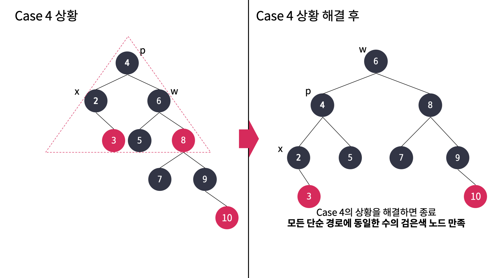

### 예제 3 - (Case 1 → Case 3 → Case 4 → 종료)

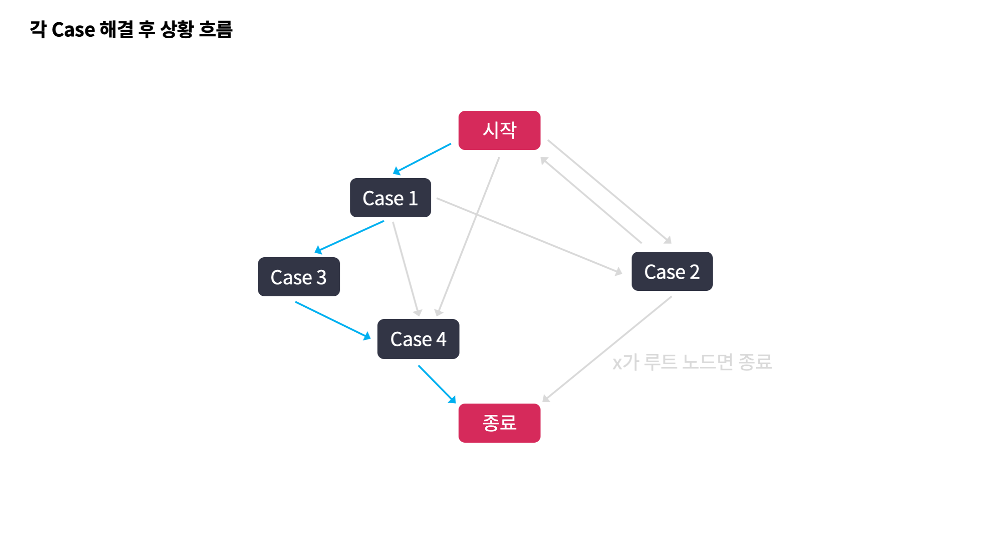

다음 트리에서 노드 2를 삭제할 때 **Case 1 - 형제 노드가 빨강 노드** 상황이다.

1. 부모 노드(4)와 형제 노드(7)의 색깔을 swap 한다.
2. 형제 노드(7)를 축으로 **Left-Rotation**을 한다.


`x`를 기준으로 **Case 3 - 형제 노드의 왼쪽 자식이 빨강, 오른쪽 자식이 검정** 상황이다.

1. 형제 노드(6)와 형제 노드의 왼쪽 자식 노드(5)의 색깔을 swap 한다.
2. 왼쪽 자식 노드를 축으로 **Right-Rotation**을 한다.

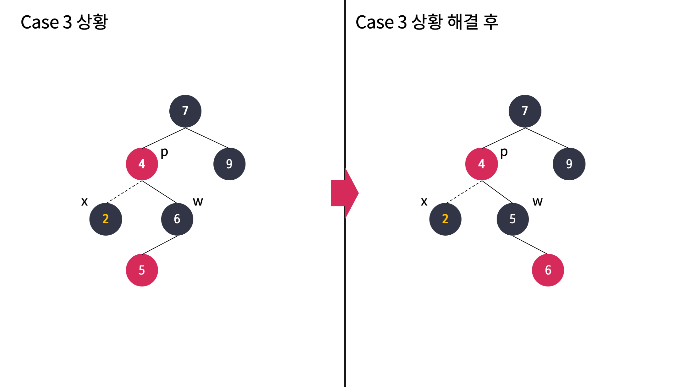

그러면 `x`를 기준으로 **Case 4 - 형제 노드의 오른쪽 자식이 빨강, 왼쪽 자식은 상관 없음** 상황이 된다.

1. 부모 노드(4)와 형제 노드(5)의 색깔을 swap 한다.
2. 형제 노드(5)의 오른쪽 자식 노드(6)의 색깔을 검정색으로 변경한다.
3. 형제 노드(5)를 축으로 **Left-Rotation**을 한다.
4. Case 4의 상황이 해결되면 재배치는 종료된다.


### 예제 4 - (Case 1 → Case 4 → 종료)

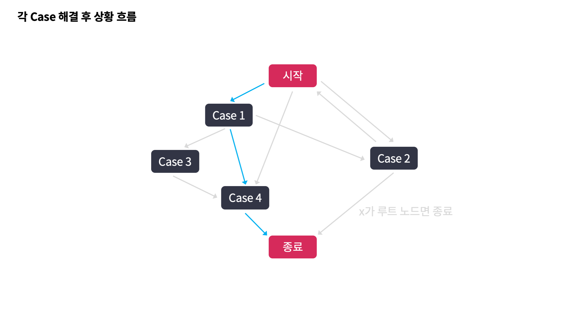

다음 트리에서 노드 2를 삭제할 때 **Case 1 - 형제 노드가 빨강 노드** 상황이다.

1. 부모 노드(4)와 형제 노드(8)의 색깔을 swap 한다.
2. 형제 노드(8)를 축으로 **Left-Rotation**을 한다.

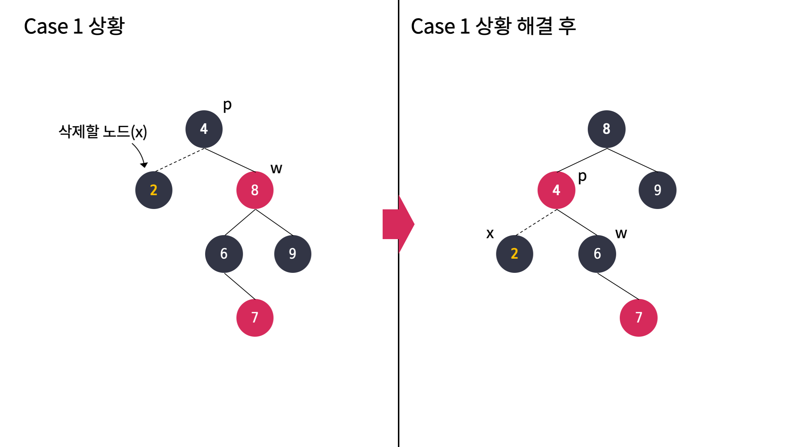

그러면 `x`를 기준으로 **Case 4 - 형제 노드의 오른쪽 자식이 빨강, 왼쪽 자식은 상관 없음** 상황이 된다.

1. 부모 노드(4)와 형제 노드(6)의 색깔을 swap 한다.
2. 형제 노드(6)의 오른쪽 자식 노드(7)의 색깔을 검정색으로 변경한다.
3. 형제 노드(6)를 축으로 **Left-Rotation**을 한다.
4. Case 4의 상황이 해결되면 재배치는 종료된다.

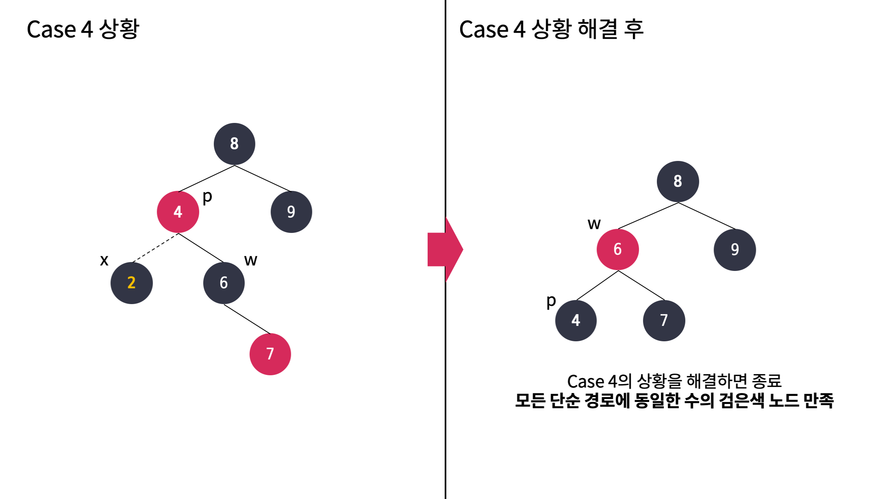

---

## 시간복잡도

- 트리의 노드 수: `N`

|    | 평균      | 최악      |
|----|---------|---------|
| 검색 | O(logN) | O(logN) |
| 삽입 | O(logN) | O(logN) |
| 삭제 | O(logN) | O(logN) |

---

# Red-Black 트리 구현

```java
public class Node<E extends Comparable<E>> {
    E key;
    Node<E> left, right, parent;
    int color = RED;

    public Node(E key) {
        this.key = key;
    }

    static final int RED = 0;
    static final int BLACK = 1;
}
```

Red-Black 트리 구현에 사용될 노드 객체로, 유연하게 다양한 형태의 객체들을
저장할 수 있도록 `Comparable`을 구현한 객체들이 저장될 수 있도록 한다.

추가로 부모 노드에 대한 참조와 노드의 색을 갖는다.

```java
public interface BinarySearch<E extends Comparable<E>> {
    void add(E key);
    void remove(E key);
    E search(E key);
}

public interface RedBlackTree<E extends Comparable<E>> extends BinarySearch<E> {
   boolean isRed(Node<E> node);                    //해당 노드가 빨강 노드인지 확인
   boolean isBlack(Node<E> node);                  //해당 노드가 검정 노드인지 확인
   void swapColor(Node<E> nodeA, Node<E> nodeB);   //두 노드의 색깔을 swap
   void LL_rotate(Node<E> node);                   //LL 회전
   void RR_rotate(Node<E> node);                   //RR 회전
   void insertFixup(Node<E> node);                 //삽입시 노드를 재배치
   void removeFixup(Node<E> node);                 //삭제시 노드를 재배치
}
```

Red-Black 트리는 이진 탐색 트리의 일종이기 때문에 기본적으로 이진 탐색 트리의 기본 행위는 모두 구현해야 한다.
그리고 Red-Black 트리는 균형을 유지하기 위해 추가적인 처리가 필요하기 때문에 그에 맞는
행위들을 추가로 구현해주어야 한다.

## 보조 메서드

```java
public class RedBlackTreeImpl<E extends Comparable<E>> implements RedBlackTree<E> {

    @Override
    public boolean isRed(Node<E> node) {
        /*해당 노드가 빨강 노드인지 확인*/
        return isExists(node) && node.color == Node.RED;
    }

    @Override
    public boolean isBlack(Node<E> node) {
        /*해당 노드가 검정 노드인지 확인*/
        return !isExists(node) || node.color == Node.BLACK;
    }

    private boolean isExists(Node<E> node) {
        return node != null;
    }

    @Override
    public void swapColor(Node<E> nodeA, Node<E> nodeB) {
        /*두 노드의 색깔을 swap*/
        int temp = nodeA.color;
        nodeA.color = nodeB.color;
        nodeB.color = temp;
    }
}
```

- 노드가 존재하지 않는 경우 검정 노드로 취급한다.

## RR 회전 (Left-Rotation) && LL 회전 (Right-Rotation)

```java
public class RedBlackTreeImpl<E extends Comparable<E>> implements RedBlackTree<E> {

    @Override
    public void RR_rotate(Node<E> node) {
        /*RR 회전 (Left-Rotate)*/

        Node<E> GP = node.parent;
        Node<E> R = node.right;
        Node<E> RL = R.left;

        R.left = node;
        node.right = RL;
        node.parent = R;
        if (isExists(RL)) {
            RL.parent = node;
        }
        R.parent = GP;

        if (!isExists(GP)) {
            this.root = R;
        } else {
            if (GP.right == node) {
                GP.right = R;
            } else if (GP.left == node) {
                GP.left = R;
            }
        }
    }

    @Override
    public void LL_rotate(Node<E> node) {
        /*LL 회전(Right-Rotation)*/

        Node<E> GP = node.parent;
        Node<E> L = node.left;
        Node<E> LR = L.right;

        L.right = node;
        node.left = LR;
        node.parent = L;
        if (isExists(LR)) {
            LR.parent = node;
        }
        L.parent = GP;

        if (!isExists(GP)) {
            this.root = L;
        } else {
            if (GP.right == node) {
                GP.right = L;
            } else if (GP.left == node) {
                GP.left = L;
            }
        }
    }
}
```

- Red-Black 트리에서 각 노드는 자식 노드 외에도 부모 노드를 참조한다.
- 따라서 회전시 부모에서 자식, 자식에서 부모 간의 연결도 고려해주어야 한다.

## 삽입시 노드 재배치

```java
public class RedBlackTreeImpl<E extends Comparable<E>> implements RedBlackTree<E> {

    @Override
    public void insertFixup(Node<E> node) {
        /*삽입시 노드를 재배치*/

        /*우측 Double Red*/
        //삼촌 검정, 오른쪽-왼쪽 Double Red
        if (isRed(node.right) && isRed(node.right.left) && isBlack(node.left)) {
            LL_rotate(node.right);
            swapColor(node, node.right);
            RR_rotate(node);
        }
        //삼촌 검정, 오른쪽-오른쪽 Double Red
        else if (isRed(node.right) && isRed(node.right.right) && isBlack(node.left)) {
            swapColor(node, node.right);
            RR_rotate(node);
        }
        //삼촌 빨강, 오른쪽-오른쪽 or 오른쪽-왼쪽 Double Red
        else if (isRed(node.right) && (isRed(node.right.right) || isRed(node.right.left))) {
            node.color = Node.RED;
            node.right.color = Node.BLACK;
            node.left.color = Node.BLACK;
        }
        /*우측 Double Red*/

        /*좌측 Double Red*/
        //삼촌 검정, 왼쪽-오른쪽 Double Red
        else if (isRed(node.left) && isRed(node.left.right) && isBlack(node.right)) {
            RR_rotate(node.left);
            swapColor(node, node.left);
            LL_rotate(node);
        }
        //삼촌 검정, 왼쪽-왼쪽 Double Red
        else if (isRed(node.left) && isRed(node.left.left) && isBlack(node.right)) {
            swapColor(node, node.left);
            LL_rotate(node);
        }
        //삼촌 빨강, 왼쪽-왼쪽 or 왼쪽-오른쪽 Double Red
        else if (isRed(node.left) && (isRed(node.left.left) || isRed(node.left.right))) {
            node.color = Node.RED;
            node.left.color = Node.BLACK;
            node.right.color = Node.BLACK;
        }
        /*좌측 Double Red*/
    }
}
```

- 삽입시 네 가지(좌우 대칭 여덟 가지) Double Red 상황이 발생할 수 있다.
- 각 상황에 맞게 이론대로 재배치한다.

## 키를 추가

```java
public class RedBlackTreeImpl<E extends Comparable<E>> implements RedBlackTree<E> {

    private Node<E> root;
    
    @Override
    public void add(E key) {
        /*키를 추가*/
        Node<E> newNode = new Node<>(key);
        if (null == root) {
            root = newNode;
        } else {
            insertNode(root, newNode);
        }
        root.color = Node.BLACK; //삽입 후 루트 노드 검정 노드로 변경
    }

    private void insertNode(Node<E> node, Node<E> newNode) {
        int compare = node.key.compareTo(newNode.key);
        if (compare > 0) {
            if (!isExists(node.left)) {
                //이중 연결이기 때문에 자식과 부모를 연결
                node.left = newNode;
                newNode.parent = node;
            } else {
                insertNode(node.left, newNode);
            }
        } else if (compare < 0) {
            if (!isExists(node.right)) {
                //이중 연결이기 때문에 자식과 부모를 연결
                node.right = newNode;
                newNode.parent = node;
            } else {
                insertNode(node.right, newNode);
            }
        }

        insertFixup(node); //재귀적으로 노드 재배치를 하면서 위로 다시 올라간다
    }
}
```

- Red-Black 트리의 삽입은 기본적으로 이진 탐색 트리이기 때문에 이진 탐색 트리의 삽입과 기본적인 방식은 비슷하다.
- 차이점은 부모-자식 이중 연결과 노드 재배치를 수행해야 하는 것이다. 

## 삭제시 노드 재배치

```java
public class RedBlackTreeImpl<E extends Comparable<E>> implements RedBlackTree<E> {

    @Override
    public void removeFixup(Node<E> x) {
        /*삭제시 노드를 재배치*/

        while (x != root && isBlack(x)) { //루트 노드가 되거나, 빨강 노드가 될 때까지

            //삭제할 노드가 왼쪽 자식 노드인 경우
            if (x.parent.left == x) {

                Node<E> w = x.parent.right; //삭제할 노드의 형제 노드

                /*Case 1 - 형제 노드가 빨강 노드*/
                if (isRed(w)) {
                    swapColor(x.parent, w); //부모와 형제의 색깔을 swap
                    RR_rotate(x.parent);    //부모 노드 기준 RR 회전
                    w = x.parent.right;     //바뀐 구조의 새로운 형제 노드 변경
                }
                /*Case 1*/

                //Case 1을 해결하고 Case 2, 3, 4 중에 하나로 해결

                /*Case 2 - 형제 노드가 검정 && 형제 노드의 자식이 모두 검정*/
                if (isBlack(w.left) && isBlack(w.right)) {
                    w.color = Node.RED; //형제 노드의 색깔을 빨강으로 변경
                    x = x.parent;       //x 노드를 부모 노드로 변경
                }
                /*Case 2*/
                else {
                    /*Case 3 - 형제 노드가 검정 && 형제 노드의 왼쪽이 빨강, 오른쪽이 검정*/
                    if (isBlack(w.right)) {
                        swapColor(w, w.left);   //형제와 형제의 왼쪽 자식 색깔 swap
                        LL_rotate(w);           //형제 노드 기준 LL 회전
                        w = x.parent.right;     //바뀐 구조의 새로운 형제 노드 변경
                    }
                    /*Case 3*/

                    /*
                     * Case 3에 의해 새로운 형제 노드의 오른쪽 자식 노드의 색깔은
                     * 빨강색이 된다. 즉 Case 4의 상황으로 해결할 수 있다.
                     */

                    /*Case 4 - 형제 노드의 오른쪽 자식이 빨강*/
                    swapColor(w, x.parent);     //형제 노드와 부모 노드의 색깔을 swap
                    w.right.color = Node.BLACK; //형제 노드의 오른쪽 자식을 검정으로 변경
                    RR_rotate(x.parent);        //부모 노드 기준 RR 회전
                    break;                      //Case 4가 해결되면 재배치 종료
                    /*Case 4*/
                }
            }
            //삭제할 노드가 왼쪽 자식 노드인 경우
            else if (x == x.parent.right) {

                Node<E> w = x.parent.left;

                if (isRed(w)) {
                    swapColor(w, x.parent);
                    LL_rotate(x.parent);
                    w = x.parent.left;
                }
                if (isBlack(w.left) && isBlack(w.right)) {
                    w.color = Node.RED;
                    x = x.parent;
                } else {
                    if (isBlack(x.left)) {
                        swapColor(w, w.right);
                        RR_rotate(w);
                        w = w.parent.left;
                    }
                    swap(w, x.parent);
                    w.left.color = Node.BLACK;
                    LL_rotate(x.parent);
                    break;
                }
            }
        }

        //마지막으로 x 노드를 검정 노드로 변경
        x.color = Node.BLACK;
    }
}
```

- Case 2에 의해 노드가 루트 노드가 되거나, Case 1과 Case 2에 의해
`x` 노드가 빨강 노드가 될 수 있다.
- 따라서 재배치가 종료되면 `x` 노드를 검정색으로 변경한다.

## 키를 삭제

```java
public class RedBlackTreeImpl<E extends Comparable<E>> implements RedBlackTree<E> {

    private Node<E> root;

    @Override
    public void remove(E key) {
        removeNode(root, key);
    }

    private void removeNode(Node<E> node, E key) {
        if (node == null) {
            throw new RuntimeException("Not exists node");
        }

        /*삭제할 키를 찾는 과정*/
        int compare = node.key.compareTo(key);

        if (compare > 0) {
            removeNode(node.left, key);
        } else if (compare < 0) {
            removeNode(node.right, key);
        }
        /*삭제할 키를 찾는 과정*/
        else {
            /*삭제할 키를 찾으면 swap 가능한 선임자 또는 후임자 값을 찾는 과정*/
            if (isExists(node.left)) {
                Node<E> predecessor = getLargestNode(node.left); //왼쪽 서브 트리 중 가장 큰 값
                swap(node, predecessor); //swap
                removeNode(node.left, key);
            } else if (isExists(node.right)) {
                Node<E> successor = getSmallestNode(node.right); //오른쪽 서브 트리 중 가장 큰 값
                swap(node, successor); //swap
                removeNode(node.right, key);
            }
            /*삭제할 키를 찾으면 swap 가능한 선임자 또는 후임자 값을 찾는 과정*/

            //삭제할 노드 리프 노드 도착
            else {
                //삭제할 노드가 검정 노드인 경우 = 재배치
                if (isBlack(node)) {
                    removeFixup(node);
                }
                //부모 노드에서 자식 노드의 연결을 끊는다.
                if (node.parent.left == node) {
                    node.parent.left = null;
                } else if (node.parent.right == node) {
                    node.parent.right = null;
                }

                //자식 노드에서 부모 노드의 연결을 끊는다.
                node.parent = null;
            }
        }
    }

    private void swap(Node<E> node, Node<E> alterNode) {
        E temp = node.key;
        node.key = alterNode.key;
        alterNode.key = temp;
    }

    private Node<E> getLargestNode(Node<E> node) {
        if (node.right == null) {
            return node;
        }
        return getLargestNode(node.right);
    }

    private Node<E> getSmallestNode(Node<E> node) {
        if (node.left == null) {
            return node;
        }
        return getSmallestNode(node.left);
    }
}
```

- 기본적인 삭제 연산 과정은 이진 탐색 트리와 같다.
- 다만 부모-자식 양방향 연결을 끊어주고, 검정 노드 삭제시 노드 재배치가 수행되어야 한다.

## 전체 구현 및 사용 코드

```java
import java.util.ArrayList;
import java.util.List;
import java.util.stream.Collectors;

public class RedBlackTreeImpl<E extends Comparable<E>> implements RedBlackTree<E> {

    private Node<E> root;

    @Override
    public boolean isRed(Node<E> node) {
        /*해당 노드가 빨강 노드인지 확인*/
        return isExists(node) && node.color == Node.RED;
    }

    @Override
    public boolean isBlack(Node<E> node) {
        /*해당 노드가 검정 노드인지 확인*/
        return !isExists(node) || node.color == Node.BLACK;
    }

    private boolean isExists(Node<E> node) {
        return node != null;
    }

    @Override
    public void swapColor(Node<E> nodeA, Node<E> nodeB) {
        /*두 노드의 색깔을 swap*/
        int temp = nodeA.color;
        nodeA.color = nodeB.color;
        nodeB.color = temp;
    }

    @Override
    public void LL_rotate(Node<E> node) {
        /*LL 회전(Right-Rotation)*/

        Node<E> GP = node.parent;
        Node<E> L = node.left;
        Node<E> LR = L.right;

        L.right = node;
        node.left = LR;
        node.parent = L;
        if (isExists(LR)) {
            LR.parent = node;
        }
        L.parent = GP;

        if (!isExists(GP)) {
            this.root = L;
        } else {
            if (GP.right == node) {
                GP.right = L;
            } else if (GP.left == node) {
                GP.left = L;
            }
        }
    }

    @Override
    public void RR_rotate(Node<E> node) {
        /*RR 회전 (Left-Rotate)*/

        Node<E> GP = node.parent;
        Node<E> R = node.right;
        Node<E> RL = R.left;

        R.left = node;
        node.right = RL;
        node.parent = R;
        if (isExists(RL)) {
            RL.parent = node;
        }
        R.parent = GP;

        if (!isExists(GP)) {
            this.root = R;
        } else {
            if (GP.right == node) {
                GP.right = R;
            } else if (GP.left == node) {
                GP.left = R;
            }
        }
    }

    @Override
    public void add(E key) {
        /*키를 추가*/
        Node<E> newNode = new Node<>(key);
        if (null == root) {
            root = newNode;
        } else {
            insertNode(root, newNode);
        }
        root.color = Node.BLACK;
    }

    private void insertNode(Node<E> node, Node<E> newNode) {
        int compare = node.key.compareTo(newNode.key);
        if (compare > 0) {
            if (!isExists(node.left)) {
                //이중 연결이기 때문에 자식과 부모를 연결
                node.left = newNode;
                newNode.parent = node;
            } else {
                insertNode(node.left, newNode);
            }
        } else if (compare < 0) {
            if (!isExists(node.right)) {
                //이중 연결이기 때문에 자식과 부모를 연결
                node.right = newNode;
                newNode.parent = node;
            } else {
                insertNode(node.right, newNode);
            }
        }

        insertFixup(node); //재귀적으로 노드 재배치를 하면서 위로 올라간다
    }

    @Override
    public void insertFixup(Node<E> node) {
        /*삽입시 노드를 재배치*/

        /*우측 Double Red*/
        //삼촌 검정, 오른쪽-왼쪽 Double Red
        if (isRed(node.right) && isRed(node.right.left) && isBlack(node.left)) {
            LL_rotate(node.right);
            swapColor(node, node.right);
            RR_rotate(node);
        }
        //삼촌 검정, 오른쪽-오른쪽 Double Red
        else if (isRed(node.right) && isRed(node.right.right) && isBlack(node.left)) {
            swapColor(node, node.right);
            RR_rotate(node);
        }
        //삼촌 빨강, 오른쪽-오른쪽 or 오른쪽-왼쪽 Double Red
        else if (isRed(node.right) && (isRed(node.right.right) || isRed(node.right.left))) {
            node.color = Node.RED;
            node.right.color = Node.BLACK;
            node.left.color = Node.BLACK;
        }
        /*우측 Double Red*/

        /*좌측 Double Red*/
        //삼촌 검정, 왼쪽-오른쪽 Double Red
        else if (isRed(node.left) && isRed(node.left.right) && isBlack(node.right)) {
            RR_rotate(node.left);
            swapColor(node, node.left);
            LL_rotate(node);
        }
        //삼촌 검정, 왼쪽-왼쪽 Double Red
        else if (isRed(node.left) && isRed(node.left.left) && isBlack(node.right)) {
            swapColor(node, node.left);
            LL_rotate(node);
        }
        //삼촌 빨강, 왼쪽-왼쪽 or 왼쪽-오른쪽 Double Red
        else if (isRed(node.left) && (isRed(node.left.left) || isRed(node.left.right))) {
            node.color = Node.RED;
            node.left.color = Node.BLACK;
            node.right.color = Node.BLACK;
        }
        /*좌측 Double Red*/
    }

    @Override
    public void remove(E key) {
        removeNode(root, key);
    }

    private void removeNode(Node<E> node, E key) {
        if (node == null) {
            throw new RuntimeException("Not exists node");
        }

        /*삭제할 키를 찾는 과정*/
        int compare = node.key.compareTo(key);

        if (compare > 0) {
            removeNode(node.left, key);
        } else if (compare < 0) {
            removeNode(node.right, key);
        }
        /*삭제할 키를 찾는 과정*/
        else {
            /*삭제할 키를 찾으면 swap 가능한 선임자 또는 후임자 값을 찾는 과정*/
            if (isExists(node.left)) {
                Node<E> predecessor = getLargestNode(node.left); //왼쪽 서브 트리 중 가장 큰 값
                swap(node, predecessor); //swap
                removeNode(node.left, key);
            } else if (isExists(node.right)) {
                Node<E> successor = getSmallestNode(node.right); //오른쪽 서브 트리 중 가장 큰 값
                swap(node, successor); //swap
                removeNode(node.right, key);
            }
            /*삭제할 키를 찾으면 swap 가능한 선임자 또는 후임자 값을 찾는 과정*/

            //삭제할 노드 리프 노드 도착
            else {
                //삭제할 노드가 검정 노드인 경우 = 재배치
                if (isBlack(node)) {
                    removeFixup(node);
                }
                //부모 노드에서 자식 노드의 연결을 끊는다.
                if (node.parent.left == node) {
                    node.parent.left = null;
                } else if (node.parent.right == node) {
                    node.parent.right = null;
                }

                //자식 노드에서 부모 노드의 연결을 끊는다.
                node.parent = null;
            }
        }
    }

    private void swap(Node<E> node, Node<E> alterNode) {
        E temp = node.key;
        node.key = alterNode.key;
        alterNode.key = temp;
    }

    private Node<E> getLargestNode(Node<E> node) {
        if (node.right == null) {
            return node;
        }
        return getLargestNode(node.right);
    }

    private Node<E> getSmallestNode(Node<E> node) {
        if (node.left == null) {
            return node;
        }
        return getSmallestNode(node.left);
    }

    @Override
    public void removeFixup(Node<E> x) {
        /*삭제시 노드를 재배치*/

        while (x != root && isBlack(x)) { //루트 노드가 되거나, 빨강 노드가 될 때까지

            //삭제할 노드가 왼쪽 자식 노드인 경우
            if (x.parent.left == x) {

                Node<E> w = x.parent.right; //삭제할 노드의 형제 노드

                /*Case 1 - 형제 노드가 빨강 노드*/
                if (isRed(w)) {
                    swapColor(x.parent, w); //부모와 형제의 색깔을 swap
                    RR_rotate(x.parent);    //부모 노드 기준 RR 회전
                    w = x.parent.right;     //바뀐 구조의 새로운 형제 노드 변경
                }
                /*Case 1*/

                //Case 1을 해결하고 Case 2, 3, 4 중에 하나로 해결

                /*Case 2 - 형제 노드가 검정 && 형제 노드의 자식이 모두 검정*/
                if (isBlack(w.left) && isBlack(w.right)) {
                    w.color = Node.RED; //형제 노드의 색깔을 빨강으로 변경
                    x = x.parent;       //x 노드를 부모 노드로 변경
                }
                /*Case 2*/
                else {
                    /*Case 3 - 형제 노드가 검정 && 형제 노드의 왼쪽이 빨강, 오른쪽이 검정*/
                    if (isBlack(w.right)) {
                        swapColor(w, w.left);   //형제와 형제의 왼쪽 자식 색깔 swap
                        LL_rotate(w);           //형제 노드 기준 LL 회전
                        w = x.parent.right;     //바뀐 구조의 새로운 형제 노드 변경
                    }
                    /*Case 3*/

                    /*
                     * Case 3에 의해 새로운 형제 노드의 오른쪽 자식 노드의 색깔은
                     * 빨강색이 된다. 즉 Case 4의 상황으로 해결할 수 있다.
                     */

                    /*Case 4 - 형제 노드의 오른쪽 자식이 빨강*/
                    swapColor(w, x.parent);     //형제 노드와 부모 노드의 색깔을 swap
                    w.right.color = Node.BLACK; //형제 노드의 오른쪽 자식을 검정으로 변경
                    RR_rotate(x.parent);        //부모 노드 기준 RR 회전
                    break;                      //Case 4가 해결되면 재배치 종료
                    /*Case 4*/
                }
            }
            //삭제할 노드가 왼쪽 자식 노드인 경우
            else if (x == x.parent.right) {

                Node<E> w = x.parent.left;

                if (isRed(w)) {
                    swapColor(w, x.parent);
                    LL_rotate(x.parent);
                    w = x.parent.left;
                }
                if (isBlack(w.left) && isBlack(w.right)) {
                    w.color = Node.RED;
                    x = x.parent;
                } else {
                    if (isBlack(w.left)) {
                        swapColor(w, w.right);
                        RR_rotate(w);
                        w = w.parent.left;
                    }
                    swapColor(w, x.parent);
                    w.left.color = Node.BLACK;
                    LL_rotate(x.parent);
                    break;
                }
            }
        }

        //마지막으로 x 노드를 검정 노드로 변경
        x.color = Node.BLACK;
    }

    @Override
    public E search(E key) {
        return searchNode(root, key).key;
    }

    private Node<E> searchNode(Node<E> node, E key) {
        if (node == null) throw new RuntimeException("Not exists node");

        int compare = node.key.compareTo(key);

        if (compare > 0) {
            return searchNode(node.left, key);
        } else if (compare < 0) {
            return searchNode(node.right, key);
        }

        return node;
    }

    //오름차순 순회(중위 순회)
    public void traversal() {
        List<String> result = new ArrayList<>();
        inOrder(this.root, result);
        System.out.println(
            String.join(" => ", result)
        );
    }

    private void inOrder(Node<E> node, List<String> result) {
        if (node == null) {
            return;
        }
        inOrder(node.left, result);
        result.add(node.key.toString() + (node.color == Node.BLACK ? " [BLACK]" : " [RED]"));
        inOrder(node.right, result);
    }
}
```
```java
public class Main {
    public static void main(String[] args) {
        RedBlackTreeImpl<Integer> rbt = new RedBlackTreeImpl<>();
        rbt.add(5);
        rbt.add(2);
        rbt.add(9);
        rbt.add(3);
        rbt.add(7);
        rbt.add(4);
        rbt.add(8);
        rbt.add(1);
        rbt.add(6);

        rbt.traversal();
    }
}
```
```text
1 [RED] => 2 [BLACK] => 3 [RED] => 4 [BLACK] => 5 [BLACK] => 6 [RED] => 7 [BLACK] => 8 [RED] => 9 [BLACK]
```

---

### 참고

- [자료구조 시각화 사이트](https://www.cs.usfca.edu/~galles/visualization/RedBlack.html)
- [유튜브](https://www.youtube.com/watch?v=syGPNOhsnI4&list=PLcXyemr8ZeoR82N8uZuG9xVrFIfdnLd72&index=10)
- [사이트](https://www.codelatte.io/courses/java_data_structure/UN9UCFI8OJ7QGRCB)