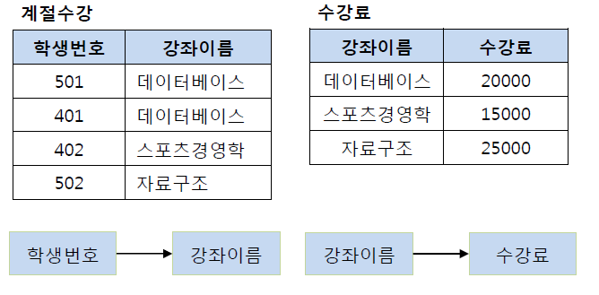

# 정규화에 대해서 설명해 주세요.

- **정규화(`Normailization`)** 는 관계형 데이터 모델에서 **데이터의 중복성을 제거**하여 이상 현상을 방지하고, 데이터의 일관성과 정확성을 유지하기 위해
    무손실 분해하는 과정이다.
- 정규화의 기본 목표는 **테이블 간에 중복된 데이터를 허용하지 않는다**는 것이다.
- 중복된 데이터를 허용하지 않음으로써 **무결성**을 유지할 수 있으며, DB의 저장 용량도 줄일 수 있다.
  - 데이터의 무결성(`Integrity`)란 데이터가 전송, 저장되고 처리되는 모든 과정에서 **변경되거나 손상되지 않고** 완전성, 정확성, 일관성을 유지함을 보장하는 특성이다.

 

# 정규화 단계를 설명해 주세요.

### 필수 개념

- 함수 종속 종류

| 종류                                           | 설명                                                                       |
|----------------------------------------------|--------------------------------------------------------------------------|
| **부분 함수 종속** (Partial Functional Dependency) | 릴레이션에서 기본 키가 복합 키일 경우 기본 키를 구성하는 속성 중 일부에게 종속된 경우                        |
| **완전 함수 종속** (Full Functional Dependency)    | 릴레이션에서 `X -> Y` 관계가 있을 때, `Y`는 `X`의 전체 속성에 대해 종속하고, 부분 집합 속성에 종속하지 않는 경우 |
| **이행 함수 종속** (Transitive Functional Dependency)                         | 릴레이션에서 `X -> Y`, `Y -> Z` 종속 관계가 있을 때, `X -> Z`가 성립되는 경우                 |

- 키 종류

| 종류                       | 설명                                                                               |
|--------------------------|----------------------------------------------------------------------------------|
| **기본 키** (Primary Key)   | 테이블의 각 튜플들을 고유하게 식별하는 컬럼                                                         |
| **대체 키** (Alternate Key) | 후보 키 중에서 기본 키로 선택되지 않은 키                                                         |
| **후보 키** (Candidate Key) | - 테이블에서 각 튜플을 구별하는 데 기준이 되는 컬럼  - 기본 키와 대체 키를 합친 키(기본 키 ⊆ 후보 키, 대체 키 ⊆ 후보 키) |
| **슈퍼 키** (Super Key)     | 릴레이션을 구성하는 모든 튜플에 대해 유일성은 만족하지만, 최소성은 만족하지 못하는 키                                 |
| **외래 키** (Foreign Key)   | - 테이블 간의 참조 데이터 무결성을 위한 제약 조건  - 한 릴레이션의 컬럼이 다른 릴레이션의 기본 키로 이용되는 키           |

## 제 1 정규화

- **테이블 내의 속성값은 원자값(하나의 값)을 가지고 있어야 한다.**
- 모든 속성에 반복되는 그룹이 나타나지 않아야 한다.
- 기본키를 사용하여 관련 데이터와 각 집합을 고유하게 식별할 수 있어야 한다.

다음 테이블은 "취미들" 컬럼에 대해 원자값을 가지고 있지 않은 행이 존재하기 때문에 제 1 정규형을 만족하지 못한다.

제 1 정규화하여 분해한 결과는 다음과 같다.

## 제 2 정규화

- 제 1 정규화를 진행한 테이블에 대해 **완전 함수 종속**을 만족하도록 테이블을 분해한다.
  - **완전 함수 종속** : 기본 키의 부분집합이 결정자가 되어선 안 된다는 것을 의미한다.
- 테이블에서 기본 키가 복합 키(키1, 키2)로 묶여있을 때, 두 키 중 하나의 키만으로 다른 컬럼을 결정지을 수 있으면 안 된다.
  - 기본 키의 부분집합 키가 결정자가 되어선 안 된다.

- 기본 키는 `(학생 번호, 강좌이름)`으로 복합 키이다. 그리고 이 기본 키는 "성적"을 결정하고 있다.
- 그런데 여기서 "강의실" 컬럼은 기본 키의 부분집합인 "강좌이름"에 의해 결정될 수 있다.
- 즉, 기본 키의 부분 키인 "강좌이름"이 결정자이기 때문에 강의실을 분해해 별도의 테이블로 관리하여 제 2 정규형을 만족시킬 수 있다.

## 제 3 정규화

- 제 2 정규화를 진행한 테이블에 대해 **이행적 종속**을 없애도록 테이블을 분해한다.

- 학생 번호는 강좌 이름을 결정하고 있고, 강좌 이름은 수강료를 결정하고 있다.
- 세 컬럼을 한 테이블에 두는 것은 이행함수 종속성으로 인해 3차 정규화를 만족하지 못한다.
- 학생번호는 수강료에 직접 영향을 주는 관계가 아니기 때문에 (`학생번호, 강좌이름`) 테이블과 (`강좌이름, 수강료`) 테이블로 분리하여 이햄 함수 관계를 제거하여 3차 정규화를 만족한다.

- 학생 번호를 통해 강좌이름을 참조하고, 강좌이름을 통해 수강료를 참조하도록 분해했다.

## 보이스-코드 정규화(BCNF)

- BCNF 정규화는 제 3 정규화를 진행한 테이블에 대해 **모든 결정자가 후보키가 되도록** 테이블을 분해한다.

- 기본 키는 `(학생번호, 특강이름)`이다. 그리고 기본 키는 "교수"를 결정하고 있고, "교수"는 "특강이름"을 결정하고 있다.
- 문제는 "교수"가 "특가이름"을 결정하는 결정자이지만, 후보 키가 아니라는 점이다.
- 때문에 BCNF 정규화를 만족시키기 위해 테이블을 분리할 수 있다.

- "특강신청" 테이블과 "특강교수" 테이블로 분리했다.

 

### 참고
- [참고 블로그](https://mangkyu.tistory.com/110)