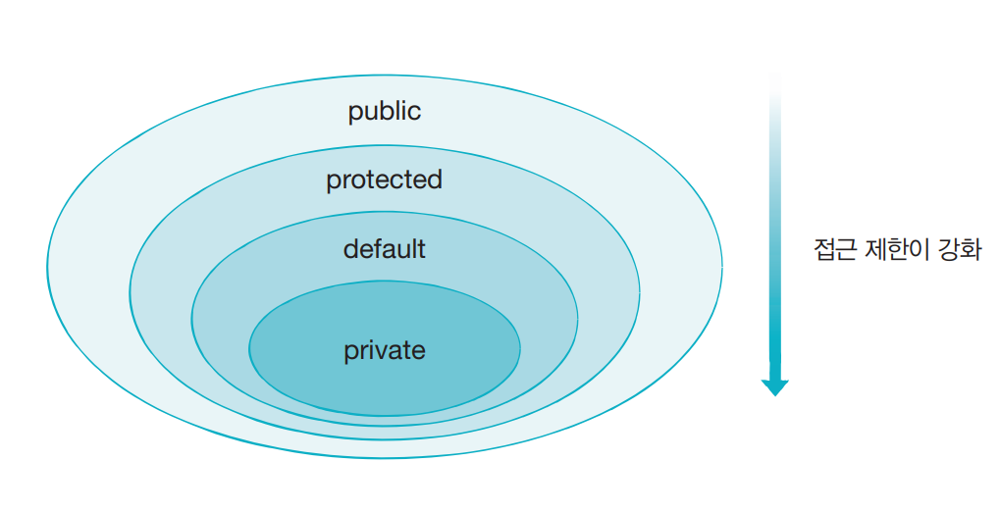

# 접근제어자에 대해 설명해 주세요.

- 객체의 필드를 외부에서 변경하거나 메서드를 호출할 수 없도록 막아야 할 필요가 있다.
- 중요한 필드와 메서드가 외부로 노출되지 않도록 해 객체의 무결성(결점이 없는 상태)을 유지해야 하기 때문이다.
- 자바는 이러한 기능을 구현하기 위해 접근 제어자(`Access Modifier`)를 사용한다.
- 접근 제한자는 **public**, **protected**, **private**이 있다.
- `default`는 접근 제어자가 아니라 접근 제어자가 붙지 않은 상태를 말한다.

| 접근 제어자    | 제한 대상             | 제한 범위                   |
|-----------|-------------------|-------------------------|
| **public**    | 클래스, 필드, 생성자, 메서드 | 없음                      |
| **protected** | 필드, 생성자, 메서드      | 같은 패키지이거나, 자식 객체만 사용 가능 |
| **(default)** | 클래스, 필드, 생성자, 메서드 | 같은 패키지                  |
| **private**   | 필드, 생성자, 메서드      | 객체 내부                   |

