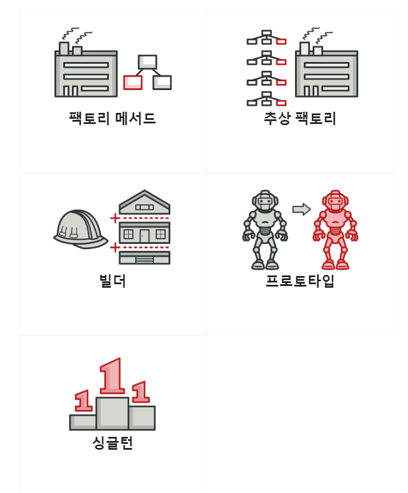
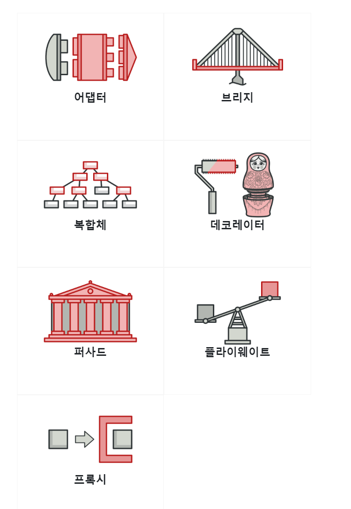

# 디자인 패턴에 대해서 설명해 주세요.

- **디자인 패턴(Design Pattern)** 은 프로그램을 개발하는 과정에서 빈번하게 발생하는 디자인 문제를 정리해서 상황에 따라
    간편하게 적용할 수 있게 정리한 것이다.
- **하나의 아이디어일 뿐, 특정한 구현이 아니다.**
- 목적에 따라 **생성 패턴, 구조 패턴, 행위 패턴**으로 분류할 수 있다.

## 생성 패턴 (Creational Pattern)

- **객체의 생성 방식 결정**
- 객체 인스턴스를 생성하는 패턴으로, 클라이언트와 그 클라이언트가 생성해야 하는 객체 인스턴스 사이의 연결을 끊어주는 패턴이다.
- 기존 코드의 유연성과 재사용을 증가시키는 객체를 생성하는 다양한 방법을 제공한다.

### 팩토리 메서드 패턴 (Factory Method Pattern)

- **객체를 만드는 부분을 서브 클래스에게 맡기는 패턴**
- 부모 클래스에서 객체들을 생성할 수 있는 인터페이스를 제공하지만, 자식 클래스들이 생성될 객체들의 유형을 변경할 수 있도록 하는 패턴이다.
  - 객체를 생성할 때 필요한 인터페이스를 만든다.
  - 어떤 클래스의 인스턴스를 만들지는 서브 클래스에서 결정한다.
  - 팩토리 메서드 패턴을 사용하면 클래스 인스턴스 만드는 일을 서브 클래스에게 맡기게 된다.

### 추상 팩토리 패턴 (Abstract Factory Pattern)

- **구상 클래스에 의존하지 않고도 서로 연관되거나 의존적인 객체로 이루어진 제품군을 생상하는 인터페이스를 제공한다. 구상 클래스는 서브 클래스에서 만든다.**
- 관련 객체들의 구상 클래스들을 지정하지 않고도 관련 객체들의 모음을 생성할 수 있도록 하는 패턴이다.

### 빌더 패턴 (Builder Pattern)

- **복잡한 객체들을 단계별로 생성할 수 있도록 하는 패턴으로, 이 패턴을 사용하면 같은 제작 코드를 사용하여 객체의 다양한 유형들과 표현을 제작할 수 있다.**
- 제품을 여러 단계로 나눠서 만들도록 하여 제품 생상 단계를 캡슐화하고 싶을 때 사용할 수 있는 패턴이다.

### 프로토타입 패턴 (Prototype Pattern)

- **코드를 그들의 클래스들에 의존시키지 않고 기존 객체들을 복사할 수 있도록 하는 패턴이다.**
- 어떤 클래스의 인스턴스를 만들 때 자원과 시간이 많이 들거나 복잡하다면 프로토타입 패턴을 사용할 수 있다.

### 싱글톤 패턴 (Singleton Pattern)

- **애플리케이션이 시작될 때, 어떤 클래스가 최초 한 번만 메모리를 할당(`static`)하고 해당 메모리에 인스턴스를 만들어 사용하는 패턴**
- 특정 클래스에 객체 인스턴스가 하나만 만들어지도록 하는 패턴으로, 싱글톤 패턴을 사용하면 전역 변수를 사용할 때와 마찬가지로 객체 인스턴스를 어디서든지 액세스 할 수 있게 만들 수 있다.
- 클래스 인스턴스를 하나만 만들고 그 인스턴스로의 전역 접근을 제공한다.

 

## 구조 해턴 (Structural Pattern)

- **객체간의 관계를 조직**
- 클래스와 객체를 더 큰 구조로 만들 수 있게 구성을 사용하는 패턴이다.
- 구조를 유연하고 효율적으로 유지하면서 객체들과 클래스들을 더 큰 구조로 조립하는 방법을 설명한다.

### 어댑터 패턴 (Adapter Pattern)

- **호환되지 않는 인터페이스를 가진 객체들이 협업할 수 있도록 하는 패턴이다.**
- 클래스를 바로 사용할 수 없는 경우(다른 곳에서 개발하거나, 수정할 수 없을 때)가 있는데, 중간에서 변환 역할을 해주는 클래스가 필요할 때 사용할 수 있는 패턴이다.
- 특정 클래스 인터페이스를 클라이언트에서 요구하는 다른 인터페이스로 변환한다. 인터페이스가 호환되지 않아 같이 쓸 수 없었던 클래스를 사용할 수 있게 도와준다.

### 브리지 패턴 (Bridge Pattern)

- **큰 클래스 또는 밀접하게 관련된 클래스들의 집합을 두 개의 개별 계층구조(추상화 및 구현)로 나눈 후 각각 독립적으로 개발할 수 있도록 하는 패턴이다.**
- 구현과 더불어 추상화 부분까지 변경해야 한다면 이 패턴을 사용할 수 있다.

### 복합체 패턴 (Composite Pattern)

- **객체들을 트리 구조들로 구성한 후, 이러한 구조들과 개별 객체들처럼 작업할 수 있도록 하는 패턴이다.**
- 컴포지트 패턴으로 객체를 트리구조로 구성해서 부분-전체 계층 구조를 구현한다. 컴포지트 패턴을 사용하면 클라이언트에서 개별 객체와 복합 객체를 똑같은 방법으로 다룰 수 있다.
- 사용 목적은 `Object`의 계층을 표현하고 각각의 `Object`를 독립적으로 동일한 인터페이스를 통해 처리할 수 있게 한다.

### 데코레이터 패턴 (Decorator Pattern)

- **객체들을 새로운 행동들을 포함한 특수 래퍼 객체들 내에 넣어서 위 행동들을 해당 객체들에 연결시키는 패턴이다.**
- 객체에 추가 요소를 동적으로 더할 수 있고, 서브 클래스를 만들 때보다 훨씬 유연하게 기능을 확장할 수 있다.

### 퍼사드 패턴 (Facade Pattern)

- **라이브러리에 대한, 프레임워크에 대한 또는 다른 클래스들의 복잡한 집합에 대한 단순화된 인터페이스를 제공하는 패턴이다.**
- 서브 시스템에 있는 일련의 인터페이스를 통합 인터페이스로 묶어주고, 고수준 인터페이스도 정의하므로 서브 시스템을 더 편리하게 사용할 수 있다.

### 플라이웨이트 패턴 (Flyweight Pattern)

- **각 객체에 모든 데이터를 유지하는 대신 여러 객체들 간에 상태의 공통 부분들을 공유하여 사용할 수 있는 `RAM`에 더 많은 객체들을 포함할 수 있도록 하는 패턴이다.**
- 어떤 클래스의 인스턴스 하나로 여러 개의 "가상 인스턴스"를 제공하고 싶을 때 사용할 수 있는 패턴이다.

### 프록시 패턴 (Proxy Pattern)

- **다른 객체에 대한 대체 또는 자리표시자를 제공할 수 있다. 프록시는 원래 객체에 대한 접근을 제어하므로, 클라이언트의 요청이 원래 객체에 전달되기 전 또는 후에 무언가를 수행할 수 있도록 하는 패턴이다.**
- 특정 객체로의 접근을 제어하는 대리인(특정 객체를 대변하는 객체)을 제공한다.

 

## 행위 패턴 (Behavioral Pattern)

- **객체의 행위를 조직, 관리, 연합**
- 클래스와 객체들이 상호작용하는 방법과 역할을 분담하는 방법을 다루는 패턴이다.

### 책임 연쇄 패턴 (Chain of Responsibility Pattern)

- **핸들러들의 체인(사슬)을 따라 요청을 전덜할 수 있게 해주는 패턴으로, 요청을 받으면 요청을 처리할지 아니면 체인의 다음 핸들러로 전달할지를 결정한다.**
- 1개의 요청을 2개 이상의 객체에서 처리해야 한다면 이 패턴을 사용할 수 있다.

### 커맨드 패턴 (Command Pattern)

- **요청을 요청에 대한 모든 정보가 포함된 독립실행형 객체로 변환하는 패턴으로, 이 변환은 다양한 요청들이 있는 메서드들을 인수화할 수 잇도록하며, 요청의 실행을
    지연 또는 대기열에 넣을 수 있도록 하고, 또 실행 및 취소할 수 있는 작업을 지원할 수 있도록 한다.**

### 반복자 패턴 (Iterator Pattern)

- **컬렉션의 요소들의 기본 표현(리스트, 스택, 트리 등)을 노출하지 않고 그들을 하나씩 순회할 수 있도록 하는 패턴이다.**
- 컬렉션의 구현 방법을 노출하지 않으면서 집합체 내의 모든 항목에 접근하는 방법을 제공한다.

### 중재자 패턴 (Mediator Pattern)

- **객체 간의 혼란스러운 의존관계들을 줄일 수 있는 패턴으로, 객체 간의 직접 통신을 제한하고 중재자 객체를 통해서만 협력하도록 한다.**
- 서로 관련된 객체 사이의 복잡한 통신과 제어를 한곳으로 집중하고 싶다면 이 패턴을 사용할 수 있다.

### 메멘토 패턴 (Memento Pattern)

- **객체의 구현 세부 사항을 공개하지 않으면서 해당 객체의 이전 상태를 저장하고 복원할 수 있게 해주는 패턴이다.**
- 객체를 이전 상태로 복구해야 한다면 이 패턴을 사용할 수 있다.(사용자의 작업 취소)

### 옵저버 패턴 (Observer Pattern)

- **상태를 가지고 있는 주채 겍체와 상태의 변경을 알아야 하는 관찰 객체**
- 여러 객체에 자신이 관찰 중인 객체에 발생하는 모든 이벤트에 대하여 알리는 구독 메커니즘을 정의할 수 있도록 하는 패턴이다.
- 한 객체의 상태가 바뀌면 그 객체에 의존하는 다른 객체에게 연락이 가고, 자동으로 내용이 갱신되는 방식으로 일대다 의존성을 정의한다.

### 상태 패턴 (State Pattern)

- **객체의 내부 상태가 변경될 때 해당 객체가 그의 핻옹을 변경할 수 있도록 하는 패턴으로, 객체가 행동을 변경할 때 객체가 클래스를 변경한 것처럼 보일 수 있다.**
- 이 패턴을 사용하면 객체의 내부 상태가 바뀜에 따라서 객체의 행동을 바꿀 수 있다. 마치 객체의 클래스가 바뀌는 것과 같은 결과를 얻을 수 있다.

### 전략 패턴 (Strategy Pattern)

- **어떤 동작을 하는 로직을 정의하고, 이것들을 하나로 묶어(캡슐화) 관리하는 패턴**
- 새로운 로직을 추가하거나 변경할 때, 한번에 효율적으로 변경이 가능하다.
- 알고리즘들의 패밀리를 정의하고, 각 패밀리를 별도의 클래스에 넣은 후 그들의 객체들을 상호교환할 수 있도록 하는 패턴이다.
- 알고리즘군을 정의하고 캡슐화해서 각각의 알고리즘군을 수정해서 쓸 수 있게 해준다.
- 이 패턴을 사용하면 클라이언트로부터 알고리즘을 분리해서 독립적으로 변경할 수 있다.

### 템플릿 메서드 패턴 (Template Method Pattern)

- **부모 클래스에서 알고리즘의 골격을 정의하지만, 해당 알고리즘의 구조를 변경하지 않고 자식 클래스들이 알고리즘의 특정 단계들을 오버라이드할 수 있도록 하는 패턴이다.**
- 이 패턴을 사용하면 알고리즘 일부 단계를 서브 클래스에서 구현할 수 있으며, 알고리즘의 구조는 그대로 유지하면서 알고리즘의 특정 단계를 서브 클래스에서 재정의할 수도 있다.
- 로직을 단계별로 나눠야 하는 상황에서 적용할 수 있으며, 단계별로 나눈 로직들이 앞으로 수정될 가능성이 있을 경우 더 효울적이다.

### 비지터 패턴 (Visitor Pattern)

- **알고리즘들을 그들이 작동하는 객체들로부터 분리할 수 있도록 하는 패턴이다.**
- 다양한 객체에 새로운 기능을 추가해야 하는데 캡슐화가 별로 중요하지 않다면 이 패턴을 사용할 수 있다.

 

 

### 참고
- [참고 블로그](https://gyoogle.dev/blog/design-pattern/Overview.html)
- [참고 사이트](https://m.hanbit.co.kr/channel/category/category_view.html?cms_code=CMS5781398544&cate_cd=)
- [참고 사이트](https://refactoring.guru/ko/design-patterns)