# JVM 구조에 대해서 설명해 주세요.

### JVM의 동작 방식

**자바 가상 머신(JVM : Java Virtual Machine)** 의 역할은 자바 애플리케이션을 클래스 로더를 통해 읽어 자바 API와 함께 실행하는 것이다.

1. 자바 프로그램을 실행하면 JVM OS로부터 메모리를 할당받는다.
2. 자바 컴파일러(`javac`)가 자바 소스코드(`.java`)를 자바 바이트 코드(`.class`)로 컴파일한다.
3. **Class Loader**는 동적 로딩을 통해 필요한 클래스들을 로딩 및 링크 하여 **Runtime Data Area**(실질적인 메모리를 할당받아 관리하는 영역)에 올린다.
4. Runtime Data Area에 로딩된 바이트 코드는 **Execution Engine**을 통해 해석된다.
5. 이 과정에서 Execution Engine에 의해 **가비지 콜렉터**의 작동과 **쓰레드 동기화**가 이루어진다.

> **JVM 구조 요약**
> - _**JVM은** 자바 프로그램을 실행하기 위한 가상의 컴퓨터 환경을 제공하는 소프트웨어다._
> - **클래스 로더(`Class Loader`)**
>   - 자바 프로그램에서 사용되는 클래스 파일들을 읽어와서 메모리에 로드 하는 역할을 한다.
> - **메서드 영역(`Method Area`)**
>   - 클래스 변수와 메서드에 관한 정보를 저장하는 영역이다.
> - **힙 영역(`Heap Area`)**
>   - 인스턴스 변수와 상수에 관한 정보를 저장하는 영역이다.
> - **스택 영역(`Stack Area`)**
>   - 호출된 메서드의 실행 정보를 저장하는 영역이다.
> - **PC 레지스터(`Program Counter Register`)**
>   - 현재 실행되고 있는 명령어의 주소를 저장하는 레지스터이다.
> - **네이티브 메서드 스택(`Native Method Stack`)**
>   - JVM에서 실행할 수 없는 네이티브 메서드를 실행하기 위한 스택이다.

# JVM 구조 상세

## 클래스 로더 (Class Loader)

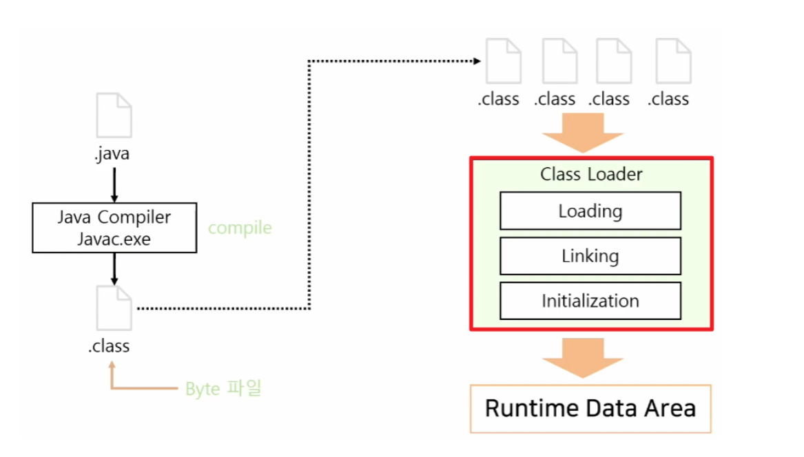

- **클래스 로더**는 JVM 내로 클래스 파일(`*.class`)을 **동적으로 로드**하고, 링크를 통해 배치하는 작업을 수행한다.
- 즉, **로드된 바이트 코드(`.class`)들을 엮어서 JVM의 메모리 영역인 Runtime Data Areas에 배치한다.**
- 클래스를 메모리에 올리는 로딩 기능은 한번에 메모리에 올리지 않고, 애플리케이션이 필요한 경우 **동적으로 메모리에 적재하게 된다.**

### 클래스 파일 로딩 순서

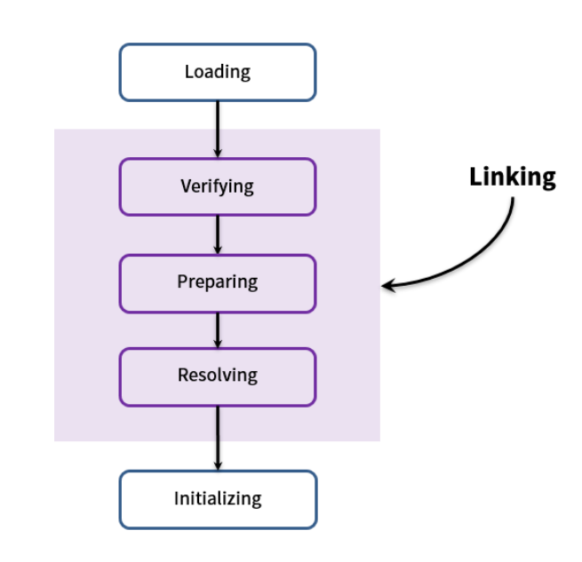

1. **Loading(로드)** : 클래스 파일을 가져와서 **JVM의 메모리에 로드**

2. **Linking(링크)** : 클래스 파일을 사용하기 위해 **검증하는 과정**
    1. **Verifying(검증)** : 읽어들인 클래스가 JVM 명세에 명시된 대로 구성되어 있는지 검사
    2. **Preparing(준비)** : 클래스가 필요로 하는 메모리를 할당
    3. **Resolving(분석)** : 클래스의 상수 풀 내 모든 심볼릭 레퍼런스를 다이렉트 레퍼런스로 변경

3. **Initialization(초기화)** : 클래스 변수들을 적절한 값으로 초기화(`static` 필드들을 설정된 값으로 초기화, `int = 0` 등)

## 실행 엔진 (Execution Engine)

- **실행 엔진**은 클래스 로더를 통해 런타임 데이터 영역에 배치된 **바이트 코드를 명령어 단위로 읽어서 실행한다.**
- 자바 바이트 코드(`*.class`)는 기계가 바로 수행할 수 있는 언어보다는 JVM이 이해할 수 있는 중간 레벨로 컴파일 된 코드이기 때문에, **실행 엔진**은 이와 같은
   바이트 코드를 실제로 JVM 내부에서 기계가 실행할 수 있는 형태로 변경해준다.
- 이 수행 과정에서 실행 엔진은 **인터프리터**와 **JIT 컴파일러** 두 가지 방식으로 바이트 코드를 실행한다.

### 인터프리터
- 바이트 코드 명령어를 **하나씩 읽어서 해석하고 바로 실행한다.**
- JVM 안에서 바이트 코드는 기본적으로 인터프리터 방식으로 동작한다.
- 같은 메서드라도 여러 번 호출 되면 매번 해석하고 수행해야 하기 때문에 전체적은 속도는 느리다.

### JIT 컴파일러
- 인터프리터의 단점을 보완하기 위해 도입된 방식이다.
- **반복되는 코드를 발견하여 바이트 코드 전체를 컴파일하여 `Native Code`로 변경하고, 이후에는 해당 메서드를 더 이상 인터프리팅 하지 않고 캐싱해 두었다가 네이티브 코드로 직접 실행하는 방식이다.**
- 하나씩 인터프리팅하여 실행하지 않고, 컴파일된 네이티브 코드를 실행하기 때문에 전체적인 실행 속도는 인터프리터 방식보다 빠르다.
- 하지만 **바이트 코드를 네이티브 코드로 변환하는 데에도 비용이 소요**되므로, `JVM`은 모든 코드를 **JIT 컴파일러 방식**으로 실행하지 않고, 인터프리터 방식을 사용하다가 일정 수준이 넘어가면
   JIT 컴파일러 방식으로 명령어를 실행하는 식으로 진행한다.

### 가비지 컬렉터
- JVM은 [가비지 컬렉터](https://github.com/genesis12345678/TIL/blob/main/interview/java/1_10/GC.md)를 이용하여 **Heap 메모리 영역에서 더 이상 사용하지 않는 메모리를 자동으로 회수해준다.**

## 런타임 데이터 영역 (Runtime Data Area)

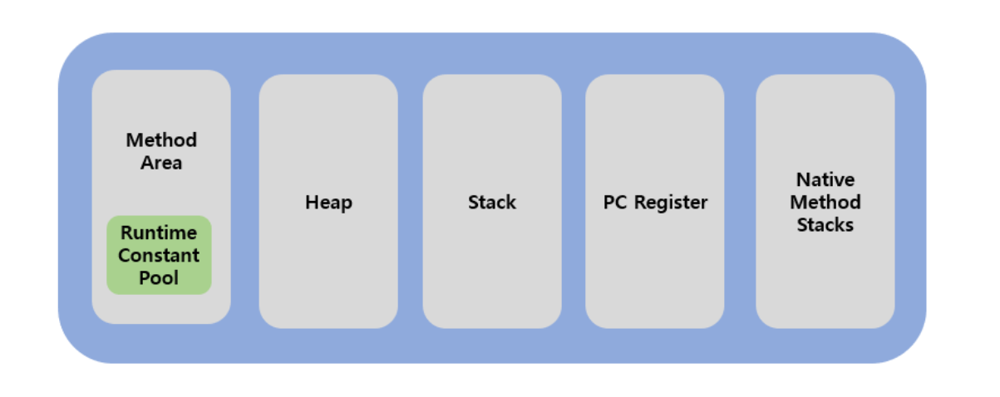

- **런타임 데이터 영역**은 JVM의 메모리 영역으로 **자바 애플리케이션을 실행할 때 사용되는 데이터들을 적재하는 영역이다.**

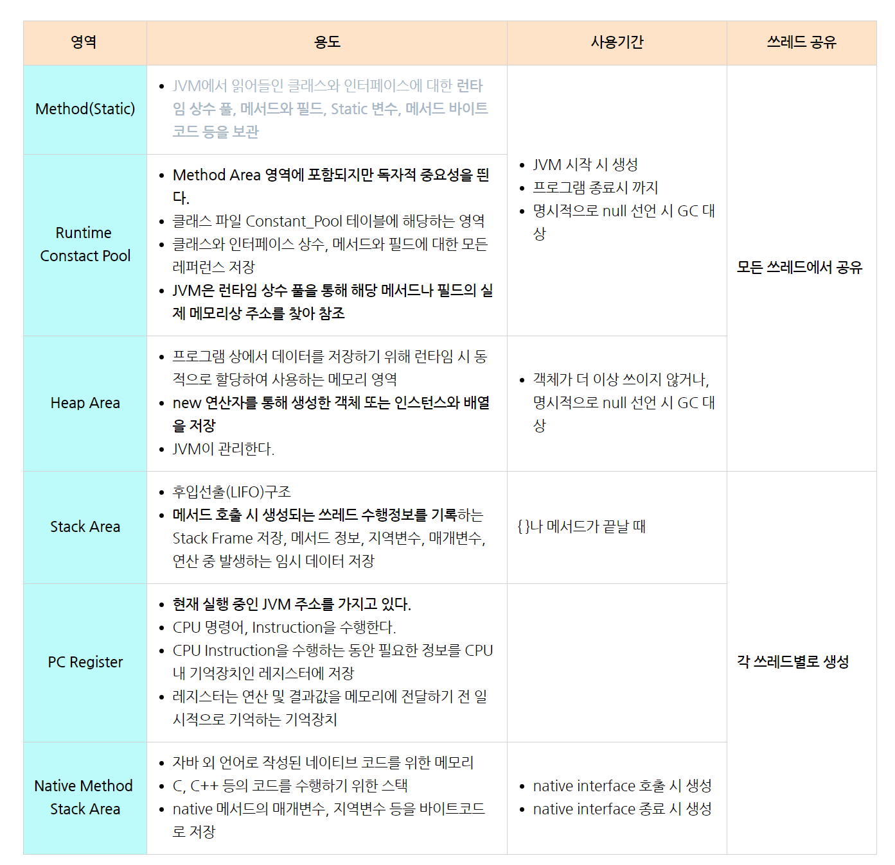

**`Method Area`, `Heap Area`는 모든 쓰레드가 공유하는 영역**이고, 나머지 **`Stack Area`, `PC Register`, `Native Method Stack`은 각 쓰레드마다 생성되는 개별 영역**이다.

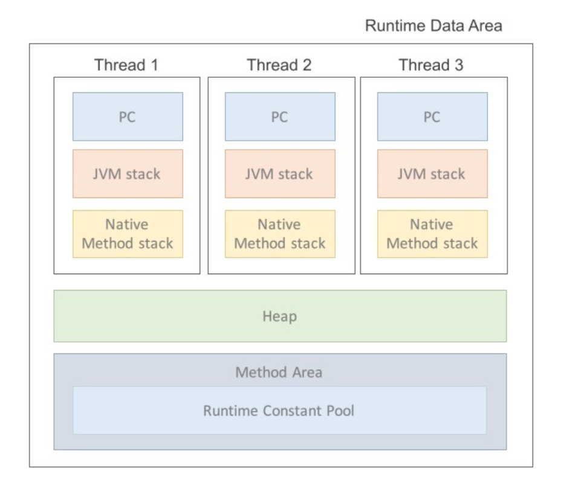

### 메서드 영역 (Method Area)

- `Class Area`나 `Static Area` 로도 불린다.
- **메서드 영역**은 JVM이 시작될 때 생성되는 공간으로, **바이트 코드(`.class`)를 처음 메모리 공간에 올릴 때 초기화되는 대상을 저장하기 위한 메모리 공간이다.**
- JVM이 동작하고 클래스가 로드될 때 적재되서 **프로그램이 종료될 때까지 저장된다.**
- **모든 쓰레드가 공유하는 영역**이라 다음과 같은 초기화 코드 정보들이 저장된다.
  - **Field Info** : 멤버 변수의 이름, 데이터 타입, 접근 제어자의 정보
  - **Method Info** : 메서드 이름, 리턴 타입, 함수 매개변수, 접근 제어자의 정보
  - **Type Info** : `Class` 인지 `Interface` 인지 여부 저장, `Type`의 속성, 이름, `Super Class`의 이름
- **정적 필드와 클래스 구조**를 갖고 있는 것이다.

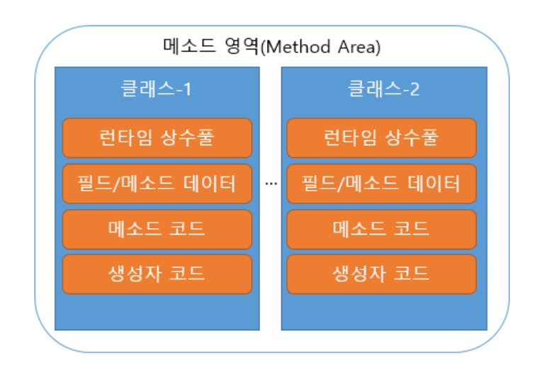

### 힙 영역 (Heap Area)

- **힙 영역**은 메서드 영역과 함께 **모든 쓰레드가 공유**하며, JVM이 관리하는 프로그램 상에서 데이터를 저장하기 위해 **런타임 시 동적으로 할당하여 사용하는 영역이다.**
- **`new` 연산자로 생성되는 클래스와 인스턴스 변수, 배열 타입 등 참조형(`Reference Type`)이 저장되는 곳이다.**

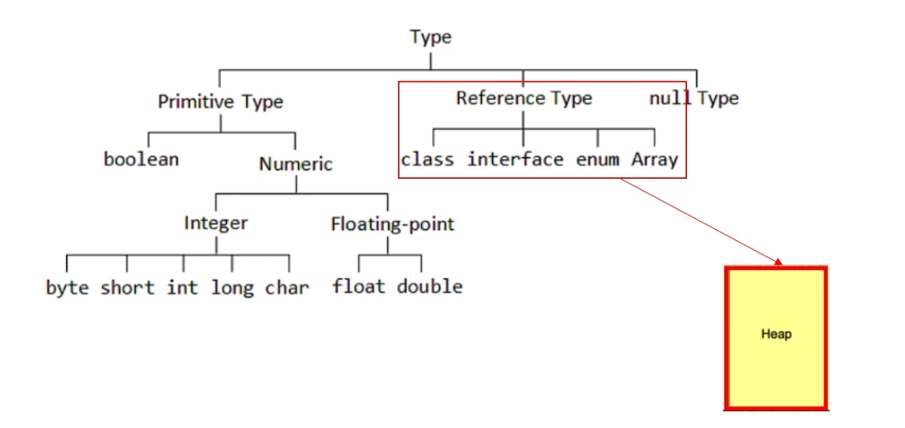

- 유의할 점은, 힙 영역에 생성된 객체와 배열 등은 **Reference Type**으로서, JVM 스택 영역의 변수나 **다른 객체의 필드에서 참조된다는 점**이다.
- 즉, 힙의 참조 주소는 **스택**이 갖고 있고 해당 객체를 통해서만 힙 영역에 있는 인스턴스를 핸들링할 수 있는 것이다.

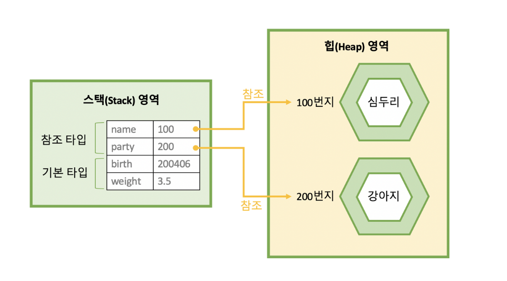

- 힙의 객체는 스택의 참조 타입 변수와 연결되어 있다.
- 만약 참조하는 변수나 필드가 없다면 의미없는 객체가 되기 때문에 이것을 쓰레기로 취급하고 JVM은 [가비지 컬렉터](https://github.com/genesis12345678/TIL/blob/main/interview/java/1_10/GC.md)를 실행시켜 쓰레기 객체를 힙 영역에서 자동으로 제거한다.
- 이처럼 힙 영역은 **가비지 컬렉션에 대상이 되는 공간이다.**

### 스택 영역 (Stack Area)

- **스택 영역**은 `int`, `long`, `boolean` 등 기본 자료형을 생성할 때 저장하는 공간으로, **임시적으로 사용되는 변수나 정보들이 저장되는 영역이다.**

- 메서드 호출 시마다 각각의 **스택 프레임(그 메서드만을 위한 공간)** 이 생성되고, 메서드 안에서 사용되는 값들을 저장하고, 호출된 메서드의 매개변수, 지역변수, 리턴 값 및 연산 시 일어나는 값들을 임시로 저장한다.
- 그리고 메서드 수행이 끝나면 프레임별로 삭제된다.
- **데이터의 타입에 따라 스택과 힙에 저장되는 방식이 다르다는 점을 유의해야 한다.**
  - 기본(원시) 타입 변수는 **스택 영역에 직접 값을 가진다.**
  - 참조타입 변수는 **힙 영역이나 메서드 영역의 객체 주소를 가진다.**

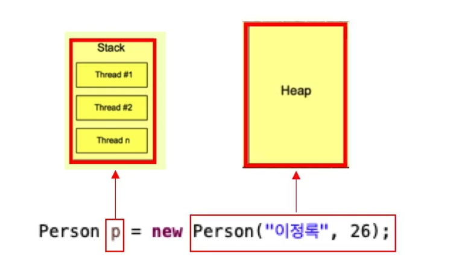

- `new` 에 의해 생성된 클래스는 `Heap Area`에 저장되고, `Stack Area`에는 생성된 클래스의 참조인 `p`만 저장된다.
- **스택 영역은 각 쓰레드마다 하나씩 존재하며, 쓰레드가 시작될 때 할당된다.**
- 프로세스가 메모리에 로드될 때 스택 사이즈가 고정되어 있어, 런타임 시에 스택 사이즈를 바꿀 수는 없다.
- 만약 고정된 크기의 JVM 스택에서 프로그램 실행 중 메모리 크기가 충분하지 않다면 `StackOverFlowError`가 발생하게 된다.
- 쓰레드를 종료하면 런타임 스택도 사라진다.

### PC 레지스터 (Program Counter Register)

- **PC 레지스터**는 쓰레드가 시작될 때 생성되며, **현재 수행중인 JVM 명령어 주소를 저장하는 공간이다.**
- JVM 명령의 주소는 쓰레드가 어떤 부분을 무슨 명령으로 실행해야할 지에 대한 기록을 가지고 있다.
- 일반적으로 프로그램의 실행은 **CPU에서 명령어(`Instruction`)를 수행하는 과정**으로 이루어진다.
- 이떄 CPU는 연산을 수행하는 동안 필요한 정보를 **레지스터(Register)** 라고 하는 CPU 내의 기억장치를 이용하게 된다.

**하지만 자바의 PC Register는 CPU Register와는 다르게 동작한다.**

- 자바는 OS나 CPU의 입장에서는 하나의 프로세스이기 때문에 JVM의 리소스를 이용해야 한다.
- 그래서 자바는 CPU에 직접 연산을 수행하도록 하는 것이 아닌, **현재 작업하는 내용을 CPU에게 연산으로 제공**해야 하며, **이를 위한 버퍼 공간으로 `PC Register`라는 메모리 영역**을 만들게 되었다.
- 따라서 JVM은 스택에서 비연산값 `Operand`를 뽑아 별도의 메모리 공간인 `PC Register`에 저장하는 방식을 취한다.

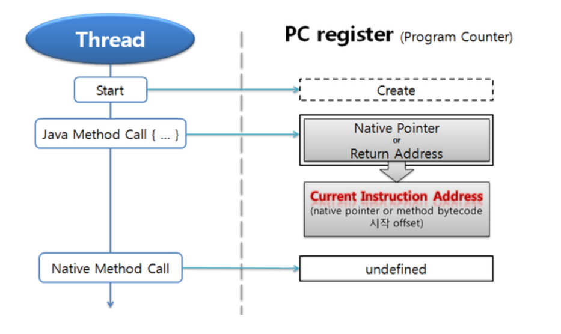

- 만약 쓰레드가 자바 메소드를 수행하고 있으면 JVM 명령(`Instruction`)의 주소를 **PC Register**에 저장한다.
- 그러다 자바가 아닌 다른 언어(C언어, 어셈블리)의 메서드를 수행하고 있다면, `undefined` 상태가 된다.
- 왜냐하면 자바에서는 이 두 경우를 따로 처리하기 때문이다.

### 네이티브 메서드 스택 (Native Method Stack)

- **네이티브 메서드 스택**은 자바 코드가 컴파일 되어 생성되는 바이트 코드가 아닌 **실제 수행할 수 있는 기계어로 작성된 프로그램을 실행시키는 영역**이다.
- 또한 자바 이외의 언어(C, C++, 어셈블리 등)로 작성된 네이티브 코드를 실행하기 위한 공간이기도 하다.
- **JIT 컴파일러**에 의해 변환된 `Native Code` 역시 여기에서 실행 된다고 보면 된다.

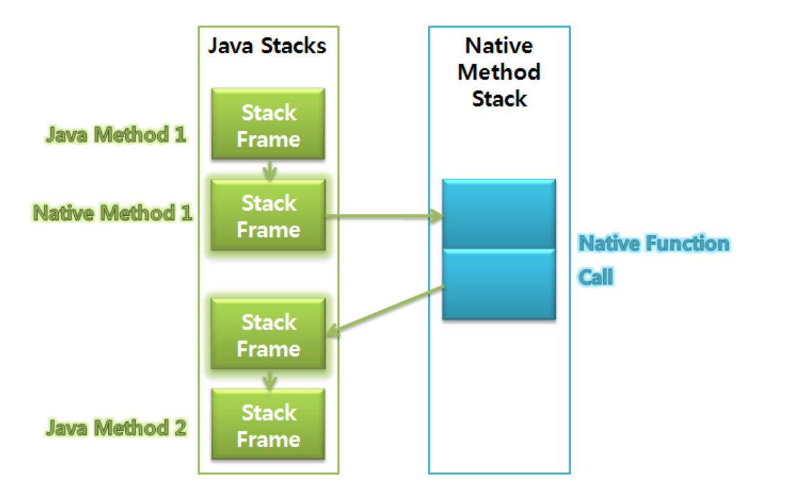

- 일반적으로 메서드를 실행하는 경우 JVM 스택에 쌓이다가 해당 메서드 내부에 **네이티브 방식**을 사용하는 메서드가 있다면, 해당 메서드는 네이티브 스택에 쌓인다.
- 그리고 네이티브 메서드가 수행이 끝나면 다시 자바 스택으로 돌아와 작업을 수행한다.
- 그래서 네이티브 코드로 되어 있는 함수의 호출을 자바 프로그램 내에서도 직접 수행할 수 있고 그 결과를 받아올 수도 있는 것이다.

 

## JNI (Native Method Interface)

- JVM에 의해 실행되는 코드 중 **네이티브로 실행하는 것이 있다면** 해당 네이티브 코드를 호출하거나 호출될 수 있도록 만든 일종의 프레임워크

## Navite Method Library

- 네이티브 메서드 실행에 필요한 라이브러리

 

### 꼬리 질문 - JVM 튜닝은 어떤 식으로 진행되나요?

JVM 튜닝은 다음과 같은 단계를 거치며 진행된다.

1. **애플리케이션 분석**
   - JVM을 사용하는 애플리케이션의 리소스 사용 상태 분석
2. **메모리 튜닝**
   - JVM의 메모리 구성 최적화, GC 설정 등
3. **성능 모니터링**
   - 애플리케이션의 JVM 성능 모니터링
4. **튜닝 평가**
   - 수정한 JVM 튜닝 설정의 효과 평가
5. **수정 반복**
   - 효과가 만족스러운 경우 종료, 그렇지 않으면 2단계부터 다시 반복

**마지막 5번, 수정 반복이 중요한 부분이다. 계속해서 피드백을 적용시키는 메커니즘으로 진행된다.**

 

 

### 참고
- [참고 블로그](https://sharplee7.tistory.com/61)
- [참고 블로그](https://inpa.tistory.com/entry/JAVA-%E2%98%95-JVM-%EB%82%B4%EB%B6%80-%EA%B5%AC%EC%A1%B0-%EB%A9%94%EB%AA%A8%EB%A6%AC-%EC%98%81%EC%97%AD-%EC%8B%AC%ED%99%94%ED%8E%B8)
- [참고 동영상](https://www.youtube.com/watch?v=AWXPnMDZ9I0)